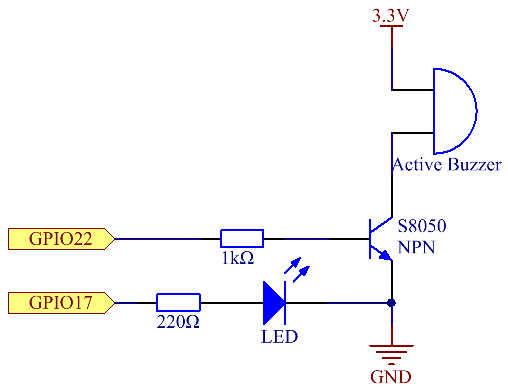
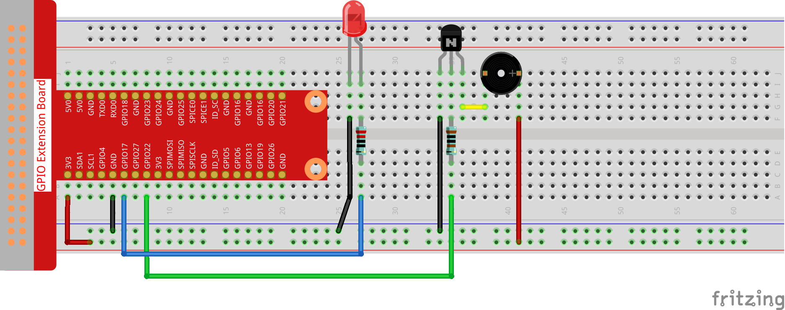

.. note::

    ¡Hola! Bienvenido a la comunidad de entusiastas de SunFounder para Raspberry Pi, Arduino y ESP32 en Facebook. Únete para profundizar en Raspberry Pi, Arduino y ESP32 junto a otros apasionados.

    **¿Por qué unirte?**

    - **Soporte de Expertos**: Resuelve problemas post-venta y desafíos técnicos con la ayuda de nuestra comunidad y equipo.
    - **Aprende y Comparte**: Intercambia consejos y tutoriales para mejorar tus habilidades.
    - **Avances Exclusivos**: Obtén acceso anticipado a anuncios de nuevos productos y vistas previas.
    - **Descuentos Especiales**: Disfruta de descuentos exclusivos en nuestros productos más recientes.
    - **Promociones Festivas y Sorteos**: Participa en sorteos y promociones de temporada.

    👉 ¿Listo para explorar y crear con nosotros? Haz clic en [|link_sf_facebook|] y únete hoy.

3.1.11 Generador de Código Morse
===================================

Introducción
-----------------

En esta lección, crearemos un generador de código Morse. Ingresarás una 
serie de letras en inglés en el Raspberry Pi y aparecerán en forma de 
código Morse.

Componentes
---------------

.. image:: img/3.1.10.png
    :align: center

Diagrama Esquemático
-----------------------

============ ======== ======== ===
T-Board Name physical wiringPi BCM
GPIO17       Pin 11   0        17
GPIO22       Pin 15   3        22
============ ======== ======== ===

Procedimientos Experimentales
---------------------------------

**Paso 1:** Construye el circuito. (Presta atención a los polos del 
zumbador: el marcado con + es el polo positivo y el otro es el negativo.)

**Para Usuarios de Lenguaje C**
^^^^^^^^^^^^^^^^^^^^^^^^^^^^^^^^^^^

**Paso 2**: Abre el archivo de código.

.. raw:: html

   <run></run>

.. code-block:: 

    cd ~/davinci-kit-for-raspberry-pi/c/3.1.11/

**Paso 3**: Compila el código.

.. raw:: html

   <run></run>

.. code-block:: 

    gcc 3.1.11_MorseCodeGenerator.c -lwiringPi

**Paso 4**: Ejecuta el archivo ejecutable.

.. raw:: html

   <run></run>

.. code-block:: 

    sudo ./a.out

Después de ejecutar el programa, escribe una serie de caracteres y el 
zumbador y el LED enviarán las señales correspondientes en código Morse.

.. note::

    Si no funciona después de ejecutarlo, o aparece un mensaje de error: \"wiringPi.h: No such file or directory", consulta :ref:`C code is not working?`.

**Explicación del Código**

.. code-block:: c

    struct MORSE{
        char word;
        unsigned char *code;
    };

    struct MORSE morseDict[]=
    {
        {'A',"01"}, {'B',"1000"}, {'C',"1010"}, {'D',"100"}, {'E',"0"}, 
        {'F',"0010"}, {'G',"110"}, {'H',"0000"}, {'I',"00"}, {'J',"0111"}, 
        {'K',"101"}, {'L',"0100"}, {'M',"11"}, {'N',"10"}, {'O',"111"}, 
        {'P',"0110"}, {'Q',"1101"}, {'R',"010"}, {'S',"000"}, {'T',"1"},
        {'U',"001"}, {'V',"0001"}, {'W',"011"}, {'X',"1001"}, {'Y',"1011"}, 
        {'Z',"1100"},{'1',"01111"}, {'2',"00111"}, {'3',"00011"}, {'4',"00001"}, 
        {'5',"00000"},{'6',"10000"}, {'7',"11000"}, {'8',"11100"}, {'9',"11110"},
        {'0',"11111"},{'?',"001100"}, {'/',"10010"}, {',',"110011"}, {'.',"010101"},
        {';',"101010"},{'!',"101011"}, {'@',"011010"}, {':',"111000"}
    };

Esta estructura MORSE es el diccionario del código Morse y contiene los 
caracteres de la A a la Z, los números del 0 al 9 y los símbolos \"?\" \"/\" \":\" \",\" \".\" \";\" \"!\" \"@\" .

.. code-block:: c

    char *lookup(char key,struct MORSE *dict,int length)
    {
        for (int i=0;i<length;i++)
        {
            if(dict[i].word==key){
                return dict[i].code;
            }
        }    
    }

La función **lookup()** funciona como un "diccionario". Define una **clave**, 
busca en la estructura **morseDict** la palabra que coincide con **key** y 
devuelve la información correspondiente —el \"**code**\" de esa palabra.

.. code-block:: c

    void on(){
        digitalWrite(ALedPin,HIGH);
        digitalWrite(BeepPin,HIGH);     
    }

Crea una función on() para activar el zumbador y el LED.

.. code-block:: c

    void off(){
        digitalWrite(ALedPin,LOW);
        digitalWrite(BeepPin,LOW);
    }

La función off() apaga el zumbador y el LED.

.. code-block:: c

    void beep(int dt){
        on();
        delay(dt);
        off();
        delay(dt);
    }
Define una función beep() para hacer que el zumbador y el LED emitan sonidos y
parpadeen en un intervalo determinado de **dt**.

.. code-block:: c

    void morsecode(char *code){
        int pause = 250;
        char *point = NULL;
        int length = sizeof(morseDict)/sizeof(morseDict[0]);
        for (int i=0;i<strlen(code);i++)
        {
            point=lookup(code[i],morseDict,length);
            for (int j=0;j<strlen(point);j++){
                if (point[j]=='0')
                {
                    beep(pause/2);
                }else if(point[j]=='1')
                {
                    beep(pause);
                }
                delay(pause);
            }
        }
    }

La función morsecode() procesa el código Morse de los caracteres ingresados 
haciendo que el "1" del código emita sonidos o luces prolongados, mientras 
que el "0" produce sonidos o luces breves; por ejemplo, al ingresar "SOS", 
se generará una señal con tres segmentos cortos, tres largos y luego tres cortos " · · · - - - · · · ".

.. code-block:: c

    int toupper(int c)
    {
        if ((c >= 'a') && (c <= 'z'))
            return c + ('A' - 'a');
        return c;
    }
    char *strupr(char *str)
    {
        char *orign=str;
        for (; *str!='\0'; str++)
            *str = toupper(*str);
    return orign;
    }

Antes de codificar, debes unificar las letras en mayúsculas.

.. code-block:: c

    void main(){
        setup();
        char *code;
        int length=8;
        code = (char*)malloc(sizeof(char)*length);
        while (1){
            printf("Please input the messenger:");
            delay(100);
            scanf("%s",code);
            code=strupr(code);
            printf("%s\n",code);
            delay(100);
            morsecode(code);
        }
    }

Cuando ingreses los caracteres relevantes con el teclado, code=strupr(code) 
convertirá las letras ingresadas a mayúsculas.

Printf() luego imprimirá el texto claro en la pantalla de la computadora, 
y la función morsecode() hará que el zumbador y el LED emitan el código Morse.

Ten en cuenta que la longitud de los caracteres ingresados no debe exceder 
el **length** (se puede modificar).

**Para Usuarios de Lenguaje Python**
^^^^^^^^^^^^^^^^^^^^^^^^^^^^^^^^^^^^^^

**Paso 2**: Abre el archivo de código.

.. raw:: html

   <run></run>

.. code-block:: 

    cd ~/davinci-kit-for-raspberry-pi/python

**Paso 3**: Ejecuta.

.. raw:: html

   <run></run>

.. code-block:: 

    sudo python3 3.1.11_MorseCodeGenerator.py

Después de ejecutar el programa, escribe una serie de caracteres y el 
zumbador y el LED enviarán las señales correspondientes en código Morse.

**Código**

.. note::

    Puedes **Modificar/Restablecer/Copiar/Ejecutar/Detener** el código a continuación. Pero antes, necesitas dirigirte a la ruta del código fuente, como ``davinci-kit-for-raspberry-pi/python``. 
    

.. code-block:: python

    import RPi.GPIO as GPIO
    import time

    BeepPin=22
    ALedPin=17

    MORSECODE = {
        'A':'01', 'B':'1000', 'C':'1010', 'D':'100', 'E':'0', 'F':'0010', 'G':'110',
        'H':'0000', 'I':'00', 'J':'0111', 'K':'101', 'L':'0100', 'M':'11', 'N':'10',
        'O':'111', 'P':'0110', 'Q':'1101', 'R':'010', 'S':'000', 'T':'1',
        'U':'001', 'V':'0001', 'W':'011', 'X':'1001', 'Y':'1011', 'Z':'1100',
        '1':'01111', '2':'00111', '3':'00011', '4':'00001', '5':'00000',
        '6':'10000', '7':'11000', '8':'11100', '9':'11110', '0':'11111',
        '?':'001100', '/':'10010', ',':'110011', '.':'010101', ';':'101010',
        '!':'101011', '@':'011010', ':':'111000',
        }

    def setup():
        GPIO.setmode(GPIO.BCM)
        GPIO.setup(BeepPin, GPIO.OUT, initial=GPIO.LOW)
        GPIO.setup(ALedPin,GPIO.OUT,initial=GPIO.LOW)

    def on():
        GPIO.output(BeepPin, 1)
        GPIO.output(ALedPin, 1)

    def off():
        GPIO.output(BeepPin, 0)
        GPIO.output(ALedPin, 0)

    def beep(dt):  # dt es el tiempo de retardo.
        on()
        time.sleep(dt)
        off()
        time.sleep(dt)

    def morsecode(code):
        pause = 0.25
        for letter in code:
            for tap in MORSECODE[letter]:
                if tap == '0':
                    beep(pause/2)
                if tap == '1':
                    beep(pause)
            time.sleep(pause)

    def main():
        while True:
            code=input("Please input the messenger:")
            code = code.upper()
            print(code)
            morsecode(code)

    def destroy():
        print("")
        GPIO.output(BeepPin, GPIO.LOW)
        GPIO.output(ALedPin, GPIO.LOW)
        GPIO.cleanup()  

    if __name__ == '__main__':
        setup()
        try:
            main()
        except KeyboardInterrupt:
            destroy()

**Explicación del Código**

.. code-block:: python

    MORSECODE = {
        'A':'01', 'B':'1000', 'C':'1010', 'D':'100', 'E':'0', 'F':'0010', 'G':'110',
        'H':'0000', 'I':'00', 'J':'0111', 'K':'101', 'L':'0100', 'M':'11', 'N':'10',
        'O':'111', 'P':'0110', 'Q':'1101', 'R':'010', 'S':'000', 'T':'1',
        'U':'001', 'V':'0001', 'W':'011', 'X':'1001', 'Y':'1011', 'Z':'1100',
        '1':'01111', '2':'00111', '3':'00011', '4':'00001', '5':'00000',
        '6':'10000', '7':'11000', '8':'11100', '9':'11110', '0':'11111',
        '?':'001100', '/':'10010', ',':'110011', '.':'010101', ';':'101010',
        '!':'101011', '@':'011010', ':':'111000',
    }

Esta estructura MORSE es el diccionario del código Morse, que contiene
los caracteres de la A a la Z, los números del 0 al 9 y los símbolos \"?\" \"/\" \":\" \",\" \".\" \";\" \"!\" \"@\".

.. code-block:: python

    def on():
        GPIO.output(BeepPin, 1)
        GPIO.output(ALedPin, 1)

La función on() activa el zumbador y el LED.

.. code-block:: python

    def off():
        GPIO.output(BeepPin, 0)
        GPIO.output(ALedPin, 0)

La función off() se utiliza para apagar el zumbador y el LED.

.. code-block:: python

    def beep(dt):   # dt es el tiempo de retardo.
        on()
        time.sleep(dt)
        off()
        time.sleep(dt)

Define una función beep() para hacer que el zumbador y el LED emitan sonidos y
parpadeen en un intervalo determinado de **dt**.

.. code-block:: python

    def morsecode(code):
        pause = 0.25
        for letter in code:
            for tap in MORSECODE[letter]:
                if tap == '0':
                    beep(pause/2)
                if tap == '1':
                    beep(pause)
            time.sleep(pause)

La función morsecode() procesa el código Morse de los caracteres ingresados 
haciendo que el "1" del código emita sonidos o luces prolongados, mientras 
que el "0" produce sonidos o luces breves; por ejemplo, al ingresar "SOS", 
se generará una señal con tres segmentos cortos, tres largos y luego tres 
cortos " · · · - - - · · · ".

.. code-block:: python

    def main():
        while True:
            code=input("Please input the messenger:")
            code = code.upper()
            print(code)
            morsecode(code)

Cuando ingreses los caracteres relevantes con el teclado, upper() convertirá 
las letras ingresadas a mayúsculas.

Printf() luego imprimirá el texto claro en la pantalla de la computadora, y 
la función morsecode() hará que el zumbador y el LED emitan el código Morse.

Imagen del Fenómeno
-----------------------

.. image:: img/image270.jpeg
   :align: center