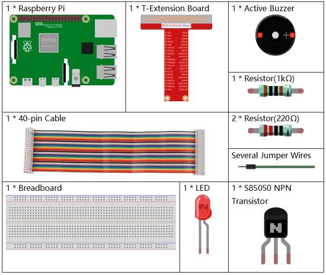

3.1.11 Morsekode-Generator
~~~~~~~~~~~~~~~~~~~~~~~~~~~

Einführung
-----------------

In dieser Lektion erstellen wir einen Morsekode-Generator, in den Sie eine Reihe englischer Buchstaben in den Raspberry Pi eingeben, damit er als Morsekode angezeigt wird.

Komponenten
---------------

Schematische Darstellung
--------------------------------

============ ======== ======== ===
T-Karte Name physisch wiringPi BCM
GPIO17       Pin 11   0        17
GPIO22       Pin 15   3        22
============ ======== ======== ===

.. image:: media/Schematic_three_one11.png
   :align: center

Experimentelle Verfahren
----------------------------

Schritt 1: Bauen Sie die Schaltung auf. (Achten Sie auf die Pole des Summers: Der mit dem + Etikett ist der positive Pol und der andere der negative.)

.. image:: media/image269.png
   :alt: Morse_bb
   :width: 800

Für Benutzer in C-Sprache
^^^^^^^^^^^^^^^^^^^^^^^^^^

Schritt 2: Öffnen Sie die Kodedatei.

.. raw:: html

   <run></run>

.. code-block::

    cd /home/pi/davinci-kit-for-raspberry-pi/c/3.1.11/

Schritt 3: Kompilieren Sie den Kode.

.. raw:: html

   <run></run>

.. code-block::

    gcc 3.1.11_MorseCodeGenerator.c -lwiringPi

Schritt 4: Führen Sie die obige ausführbare Datei aus.

.. raw:: html

   <run></run>

.. code-block:: 

    sudo ./a.out

Geben Sie nach dem Ausführen des Programms eine Reihe von Zeichen ein, und der Summer und die LED senden die entsprechenden Morsekodesignale.

**Code Erklärung**

.. code-block:: c

    struct MORSE{
        char word;
        unsigned char *code;
    };

    struct MORSE morseDict[]=
    {
        {'A',"01"}, {'B',"1000"}, {'C',"1010"}, {'D',"100"}, {'E',"0"}, 
        {'F',"0010"}, {'G',"110"}, {'H',"0000"}, {'I',"00"}, {'J',"0111"}, 
        {'K',"101"}, {'L',"0100"}, {'M',"11"}, {'N',"10"}, {'O',"111"}, 
        {'P',"0110"}, {'Q',"1101"}, {'R',"010"}, {'S',"000"}, {'T',"1"},
        {'U',"001"}, {'V',"0001"}, {'W',"011"}, {'X',"1001"}, {'Y',"1011"}, 
        {'Z',"1100"},{'1',"01111"}, {'2',"00111"}, {'3',"00011"}, {'4',"00001"}, 
        {'5',"00000"},{'6',"10000"}, {'7',"11000"}, {'8',"11100"}, {'9',"11110"},
        {'0',"11111"},{'?',"001100"}, {'/',"10010"}, {',',"110011"}, {'.',"010101"},
        {';',"101010"},{'!',"101011"}, {'@',"011010"}, {':',"111000"}
    };

Diese Struktur MORSE ist das Wörterbuch des Morsecodes und enthält die Zeichen A-Z, 
die Zahlen 0-9 und die Zeichen „?“ „/“ „:“ “ “ „,“ „.“ „;“ „!“ „@“.

.. code-block:: c

    char *lookup(char key,struct MORSE *dict,int length)
    {
        for (int i=0;i<length;i++)
        {
            if(dict[i].word==key){
                return dict[i].code;
            }
        }    
    }

Die Funktion ``lookup()`` funktioniert durch „Überprüfen des Wörterbuchs“. 
Definieren Sie einen Schlüssel, 
suchen Sie die gleichen Wörter wie den Schlüssel in der Struktur morseDict und geben Sie die entsprechenden Informationen zurück - „kode“ des bestimmten Wortes.

.. code-block:: c

    void on(){
        digitalWrite(ALedPin,HIGH);
        digitalWrite(BeepPin,HIGH);     
    }

Erstellen Sie eine Funktion ``on()`` , um den Summer und die LED zu starten.

.. code-block:: c

    void off(){
        digitalWrite(ALedPin,LOW);
        digitalWrite(BeepPin,LOW);
    }

Die Funktion ``off()`` schaltet den Summer und die LED aus.

.. code-block:: c

    void beep(int dt){
        on();
        delay(dt);
        off();
        delay(dt);
    }

Definieren Sie einen Funktionston ``beep()`` , 
damit der Summer und die LED in einem bestimmten Intervall von ``dt`` ertönen und blinken.

.. code-block:: c

    void morsecode(char *code){
        int pause = 250;
        char *point = NULL;
        int length = sizeof(morseDict)/sizeof(morseDict[0]);
        for (int i=0;i<strlen(code);i++)
        {
            point=lookup(code[i],morseDict,length);
            for (int j=0;j<strlen(point);j++){
                if (point[j]=='0')
                {
                    beep(pause/2);
                }else if(point[j]=='1')
                {
                    beep(pause);
                }
                delay(pause);
            }
        }
    }

Die Funktion ``morsecode()`` wird verwendet, um den Morsecode von Eingabezeichen zu verarbeiten, 
indem die „1“ der Kode weiterhin Töne oder Lichter aussendet und die „0“ in Kürze Töne oder 
Lichter aussendet, z. B. „SOS“ eingibt und dort wird ein Signal sein, 
das drei kurze, drei lange und dann drei kurze Segmente **· · · - - - · · ·** enthält.

.. code-block:: c

    int toupper(int c)
    {
        if ((c >= 'a') && (c <= 'z'))
            return c + ('A' - 'a');
        return c;
    }
    char *strupr(char *str)
    {
        char *orign=str;
        for (; *str!='\0'; str++)
            *str = toupper(*str);
    return orign;
    }

Vor dem Codieren müssen Sie die Buchstaben in Großbuchstaben vereinheitlichen.

.. code-block:: c

    void main(){
        setup();
        char *code;
        int length=8;
        code = (char*)malloc(sizeof(char)*length);
        while (1){
            printf("Please input the messenger:");
            delay(100);
            scanf("%s",code);
            code=strupr(code);
            printf("%s\n",code);
            delay(100);
            morsecode(code);
        }
    }

Wenn Sie die relevanten Zeichen mit der Tastatur eingeben, konvertiert
``code=strupr(code)`` die Eingabebuchstaben in ihre Großbuchstaben.

``printf()`` druckt dann den Klartext auf dem Computerbildschirm, und die Funktion
``morsecod()`` bewirkt, dass der Summer und die LED Morsecode ausgeben.

Beachten Sie, die Länge des Eingabezeichens darf die
``length`` nicht überschreiten(kann überarbeitet werden).

Für Python-Sprachbenutzer
^^^^^^^^^^^^^^^^^^^^^^^^^^^^^^^^^

Schritt 2: Öffnen Sie die Kodedatei.

.. raw:: html

   <run></run>

.. code-block::

    cd /home/pi/davinci-kit-for-raspberry-pi/python

Schritt 3: Ausführen.

.. raw:: html

   <run></run>

.. code-block::

    sudo python3 3.1.11_MorseCodeGenerator.py

Geben Sie nach dem Ausführen des Programms eine Reihe von Zeichen ein, und der Summer und die LED senden die entsprechenden Morsekodesignale.

**Code**

.. note::

    Sie können den folgenden Code **Ändern/Zurücksetzen/Kopieren/Ausführen/Stoppen** . Zuvor müssen Sie jedoch zu einem Quellcodepfad wie ``davinci-kit-for-raspberry-pi/python`` gehen.
    

.. code-block:: python

    import RPi.GPIO as GPIO
    import time

    BeepPin=22
    ALedPin=17

    MORSECODE = {
        'A':'01', 'B':'1000', 'C':'1010', 'D':'100', 'E':'0', 'F':'0010', 'G':'110',
        'H':'0000', 'I':'00', 'J':'0111', 'K':'101', 'L':'0100', 'M':'11', 'N':'10',
        'O':'111', 'P':'0110', 'Q':'1101', 'R':'010', 'S':'000', 'T':'1',
        'U':'001', 'V':'0001', 'W':'011', 'X':'1001', 'Y':'1011', 'Z':'1100',
        '1':'01111', '2':'00111', '3':'00011', '4':'00001', '5':'00000',
        '6':'10000', '7':'11000', '8':'11100', '9':'11110', '0':'11111',
        '?':'001100', '/':'10010', ',':'110011', '.':'010101', ';':'101010',
        '!':'101011', '@':'011010', ':':'111000',
        }

    def setup():
        GPIO.setmode(GPIO.BCM)
        GPIO.setup(BeepPin, GPIO.OUT, initial=GPIO.LOW)
        GPIO.setup(ALedPin,GPIO.OUT,initial=GPIO.LOW)

    def on():
        GPIO.output(BeepPin, 1)
        GPIO.output(ALedPin, 1)

    def off():
        GPIO.output(BeepPin, 0)
        GPIO.output(ALedPin, 0)

    def beep(dt):	# dt for delay time.
        on()
        time.sleep(dt)
        off()
        time.sleep(dt)

    def morsecode(code):
        pause = 0.25
        for letter in code:
            for tap in MORSECODE[letter]:
                if tap == '0':
                    beep(pause/2)
                if tap == '1':
                    beep(pause)
            time.sleep(pause)

    def main():
        while True:
            code=input("Please input the messenger:")
            code = code.upper()
            print(code)
            morsecode(code)

    def destroy():
        print("")
        GPIO.output(BeepPin, GPIO.LOW)
        GPIO.output(ALedPin, GPIO.LOW)
        GPIO.cleanup()  

    if __name__ == '__main__':
        setup()
        try:
            main()
        except KeyboardInterrupt:
            destroy()

**Code Erklärung**

.. code-block:: python

    MORSECODE = {
        'A':'01', 'B':'1000', 'C':'1010', 'D':'100', 'E':'0', 'F':'0010', 'G':'110',
        'H':'0000', 'I':'00', 'J':'0111', 'K':'101', 'L':'0100', 'M':'11', 'N':'10',
        'O':'111', 'P':'0110', 'Q':'1101', 'R':'010', 'S':'000', 'T':'1',
        'U':'001', 'V':'0001', 'W':'011', 'X':'1001', 'Y':'1011', 'Z':'1100',
        '1':'01111', '2':'00111', '3':'00011', '4':'00001', '5':'00000',
        '6':'10000', '7':'11000', '8':'11100', '9':'11110', '0':'11111',
        '?':'001100', '/':'10010', ',':'110011', '.':'010101', ';':'101010',
        '!':'101011', '@':'011010', ':':'111000',
        }

Diese Struktur MORSE ist das Wörterbuch des Morsecodes und enthält die Zeichen A-Z, 
die Zahlen 0-9 und die Zeichen „?“ „/“ „:“ “ “ „,“ „.“ „;“ „!“ „@“.

.. code-block:: python

    def on():
        GPIO.output(BeepPin, 1)
        GPIO.output(ALedPin, 1)

Die Funktion ``on()`` startet den Summer und die LED.

.. code-block:: python

    def off():
        GPIO.output(BeepPin, 0)
        GPIO.output(ALedPin, 0)

Mit der Funktion ``off()`` werden der Summer und die LED ausgeschaltet.

.. code-block:: python

    def beep(dt):   # x for dalay time.
        on()
        time.sleep(dt)
        off()
        time.sleep(dt)

Definieren Sie einen Funktionston ``beep()`` , 
damit der Summer und die LED in einem bestimmten Intervall von dt ertönen und blinken.

.. code-block:: python

    def morsecode(code):
        pause = 0.25
        for letter in code:
            for tap in MORSECODE[letter]:
                if tap == '0':
                    beep(pause/2)
                if tap == '1':
                    beep(pause)
            time.sleep(pause)

Die Funktion ``morsecode()`` wird verwendet, um den Morsecode von Eingabezeichen zu verarbeiten, 
indem die „1“ der Kode weiterhin Töne oder Lichter aussendet und die „0“ 
in Kürze Töne oder Lichter aussendet, z. B. **SOS** eingibt und dort wird ein Signal sein, 
das drei kurze, drei lange und dann drei kurze Segmente **· · · - - - · · ·** enthält.

.. code-block:: python

    def main():
        while True:
            code=input("Please input the messenger:")
            code = code.upper()
            print(code)
            morsecode(code)

Wenn Sie die relevanten Zeichen mit der Tastatur eingeben, 
konvertiert ``upper()`` die Eingabebuchstaben in ihre Großbuchstaben.

``print()`` druckt dann den Klartext auf dem Computerbildschirm, 
und die Funktion ``morsecode()`` bewirkt, dass der Summer und die LED Morsecode ausgeben.

Phänomen Bild
-----------------------

.. image:: media/image270.jpeg
   :align: center