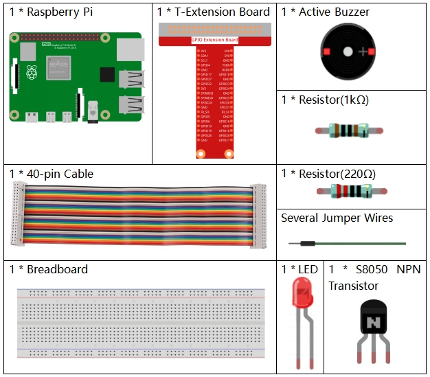

.. note::

    Bonjour et bienvenue dans la communauté SunFounder Raspberry Pi & Arduino & ESP32 Enthusiasts sur Facebook ! Plongez au cœur de Raspberry Pi, Arduino et ESP32 avec d'autres passionnés.

    **Pourquoi nous rejoindre ?**

    - **Support Expert** : Résolvez les problèmes après-vente et les défis techniques avec l'aide de notre communauté et de notre équipe.
    - **Apprendre & Partager** : Échangez des astuces et des tutoriels pour améliorer vos compétences.
    - **Aperçus Exclusifs** : Accédez en avant-première aux annonces de nouveaux produits et aux aperçus.
    - **Réductions Spéciales** : Profitez de réductions exclusives sur nos nouveaux produits.
    - **Promotions et Concours Festifs** : Participez à des concours et promotions pendant les fêtes.

    👉 Prêt à explorer et créer avec nous ? Cliquez sur [|link_sf_facebook|] et rejoignez-nous dès aujourd'hui !

3.1.11 Générateur de Code Morse
=======================================

Introduction
-----------------

Dans ce cours, nous allons créer un générateur de code Morse, où vous tapez 
une série de lettres anglaises sur le Raspberry Pi pour qu'elles apparaissent 
sous forme de code Morse.

Composants
---------------

Schéma de Circuit
-----------------------

============ ======== ======== ===
T-Board Name physical wiringPi BCM
GPIO17       Pin 11   0        17
GPIO22       Pin 15   3        22
============ ======== ======== ===

.. image:: img/Schematic_three_one11.png
   :align: center

Procédures Expérimentales
----------------------------

**Étape 1 :** Construisez le circuit. (Faites attention aux pôles du buzzer : 
celui avec l'étiquette + est le pôle positif et l'autre est le pôle négatif.)

.. image:: img/image269.png
   :alt: Morse_bb
   :width: 800

**Pour les utilisateurs de langage C**
^^^^^^^^^^^^^^^^^^^^^^^^^^^^^^^^^^^^^^^^^^^

**Étape 2 :** Ouvrez le fichier de code.

.. raw:: html

   <run></run>

.. code-block::

    cd ~/davinci-kit-for-raspberry-pi/c/3.1.11/

**Étape 3 :** Compilez le code.

.. raw:: html

   <run></run>

.. code-block::

    gcc 3.1.11_MorseCodeGenerator.c -lwiringPi

**Étape 4 :** Exécutez le fichier exécutable ci-dessus.

.. raw:: html

   <run></run>

.. code-block:: 

    sudo ./a.out

Après le démarrage du programme, tapez une série de caractères, et le buzzer 
ainsi que la LED enverront les signaux correspondants en code Morse.

.. note::

    Si cela ne fonctionne pas après l'exécution ou s'il y a un message d'erreur : \"wiringPi.h: No such file or directory\", veuillez vous référer à :ref:`C code is not working?`.

**Explication du Code**

.. code-block:: c

    struct MORSE{
        char word;
        unsigned char *code;
    };

    struct MORSE morseDict[]=
    {
        {'A',"01"}, {'B',"1000"}, {'C',"1010"}, {'D',"100"}, {'E',"0"}, 
        {'F',"0010"}, {'G',"110"}, {'H',"0000"}, {'I',"00"}, {'J',"0111"}, 
        {'K',"101"}, {'L',"0100"}, {'M',"11"}, {'N',"10"}, {'O',"111"}, 
        {'P',"0110"}, {'Q',"1101"}, {'R',"010"}, {'S',"000"}, {'T',"1"},
        {'U',"001"}, {'V',"0001"}, {'W',"011"}, {'X',"1001"}, {'Y',"1011"}, 
        {'Z',"1100"},{'1',"01111"}, {'2',"00111"}, {'3',"00011"}, {'4',"00001"}, 
        {'5',"00000"},{'6',"10000"}, {'7',"11000"}, {'8',"11100"}, {'9',"11110"},
        {'0',"11111"},{'?',"001100"}, {'/',"10010"}, {',',"110011"}, {'.',"010101"},
        {';',"101010"},{'!',"101011"}, {'@',"011010"}, {':',"111000"}
    };

Cette structure MORSE est le dictionnaire du code Morse, contenant les 
caractères A-Z, les chiffres 0-9 et les symboles \"?\" \"/\" \":\" \",\" \".\" \";\" \"!\" \"@\" .

.. code-block:: c

    char *lookup(char key,struct MORSE *dict,int length)
    {
        for (int i=0;i<length;i++)
        {
            if(dict[i].word==key){
                return dict[i].code;
            }
        }    
    }

La fonction **lookup()** permet de \"consulter le dictionnaire\". Définissez une 
**clé**, recherchez les mots similaires à **clé** dans la structure **morseDict** 
et renvoyez l'information correspondante— le \"**code**\" du mot en question.

.. code-block:: c

    void on(){
        digitalWrite(ALedPin,HIGH);
        digitalWrite(BeepPin,HIGH);     
    }

Créez une fonction on() pour activer le buzzer et la LED.

.. code-block:: c

    void off(){
        digitalWrite(ALedPin,LOW);
        digitalWrite(BeepPin,LOW);
    }

La fonction off() désactive le buzzer et la LED.

.. code-block:: c

    void beep(int dt){
        on();
        delay(dt);
        off();
        delay(dt);
    }

Définissez une fonction beep() pour faire émettre des sons au buzzer et faire 
clignoter la LED à un intervalle de **dt**.
.. code-block:: c

    void morsecode(char *code){
        int pause = 250;
        char *point = NULL;
        int length = sizeof(morseDict)/sizeof(morseDict[0]);
        for (int i=0;i<strlen(code);i++)
        {
            point=lookup(code[i],morseDict,length);
            for (int j=0;j<strlen(point);j++){
                if (point[j]=='0')
                {
                    beep(pause/2);
                }else if(point[j]=='1')
                {
                    beep(pause);
                }
                delay(pause);
            }
        }
    }

La fonction `morsecode()` est utilisée pour traiter le code Morse des 
caractères saisis en faisant en sorte que le "1" du code émette des sons 
ou des lumières prolongés, tandis que le "0" émette des sons ou des lumières 
courts, par exemple, si vous entrez "SOS", un signal avec trois segments courts, 
trois segments longs puis trois segments courts sera émis " · · · - - - · · · ".

.. code-block:: c

    int toupper(int c)
    {
        if ((c >= 'a') && (c <= 'z'))
            return c + ('A' - 'a');
        return c;
    }
    char *strupr(char *str)
    {
        char *orign=str;
        for (; *str!='\0'; str++)
            *str = toupper(*str);
    return orign;
    }

Avant de coder, vous devez unifier les lettres en majuscules.

.. code-block:: c

    void main(){
        setup();
        char *code;
        int length=8;
        code = (char*)malloc(sizeof(char)*length);
        while (1){
            printf("Please input the messenger:");
            delay(100);
            scanf("%s",code);
            code=strupr(code);
            printf("%s\n",code);
            delay(100);
            morsecode(code);
        }
    }

Lorsque vous tapez les caractères avec le clavier, `code=strupr(code)` 
convertit les lettres saisies en majuscules.

`Printf()` affiche ensuite le texte clair à l'écran de l'ordinateur, et la 
fonction `morsecode()` fait en sorte que le buzzer et la LED émettent le code Morse.

Notez que la longueur des caractères saisis ne doit pas dépasser la **longueur** (modifiable).

**Pour les utilisateurs de langage Python**
^^^^^^^^^^^^^^^^^^^^^^^^^^^^^^^^^^^^^^^^^^^^^^^^^^^^^^

**Étape 2 :** Ouvrez le fichier de code.

.. raw:: html

   <run></run>

.. code-block::

    cd ~/davinci-kit-for-raspberry-pi/python

**Étape 3 :** Exécutez.

.. raw:: html

   <run></run>

.. code-block::

    sudo python3 3.1.11_MorseCodeGenerator.py

Après le démarrage du programme, tapez une série de caractères, et le buzzer 
ainsi que la LED enverront les signaux correspondants en code Morse.

**Code**

.. note::

    Vous pouvez **Modifier/Réinitialiser/Copier/Exécuter/Arrêter** le code ci-dessous. Mais avant cela, vous devez vous rendre au chemin source du code comme ``davinci-kit-for-raspberry-pi/python``. 
    

.. code-block:: python

    import RPi.GPIO as GPIO
    import time

    BeepPin=22
    ALedPin=17

    MORSECODE = {
        'A':'01', 'B':'1000', 'C':'1010', 'D':'100', 'E':'0', 'F':'0010', 'G':'110',
        'H':'0000', 'I':'00', 'J':'0111', 'K':'101', 'L':'0100', 'M':'11', 'N':'10',
        'O':'111', 'P':'0110', 'Q':'1101', 'R':'010', 'S':'000', 'T':'1',
        'U':'001', 'V':'0001', 'W':'011', 'X':'1001', 'Y':'1011', 'Z':'1100',
        '1':'01111', '2':'00111', '3':'00011', '4':'00001', '5':'00000',
        '6':'10000', '7':'11000', '8':'11100', '9':'11110', '0':'11111',
        '?':'001100', '/':'10010', ',':'110011', '.':'010101', ';':'101010',
        '!':'101011', '@':'011010', ':':'111000',
        }

    def setup():
        GPIO.setmode(GPIO.BCM)
        GPIO.setup(BeepPin, GPIO.OUT, initial=GPIO.LOW)
        GPIO.setup(ALedPin,GPIO.OUT,initial=GPIO.LOW)

    def on():
        GPIO.output(BeepPin, 1)
        GPIO.output(ALedPin, 1)

    def off():
        GPIO.output(BeepPin, 0)
        GPIO.output(ALedPin, 0)

    def beep(dt):	# dt pour le temps de pause.
        on()
        time.sleep(dt)
        off()
        time.sleep(dt)

    def morsecode(code):
        pause = 0.25
        for letter in code:
            for tap in MORSECODE[letter]:
                if tap == '0':
                    beep(pause/2)
                if tap == '1':
                    beep(pause)
            time.sleep(pause)

    def main():
        while True:
            code=input("Please input the messenger:")
            code = code.upper()
            print(code)
            morsecode(code)

    def destroy():
        print("")
        GPIO.output(BeepPin, GPIO.LOW)
        GPIO.output(ALedPin, GPIO.LOW)
        GPIO.cleanup()  

    if __name__ == '__main__':
        setup()
        try:
            main()
        except KeyboardInterrupt:
            destroy()
**Explication du Code**

.. code-block:: python

    MORSECODE = {
        'A':'01', 'B':'1000', 'C':'1010', 'D':'100', 'E':'0', 'F':'0010', 'G':'110',
        'H':'0000', 'I':'00', 'J':'0111', 'K':'101', 'L':'0100', 'M':'11', 'N':'10',
        'O':'111', 'P':'0110', 'Q':'1101', 'R':'010', 'S':'000', 'T':'1',
        'U':'001', 'V':'0001', 'W':'011', 'X':'1001', 'Y':'1011', 'Z':'1100',
        '1':'01111', '2':'00111', '3':'00011', '4':'00001', '5':'00000',
        '6':'10000', '7':'11000', '8':'11100', '9':'11110', '0':'11111',
        '?':'001100', '/':'10010', ',':'110011', '.':'010101', ';':'101010',
        '!':'101011', '@':'011010', ':':'111000',
        }

Cette structure `MORSECODE` est le dictionnaire du code Morse, contenant les 
lettres A-Z, les chiffres 0-9 et les signes \"?\" \"/\" \":\" \",\" \".\" \";\" \"!\" \"@\" .

.. code-block:: python

    def on():
        GPIO.output(BeepPin, 1)
        GPIO.output(ALedPin, 1)

La fonction `on()` active le buzzer et la LED.

.. code-block:: python

    def off():
        GPIO.output(BeepPin, 0)
        GPIO.output(ALedPin, 0)

La fonction `off()` permet d'éteindre le buzzer et la LED.

.. code-block:: python

    def beep(dt):   # x pour la durée de pause.
        on()
        time.sleep(dt)
        off()
        time.sleep(dt)

La fonction `beep()` permet de faire émettre des sons au buzzer et faire 
clignoter la LED avec un intervalle de **dt**.

.. code-block:: python

    def morsecode(code):
        pause = 0.25
        for letter in code:
            for tap in MORSECODE[letter]:
                if tap == '0':
                    beep(pause/2)
                if tap == '1':
                    beep(pause)
            time.sleep(pause)

La fonction `morsecode()` est utilisée pour traiter le code Morse des caractères 
saisis en faisant en sorte que le "1" du code émette des sons ou des lumières 
prolongés, tandis que le "0" émette des sons ou des lumières courts, par exemple, 
si vous entrez "SOS", un signal avec trois segments courts, trois segments longs 
puis trois segments courts sera émis " · · · - - - · · · ".

.. code-block:: python

    def main():
        while True:
            code=input("Please input the messenger:")
            code = code.upper()
            print(code)
            morsecode(code)

Lorsque vous tapez les caractères avec le clavier, `upper()` convertit les 
lettres saisies en majuscules.

`Printf()` affiche ensuite le texte clair à l'écran de l'ordinateur, et la 
fonction `morsecode()` fait en sorte que le buzzer et la LED émettent le code Morse.

Image Illustrative
-----------------------

.. image:: img/image270.jpeg
   :align: center