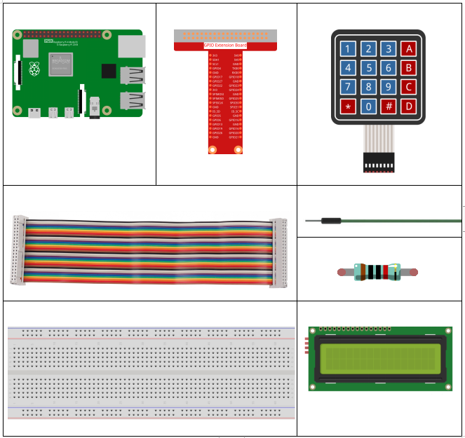
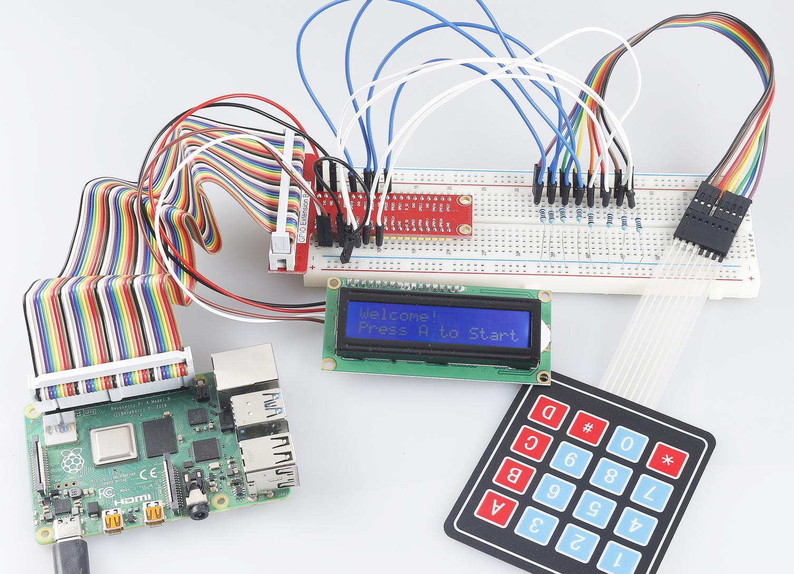

3.1.12 GAME– Guess Number
~~~~~~~~~~~~~~~~~~~~~~~~~

Introduction
------------------

Guessing Numbers is a fun party game where you and your friends take
turns inputting a number (0~99). The range will be smaller with the
inputting of the number till a player answers the riddle correctly. Then
the player is defeated and punished. For example, if the lucky number is
51 which the players cannot see, and the player ① inputs 50, the prompt
of number range changes to 50~99; if the player ② inputs 70, the range
of number can be 50~70; if the player ③ inputs 51, this player is the
unlucky one. Here, we use keypad to input numbers and use LCD to output
outcomes.

Components
-----------------

Schematic Diagram
-----------------------

============ ======== ======== =======
T-Board Name physical wiringPi BCM
GPIO18       Pin 12   1        18
GPIO23       Pin 16   4        23
GPIO24       Pin 18   5        24
GPIO25       Pin 22   6        25
SPIMOSI      Pin 19   12       10
GPIO22       Pin 15   3        22
GPIO27       Pin 13   2        27
GPIO17       Pin 11   0        17
SDA1         Pin 3    SDA1(8)  SDA1(2)
SCL1         Pin 5    SCL1(9)  SDA1(3)
============ ======== ======== =======

.. image:: media/Schematic_three_one12.png
   :align: center

Experimental Procedures
-----------------------------

**Step 1:** Build the circuit.

.. image:: media/image273.png
   :alt: Guess Number_bb
   :width: 6.71458in
   :height: 6.64097in

**Step 2**: Setup I2C (see Appendix. If you have set I2C, skip this
step.)

**For C Language Users**
^^^^^^^^^^^^^^^^^^^^^^^^^^^^

**Step 3**: Change directory.

.. raw:: html

   <run></run>

.. code-block::

    cd /home/pi/davinci-kit-for-raspberry-pi/c/3.1.12/

**Step 4**: Compile.

.. raw:: html

   <run></run>

.. code-block::

    gcc 3.1.12_GAME_GuessNumber.c -lwiringPi

**Step 5**: Run.

.. raw:: html

   <run></run>

.. code-block::

    sudo ./a.out

After the program runs, there displays the initial page on the LCD:

.. code-block:: 

   Welcome!
   Press A to go!

Press ‘A’, and the game will start and the game page will appear on the
LCD.

.. code-block:: 

   Enter number:
   0 ‹point‹ 99

.. note::

   If it does not work after running, please refer to :ref:`C code is not working?`

A random number ‘\ **point**\ ’ is produced but not displayed on the LCD
when the game starts, and what you need to do is to guess it. The number
you have typed appears at the end of the first line till the final
calculation is finished. (Press ‘D’ to start the comparation, and if the
input number is larger than **10**, the automatic comparation will
start.)

The number range of ‘point’ is displayed on the second line. And you
must type the number within the range. When you type a number, the range
narrows; if you got the lucky number luckily or unluckily, there will
appear “You've got it!”

**Code Explanation**

At the beginning part of the code are the functional functions of
**keypad** and **I2C LCD1602**. You can learning more details about them
in **1.1.7 I2C LCD1602** and **2.1.5 Keypad.**

Here, what we need to know is as follows:

.. code-block:: c

    /****************************************/
    //Start from here
    /****************************************/
    void init(void){
        fd = wiringPiI2CSetup(LCDAddr);
        lcd_init();
        lcd_clear();
        for(int i=0 ; i<4 ; i++) {
            pinMode(rowPins[i], OUTPUT);
            pinMode(colPins[i], INPUT);
        }
        lcd_clear();
        write(0, 0, "Welcome!");
        write(0, 1, "Press A to go!");
    }
    
This function is used to initially define **I2C LCD1602** and **Keypad**
and to display “Welcome!” and “Press A to go!”.

.. code-block:: c

    void init_new_value(void){
        srand(time(0));
        pointValue = rand()%100;
        upper = 99;
        lower = 0;
        count = 0;
        printf("point is %d\n",pointValue);
    }

The function produces the random number ‘\ **point**\ ’ and resets the
range hint of the point.

.. code-block:: c

    bool detect_point(void){
        if(count > pointValue){
            if(count < upper){
                upper = count;
            }
        }
        else if(count < pointValue){
            if(count > lower){
                lower = count;
            }
        }
        else if(count = pointValue){
            count = 0;
            return 1;
        }
        count = 0;
        return 0;
    }

detect_point() compares the input number with the produced “point”. If
the comparing outcome is that they are not same, **count** will assign
values to **upper** and **lower** and return ‘\ **0**\ ’; otherwise, if
the outcome indicates they are same, there returns ‘\ **1**\ ’.

.. code-block:: c

    void lcd_show_input(bool result){
        char *str=NULL;
        str =(char*)malloc(sizeof(char)*3);
        lcd_clear();
        if (result == 1){
            write(0,1,"You've got it!");
            delay(5000);
            init_new_value();
            lcd_show_input(0);
            return;
        }
        write(0,0,"Enter number:");
        Int2Str(str,count);
        write(13,0,str);
        Int2Str(str,lower);
        write(0,1,str);
        write(3,1,"<Point<");
        Int2Str(str,upper);
        write(12,1,str);
    }

This function works for displaying the game page. Pay attention to the
function **Int2Str(str,count)**, it converts these variables **count**,
**lower**, and **upper** from **integer** to **character string** for
the correct display of **lcd**.

.. code-block:: c

    int main(){
        unsigned char pressed_keys[BUTTON_NUM];
        unsigned char last_key_pressed[BUTTON_NUM];
        if(wiringPiSetup() == -1){ //when initialize wiring failed,print messageto screen
            printf("setup wiringPi failed !");
            return 1; 
        }
        init();
        init_new_value();
        while(1){
            keyRead(pressed_keys);
            bool comp = keyCompare(pressed_keys, last_key_pressed);
            if (!comp){
                if(pressed_keys[0] != 0){
                    bool result = 0;
                    if(pressed_keys[0] == 'A'){
                        init_new_value();
                        lcd_show_input(0);
                    }
                    else if(pressed_keys[0] == 'D'){
                        result = detect_point();
                        lcd_show_input(result);
                    }
                    else if(pressed_keys[0] >='0' && pressed_keys[0] <= '9'){
                        count = count * 10;
                        count = count + (pressed_keys[0] - 48);
                        if (count>=10){
                            result = detect_point();
                        }
                        lcd_show_input(result);
                    }
                }
                keyCopy(last_key_pressed, pressed_keys);
            }
            delay(100);
        }
        return 0;   
    }

Main() contains the whole process of the program, as show below:

1) Initialize **I2C LCD1602** and **Keypad**.

2) Use **init_new_value()** to create a random number **0-99**.

3) Judge whether the button is pressed and get the button reading.

4) If the button ‘\ **A**\ ’ is pressed, a random number **0-99** will
   appear then the game starts.

5) If the button ‘\ **D**\ ’ is detected to have been pressed, the
   program will enter into the outcome judgement and will display the
   outcome on the LCD. This step helps that you can also judge the
   outcome when you press only one number and then the button
   ‘\ **D**\ ’.

6) If the button **0-9** is pressed, the value of **count** will be
   changed; if the **count** is larger than **10**, then the judgement
   starts.

7) The changes of the game and its values are displayed on **LCD1602**.

**For Python Language Users**
^^^^^^^^^^^^^^^^^^^^^^^^^^^^^^

**Step 3**: Change directory.

.. raw:: html

   <run></run>

.. code-block:: 

    cd /home/pi/davinci-kit-for-raspberry-pi/python/

**Step 4**: Run.

.. raw:: html

   <run></run>

.. code-block:: 

    sudo python3 3.1.12_GAME_GuessNumber.py

After the program runs, there displays the initial page on the LCD:

.. code-block:: 

   Welcome!
   Press A to go!

Press ‘A’, and the game will start and the game page will appear on the
LCD.

.. code-block:: 

   Enter number:
   0 ‹point‹ 99

A random number ‘\ **point**\ ’ is produced but not displayed on the LCD
when the game starts, and what you need to do is to guess it. The number
you have typed appears at the end of the first line till the final
calculation is finished. (Press ‘D’ to start the comparation, and if the
input number is larger than **10**, the automatic comparation will
start.)

The number range of ‘point’ is displayed on the second line. And you
must type the number within the range. When you type a number, the range
narrows; if you got the lucky number luckily or unluckily, there will
appear “You've got it!”

**Code**

.. note::

   You can **Modify/Reset/Copy/Run/Stop** the code below. But before that, you need to go to  source code path like ``davinci-kit-for-raspberry-pi\\python``. 
    
.. raw:: html

    <run></run>

.. code-block:: python

   import RPi.GPIO as GPIO
   import time
   import LCD1602
   import random

   ##################### HERE IS THE KEYPAD LIBRARY TRANSPLANTED FROM Arduino ############
   #class Key:Define some of the properties of Key
   class Keypad():

      def __init__(self, rowsPins, colsPins, keys):
         self.rowsPins = rowsPins
         self.colsPins = colsPins
         self.keys = keys
         GPIO.setwarnings(False)
         GPIO.setmode(GPIO.BCM)
         GPIO.setup(self.rowsPins, GPIO.OUT, initial=GPIO.LOW)
         GPIO.setup(self.colsPins, GPIO.IN, pull_up_down=GPIO.PUD_DOWN)

      def read(self):
         pressed_keys = []
         for i, row in enumerate(self.rowsPins):
               GPIO.output(row, GPIO.HIGH)
               for j, col in enumerate(self.colsPins):
                  index = i * len(self.colsPins) + j
                  if (GPIO.input(col) == 1):
                     pressed_keys.append(self.keys[index])
               GPIO.output(row, GPIO.LOW)
         return pressed_keys

   ################ EXAMPLE CODE START HERE ################  

   count = 0
   pointValue = 0
   upper=99
   lower=0

   def setup():
      global keypad, last_key_pressed,keys
      rowsPins = [18,23,24,25]
      colsPins = [10,22,27,17]
      keys = ["1","2","3","A",
               "4","5","6","B",
               "7","8","9","C",
               "*","0","#","D"]
      keypad = Keypad(rowsPins, colsPins, keys)
      last_key_pressed = []
      LCD1602.init(0x27, 1)    # init(slave address, background light)
      LCD1602.clear()
      LCD1602.write(0, 0, 'Welcome!')
      LCD1602.write(0, 1, 'Press A to Start!')

   def init_new_value():
      global pointValue,upper,count,lower
      pointValue = random.randint(0,99)
      upper = 99
      lower = 0
      count = 0
      print('point is %d' %(pointValue))
      

   def detect_point():
      global count,upper,lower
      if count > pointValue:
         if count < upper:
               upper = count 
      elif count < pointValue:
         if count > lower:
               lower = count
      elif count == pointValue:
         count = 0
         return 1
      count = 0
      return 0

   def lcd_show_input(result):
      LCD1602.clear()
      if result == 1:
         LCD1602.write(0,1,'You have got it!')
         time.sleep(5)
         init_new_value()
         lcd_show_input(0)
         return
      LCD1602.write(0,0,'Enter number:')
      LCD1602.write(13,0,str(count))
      LCD1602.write(0,1,str(lower))
      LCD1602.write(3,1,' < Point < ')
      LCD1602.write(13,1,str(upper))

   def loop():
      global keypad, last_key_pressed,count
      while(True):
         result = 0
         pressed_keys = keypad.read()
         if len(pressed_keys) != 0 and last_key_pressed != pressed_keys:
               if pressed_keys == ["A"]:
                  init_new_value()
                  lcd_show_input(0)
               elif pressed_keys == ["D"]:
                  result = detect_point()
                  lcd_show_input(result)
               elif pressed_keys[0] in keys:
                  if pressed_keys[0] in list(["A","B","C","D","#","*"]):
                     continue
                  count = count * 10
                  count += int(pressed_keys[0])
                  if count >= 10:
                     result = detect_point()
                  lcd_show_input(result)
               print(pressed_keys)
         last_key_pressed = pressed_keys
         time.sleep(0.1)

   # Define a destroy function for clean up everything after the script finished
   def destroy():
      # Release resource
      GPIO.cleanup()
      LCD1602.clear() 

   if __name__ == '__main__':     # Program start from here
      try:
         setup()
         while True:
               loop()
      except KeyboardInterrupt:   # When 'Ctrl+C' is pressed, the program destroy() will be executed.
         destroy()

**Code Explanation**

At the beginning part of the code are the functional functions of
**keypad** and **I2C LCD1602**. You can learning more details about them
in **1.1.7 I2C LCD1602** and **2.1.5 Keypad.**

Here, what we need to know is as follows:

.. code-block:: python

    def init_new_value():
        global pointValue,upper,count,lower
        pointValue = random.randint(0,99)
        upper = 99
        lower = 0
        count = 0
        print('point is %d' %(pointValue))

The function produces the random number ‘\ **point**\ ’ and resets the
range hint of the point.

.. code-block:: python

    def detect_point():
        global count,upper,lower
        if count > pointValue:
            if count < upper:
                upper = count 
        elif count < pointValue:
            if count > lower:
                lower = count
        elif count == pointValue:
            count = 0
            return 1
        count = 0
        return 0

detect_point() compares the input number (**count**) with the produced
“\ **point**\ ”. If the comparing outcome is that they are not same,
**count** will assign values to **upper** and **lower** and return
‘\ **0**\ ’; otherwise, if the outcome indicates they are same, there
returns ‘\ **1**\ ’.

.. code-block:: python

    def lcd_show_input(result):
        LCD1602.clear()
        if result == 1:
            LCD1602.write(0,1,'You have got it!')
            time.sleep(5)
            init_new_value()
            lcd_show_input(0)
            return
        LCD1602.write(0,0,'Enter number:')
        LCD1602.write(13,0,str(count))
        LCD1602.write(0,1,str(lower))
        LCD1602.write(3,1,' < Point < ')
        LCD1602.write(13,1,str(upper))

This function works for displaying the game page.

str(count): Because **write()** can only support the data type —
**character string**, **str()** is needed to convert the **number** into
**string**.

.. code-block:: python

    def loop():
        global keypad, last_key_pressed,count
        while(True):
            result = 0
            pressed_keys = keypad.read()
            if len(pressed_keys) != 0 and last_key_pressed != pressed_keys:
                if pressed_keys == ["A"]:
                    init_new_value()
                    lcd_show_input(0)
                elif pressed_keys == ["D"]:
                    result = detect_point()
                    lcd_show_input(result)
                elif pressed_keys[0] in keys:
                    if pressed_keys[0] in list(["A","B","C","D","#","*"]):
                        continue
                    count = count * 10
                    count += int(pressed_keys[0])
                    if count >= 10:
                        result = detect_point()
                    lcd_show_input(result)
                print(pressed_keys)
            last_key_pressed = pressed_keys
            time.sleep(0.1)
   

Main() contains the whole process of the program, as show below:

1) Initialize **I2C LCD1602** and **Keypad**.

2) Judge whether the button is pressed and get the button reading.

3) If the button ‘\ **A**\ ’ is pressed, a random number **0-99** will
   appear then the game starts.

4) If the button ‘\ **D**\ ’ is detected to have been pressed, the
   program will enter into the outcome judgement.

5) If the button **0-9** is pressed, the value of **count** will be
   changed; if the **count** is larger than **10**, then the judgement
   starts.

6) The changes of the game and its values are displayed on **LCD1602**.

Phenomenon Picture
------------------------

