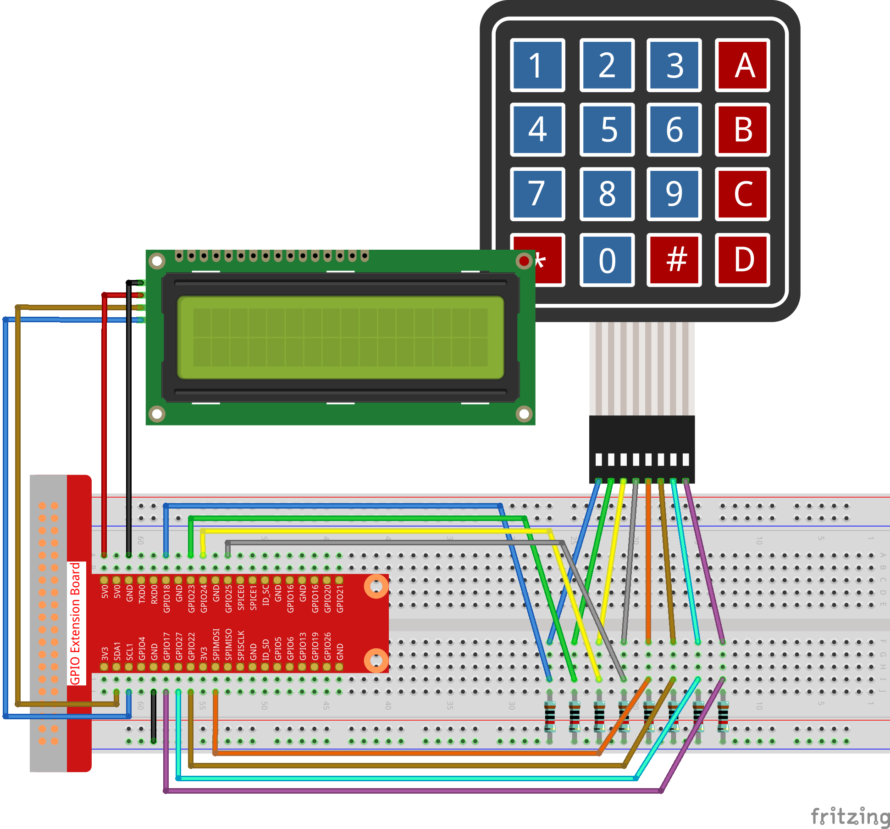

.. note::

    Ciao! Benvenuto nella Community di SunFounder per gli appassionati di Raspberry Pi, Arduino e ESP32 su Facebook! Scopri di più su Raspberry Pi, Arduino ed ESP32 insieme ad altri appassionati.

    **Perché unirsi?**

    - **Supporto Esperto**: Risolvi problematiche post-vendita e sfide tecniche con il supporto della nostra community e del nostro team.
    - **Impara e Condividi**: Scambia suggerimenti e tutorial per migliorare le tue competenze.
    - **Anteprime Esclusive**: Accedi in anticipo agli annunci di nuovi prodotti e alle anteprime.
    - **Sconti Speciali**: Goditi sconti esclusivi sui nostri nuovi prodotti.
    - **Promozioni Festive e Giveaway**: Partecipa a concorsi e promozioni durante le festività.

    👉 Pronto a esplorare e creare con noi? Clicca su [|link_sf_facebook|] e unisciti oggi stesso!

3.1.12 GIOCO - Indovina il Numero
==================================

Introduzione
--------------

"Indovina il Numero" è un gioco divertente in cui tu e i tuoi amici inserite 
a turno un numero (da 0 a 99). Il range si riduce progressivamente fino a 
quando un giocatore indovina il numero corretto e perde, ricevendo una 
"penitenza". Ad esempio, se il numero segreto è 51, il giocatore ① inserisce 
50 e il range cambia in 50~99; se il giocatore ② inserisce 70, il range diventa 
50~70; se il giocatore ③ inserisce 51, è sfortunato e perde. In questo progetto, 
useremo una tastiera per inserire i numeri e un display LCD per mostrare i 
risultati.

Componenti
-------------

.. image:: img/list_GAME_Guess_Number.png
    :align: center

Schema del Circuito
--------------------

============ ======== ======== =======
T-Board Name physical wiringPi BCM
GPIO18       Pin 12   1        18
GPIO23       Pin 16   4        23
GPIO24       Pin 18   5        24
GPIO25       Pin 22   6        25
SPIMOSI      Pin 19   12       10
GPIO22       Pin 15   3        22
GPIO27       Pin 13   2        27
GPIO17       Pin 11   0        17
SDA1         Pin 3    SDA1(8)  SDA1(2)
SCL1         Pin 5    SCL1(9)  SDA1(3)
============ ======== ======== =======

.. image:: img/Schematic_three_one12.png
   :align: center

Procedure Sperimentali
-----------------------

**Passo 1:** Costruisci il circuito.

**Passo 2**: Configura I2C (vedi Appendice. Se I2C è già configurato, salta questo passaggio.)

**Per gli Utenti di Linguaggio C**
^^^^^^^^^^^^^^^^^^^^^^^^^^^^^^^^^^^^

**Passo 3**: Cambia directory.

.. raw:: html

   <run></run>

.. code-block::

    cd ~/davinci-kit-for-raspberry-pi/c/3.1.12/

**Passo 4**: Compila.

.. raw:: html

   <run></run>

.. code-block::

    gcc 3.1.12_GAME_GuessNumber.c -lwiringPi

**Passo 5**: Esegui.

.. raw:: html

   <run></run>

.. code-block::

    sudo ./a.out

Dopo l’avvio del programma, sul display LCD compare la schermata iniziale:

.. code-block::

   Welcome!
   Press A to go!

Premi 'A' per iniziare il gioco, e la schermata di gioco apparirà sul LCD.

.. code-block::

   Enter number:
   0 ‹point‹ 99

.. note::

   Se il programma non funziona o ricevi un messaggio di errore: \"wiringPi.h: No such file or directory\", consulta :ref:`Il codice C non funziona?`.

All'inizio del gioco viene generato un numero casuale \"**point**\" 
che non viene visualizzato sul display LCD. Il tuo compito è indovinarlo. 
Il numero che hai inserito appare alla fine della prima riga fino al termine 
del calcolo. (Premi 'D' per avviare il confronto; se il numero è maggiore di 
**10**, il confronto automatico inizierà.)

Il range del numero \"point\" viene mostrato nella seconda riga. Devi inserire 
il numero all’interno di questo intervallo. Quando indovini il numero, apparirà 
il messaggio "You've got it!".

**Spiegazione del Codice**

Nella parte iniziale del codice ci sono le funzioni di **Keypad** e **I2C LCD1602**. 
Per ulteriori dettagli, consulta **1.1.7 LCD1602 I2C** e **2.1.5 Tastierino**.

Qui di seguito i dettagli principali:

.. code-block:: c

    /****************************************/
    //Inizio da qui
    /****************************************/
    void init(void){
        fd = wiringPiI2CSetup(LCDAddr);
        lcd_init();
        lcd_clear();
        for(int i=0 ; i<4 ; i++) {
            pinMode(rowPins[i], OUTPUT);
            pinMode(colPins[i], INPUT);
        }
        lcd_clear();
        write(0, 0, "Welcome!");
        write(0, 1, "Press A to go!");
    }

Questa funzione definisce inizialmente **I2C LCD1602** e **Keypad**, 
e visualizza "Welcome!" e "Press A to go!".

.. code-block:: c

    void init_new_value(void){
        srand(time(0));
        pointValue = rand()%100;
        upper = 99;
        lower = 0;
        count = 0;
        printf("point is %d\n",pointValue);
    }

La funzione genera un numero casuale \"**point**\" e reimposta il 
range di suggerimento del punto.

.. code-block:: c

    bool detect_point(void){
        if(count > pointValue){
            if(count < upper){
                upper = count;
            }
        }
        else if(count < pointValue){
            if(count > lower){
                lower = count;
            }
        }
        else if(count = pointValue){
            count = 0;
            return 1;
        }
        count = 0;
        return 0;
    }

detect_point() confronta il numero inserito con il numero \"point\" 
generato. Se i numeri non coincidono, **count** assegna i valori a 
**upper** e **lower** e restituisce '0'; se coincidono, restituisce '1'.

.. code-block:: c

    void lcd_show_input(bool result){
        char *str=NULL;
        str =(char*)malloc(sizeof(char)*3);
        lcd_clear();
        if (result == 1){
            write(0,1,"You've got it!");
            delay(5000);
            init_new_value();
            lcd_show_input(0);
            return;
        }
        write(0,0,"Enter number:");
        Int2Str(str,count);
        write(13,0,str);
        Int2Str(str,lower);
        write(0,1,str);
        write(3,1,"<Point<");
        Int2Str(str,upper);
        write(12,1,str);
    }

Questa funzione visualizza la schermata di gioco. Nota la funzione 
**Int2Str(str,count)** che converte le variabili **count**, **lower** 
e **upper** da **integer** a **stringa di caratteri** per una corretta 
visualizzazione su **lcd**.

.. code-block:: c

    int main(){
        unsigned char pressed_keys[BUTTON_NUM];
        unsigned char last_key_pressed[BUTTON_NUM];
        if(wiringPiSetup() == -1){ //when initialize wiring failed,print messageto screen
            printf("setup wiringPi failed !");
            return 1; 
        }
        init();
        init_new_value();
        while(1){
            keyRead(pressed_keys);
            bool comp = keyCompare(pressed_keys, last_key_pressed);
            if (!comp){
                if(pressed_keys[0] != 0){
                    bool result = 0;
                    if(pressed_keys[0] == 'A'){
                        init_new_value();
                        lcd_show_input(0);
                    }
                    else if(pressed_keys[0] == 'D'){
                        result = detect_point();
                        lcd_show_input(result);
                    }
                    else if(pressed_keys[0] >='0' && pressed_keys[0] <= '9'){
                        count = count * 10;
                        count = count + (pressed_keys[0] - 48);
                        if (count>=10){
                            result = detect_point();
                        }
                        lcd_show_input(result);
                    }
                }
                keyCopy(last_key_pressed, pressed_keys);
            }
            delay(100);
        }
        return 0;   
    }

Main() contiene l’intero processo del programma:

1) Inizializza **I2C LCD1602** e **Keypad**.

2) Usa **init_new_value()** per creare un numero casuale tra **0-99**.

3) Verifica se è stato premuto un pulsante e ottieni il valore.

4) Se viene premuto il pulsante '**A**', appare un numero casuale tra **0-99** 
   e il gioco inizia.

5) Se il pulsante '**D**' viene rilevato come premuto, il programma entrerà 
   nella fase di valutazione del risultato e visualizzerà l’esito sul display 
   LCD. Questo passaggio permette anche di verificare il risultato inserendo 
   un solo numero seguito dalla pressione del pulsante '**D**'.

6) Se viene premuto un pulsante da **0-9**, il valore di **count** cambia; se 
   **count** è maggiore di **10**, inizia il giudizio.

7) Le variazioni di gioco e i valori vengono visualizzati su **LCD1602**.
**Per Utenti Python**
^^^^^^^^^^^^^^^^^^^^^^^

**Passo 3**: Cambia directory.

.. raw:: html

   <run></run>

.. code-block::

    cd ~/davinci-kit-for-raspberry-pi/python/

**Passo 4**: Esegui.

.. raw:: html

   <run></run>

.. code-block::

    sudo python3 3.1.12_GAME_GuessNumber.py

Dopo l'avvio del programma, sul display LCD viene visualizzata la schermata iniziale:

.. code-block::

   Welcome!
   Press A to go!

Premi 'A' per avviare il gioco, e la schermata del gioco apparirà sul LCD.

.. code-block::

   Enter number:
   0 ‹point‹ 99

Viene generato un numero casuale 'point' che non viene mostrato sul display 
LCD all'inizio del gioco. Il tuo compito è indovinare questo numero. Il numero 
che hai digitato appare alla fine della prima riga fino alla conclusione del 
calcolo. (Premi 'D' per avviare il confronto; se il numero inserito è maggiore 
di 10, il confronto automatico inizierà.)

Il range del numero 'point' è visualizzato nella seconda riga. Devi inserire il 
numero all'interno di questo intervallo. Quando indovini il numero, il range si 
restringe; se lo indovini correttamente, apparirà "You've got it!".

**Codice**

.. note::

   Puoi **Modificare/Reimpostare/Copiare/Eseguire/Interrompere** il codice qui 
   sotto. Tuttavia, prima di farlo, è necessario andare nel percorso del codice 
   sorgente, come ``davinci-kit-for-raspberry-pi/python``.

.. raw:: html

   <run></run>

.. code-block:: python

   import RPi.GPIO as GPIO
   import time
   import LCD1602
   import random

   ##################### QUI INIZIA LA LIBRERIA DEL KEYPAD TRASPORTATA DA Arduino ############
   # class Key: Definisce alcune delle proprietà di Key
   class Keypad():

      def __init__(self, rowsPins, colsPins, keys):
         self.rowsPins = rowsPins
         self.colsPins = colsPins
         self.keys = keys
         GPIO.setwarnings(False)
         GPIO.setmode(GPIO.BCM)
         GPIO.setup(self.rowsPins, GPIO.OUT, initial=GPIO.LOW)
         GPIO.setup(self.colsPins, GPIO.IN, pull_up_down=GPIO.PUD_DOWN)

      def read(self):
         pressed_keys = []
         for i, row in enumerate(self.rowsPins):
               GPIO.output(row, GPIO.HIGH)
               for j, col in enumerate(self.colsPins):
                  index = i * len(self.colsPins) + j
                  if (GPIO.input(col) == 1):
                     pressed_keys.append(self.keys[index])
               GPIO.output(row, GPIO.LOW)
         return pressed_keys

   ################ INIZIO DEL CODICE DI ESEMPIO ################  

   count = 0
   pointValue = 0
   upper=99
   lower=0

   def setup():
      global keypad, last_key_pressed,keys
      rowsPins = [18,23,24,25]
      colsPins = [10,22,27,17]
      keys = ["1","2","3","A",
               "4","5","6","B",
               "7","8","9","C",
               "*","0","#","D"]
      keypad = Keypad(rowsPins, colsPins, keys)
      last_key_pressed = []
      LCD1602.init(0x27, 1)    # init(slave address, background light)
      LCD1602.clear()
      LCD1602.write(0, 0, 'Welcome!')
      LCD1602.write(0, 1, 'Press A to Start!')

   def init_new_value():
      global pointValue,upper,count,lower
      pointValue = random.randint(0,99)
      upper = 99
      lower = 0
      count = 0
      print('point is %d' %(pointValue))
      

   def detect_point():
      global count,upper,lower
      if count > pointValue:
         if count < upper:
               upper = count 
      elif count < pointValue:
         if count > lower:
               lower = count
      elif count == pointValue:
         count = 0
         return 1
      count = 0
      return 0

   def lcd_show_input(result):
      LCD1602.clear()
      if result == 1:
         LCD1602.write(0,1,'You have got it!')
         time.sleep(5)
         init_new_value()
         lcd_show_input(0)
         return
      LCD1602.write(0,0,'Enter number:')
      LCD1602.write(13,0,str(count))
      LCD1602.write(0,1,str(lower))
      LCD1602.write(3,1,' < Point < ')
      LCD1602.write(13,1,str(upper))

   def loop():
      global keypad, last_key_pressed,count
      while(True):
         result = 0
         pressed_keys = keypad.read()
         if len(pressed_keys) != 0 and last_key_pressed != pressed_keys:
               if pressed_keys == ["A"]:
                  init_new_value()
                  lcd_show_input(0)
               elif pressed_keys == ["D"]:
                  result = detect_point()
                  lcd_show_input(result)
               elif pressed_keys[0] in keys:
                  if pressed_keys[0] in list(["A","B","C","D","#","*"]):
                     continue
                  count = count * 10
                  count += int(pressed_keys[0])
                  if count >= 10:
                     result = detect_point()
                  lcd_show_input(result)
               print(pressed_keys)
         last_key_pressed = pressed_keys
         time.sleep(0.1)

   # Definisci una funzione di distruzione per pulire tutto dopo la fine dello script
   def destroy():
      # Rilascia risorse
      GPIO.cleanup()
      LCD1602.clear() 

   if __name__ == '__main__':     # Il programma inizia da qui
      try:
         setup()
         while True:
               loop()
      except KeyboardInterrupt:   # Quando si preme 'Ctrl+C', verrà eseguito il programma destroy().
         destroy()

**Spiegazione del Codice**

All'inizio del codice si trovano le funzioni per il funzionamento del 
**keypad** e del **display I2C LCD1602**. Puoi trovare maggiori dettagli 
su di esse in **1.1.7 LCD1602 I2C** e **2.1.5 Tastierino**.

Qui di seguito sono illustrate le funzioni principali:

.. code-block:: python

    def init_new_value():
        global pointValue,upper,count,lower
        pointValue = random.randint(0,99)
        upper = 99
        lower = 0
        count = 0
        print('point is %d' %(pointValue))

Questa funzione genera un numero casuale '**point**' e reimposta il range di 
riferimento per il gioco.

.. code-block:: python

    def detect_point():
        global count,upper,lower
        if count > pointValue:
            if count < upper:
                upper = count 
        elif count < pointValue:
            if count > lower:
                lower = count
        elif count == pointValue:
            count = 0
            return 1
        count = 0
        return 0

La funzione detect_point() confronta il numero inserito (**count**) con 
quello generato ('**point**'). Se il risultato del confronto è diverso, 
**count** aggiorna i valori di **upper** e **lower** e restituisce '**0**'; 
se il risultato è uguale, restituisce '**1**'.

.. code-block:: python

    def lcd_show_input(result):
        LCD1602.clear()
        if result == 1:
            LCD1602.write(0,1,'You have got it!')
            time.sleep(5)
            init_new_value()
            lcd_show_input(0)
            return
        LCD1602.write(0,0,'Enter number:')
        LCD1602.write(13,0,str(count))
        LCD1602.write(0,1,str(lower))
        LCD1602.write(3,1,' < Point < ')
        LCD1602.write(13,1,str(upper))

Questa funzione gestisce la visualizzazione della schermata di gioco.

str(count): Poiché la funzione **write()** supporta solo il tipo di dati 
**stringa**, **str()** viene utilizzato per convertire il **numero** in 
**stringa**.

.. code-block:: python

    def loop():
        global keypad, last_key_pressed,count
        while(True):
            result = 0
            pressed_keys = keypad.read()
            if len(pressed_keys) != 0 and last_key_pressed != pressed_keys:
                if pressed_keys == ["A"]:
                    init_new_value()
                    lcd_show_input(0)
                elif pressed_keys == ["D"]:
                    result = detect_point()
                    lcd_show_input(result)
                elif pressed_keys[0] in keys:
                    if pressed_keys[0] in list(["A","B","C","D","#","*"]):
                        continue
                    count = count * 10
                    count += int(pressed_keys[0])
                    if count >= 10:
                        result = detect_point()
                    lcd_show_input(result)
                print(pressed_keys)
            last_key_pressed = pressed_keys
            time.sleep(0.1)

Main() contiene l'intero flusso del programma, come illustrato di seguito:

1) Inizializza **I2C LCD1602** e **Keypad**.

2) Verifica se un pulsante è stato premuto e legge il valore del pulsante.

3) Se viene premuto il pulsante '**A**', viene generato un numero casuale tra 
   **0-99** e inizia il gioco.

4) Se viene rilevato che è stato premuto il pulsante '**D**', il programma 
   esegue la valutazione del risultato.

5) Se viene premuto un pulsante da **0 a 9**, il valore di **count** viene 
   aggiornato; se **count** è maggiore di **10**, inizia la valutazione.

6) Le modifiche del gioco e i relativi valori vengono visualizzati su **LCD1602**.

Immagine del Risultato
------------------------

