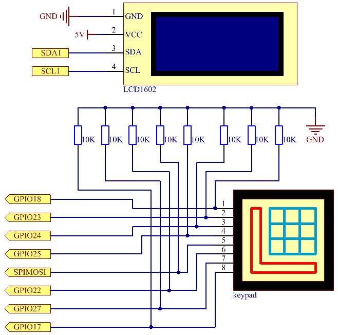

.. note::

    Hallo und willkommen in der SunFounder Raspberry Pi & Arduino & ESP32 Enthusiasten-Gemeinschaft auf Facebook! Tauchen Sie tiefer ein in die Welt von Raspberry Pi, Arduino und ESP32 mit anderen Enthusiasten.

    **Warum beitreten?**

    - **Expertenunterstützung**: Lösen Sie Nachverkaufsprobleme und technische Herausforderungen mit Hilfe unserer Gemeinschaft und unseres Teams.
    - **Lernen & Teilen**: Tauschen Sie Tipps und Anleitungen aus, um Ihre Fähigkeiten zu verbessern.
    - **Exklusive Vorschauen**: Erhalten Sie frühzeitigen Zugang zu neuen Produktankündigungen und exklusiven Einblicken.
    - **Spezialrabatte**: Genießen Sie exklusive Rabatte auf unsere neuesten Produkte.
    - **Festliche Aktionen und Gewinnspiele**: Nehmen Sie an Gewinnspielen und Feiertagsaktionen teil.

    👉 Sind Sie bereit, mit uns zu erkunden und zu erschaffen? Klicken Sie auf [|link_sf_facebook|] und treten Sie heute bei!

3.1.12 SPIEL – Nummer Vermutung
=================================

Einführung
------------------

Nummer Vermutung ist ein lustiges Partyspiel, 
bei dem Sie und Ihre Freunde abwechselnd eine Nummer eingeben (0~99). 
Die Reichweite wird mit der Eingabe der Nummer kleiner, bis ein Spieler das Rätsel richtig beantwortet. 
Dann wird der Spieler besiegt und bestraft. Wenn zum Beispiel die Glücksnummer 51 ist, 
die die Spieler nicht sehen können, und der Spieler ① 50 eingibt, 
ändert sich die Eingabeaufforderung des Nummernbereichs auf 50~99; 
Wenn der Spieler ② 70 eingibt, kann der Nummerbereich zwischen 50 und 70 liegen. 
Wenn der Spieler ③ 51 eingibt, ist dieser Spieler der Unglückliche. 
Hier verwenden wir die Tastatur zur Eingabe von Nummer und das LCD zur Ausgabe der Ergebnisse.

Komponenten
-----------------

.. image:: media/list_GAME_Guess_Number.png
    :align: center

Schematische Darstellung
-----------------------------------------

============ ======== ======== =======
T-Karte Name physisch wiringPi BCM
GPIO18       Pin 12   1        18
GPIO23       Pin 16   4        23
GPIO24       Pin 18   5        24
GPIO25       Pin 22   6        25
SPIMOSI      Pin 19   12       10
GPIO22       Pin 15   3        22
GPIO27       Pin 13   2        27
GPIO17       Pin 11   0        17
SDA1         Pin 3    SDA1(8)  SDA1(2)
SCL1         Pin 5    SCL1(9)  SDA1(3)
============ ======== ======== =======

Experimentelle Verfahren
-----------------------------

Schritt 1: Bauen Sie die Schaltung auf.

.. image:: media/image273.png
   :alt: Guess Number_bb
   :width: 800

Schritt 2: I2C einrichten (siehe Anhang. Wenn Sie :ref:`i2c_config`  eingestellt haben, überspringen Sie diesen Schritt.)

Für Benutzer in C-Sprache
^^^^^^^^^^^^^^^^^^^^^^^^^^^^

Schritt 3: Verzeichnis wechseln.

.. raw:: html

   <run></run>

.. code-block::

    cd ~/davinci-kit-for-raspberry-pi/c/3.1.12/

Schritt 4: Kompilieren.

.. raw:: html

   <run></run>

.. code-block::

    gcc 3.1.12_GAME_GuessNumber.c -lwiringPi

Schritt 5: Ausführen.

.. raw:: html

   <run></run>

.. code-block::

    sudo ./a.out

Nachdem das Programm ausgeführt wurde, wird die erste Seite auf dem LCD angezeigt:

.. code-block:: 

   Welcome!
   Press A to go!

Drücken Sie ‚A‘ und das Spiel startet und die Spieleseite erscheint auf dem LCD.

.. code-block:: 

   Enter number:
   0 ‹point‹ 99

Zu Beginn des Spiels wird eine Zufallsnummer ‚Punkt‘ erzeugt, die jedoch nicht auf dem LCD angezeigt wird. Sie müssen sie nur erraten. Die eingegebene Nummer wird am Ende der ersten Zeile angezeigt, bis die endgültige Berechnung abgeschlossen ist. (Drücken Sie ‚D‘, um den Vergleich zu starten. Wenn die Eingangsnummer größer als 10 ist, wird der automatische Vergleich gestartet.)

Der Nummernkreis von ‚Punkt‘ wird in der zweiten Zeile angezeigt. Und Sie müssen die Nummer innerhalb des Bereichs eingeben. Wenn Sie eine Nummer eingeben, wird der Bereich enger. Wenn Sie die Glücksnummer glücklicherweise oder unglücklicherweise erhalten haben, wird „You've got it!“ angezeigt.

**Code Erklärung**

Am Anfang des Codes stehen die Funktionsfunktionen der Tastatur und des I2C LCD1602. 
Weitere Informationen hierzu finden Sie in den Tasten :ref:`py_lcd` und :ref:`py_keypad` .

Hier müssen wir Folgendes wissen:

.. code-block:: c

    /****************************************/
    //Start from here
    /****************************************/
    void init(void){
        fd = wiringPiI2CSetup(LCDAddr);
        lcd_init();
        lcd_clear();
        for(int i=0 ; i<4 ; i++) {
            pinMode(rowPins[i], OUTPUT);
            pinMode(colPins[i], INPUT);
        }
        lcd_clear();
        write(0, 0, "Welcome!");
        write(0, 1, "Press A to go!");
    }
    

Diese Funktion wird verwendet, um zunächst I2C LCD1602 und Tastatur 
zu definieren und „Welcome!“ und „Press A to go!“ anzuzeigen.

.. code-block:: c

    void init_new_value(void){
        srand(time(0));
        pointValue = rand()%100;
        upper = 99;
        lower = 0;
        count = 0;
        printf("point is %d\n",pointValue);
    }

Die Funktion erzeugt die Zufallsnummer ``pointValue`` und setzt den Bereichshinweis des Punktes zurück.

.. code-block:: c

    bool detect_point(void){
        if(count > pointValue){
            if(count < upper){
                upper = count;
            }
        }
        else if(count < pointValue){
            if(count > lower){
                lower = count;
            }
        }
        else if(count = pointValue){
            count = 0;
            return 1;
        }
        count = 0;
        return 0;
    }

``detect_point()`` vergleicht die Eingabenummer mit dem erzeugten „point“. 
Wenn das Ergebnis des Vergleichs ist, dass sie nicht gleich sind, weist ``count`` ``upper`` und ``lower`` Werte zu und gibt „0“ zurück; andernfalls, wenn das Ergebnis anzeigt, dass sie gleich sind, wird „1“ zurückgegeben.

.. code-block:: c

    void lcd_show_input(bool result){
        char *str=NULL;
        str =(char*)malloc(sizeof(char)*3);
        lcd_clear();
        if (result == 1){
            write(0,1,"You've got it!");
            delay(5000);
            init_new_value();
            lcd_show_input(0);
            return;
        }
        write(0,0,"Enter number:");
        Int2Str(str,count);
        write(13,0,str);
        Int2Str(str,lower);
        write(0,1,str);
        write(3,1,"<Point<");
        Int2Str(str,upper);
        write(12,1,str);
    }

Diese Funktion dient zum Anzeigen der Spieleseite. 
Beachten Sie die Funktion ``Int2Str(str,count)`` , 
die diese Variablen ``count`` , ``lower`` und ``upper`` von Integer in Character String konvertiert, 
um die korrekte Anzeige von lcd zu gewährleisten.

.. code-block:: c

    int main(){
        unsigned char pressed_keys[BUTTON_NUM];
        unsigned char last_key_pressed[BUTTON_NUM];
        if(wiringPiSetup() == -1){ //when initialize wiring failed,print messageto screen
            printf("setup wiringPi failed !");
            return 1; 
        }
        init();
        init_new_value();
        while(1){
            keyRead(pressed_keys);
            bool comp = keyCompare(pressed_keys, last_key_pressed);
            if (!comp){
                if(pressed_keys[0] != 0){
                    bool result = 0;
                    if(pressed_keys[0] == 'A'){
                        init_new_value();
                        lcd_show_input(0);
                    }
                    else if(pressed_keys[0] == 'D'){
                        result = detect_point();
                        lcd_show_input(result);
                    }
                    else if(pressed_keys[0] >='0' && pressed_keys[0] <= '9'){
                        count = count * 10;
                        count = count + (pressed_keys[0] - 48);
                        if (count>=10){
                            result = detect_point();
                        }
                        lcd_show_input(result);
                    }
                }
                keyCopy(last_key_pressed, pressed_keys);
            }
            delay(100);
        }
        return 0;   
    }

``main()`` enthält den gesamten Prozess des Programms, wie unten gezeigt:

1. Initialisieren Sie I2C LCD1602 und Tastatur.

#. Verwenden Sie ``init_new_value()`` , um eine Zufallsnummer 0-99 zu erstellen.

#. Beurteilen Sie, ob die Taste gedrückt wurde, und lassen Sie die Taste ablesen.

#. Wenn die Taste „A“ gedrückt wird, erscheint eine Zufallsnummer 0-99 und das Spiel beginnt.

#. Wenn festgestellt wird, dass die Taste „D“ gedrückt wurde, geht das Programm in die Ergebnisbeurteilung ein und zeigt das Ergebnis auf dem LCD an. Dieser Schritt hilft Ihnen, das Ergebnis auch zu beurteilen, wenn Sie nur eine Nummer und dann die Taste „D“ drücken.

#. Wenn die Taste 0-9 gedrückt wird, wird der Zählwert geändert. Wenn die Anzahl größer als 10 ist, beginnt das Urteil.

#. Die Änderungen des Spiels und seiner Werte werden auf dem LCD1602 angezeigt.

Für Python-Sprachbenutzer
^^^^^^^^^^^^^^^^^^^^^^^^^^^^^^

Schritt 3: Verzeichnis wechseln.

.. raw:: html

   <run></run>

.. code-block:: 

    cd ~/davinci-kit-for-raspberry-pi/python/

Schritt 4: Ausführen.

.. raw:: html

   <run></run>

.. code-block:: 

    sudo python3 3.1.12_GAME_GuessNumber.py

Nachdem das Programm ausgeführt wurde, wird die erste Seite auf dem LCD angezeigt:

.. code-block:: 

   Welcome!
   Press A to go!

Drücken Sie ‚A‘ und das Spiel startet und die Spieleseite erscheint auf dem LCD.

.. code-block:: 

   Enter number:
   0 ‹point‹ 99

Zu Beginn des Spiels wird eine Zufallsnummer ‚Punkt‘ erzeugt, 
die jedoch nicht auf dem LCD angezeigt wird. Sie müssen sie nur erraten. 
Die eingegebene Nummer wird am Ende der ersten Zeile angezeigt, 
bis die endgültige Berechnung abgeschlossen ist. (Drücken Sie ‚D‘, um den Vergleich zu starten. 
Wenn die Eingangsnummer größer als 10 ist, wird der automatische Vergleich gestartet.)

Der Nummernkreis von ‚Punkt‘ wird in der zweiten Zeile angezeigt. 
Und Sie müssen die Nummer innerhalb des Bereichs eingeben. Wenn Sie eine Nummer eingeben, 
wird der Bereich enger. Wenn Sie die Glücksnummer glücklicherweise oder unglücklicherweise erhalten haben, 
wird „You've got it!“ angezeigt. 

**Code**

.. note::

    Sie können den folgenden Code **Ändern/Zurücksetzen/Kopieren/Ausführen/Stoppen** . Zuvor müssen Sie jedoch zu einem Quellcodepfad wie ``davinci-kit-for-raspberry-pi/python`` gehen.
      
.. raw:: html

    <run></run>

.. code-block:: python

   import RPi.GPIO as GPIO
   import time
   import LCD1602
   import random

   ##################### HERE IS THE KEYPAD LIBRARY TRANSPLANTED FROM Arduino ############
   #class Key:Define some of the properties of Key
   class Keypad():

      def __init__(self, rowsPins, colsPins, keys):
         self.rowsPins = rowsPins
         self.colsPins = colsPins
         self.keys = keys
         GPIO.setwarnings(False)
         GPIO.setmode(GPIO.BCM)
         GPIO.setup(self.rowsPins, GPIO.OUT, initial=GPIO.LOW)
         GPIO.setup(self.colsPins, GPIO.IN, pull_up_down=GPIO.PUD_DOWN)

      def read(self):
         pressed_keys = []
         for i, row in enumerate(self.rowsPins):
               GPIO.output(row, GPIO.HIGH)
               for j, col in enumerate(self.colsPins):
                  index = i * len(self.colsPins) + j
                  if (GPIO.input(col) == 1):
                     pressed_keys.append(self.keys[index])
               GPIO.output(row, GPIO.LOW)
         return pressed_keys

   ################ EXAMPLE CODE START HERE ################  

   count = 0
   pointValue = 0
   upper=99
   lower=0

   def setup():
      global keypad, last_key_pressed,keys
      rowsPins = [18,23,24,25]
      colsPins = [10,22,27,17]
      keys = ["1","2","3","A",
               "4","5","6","B",
               "7","8","9","C",
               "*","0","#","D"]
      keypad = Keypad(rowsPins, colsPins, keys)
      last_key_pressed = []
      LCD1602.init(0x27, 1)    # init(slave address, background light)
      LCD1602.clear()
      LCD1602.write(0, 0, 'Welcome!')
      LCD1602.write(0, 1, 'Press A to Start!')

   def init_new_value():
      global pointValue,upper,count,lower
      pointValue = random.randint(0,99)
      upper = 99
      lower = 0
      count = 0
      print('point is %d' %(pointValue))
      

   def detect_point():
      global count,upper,lower
      if count > pointValue:
         if count < upper:
               upper = count 
      elif count < pointValue:
         if count > lower:
               lower = count
      elif count == pointValue:
         count = 0
         return 1
      count = 0
      return 0

   def lcd_show_input(result):
      LCD1602.clear()
      if result == 1:
         LCD1602.write(0,1,'You have got it!')
         time.sleep(5)
         init_new_value()
         lcd_show_input(0)
         return
      LCD1602.write(0,0,'Enter number:')
      LCD1602.write(13,0,str(count))
      LCD1602.write(0,1,str(lower))
      LCD1602.write(3,1,' < Point < ')
      LCD1602.write(13,1,str(upper))

   def loop():
      global keypad, last_key_pressed,count
      while(True):
         result = 0
         pressed_keys = keypad.read()
         if len(pressed_keys) != 0 and last_key_pressed != pressed_keys:
               if pressed_keys == ["A"]:
                  init_new_value()
                  lcd_show_input(0)
               elif pressed_keys == ["D"]:
                  result = detect_point()
                  lcd_show_input(result)
               elif pressed_keys[0] in keys:
                  if pressed_keys[0] in list(["A","B","C","D","#","*"]):
                     continue
                  count = count * 10
                  count += int(pressed_keys[0])
                  if count >= 10:
                     result = detect_point()
                  lcd_show_input(result)
               print(pressed_keys)
         last_key_pressed = pressed_keys
         time.sleep(0.1)

   # Define a destroy function for clean up everything after the script finished
   def destroy():
      # Release resource
      GPIO.cleanup()
      LCD1602.clear() 

   if __name__ == '__main__':     # Program start from here
      try:
         setup()
         while True:
               loop()
      except KeyboardInterrupt:   # When 'Ctrl+C' is pressed, the program destroy() will be executed.
         destroy()

**Code Erklärung**

Am Anfang des Codes stehen die Funktionsfunktionen der Tastatur und des I2C LCD1602. 
Weitere Informationen hierzu finden Sie in den Tasten :ref:`py_lcd` LCD1602 und :ref:`py_keypad` .

Hier müssen wir Folgendes wissen:

.. code-block:: python

    def init_new_value():
        global pointValue,upper,count,lower
        pointValue = random.randint(0,99)
        upper = 99
        lower = 0
        count = 0
        print('point is %d' %(pointValue))

Die Funktion erzeugt die Zufallsnummer ``pointValue`` und setzt den Bereichshinweis des Punktes zurück.

.. code-block:: python

    def detect_point():
        global count,upper,lower
        if count > pointValue:
            if count < upper:
                upper = count 
        elif count < pointValue:
            if count > lower:
                lower = count
        elif count == pointValue:
            count = 0
            return 1
        count = 0
        return 0

``detect_point()`` vergleicht die eingegebene Zahl (count) mit dem erzeugten „point“. 
Wenn das Ergebnis des Vergleichs ist, 
dass sie nicht gleich sind, weist ``count`` ``upper`` und ``lower`` Werte zu und gibt ‚0‘ zurück; 
andernfalls, wenn das Ergebnis anzeigt, dass sie gleich sind, wird ‚1‘ zurückgegeben.

.. code-block:: python

    def lcd_show_input(result):
        LCD1602.clear()
        if result == 1:
            LCD1602.write(0,1,'You have got it!')
            time.sleep(5)
            init_new_value()
            lcd_show_input(0)
            return
        LCD1602.write(0,0,'Enter number:')
        LCD1602.write(13,0,str(count))
        LCD1602.write(0,1,str(lower))
        LCD1602.write(3,1,' < Point < ')
        LCD1602.write(13,1,str(upper))

Diese Funktion dient zum Anzeigen der Spieleseite.

``str(count)`` : Da ``write()`` nur den Datentyp - Zeichenfolge - unterstützen kann, wird ``str()`` benötigt, um die Nummer in eine Zeichenfolge umzuwandeln.

.. code-block:: python

    def loop():
        global keypad, last_key_pressed,count
        while(True):
            result = 0
            pressed_keys = keypad.read()
            if len(pressed_keys) != 0 and last_key_pressed != pressed_keys:
                if pressed_keys == ["A"]:
                    init_new_value()
                    lcd_show_input(0)
                elif pressed_keys == ["D"]:
                    result = detect_point()
                    lcd_show_input(result)
                elif pressed_keys[0] in keys:
                    if pressed_keys[0] in list(["A","B","C","D","#","*"]):
                        continue
                    count = count * 10
                    count += int(pressed_keys[0])
                    if count >= 10:
                        result = detect_point()
                    lcd_show_input(result)
                print(pressed_keys)
            last_key_pressed = pressed_keys
            time.sleep(0.1)
   

``main()`` enthält den gesamten Prozess des Programms, wie unten gezeigt:

1. Initialisieren Sie I2C LCD1602 und Tastatur.

#. Beurteilen Sie, ob die Taste gedrückt wurde, und lassen Sie die Taste ablesen.

#. Wenn die Taste „A“ gedrückt wird, erscheint eine Zufallsnummer 0-99 und das Spiel beginnt.

#. Wenn festgestellt wird, dass die Taste ‚D‘ gedrückt wurde, geht das Programm in die Ergebnisbeurteilung ein.

#. Wenn die Taste 0-9 gedrückt wird, wird der Zählwert geändert. Wenn die Anzahl größer als 10 ist, beginnt das Urteil.

#. Die Änderungen des Spiels und seiner Werte werden auf dem LCD1602 angezeigt.

Phänomen Bild
------------------------

.. image:: media/image274.jpeg
   :align: center