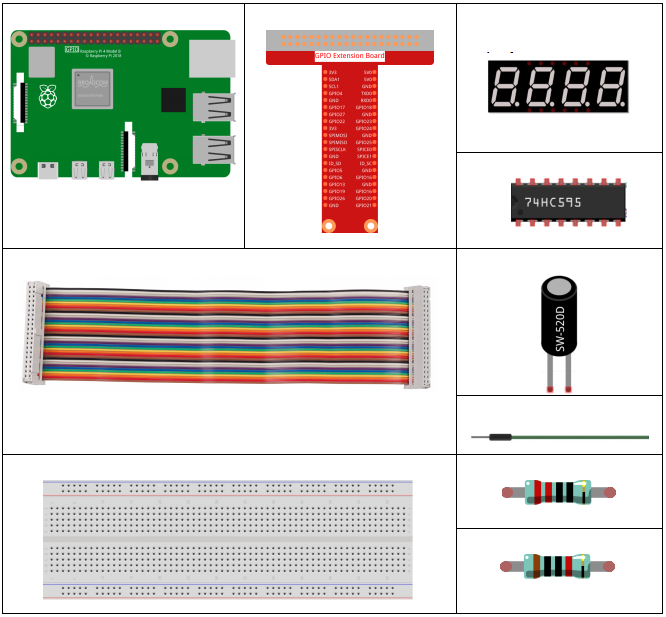
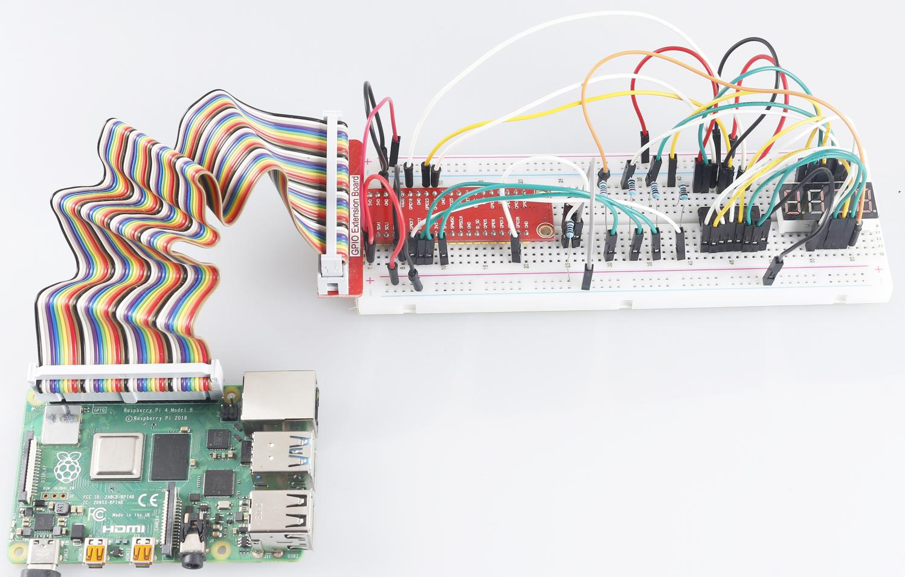

3.1.13 GAME– 10 Second
~~~~~~~~~~~~~~~~~~~~~~

**Introduction**
-------------------

Next, follow me to make a game device to challenge your concentration.
Tie the tilt switch to a stick to make a magic wand. Shake the wand, the
4-digit segment display will start counting, shake again will let it
stop counting. If you succeed in keeping the displayed count at
**10.00**, then you win. You can play the game with your friends to see
who is the time wizard.

**Components**
----------------

**Schematic Diagram**
------------------------

============ ======== ======== ===
T-Board Name physical wiringPi BCM
GPIO17       Pin 11   0        17
GPIO27       Pin 13   2        27
GPIO22       Pin 15   3        22
SPIMOSI      Pin 19   12       10
GPIO18       Pin 12   1        18
GPIO23       Pin 16   4        23
GPIO24       Pin 18   5        24
GPIO26       Pin 37   25       26
============ ======== ======== ===

.. image:: media/Schematic_three_one13.png
   :align: center

**Experimental Procedures**
---------------------------------

**Step 1**: Build the circuit.

.. image:: media/image277.png
   :alt: 10 second_bb
   :width: 6.84444in
   :height: 3.53889in

**For C Language Users**
^^^^^^^^^^^^^^^^^^^^^^^^^

**Step 2**: Go to the folder of the code.

.. raw:: html

   <run></run>

.. code-block::

    cd /home/pi/davinci-kit-for-raspberry-pi/c/3.1.13/

**Step 3**: Compile the code.

.. raw:: html

   <run></run>

.. code-block::

    gcc 3.1.13_GAME_10Second.c -lwiringPi

**Step 4**: Run the executable file.

.. raw:: html

   <run></run>

.. code-block::

    sudo ./a.out

Shake the wand, the 4-digit segment display will start counting, shake
again will let it stop counting. If you succeed in keeping the displayed
count at **10.00**, then you win. Shake it one more time to start the
next round of the game.

**Code Explanation**

.. code-block:: c

    void stateChange(){
        if (gameState == 0){
            counter = 0;
            delay(1000);
            ualarm(10000,10000); 
        }else{
            alarm(0);
            delay(1000);
        }
        gameState = (gameState + 1)%2;
    }

The game is divided into two modes:

gameState=0 is the "start" mode, in which the time is timed and
displayed on the segment display, and the tilting switch is shaken to
enter the "show" mode.

GameState =1 is the "show" mode, which stops the timing and displays the
time on the segment display. Shaking the tilt switch again will reset
the timer and restart the game.

.. code-block:: c

    void loop(){
        int currentState =0;
        int lastState=0;
        while(1){
            display();
            currentState=digitalRead(sensorPin);
            if((currentState==0)&&(lastState==1)){
                stateChange();
            }
            lastState=currentState;
        }
    }

Loop() is the main function. First, the time is displayed on the 4-bit
segment display and the value of the tilt switch is read. If the state
of the tilt switch has changed, stateChange() is called.

**For Python Language Users**
^^^^^^^^^^^^^^^^^^^^^^^^^^^^^^^

**Step 2**: Go to the folder of the code.

.. raw:: html

   <run></run>

.. code-block::

    cd /home/pi/davinci-kit-for-raspberry-pi/python/

**Step 3**: Run the executable file.

.. raw:: html

   <run></run>

.. code-block::

    sudo python3 3.1.13_GAME_10Second.py

Shake the wand, the 4-digit segment display will start counting, shake
again will let it stop counting. If you succeed in keeping the displayed
count at **10.00**, then you win. Shake it one more time to start the
next round of the game.

**Code Explanation**

.. code-block:: python

    def stateChange():
        global gameState
        global counter
        global timer1
        if gameState == 0:
            counter = 0
            time.sleep(1)
            timer() 
        elif gameState ==1:
            timer1.cancel()
            time.sleep(1)
        gameState = (gameState+1)%2

The game is divided into two modes:

gameState=0 is the "start" mode, in which the time is timed and
displayed on the segment display, and the tilting switch is shaken to
enter the "show" mode.

GameState =1 is the "show" mode, which stops the timing and displays the
time on the segment display. Shaking the tilt switch again will reset
the timer and restart the game.

.. code-block:: python

    def loop():
        global counter
        currentState = 0
        lastState = 0
        while True:
            display()
            currentState=GPIO.input(sensorPin)
            if (currentState == 0) and (lastState == 1):
                stateChange()
            lastState=currentState

Loop() is the main function. First, the time is displayed on the 4-bit
segment display and the value of the tilt switch is read. If the state
of the tilt switch has changed, stateChange() is called.

.. code-block:: python

    def timer():  
        global counter
        global timer1
        timer1 = threading.Timer(0.01, timer) 
        timer1.start()  
        counter += 1

After the interval reaches 0.01s, the timer function is called; add 1 to
counter, and the timer is used again to execute itself repeatedly every
0.01s.

**Phenomenon Picture**
-----------------------

