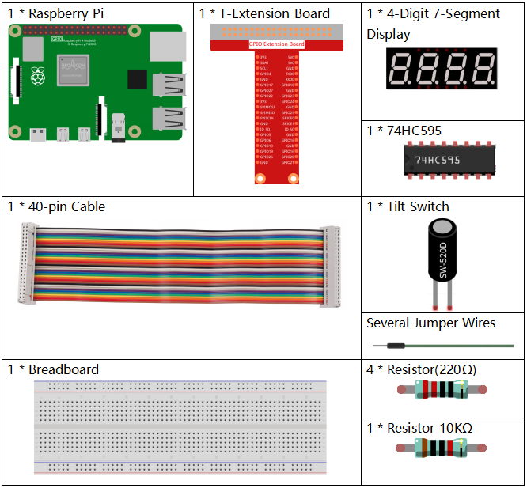
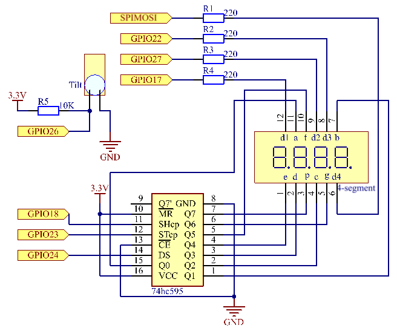
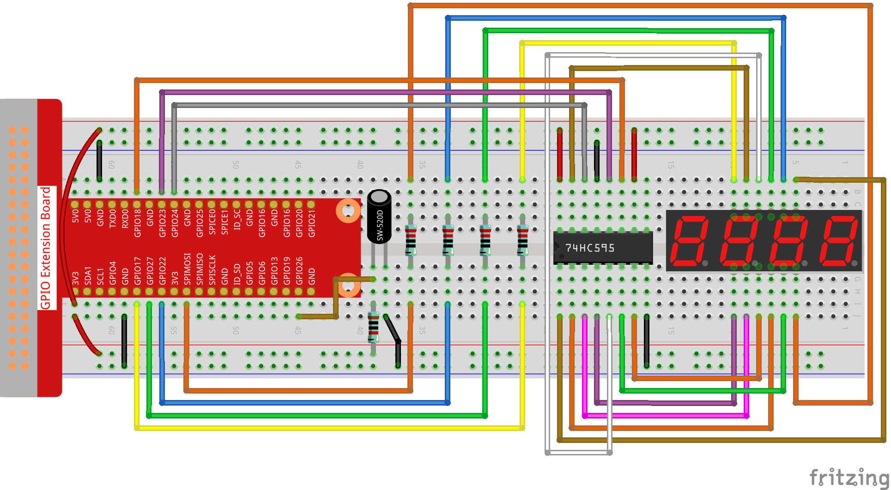
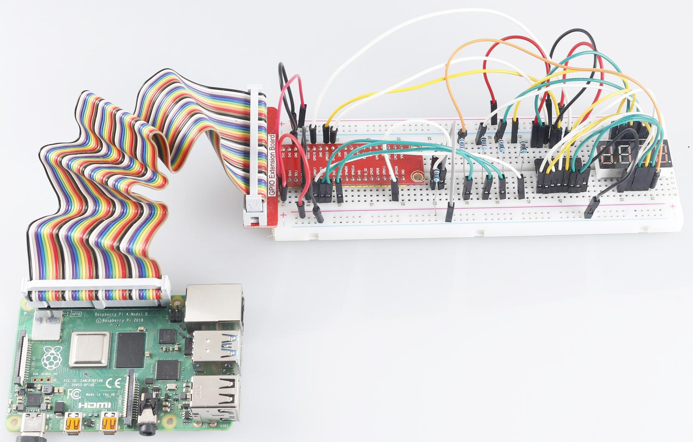

.. note:: 

    Ciao e benvenuto nella Community di SunFounder Raspberry Pi & Arduino & ESP32 Enthusiasts su Facebook! Approfondisci l'uso di Raspberry Pi, Arduino e ESP32 insieme ad altri appassionati.

    **Perché unirti a noi?**

    - **Supporto Tecnico**: Risolvi problemi post-vendita e sfide tecniche con l'aiuto della nostra community e del nostro team.
    - **Apprendimento e Condivisione**: Scambia consigli e tutorial per migliorare le tue competenze.
    - **Anteprime Esclusive**: Ottieni accesso anticipato agli annunci dei nuovi prodotti.
    - **Sconti Speciali**: Approfitta di sconti esclusivi sui nostri prodotti più recenti.
    - **Promozioni Festive e Giveaway**: Partecipa a omaggi e promozioni speciali.

    👉 Pronto a esplorare e creare con noi? Clicca su [|link_sf_facebook|] e unisciti oggi!

3.1.13 GIOCO– 10 Secondi
==========================

Introduzione
--------------------

Ora realizzeremo un dispositivo di gioco per mettere alla prova la tua 
concentrazione. Fissa un interruttore a inclinazione su un bastoncino 
per creare una bacchetta magica. Agita la bacchetta e il display a 4 cifre 
inizierà a contare; agitala di nuovo per fermare il conteggio. Se riesci 
a fermarlo esattamente su **10.00**, vinci! Puoi sfidare i tuoi amici per 
scoprire chi è il "mago del tempo".

Componenti
----------------

Schema del Circuito
------------------------

============ ======== ======== ===
T-Board Name physical wiringPi BCM
GPIO17       Pin 11   0        17
GPIO27       Pin 13   2        27
GPIO22       Pin 15   3        22
SPIMOSI      Pin 19   12       10
GPIO18       Pin 12   1        18
GPIO23       Pin 16   4        23
GPIO24       Pin 18   5        24
GPIO26       Pin 37   25       26
============ ======== ======== ===

Procedure Sperimentali
---------------------------------

**Passo 1**: Costruisci il circuito.

**Per gli Utenti del Linguaggio C**
^^^^^^^^^^^^^^^^^^^^^^^^^^^^^^^^^^^^^

**Passo 2**: Vai alla cartella del codice.

.. raw:: html

   <run></run>

.. code-block::

    cd ~/davinci-kit-for-raspberry-pi/c/3.1.13/

**Passo 3**: Compila il codice.

.. raw:: html

   <run></run>

.. code-block::

    gcc 3.1.13_GAME_10Second.c -lwiringPi

**Passo 4**: Esegui il file compilato.

.. raw:: html

   <run></run>

.. code-block::

    sudo ./a.out

Agita la bacchetta per avviare il conteggio sul display a 4 cifre; 
agitandola di nuovo, il conteggio si fermerà. Se riesci a fermare 
il conteggio su **10.00**, vinci! Agitala nuovamente per iniziare 
un nuovo round di gioco.

.. note::

    Se il programma non funziona dopo l’esecuzione o appare un errore: \"wiringPi.h: Nessun file o directory", fai riferimento a :ref:`Il codice C non funziona?`.

**Spiegazione del Codice**

.. code-block:: c

    void stateChange(){
        if (gameState == 0){
            counter = 0;
            delay(1000);
            ualarm(10000,10000); 
        }else{
            alarm(0);
            delay(1000);
        }
        gameState = (gameState + 1)%2;
    }

Il gioco è suddiviso in due modalità:

gameState=0 è la modalità "start", in cui il tempo viene conteggiato e 
mostrato sul display a segmenti; scuotendo l'interruttore inclinabile si 
entra nella modalità "show".

gameState=1 è la modalità "show", in cui il conteggio si ferma e il tempo 
viene visualizzato sul display. Scuotendo di nuovo l’interruttore inclinabile, 
il timer si resetta e il gioco ricomincia.

.. code-block:: c

    void loop(){
        int currentState =0;
        int lastState=0;
        while(1){
            display();
            currentState=digitalRead(sensorPin);
            if((currentState==0)&&(lastState==1)){
                stateChange();
            }
            lastState=currentState;
        }
    }

Loop() è la funzione principale. Prima, il tempo viene visualizzato sul 
display a 4 cifre, e si legge il valore dell'interruttore inclinabile. 
Se lo stato dell’interruttore inclinabile cambia, viene chiamata la 
funzione stateChange().

**Per Utenti di Linguaggio Python** 
^^^^^^^^^^^^^^^^^^^^^^^^^^^^^^^^^^^^^

**Passo 2**: Vai alla cartella del codice.

.. raw:: html

   <run></run>

.. code-block::

    cd ~/davinci-kit-for-raspberry-pi/python/

**Passo 3**: Esegui il file eseguibile.

.. raw:: html

   <run></run>

.. code-block::

    sudo python3 3.1.13_GAME_10Second.py

Agita la bacchetta e il display a 4 cifre inizierà a contare; agitala di 
nuovo per fermare il conteggio. Se riesci a fermare il conteggio su **10.00**, 
vinci! Agitala ancora una volta per avviare un nuovo round del gioco.

**Codice**

.. note::

    Puoi **Modificare/Reimpostare/Copiare/Eseguire/Interrompere** il codice qui sotto. Prima di farlo, però, è necessario trovarsi nel percorso di origine del codice come ``davinci-kit-for-raspberry-pi/python``.
    
.. raw:: html

    <run></run>

.. code-block:: python

    import RPi.GPIO as GPIO
    import time
    import threading

    sensorPin = 26

    SDI = 24
    RCLK = 23
    SRCLK = 18

    placePin = (10, 22, 27, 17)
    number = (0xc0, 0xf9, 0xa4, 0xb0, 0x99, 0x92, 0x82, 0xf8, 0x80, 0x90)

    counter = 0
    timer =0
    gameState =0

    def clearDisplay():
        for i in range(8):
            GPIO.output(SDI, 1)
            GPIO.output(SRCLK, GPIO.HIGH)
            GPIO.output(SRCLK, GPIO.LOW)
        GPIO.output(RCLK, GPIO.HIGH)
        GPIO.output(RCLK, GPIO.LOW)    

    def hc595_shift(data): 
        for i in range(8):
            GPIO.output(SDI, 0x80 & (data << i))
            GPIO.output(SRCLK, GPIO.HIGH)
            GPIO.output(SRCLK, GPIO.LOW)
        GPIO.output(RCLK, GPIO.HIGH)
        GPIO.output(RCLK, GPIO.LOW)

    def pickDigit(digit):
        for i in placePin:
            GPIO.output(i,GPIO.LOW)
        GPIO.output(placePin[digit], GPIO.HIGH)

    def display():
        global counter                    
        clearDisplay() 
        pickDigit(0)  
        hc595_shift(number[counter % 10])

        clearDisplay()
        pickDigit(1)
        hc595_shift(number[counter % 100//10])

        clearDisplay()
        pickDigit(2)
        hc595_shift(number[counter % 1000//100]-0x80)

        clearDisplay()
        pickDigit(3)
        hc595_shift(number[counter % 10000//1000])

    def stateChange():
        global gameState
        global counter
        global timer1
        if gameState == 0:
            counter = 0
            time.sleep(1)
            timer() 
        elif gameState ==1:
            timer1.cancel()
            time.sleep(1)
        gameState = (gameState+1)%2

    def loop():
        global counter
        currentState = 0
        lastState = 0
        while True:
            display()
            currentState=GPIO.input(sensorPin)
            if (currentState == 0) and (lastState == 1):
                stateChange()
            lastState=currentState

    def timer():  
        global counter
        global timer1
        timer1 = threading.Timer(0.01, timer) 
        timer1.start()  
        counter += 1

    def setup():
        GPIO.setmode(GPIO.BCM)
        GPIO.setup(SDI, GPIO.OUT)
        GPIO.setup(RCLK, GPIO.OUT)
        GPIO.setup(SRCLK, GPIO.OUT)
        for i in placePin:
            GPIO.setup(i, GPIO.OUT)
        GPIO.setup(sensorPin, GPIO.IN)

    def destroy():   # Quando viene premuto "Ctrl+C", la funzione viene eseguita.
        GPIO.cleanup()
        global timer1
        timer1.cancel()

    if __name__ == '__main__':  # Inizio del programma
        setup()
        try:
            loop()
        except KeyboardInterrupt:
            destroy()

**Spiegazione del Codice**

.. code-block:: python

    def stateChange():
        global gameState
        global counter
        global timer1
        if gameState == 0:
            counter = 0
            time.sleep(1)
            timer() 
        elif gameState ==1:
            timer1.cancel()
            time.sleep(1)
        gameState = (gameState+1)%2

Il gioco è diviso in due modalità:

gameState=0 è la modalità "start", in cui viene avviato il conteggio del 
tempo e visualizzato sul display a segmenti, e il movimento dell'interruttore 
a inclinazione consente di entrare nella modalità "show".

gameState=1 è la modalità "show", che ferma il conteggio e visualizza il tempo 
sul display a segmenti. Scuotendo nuovamente l'interruttore a inclinazione, il 
timer si resetta e il gioco ricomincia.

.. code-block:: python

    def loop():
        global counter
        currentState = 0
        lastState = 0
        while True:
            display()
            currentState=GPIO.input(sensorPin)
            if (currentState == 0) and (lastState == 1):
                stateChange()
            lastState=currentState

Loop() è la funzione principale. Prima, il tempo viene visualizzato sul 
display a 4 cifre e si legge il valore dell'interruttore a inclinazione. 
Se lo stato dell'interruttore cambia, viene chiamata la funzione stateChange().

.. code-block:: python

    def timer():  
        global counter
        global timer1
        timer1 = threading.Timer(0.01, timer) 
        timer1.start()  
        counter += 1

Dopo che l'intervallo raggiunge 0,01s, viene chiamata la funzione timer; 
aggiunge 1 a counter e riutilizza il timer per eseguire se stessa ripetutamente 
ogni 0,01s.

Immagine del Fenomeno
--------------------------

