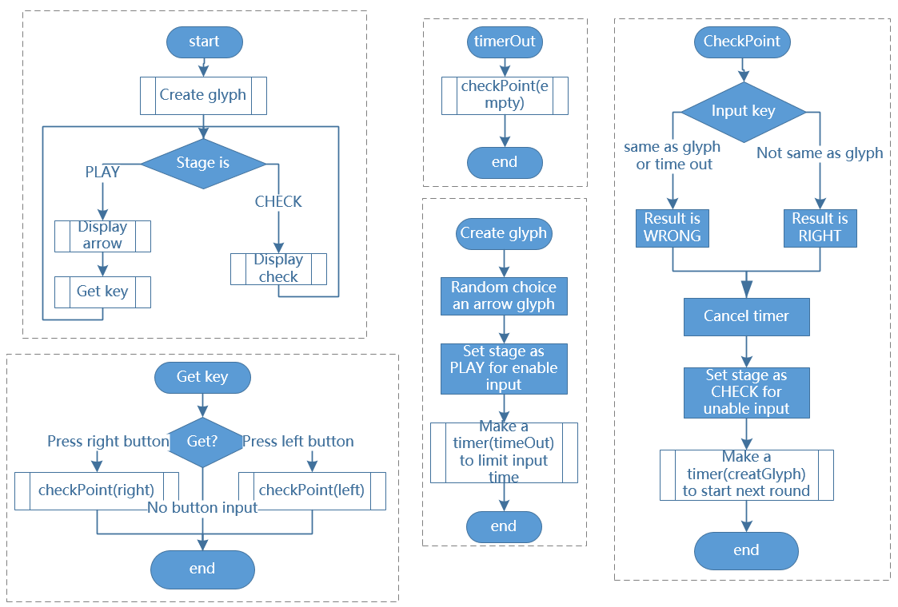

.. note::

    Bonjour, bienvenue dans la communauté des passionnés de SunFounder Raspberry Pi & Arduino & ESP32 sur Facebook ! Plongez plus profondément dans l'univers de Raspberry Pi, Arduino et ESP32 avec d'autres passionnés.

    **Pourquoi nous rejoindre ?**

    - **Support d'experts** : Résolvez les problèmes après-vente et les défis techniques grâce à l'aide de notre communauté et de notre équipe.
    - **Apprendre et partager** : Échangez des astuces et des tutoriels pour améliorer vos compétences.
    - **Aperçus exclusifs** : Obtenez un accès anticipé aux annonces de nouveaux produits et aux avant-premières.
    - **Réductions spéciales** : Profitez de remises exclusives sur nos derniers produits.
    - **Promotions festives et cadeaux** : Participez à des tirages au sort et à des promotions spéciales pendant les fêtes.

    👉 Prêt à explorer et à créer avec nous ? Cliquez sur [|link_sf_facebook|] et rejoignez-nous dès aujourd'hui !

3.1.14 JEU - Not Not
=======================

Introduction
--------------------

Dans cette leçon, nous allons fabriquer un dispositif de jeu intéressant que nous appelons "Not Not".

Pendant le jeu, la matrice à points rafraîchira une flèche aléatoire. Votre tâche est d'appuyer sur le bouton dans la direction opposée à la flèche dans un délai imparti. Si le temps est écoulé ou si vous appuyez sur le bouton dans la même direction que la flèche, vous perdez.

Ce jeu vous permet de pratiquer votre pensée inversée. Alors, êtes-vous prêt à essayer ?

Composants
---------------

.. image:: img/list_GAME_Not_Not.png
    :align: center

Schéma de câblage
-----------------------

============ ======== ======== ===
T-Board Name physical wiringPi BCM
GPIO17       Pin 11   0        17
GPIO18       Pin 12   1        18
GPIO27       Pin 13   2        27
GPIO20       Pin 38   28       20
GPIO26       Pin 37   25       26
============ ======== ======== ===

.. image:: img/Schematic_three_one14.png
   :align: center

Procédures expérimentales
-----------------------------

**Étape 1 :** Construisez le circuit.

.. image:: img/image280.png
    :width: 800

**Pour les utilisateurs du langage C**
^^^^^^^^^^^^^^^^^^^^^^^^^^^^^^^^^^^^^^^^

**Étape 2 :** Allez dans le dossier du code.

.. raw:: html

   <run></run>

.. code-block::

    cd ~/davinci-kit-for-raspberry-pi/c/3.1.14/

**Étape 3 :** Compilez.

.. raw:: html

   <run></run>

.. code-block::

    gcc 3.1.14_GAME_NotNot.c -lwiringPi

**Étape 4 :** Exécutez le fichier.

.. raw:: html

   <run></run>

.. code-block::

     sudo ./a.out

Après le démarrage du programme, une flèche gauche ou droite s'affiche 
aléatoirement sur la matrice de points. Vous devez appuyer sur le bouton 
dans la direction opposée à la flèche dans un temps imparti. Ensuite, un 
\"**√**\" apparaîtra sur la matrice de points. Si le temps est écoulé ou 
si vous appuyez sur le bouton dans la même direction que la flèche, vous 
perdez et la matrice affiche \"x\". Vous pouvez également ajouter 2 nouveaux 
boutons ou les remplacer par des touches de joystick pour avoir 4 directions 
(haut, bas, gauche, droite) et augmenter la difficulté du jeu.

.. note::

    Si le programme ne fonctionne pas après l'exécution ou si un message d'erreur apparaît : \"wiringPi.h: Aucun fichier ou répertoire de ce type", veuillez consulter :ref:`C code is not working?`.

**Explication du code**

Basé sur **1.1.6 Matrice LED**, cette leçon ajoute **2** boutons pour créer un 
dispositif de jeu amusant. Donc, si vous n'êtes pas très familier avec la matrice 
à points, veuillez consulter:ref:`1.1.6 LED Dot Matrix`.

Le processus du programme complet est le suivant :

1. Sélectionnez aléatoirement une direction de flèche et générez **timer 1**.

2. Affichez l'image de la flèche sur la matrice de points.

3. Vérifiez l'entrée du bouton. Si le bouton est pressé ou si **timer 1** signale la fin du délai, commencez la vérification.

4. Affichez l'image selon le résultat de la vérification ; en parallèle, générez **timer 2**.
5. Reprenez **étape 1** lorsque **timer 2** indique la fin du délai.

.. code-block:: c

    struct GLYPH{
        char *word;
        unsigned char code[8];
    };

    struct GLYPH arrow[2]=
    {
        {"right",{0xFF,0xEF,0xDF,0x81,0xDF,0xEF,0xFF,0xFF}},
        // {"down",{0xFF,0xEF,0xC7,0xAB,0xEF,0xEF,0xEF,0xFF}},
        // {"up",{0xFF,0xEF,0xEF,0xEF,0xAB,0xC7,0xEF,0xFF}},     
        {"left",{0xFF,0xF7,0xFB,0x81,0xFB,0xF7,0xFF,0xFF}}
    };

    struct GLYPH check[2]=
    {
        {"wrong",{0xFF,0xBB,0xD7,0xEF,0xD7,0xBB,0xFF,0xFF}},
        {"right",{0xFF,0xFF,0xF7,0xEB,0xDF,0xBF,0xFF,0xFF}}
    };

La structure GLYPH fonctionne comme un dictionnaire : l'attribut **word** 
correspond à la **clé** du dictionnaire ; l'attribut **code** correspond à la **valeur**.

Ici, le code est utilisé pour stocker un tableau permettant d'afficher des 
images sur la matrice à points (un tableau de 8x8 bits).

Le tableau **arrow** peut être utilisé pour afficher les motifs de flèches 
dans les directions haut, bas, gauche et droite sur la matrice LED.

Maintenant, **down** et **up** sont commentés, vous pouvez les décommenter si 
nécessaire.

Le tableau **check** est utilisé pour afficher ces deux images : \"**×**\" et \"**√**\".

.. code-block:: c

    char *lookup(char *key,struct GLYPH *glyph,int length){
        for (int i=0;i<length;i++)
        {
            if(strcmp(glyph[i].word,key)==0){
                return glyph[i].code;
            }
        }     
    }

La fonction **lookup()** fonctionne comme une "consultation du dictionnaire". 
Elle définit une **clé**, recherche les mots correspondants dans la structure 
**GLYPH \*glyph** et renvoie l'information correspondante — le **code** du mot concerné.

La fonction **Strcmp()** est utilisée pour comparer deux chaînes de caractères 
**glyph[i].word** et **key** ; si elles sont identiques, renvoie **glyph[i].code** 
(comme illustré).

.. code-block:: c

    void display(char *glyphCode){
        for(int i;i<8;i++){
            hc595_in(glyphCode[i]);
            hc595_in(0x80>>i);
            hc595_out();
        }
    }

Affiche le motif spécifié sur la matrice à points.

.. code-block:: c

    void createGlyph(){
        srand(time(NULL));
        int i=rand()%(sizeof(arrow)/sizeof(arrow[0]));
        waypoint=arrow[i].word;
        stage="PLAY";
        alarm(2);
    }

La fonction **createGlyph()** sélectionne aléatoirement une direction 
(l'attribut word d'un élément du tableau **arrow[]:** \"**left**\", \"**right**\"... ). 
Définit le stage sur \"PLAY\" et démarre une alarme de 2 secondes.

**srand(time(NULL)) :** Initialise des graines aléatoires à partir de l'horloge du système.

**(sizeof(arrow)/sizeof(arrow[0]))：** Calcule la longueur du tableau, qui est 2.

**rand()%2 :** Le reste est **0** ou **1,** obtenu en divisant un nombre aléatoire 
généré par 2.

**waypoint=arrow[i].word :** Le résultat doit être \"right\" ou \"left\".

.. code-block:: c

    void checkPoint(char *inputKey){
        alarm(0)==0;
        if(inputKey==waypoint||inputKey=="empty")
        {
            waypoint="wrong";
        }
        else{
            waypoint="right";
        }
        stage="CHECK";
        alarm(1);
    }

**checkPoint()** vérifie l'entrée du bouton ; si le bouton n'est pas pressé ou 
si le bouton appuyé est dans la même direction que la flèche, le résultat de 
**waypoint** est \"wrong\" et un \"**x**\" apparaît sur la matrice de points. 
Sinon, **waypoint** est \"right\" et la matrice affiche \"**√**\". Ici, le 
**stage** est **CHECK**, et une alarme de 1 seconde peut être définie.

**alarm()** est aussi appelé "réveil", dans lequel un minuteur peut être défini, 
envoyant des signaux **SIGALRM** lorsque le temps défini est écoulé.

.. code-block:: c

    void getKey(){
        if (digitalRead(AButtonPin)==1&&digitalRead(BButtonPin)==0)
        {checkPoint("right");}
        else if (digitalRead(AButtonPin)==0&&digitalRead(BButtonPin)==1)
        {checkPoint("left");}
    }

**getKey()** lit les états de ces deux boutons ; si le bouton droit est pressé, le 
paramètre de **checkPoint()** est **right** et si le bouton gauche est pressé, le 
paramètre est **left**.

.. code-block:: c

    void timer(){
        if (stage=="PLAY"){
            checkPoint("empty");
        }
        else if(stage=="CHECK"){
            createGlyph();
        }
    }

Précédemment, **timer()** était appelé lorsque **alarm()** déclenchait la fin du 
temps imparti. En mode \"PLAY\", **checkPoint()** est appelé pour juger le résultat. 
Si le programme est en mode \"CHECK\", la fonction **createGlyph()** doit être appelée 
pour sélectionner de nouveaux motifs.

.. code-block:: c

    void main(){
        setup();
        signal(SIGALRM,timer);
        createGlyph();
        char *code = NULL;
        while(1){
            if (stage == "PLAY")
            {
                code=lookup(waypoint,arrow,sizeof(arrow)/sizeof(arrow[0]));
                display(code);
                getKey();
            }
            else if(stage == "CHECK")
            {
                code = lookup(waypoint,check,sizeof(check)/sizeof(check[0]));
                display(code);
            }
        }
    }

Le fonctionnement de **signal(SIGALRM,timer) :** appel de la fonction **timer()** 
lorsqu'un signal **SIGALRM** (généré par la fonction réveil **alarm()**) est reçu.

Lorsque le programme commence, appelez d'abord **createGlyph()**, puis démarrez 
la boucle.

Dans la boucle : en mode PLAY, la matrice de points affiche les motifs de flèches 
et vérifie l'état des boutons ; si en mode CHECK, ce qui est affiché est \"**x**\" 
ou \"**√**\".

**Pour les utilisateurs du langage Python**
^^^^^^^^^^^^^^^^^^^^^^^^^^^^^^^^^^^^^^^^^^^^^^

**Étape 2** : Accédez au dossier contenant le code.

.. raw:: html

   <run></run>

.. code-block::

    cd ~/davinci-kit-for-raspberry-pi/python

**Étape 3** : Exécutez le code.

.. raw:: html

   <run></run>

.. code-block::

    sudo python3 3.1.14_GAME_NotNot.py

Après avoir lancé le programme, une flèche pointant vers la droite ou la 
gauche apparaîtra sur la matrice de points. Votre tâche consiste à appuyer 
sur le bouton dans la direction opposée à la flèche dans un délai imparti. 
Ensuite, un \"**√**\" s'affichera sur la matrice de points. Si le temps est 
écoulé ou si vous appuyez sur le bouton dans la même direction que la flèche, 
vous perdez et la matrice affichera un \"x\". Vous pouvez également ajouter 
2 nouveaux boutons ou les remplacer par des touches de joystick pour avoir 4 
directions (haut, bas, gauche et droite) et augmenter la difficulté du jeu.

**Code**

.. note::

    Vous pouvez **Modifier/Réinitialiser/Copier/Exécuter/Arrêter** le code ci-dessous. Mais avant cela, vous devez accéder au chemin source du code comme ``davinci-kit-for-raspberry-pi/python``.
    
.. raw:: html

    <run></run>

.. code-block:: python

    import RPi.GPIO as GPIO
    import time
    import threading
    import random

    SDI   = 17
    RCLK  = 18
    SRCLK = 27

    timerPlay = 0
    timerCheck = 0

    AButtonPin = 20
    BButtonPin = 26

    waypoint = "NULL"
    stage = "NULL"

    arrow={
        #"down" :[0xFF,0xEF,0xC7,0xAB,0xEF,0xEF,0xEF,0xFF],
        #"up":[0xFF,0xEF,0xEF,0xEF,0xAB,0xC7,0xEF,0xFF],
        "right" : [0xFF,0xEF,0xDF,0x81,0xDF,0xEF,0xFF,0xFF],    
        "left":[0xFF,0xF7,0xFB,0x81,0xFB,0xF7,0xFF,0xFF]
    }
    check={
        "wrong":[0xFF,0xBB,0xD7,0xEF,0xD7,0xBB,0xFF,0xFF],
        "right":[0xFF,0xFF,0xF7,0xEB,0xDF,0xBF,0xFF,0xFF]
    }

    def setup():
        GPIO.setmode(GPIO.BCM)    # Numérotation des GPIOs par leur emplacement BCM
        GPIO.setup(SDI, GPIO.OUT)
        GPIO.setup(RCLK, GPIO.OUT)
        GPIO.setup(SRCLK, GPIO.OUT)
        GPIO.output(SDI, GPIO.LOW)
        GPIO.output(RCLK, GPIO.LOW)
        GPIO.output(SRCLK, GPIO.LOW)
        GPIO.setup(AButtonPin,GPIO.IN)
        GPIO.setup(BButtonPin,GPIO.IN)    
    
    # Transférer les données vers le 74HC595
    def hc595_shift(dat):
        for bit in range(0, 8): 
            GPIO.output(SDI, 0x80 & (dat << bit))
            GPIO.output(SRCLK, GPIO.HIGH)
            GPIO.output(SRCLK, GPIO.LOW)

    def display(glyphCode):
        for i in range(0, 8):
            hc595_shift(glyphCode[i])
            hc595_shift(0x80>>i)
            GPIO.output(RCLK, GPIO.HIGH)
            GPIO.output(RCLK, GPIO.LOW)

    def creatGlyph():
        global waypoint
        global stage
        global timerPlay    
        waypoint=random.choice(list(arrow.keys()))
        stage = "PLAY"
        timerPlay = threading.Timer(2.0, timeOut)  
        timerPlay.start()  

    def checkPoint(inputKey):
        global waypoint
        global stage
        global timerCheck    
        if inputKey == "empty" or inputKey == waypoint:
            waypoint = "wrong"
        else:
            waypoint = "right"
        timerPlay.cancel()
        stage = "CHECK"
        timerCheck = threading.Timer(1.0, creatGlyph)
        timerCheck.start()  

    def timeOut():  
        checkPoint("empty")

    def getKey():
        if GPIO.input(AButtonPin)==1 and GPIO.input(BButtonPin)==0:
            checkPoint("right")
        elif GPIO.input(AButtonPin)==0 and GPIO.input(BButtonPin)==1:
            checkPoint("left")
        
    def main():
        creatGlyph()
        while True:
            if stage == "PLAY":
                display(arrow[waypoint])
                getKey()
            elif stage == "CHECK":
                display(check[waypoint])

    def destroy():
        global timer1
        GPIO.cleanup()
        timerPlay.cancel()  # annuler le minuteur
        timerCheck.cancel()

    if __name__ == '__main__':
        setup()
        try:
            main()
        except KeyboardInterrupt:
            destroy()

**Explication du Code**

Basé sur **1.1.6 Matrice de LED**, cette leçon ajoute **2** boutons pour créer un 
dispositif de jeu amusant. Donc, si vous n'êtes pas très familier avec la matrice 
de points, veuillez vous référer à :ref:`1.1.6 LED Dot Matrix`.

Le déroulement complet du programme est le suivant :

1. Sélectionner aléatoirement une direction de flèche et générer le **timer 1**.

2. Afficher l'image de la flèche correspondante sur la matrice de points.

3. Évaluer l'entrée du bouton. Si un bouton est pressé ou si le **timer 1** indique la fin du temps, le jugement commence.

4. Afficher l'image basée sur le résultat du jugement ; simultanément, générer le **timer 2**.

5. Reprendre à l'**étape 1** lorsque le **timer 2** signale la fin du temps.

.. code-block:: python

    def main():
        creatGlyph()
        while True:
            if stage == "PLAY":
                display(arrow[waypoint])
                getKey()
            elif stage == "CHECK":
                display(check[waypoint])

Main() contient l'ensemble du processus de fonctionnement.

Lorsque le programme démarre, creatGlyph() est appelé une fois au début, 
puis la boucle démarre.

Dans la boucle : en mode PLAY, la matrice de points affiche des motifs de 
flèches et vérifie l'état des boutons ; en mode CHECK, ce qui est affiché 
est soit \"**x**\" soit \"**√**\".

.. code-block:: python

    arrow={
        #"down" :[0xFF,0xEF,0xC7,0xAB,0xEF,0xEF,0xEF,0xFF],
        #"up":[0xFF,0xEF,0xEF,0xEF,0xAB,0xC7,0xEF,0xFF],
        "right" : [0xFF,0xEF,0xDF,0x81,0xDF,0xEF,0xFF,0xFF],    
        "left":[0xFF,0xF7,0xFB,0x81,0xFB,0xF7,0xFF,0xFF]
    }
    check={
        "wrong":[0xFF,0xBB,0xD7,0xEF,0xD7,0xBB,0xFF,0xFF],
        "right":[0xFF,0xFF,0xF7,0xEB,0xDF,0xBF,0xFF,0xFF]
    }

Ici, le **dictionnaire** arrow permet d'afficher les motifs de flèches dans 
les directions haut, bas, gauche et droite sur la matrice de LED.

Actuellement, les flèches haut et bas sont commentées, et vous pouvez les 
décommenter si nécessaire.

Le **dictionnaire** check est utilisé pour afficher les deux images : \"**×**\" et \"**√**\".

.. code-block:: python

    def display(glyphCode):
        for i in range(0, 8):
            hc595_shift(glyphCode[i])
            hc595_shift(0x80>>i)
            GPIO.output(RCLK, GPIO.HIGH)
            GPIO.output(RCLK, GPIO.LOW)

Afficher le motif spécifié sur la matrice de points.

.. code-block:: python

    def creatGlyph():
        global waypoint
        global stage
        global timerPlay    
        waypoint=random.choice(list(arrow.keys()))
        stage = "PLAY"
        timerPlay = threading.Timer(2.0, timeOut)  
        timerPlay.start()

La fonction **createGlyph()** est utilisée pour sélectionner aléatoirement 
une direction (l'attribut mot d'un élément dans le tableau **arrow[] :** \"**left**\", \"**right**\"... ). 
Définir l'étape en \"PLAY\" et démarrer une fonction d'alarme de 2 secondes.

**arrow.keys():** Sélectionne les clés \"right\" et \"left\" dans le tableau arrow.

**list(arrow.keys()):** Combine ces clés en un tableau.

**random.choice(list(arrow.keys())):** Sélectionne aléatoirement un élément du tableau.

Ainsi, le résultat de **waypoint=random.choice(list(arrow.keys()))** devrait être \"right\" ou \"left\".

.. code-block:: python

    def checkPoint(inputKey):
        global waypoint
        global stage
        global timerCheck    
        if inputKey == "empty" or inputKey == waypoint:
            waypoint = "wrong"
        else:
            waypoint = "right"
        timerPlay.cancel()
        stage = "CHECK"
        timerCheck = threading.Timer(1.0, creatGlyph)
        timerCheck.start()  

checkPoint() est utilisé pour détecter l'état actuel de l'entrée du bouton :

Si aucun bouton n'est pressé ou si le bouton dans la même direction que la flèche 
est pressé, la valeur assignée au **``waypoint``** est **``wrong``** et un ``x`` 
s'affiche sur la matrice de points.

Sinon, le waypoint est correct et \"**√**\" apparaît.

Maintenant, l'étape est **CHECK** et un minuteur de 1 seconde **timerCheck** est 
démarré pour appeler la fonction creatGlyph() dans une seconde.

.. code-block:: python

    def timeOut():  
        checkPoint("empty")

Dans la fonction timeout(), le paramètre de checkPoint() est défini sur \"**empty**\".

.. code-block:: python

    def getKey():
        if GPIO.input(AButtonPin)==1 and GPIO.input(BButtonPin)==0:
            checkPoint("right")
        elif GPIO.input(AButtonPin)==0 and GPIO.input(BButtonPin)==1:
            checkPoint("left")

getKey() lit l'état de ces deux boutons, et si le bouton droit est pressé, le 
paramètre de checkPoint() est **right** ; si le bouton gauche est pressé, le 
paramètre est **left**.

Image de Démonstration
------------------------------

.. image:: img/image281.jpeg
   :align: center