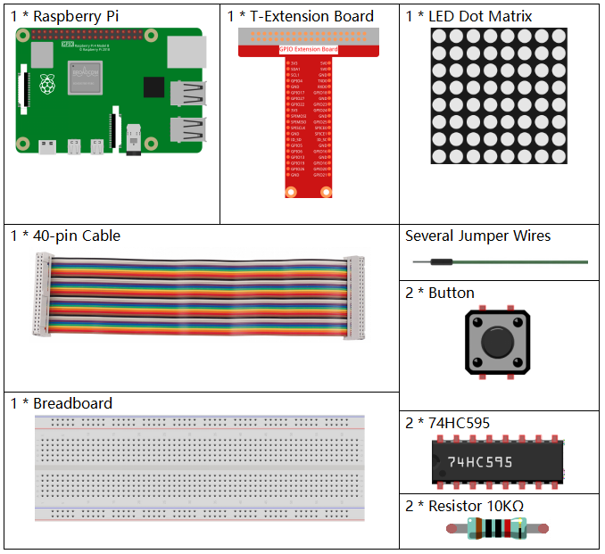
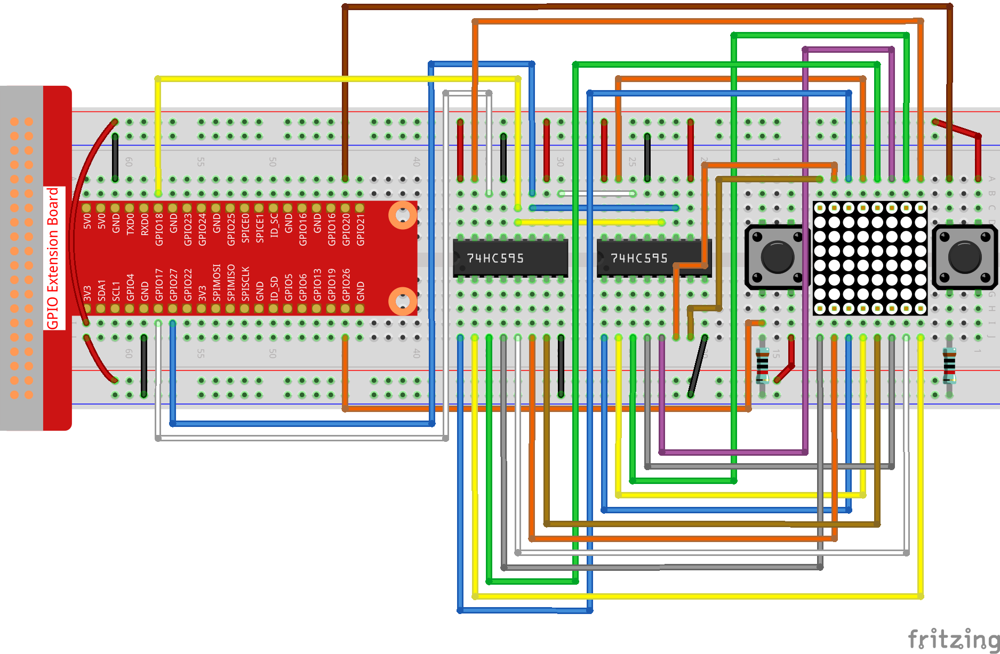
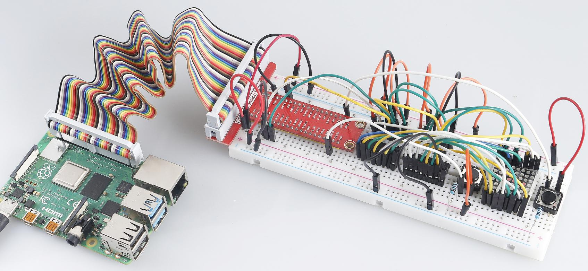

3.1.14 GAME– Not Not
~~~~~~~~~~~~~~~~~~~~

**Introduction**
--------------------

In this lesson, we will make an interesting game device, and we call it "Not Not".

During the game, the dot matrix will refresh an arrow randomly. What you need to do is to press the button in the opposite direction of the arrow within a limited time. If the time is up, or if the button in the same direction as the arrow is pressed, you are out.

This game can really practice your reverse thinking, and now shall we have a try?

**Components**
---------------

**Schematic Diagram**
-----------------------

============ ======== ======== ===
T-Board Name physical wiringPi BCM
GPIO17       Pin 11   0        17
GPIO18       Pin 12   1        18
GPIO27       Pin 13   2        27
GPIO20       Pin 38   28       20
GPIO26       Pin 37   25       26
============ ======== ======== ===

.. image:: media/Schematic_three_one14.png
   :align: center

**Experimental Procedures**
-----------------------------

**Step 1:** Build the circuit.

**For C Language Users**
^^^^^^^^^^^^^^^^^^^^^^^^^^

**Step 5:** Go to the folder of code.

.. code-block:: c

    cd /home/pi/davinci-kit-for-raspberry-pi/c/3.1.14/

**Step 6**: Compile.

.. code-block:: c

    gcc 3.1.14_GAME_NotNot.c -lwiringPi

**Step 7**: Run.

.. code-block:: c

     sudo ./a.out

After the program starts, a left or right arrow will be refreshed at
random on the dot matrix. What you need to do is to press the button in
the opposite direction of the arrow within a limited time. Then
“\ **√**\ ” appears on the dot matrix. If the time is up, or if the
button in the same direction as the arrow is pressed, you are out and
the dot matrix displays “x”. You can also add 2 new buttons or replace
them with Joystick keys for up, down, left and right— 4 directions to
increase the difficulty of the game.

**Code Explanation**

Based on **1.1.6 LED Dot Matrix**, this lesson adds **2** buttons to
make an amusing game device. So, if you are not very familiar with the
dot matrix, please refer to **1.1.6 LED Dot Matrix**.

The whole program process is as below:

1. Randomly select an arrow direction and generate **timer 1**.

2. Display the arrow image on the dot matrix.

3. Judge the button input. If the button is pressed or **timer 1**
   reminds time’s up, judgement starts.

4. Display the image on the basis of a judging result; meanwhile,
   generate **timer 2**.

5. Rerun **step 1** when **timer 2** reminds time’s up.

.. code-block:: c

    struct GLYPH{
        char *word;
        unsigned char code[8];
    };

    struct GLYPH arrow[2]=
    {
        {"right",{0xFF,0xEF,0xDF,0x81,0xDF,0xEF,0xFF,0xFF}},
        // {"down",{0xFF,0xEF,0xC7,0xAB,0xEF,0xEF,0xEF,0xFF}},
        // {"up",{0xFF,0xEF,0xEF,0xEF,0xAB,0xC7,0xEF,0xFF}},    
        {"left",{0xFF,0xF7,0xFB,0x81,0xFB,0xF7,0xFF,0xFF}}
    };

    struct GLYPH check[2]=
    {
        {"wrong",{0xFF,0xBB,0xD7,0xEF,0xD7,0xBB,0xFF,0xFF}},
        {"right",{0xFF,0xFF,0xF7,0xEB,0xDF,0xBF,0xFF,0xFF}}
    };

GLYPH structure works like a dictionary: the **word** attribute
corresponds to the **key** on the dictionary; the **code** attribute
corresponds to the **value**.

Here, code is used to store an array for dot matrix to display images
(an 8x8 bit array).

Here, the array **arrow** can be used to display the arrow pattern in
up, down, left and right directions on the LED dot matrix.

Now **down** and **up** are commented and uncomment them if needed.

The array **check** is used to display these two images: ”\ **×**\ ” and
”\ **√**\ ”.

.. code-block:: c

    char *lookup(char *key,struct GLYPH *glyph,int length){
        for (int i=0;i<length;i++)
        {
            if(strcmp(glyph[i].word,key)==0){
                return glyph[i].code;
            }
        }    
    }

The function **lookup()** works by “checking the dictionary”. Define a
**key,** search the same words as **key** in the structure **GLYPH
\*glyph** and return the corresponding information— “\ **code**\ ” of
the certain word.

The function **Strcmp()** is used to compare the identity of two
character strings **glyph[i].word** and **key**; if the identity is
judged, return **glyph[i].code** ( as shown).

.. code-block:: c

    void display(char *glyphCode){
        for(int i;i<8;i++){
            hc595_in(glyphCode[i]);
            hc595_in(0x80>>i);
            hc595_out();
        }
    }

Display the specified pattern on the dot matrix.

.. code-block:: c

    void createGlyph(){
        srand(time(NULL));
        int i=rand()%(sizeof(arrow)/sizeof(arrow[0]));
        waypoint=arrow[i].word;
        stage="PLAY";
        alarm(2);
    }

The function **createGlyph()** is used to randomly select a direction
(the word attribute of an element in the array **arrow[]:**
“\ **left**\ ”, “\ **right**\ ”... ). Set the stage as “PLAY” and start
a 2-second alarm clock function.

**srand(time(NULL)):** Initializes random seeds that are from the system
clock.

**(sizeof(arrow)/sizeof(arrow[0]))：**\ Get the length of the array, the
outcome is 2.

**rand()%2:** The remainder is **0** or **1,** gotten from dividing a
generated random number by 2\ **.**

**waypoint=arrow[i].word:** The outcome should be “right” or “left”.

.. code-block:: c

    void checkPoint(char *inputKey){
        alarm(0)==0;
        if(inputKey==waypoint||inputKey=="empty")
        {
            waypoint="wrong";
        }
        else{
            waypoint="right";
        }
        stage="CHECK";
        alarm(1);
    }

checkPoint() is used to check the button input; if the button is not
pressed or the button in the same direction as the arrow is pressed, the
outcome of the waypoint is wrong and “\ **x**\ ” appears on the dot
matrix. Otherwise, the waypoint is right and dot matrix displays
“\ **√**\ ”. Here the **stage** is **CHECK,** and there can be set a
1-second alarm clock function.

alarm() is also called “alarm clock”, in which a timer can be set, and
it sends **SIGALRM** signals to the progress when the defined time is
up.

.. code-block:: c

    void getKey(){
        if (digitalRead(AButtonPin)==1&&digitalRead(BButtonPin)==0)
        {checkPoint("right");}
        else if (digitalRead(AButtonPin)==0&&digitalRead(BButtonPin)==1)
        {checkPoint("left");}
    }

getKey() reads the states of the these two buttons; if the right button
is pressed, the parameter of the function checkPoint() is **right** and
if the left button is pressed, the parameter is **left**.

.. code-block:: c

    void timer(){
        if (stage=="PLAY"){
            checkPoint("empty");
        }
        else if(stage=="CHECK"){
            createGlyph();
        }
    }

Previously, timer() was called when set as the alarm() time’s up. Then
under the “PLAY” mode, checkPoint() is to be called to judge the
outcome. If the program is set to “CHECK” mode, the function
createGlyph() should be called to select new patterns.

.. code-block:: c

    void main(){
        setup();
        signal(SIGALRM,timer);
        createGlyph();
        char *code = NULL;
        while(1){
            if (stage == "PLAY")
            {
                code=lookup(waypoint,arrow,sizeof(arrow)/sizeof(arrow[0]));
                display(code);
                getKey();
            }
            else if(stage == "CHECK")
            {
                code = lookup(waypoint,check,sizeof(check)/sizeof(check[0]));
                display(code);
            }
        }
    }

The working of the function signal(SIGALRM,timer): calling the timer()
function when a SIGALRM signal (generated by the alarm clock function
alarm()) is received.

When the program starts, call createGlyph() one time at first and then
start the loop.

In the loop: under PLAY mode, the dot matrix displays arrow patterns and
check the button state; if under CHECK mode, what is displayed is
“\ **x**\ ” or “\ **√**\ ”.

**For Python Language Users**
^^^^^^^^^^^^^^^^^^^^^^^^^^^^^^^

**Step 5**: Get into the folder of code.

.. code-block:: python

    cd /home/pi/davinci-kit-for-raspberry-pi/python

**Step 6**: Run.

.. code-block:: python

    sudo python3 3.1.14_GAME_NotNot.py

After starting the program, on the dot matrix appears an arrow pointing
to the right or the left. What you need to do is to press the button in
the opposite direction of the arrow within a limited time. Then
“\ **√**\ ” appears on the dot matrix. If the time is up, or if the
button in the same direction as the arrow is pressed, you are out and
the dot matrix displays “x”. You can also add 2 new buttons or replace
them with Joystick keys for up, down, left and right— 4 directions to
increase the difficulty of the game.

**Code Explanation**

Based on **1.1.6 LED Dot Matrix**, this lesson adds **2** buttons to
make an amusing game device. So, if you are not very familiar with the
dot matrix, please refer to **1.1.6 LED Dot Matrix**.

The whole program process is as below:

1. Randomly select an arrow direction and generate **timer 1**.

2. Display the corresponding arrow image on the dot matrix.

3. Judge the button input. If the button is pressed or **timer 1**
   reminds time’s up, judgement starts.

4. Display the image on the basis of a judging result; meanwhile,
   generate **timer 2**.

5. Rerun **step 1** when **timer 2** reminds time’s up.

.. code-block:: python

    def main():
        creatGlyph()
        while True:
            if stage == "PLAY":
                display(arrow[waypoint])
                getKey()
            elif stage == "CHECK":
                display(check[waypoint])

Main() contains the whole running process.

When the program starts, call createGlyph() one time at first and then
start the loop.

In the loop: under PLAY mode, the dot matrix displays arrow patterns and
check the button state; if under CHECK mode, what is displayed is
“\ **x**\ ” or “\ **√**\ ”.

.. code-block:: python

    arrow={
        #"down" :[0xFF,0xEF,0xC7,0xAB,0xEF,0xEF,0xEF,0xFF],
        #"up":[0xFF,0xEF,0xEF,0xEF,0xAB,0xC7,0xEF,0xFF],
        "right" : [0xFF,0xEF,0xDF,0x81,0xDF,0xEF,0xFF,0xFF],    
        "left":[0xFF,0xF7,0xFB,0x81,0xFB,0xF7,0xFF,0xFF]
    }
    check={
        "wrong":[0xFF,0xBB,0xD7,0xEF,0xD7,0xBB,0xFF,0xFF],
        "right":[0xFF,0xFF,0xF7,0xEB,0xDF,0xBF,0xFF,0xFF]
    }

Here, the **dictionary** arrow can be used to display the arrow pattern
in up, down, left and right directions on the LED dot matrix.

Now down and up are commented and uncomment them if needed.

The **dictionary** check is used to display these two images:
”\ **×**\ ” and ”\ **√**\ ”.

.. code-block:: python

    def display(glyphCode):
        for i in range(0, 8):
            hc595_shift(glyphCode[i])
            hc595_shift(0x80>>i)
            GPIO.output(RCLK, GPIO.HIGH)
            GPIO.output(RCLK, GPIO.LOW)

Display the specified pattern on the dot matrix.

.. code-block:: python

    def creatGlyph():
        global waypoint
        global stage
        global timerPlay    
        waypoint=random.choice(list(arrow.keys()))
        stage = "PLAY"
        timerPlay = threading.Timer(2.0, timeOut)  
        timerPlay.start()

The function **createGlyph()** is used to randomly select a direction
(the word attribute of an element in the array **arrow[]:**
“\ **left**\ ”, “\ **right**\ ”... ). Set the stage as “PLAY” and start
a 2-second alarm clock function.

**arrow.keys():** Select the keys “right”and “left” in the arrow array.

l\ **ist(arrow.keys()):** Combine these keys into an array.

**random.choice(list(arrow.keys())):** Randomly select an element in the
array.

So, The outcome of **waypoint=random.choice(list(arrow.keys()))** should
be “right” or “left”.

.. code-block:: python

    def checkPoint(inputKey):
        global waypoint
        global stage
        global timerCheck    
        if inputKey == "empty" or inputKey == waypoint:
            waypoint = "wrong"
        else:
            waypoint = "right"
        timerPlay.cancel()
        stage = "CHECK"
        timerCheck = threading.Timer(1.0, creatGlyph)
        timerCheck.start()  

checkPoint() is to detect the current state of button input:

If no button is pressed or the button in the same direction as the the
arrow is pressed, the assigned value of the **waypoint** is **wrong**
and there displays “\ **x**\ ” on the dot matrix.

Otherwise, the waypoint is right and “\ **√**\ ” appears.

Now the stage is **CHECK** and start a 1-second timer **timerCheck** to
call the function creatGlyph() in a second.

.. code-block:: python

    def timeOut():  
        checkPoint("empty")

In the function timeout(), set the parameter of checkPoint() as
”\ **empty**\ ”.

.. code-block:: python

    def getKey():
        if GPIO.input(AButtonPin)==1 and GPIO.input(BButtonPin)==0:
            checkPoint("right")
        elif GPIO.input(AButtonPin)==0 and GPIO.input(BButtonPin)==1:
            checkPoint("left")

getKey() reads the state of these two buttons, and if the right button
is pressed, the parameter of checkPoint() is **right**; if the left
button is pressed, the parameter is **left**.

**Phenomenon Picture**
------------------------

