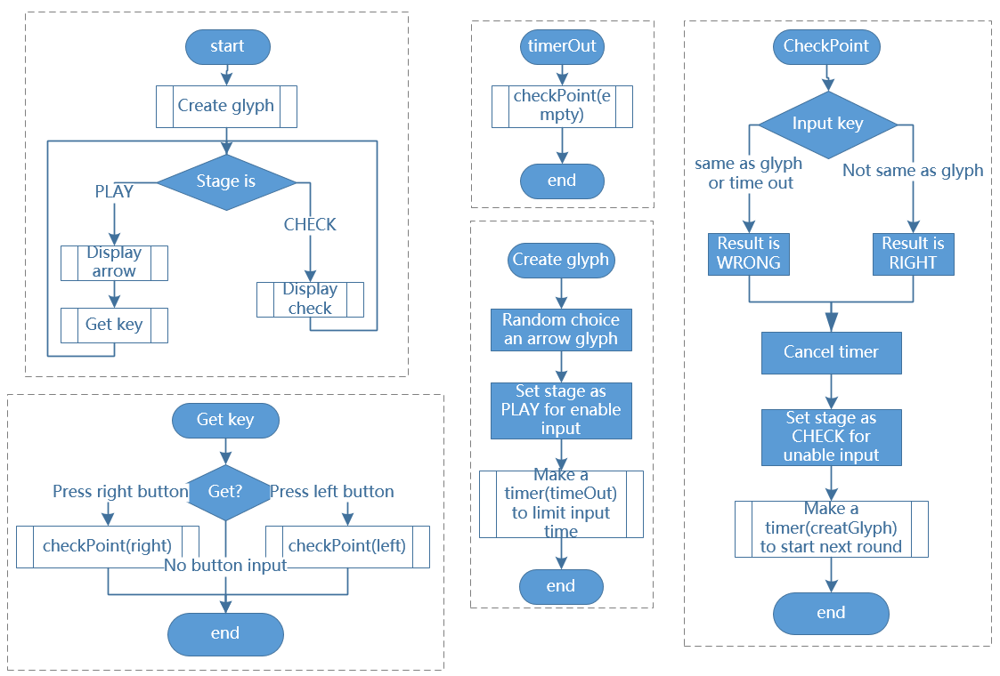

.. note::

    こんにちは、SunFounderのRaspberry Pi & Arduino & ESP32愛好家コミュニティへようこそ！Facebook上でRaspberry Pi、Arduino、ESP32についてもっと深く掘り下げ、他の愛好家と交流しましょう。

    **参加する理由は？**

    - **エキスパートサポート**：コミュニティやチームの助けを借りて、販売後の問題や技術的な課題を解決します。
    - **学び＆共有**：ヒントやチュートリアルを交換してスキルを向上させましょう。
    - **独占的なプレビュー**：新製品の発表や先行プレビューに早期アクセスしましょう。
    - **特別割引**：最新製品の独占割引をお楽しみください。
    - **祭りのプロモーションとギフト**：ギフトや祝日のプロモーションに参加しましょう。

    👉 私たちと一緒に探索し、創造する準備はできていますか？[|link_sf_facebook|]をクリックして今すぐ参加しましょう！

3.1.14 ゲーム–Not Not-頭脳耐久ゲーム
====================================

前書き
--------------------

このレッスンでは、面白いゲームデバイスを作成し、「Not Not」と呼ぶ。

ゲーム中、ドットマトリックスは矢印をランダムに更新する。必要なのは、限られた時間内に矢印の反対方向にボタンを押すことである。時間になった場合、または矢印と同じ方向のボタンが押された場合、敗北すると意味する。

このゲームは本当にあなたの逆思考を実践することができる。

部品
---------------

.. image:: media/list_GAME_Not_Not.png
    :align: center

回路図
-----------------------

============ ======== ======== ===
T-Board Name physical wiringPi BCM
GPIO17       Pin 11   0        17
GPIO18       Pin 12   1        18
GPIO27       Pin 13   2        27
GPIO20       Pin 38   28       20
GPIO26       Pin 37   25       26
============ ======== ======== ===

.. image:: media/Schematic_three_one14.png
   :align: center

実験手順
-----------------------------

ステップ1： 回路を作る。

.. image:: media/image280.png
    :width: 800

C言語ユーザー向け
^^^^^^^^^^^^^^^^^^^^^^^^^^

ステップ2： コードのフォルダに移動します。

.. raw:: html

   <run></run>

.. code-block::

    cd /home/pi/davinci-kit-for-raspberry-pi/c/3.1.14/

ステップ3： コンパイルします。

.. raw:: html

   <run></run>

.. code-block::

    gcc 3.1.14_GAME_NotNot.c -lwiringPi

ステップ4： 実行します。

.. raw:: html

   <run></run>

.. code-block::

     sudo ./a.out

プログラムの開始後、左矢印または右矢印がドットマトリックス上でランダムに更新されます。 
限られた時間内に矢印の反対方向にボタンを押す必要があります。 
次に、「√」がドットマトリックスに表示されます。 
時間切れの場合、または矢印と同じ方向のボタンが押された場合は、
外に出て、ドットマトリックスに「x」が表示されます。 
また、2つの新しいボタンを追加したり、上下左右のジョイスティックキーに置き換えたりすることもできます。
4方向でゲームの難易度を上げることができます。

**コードの説明**

1.1.6 LEDドットマトリックス に基づいて、このレッスンでは 2 ボタンを追加して面白いゲームデバイスを作成します。 したがって、ドットマトリックスにあまり詳しくない場合は、 :ref:`py_led_matrix` を参照してください。

プログラム全体のプロセスは次のとおりである：

1. 矢印の方向をランダムに選択し、 タイマー1 を生成する。

#. ドットマトリックスに矢印画像を表示する。

#. ボタン入力を判断する。ボタンが押されるか、 タイマー1 が時間切れを想起させると、判定が開始される。

#. 判定結果に基づいて画像を表示する。その間、 タイマー2 を生成する。

#. タイマー2 が時間切れを想起させると、 ステップ1 を再実行する。

.. code-block:: c

    struct GLYPH{
        char *word;
        unsigned char code[8];
    };

    struct GLYPH arrow[2]=
    {
        {"right",{0xFF,0xEF,0xDF,0x81,0xDF,0xEF,0xFF,0xFF}},
        // {"down",{0xFF,0xEF,0xC7,0xAB,0xEF,0xEF,0xEF,0xFF}},
        // {"up",{0xFF,0xEF,0xEF,0xEF,0xAB,0xC7,0xEF,0xFF}},    
        {"left",{0xFF,0xF7,0xFB,0x81,0xFB,0xF7,0xFF,0xFF}}
    };

    struct GLYPH check[2]=
    {
        {"wrong",{0xFF,0xBB,0xD7,0xEF,0xD7,0xBB,0xFF,0xFF}},
        {"right",{0xFF,0xFF,0xF7,0xEB,0xDF,0xBF,0xFF,0xFF}}
    };

GLYPH構造は辞書のように動作します。 ``word`` 属性は辞書の **key** に対応し、 ``code`` 属性は **value** に対応します。

ここでは、ドットマトリックスが画像を表示するための配列（8×8ビットの配列）を格納するためのコードを使用しています。

ここでは、配列 ``arrow`` を用いて、上下左右の矢印パターンをLEDドットマトリクスに表示することができます。

上下 が付注され、必要に応じて解除できる。

配列 ``check`` を使用して、これらの2つの画像「 × 」と「 √ 」を表示する。

.. code-block:: c

    char *lookup(char *key,struct GLYPH *glyph,int length){
        for (int i=0;i<length;i++)
        {
            if(strcmp(glyph[i].word,key)==0){
                return glyph[i].code;
            }
        }    
    }

関数 ``lookup()`` は、辞書を引くことで機能します。
``key`` を定義し、構造 ``GLYPH *glyph`` の ``key`` と同じ単語を検索し、
対応する情報（特定の単語の ``code`` ）を返す。

関数 ``Strcmp()`` は、2つの文字列 ``glyph[i].word`` と ``key`` の同一性を比較するために使用される。
同一性が判断された場合、 ``glyph[i].code`` を返す。

.. code-block:: c

    void display(char *glyphCode){
        for(int i;i<8;i++){
            hc595_in(glyphCode[i]);
            hc595_in(0x80>>i);
            hc595_out();
        }
    }

指定したパターンをドットマトリックスに表示する。

.. code-block:: c

    void createGlyph(){
        srand(time(NULL));
        int i=rand()%(sizeof(arrow)/sizeof(arrow[0]));
        waypoint=arrow[i].word;
        stage="PLAY";
        alarm(2);
    }

関数 ``createGlyph()`` を使用して、方向（配列 ``arrow[]`` の要素の単語属性："left"、"right" ...）をランダムに選択する。
ステージを「PLAY」に設定し、2秒の目覚まし時計機能を開始する。

``srand(time(NULL))`` : システムクロックからのランダムシードを初期化する。

``(sizeof(arrow)/sizeof(arrow[0]))`` : 配列の長さを取得し、結果は2である。

``rand()%2`` : 余りは 0 または 1 で、生成された乱数を2で割ったものである。

``waypoint=arrow[i].word`` : 結果は「right」または「left」でなければならない。

.. code-block:: c

    void checkPoint(char *inputKey){
        alarm(0)==0;
        if(inputKey==waypoint||inputKey=="empty")
        {
            waypoint="wrong";
        }
        else{
            waypoint="right";
        }
        stage="CHECK";
        alarm(1);
    }

``checkPoint()`` は、ボタンの入力をチェックするためのもので、ボタンが押されていなかったり、
矢印と同じ方向のボタンが押されていたりすると、
ウェイポイントの結果がおかしくなり、ドットマトリクスに「x」と表示されます。
そうでなければ、ウェイポイントの結果は正しく、ドットマトリクスには「√」と表示されます。
ここでは、ステージ が CHECK となり、1秒単位の目覚まし時計機能を設定することができます。

``alarm()`` は「目覚まし時計」とも呼ばれ、タイマーを設定し、
設定した時間が経過すると SIGALRM 信号をプログレスに送信します。

.. code-block:: c

    void getKey(){
        if (digitalRead(AButtonPin)==1&&digitalRead(BButtonPin)==0)
        {checkPoint("right");}
        else if (digitalRead(AButtonPin)==0&&digitalRead(BButtonPin)==1)
        {checkPoint("left");}
    }

``getKey()`` は、これら2つのボタンの状態を読み取ります。
右ボタンが押されている場合、関数 ``checkPoint()`` のパラメータは right 、
左ボタンが押されている場合、パラメータは left となります。

.. code-block:: c

    void timer(){
        if (stage=="PLAY"){
            checkPoint("empty");
        }
        else if(stage=="CHECK"){
            createGlyph();
        }
    }

これまでは、 ``alarm()`` が鳴ったときに ``timer()`` が呼ばれていました。
そして、「PLAY」モードでは、結果を判断するために ``checkPoint()`` を呼び出すことになっています。
「CHECK」モードの場合は、 ``createGlyph()`` を呼び出してパターンを選択します。

.. code-block:: c

    void main(){
        setup();
        signal(SIGALRM,timer);
        createGlyph();
        char *code = NULL;
        while(1){
            if (stage == "PLAY")
            {
                code=lookup(waypoint,arrow,sizeof(arrow)/sizeof(arrow[0]));
                display(code);
                getKey();
            }
            else if(stage == "CHECK")
            {
                code = lookup(waypoint,check,sizeof(check)/sizeof(check[0]));
                display(code);
            }
        }
    }

関数 ``signal(SIGALRM、timer)`` の動作：（目覚まし時計関数alarm()によって生成された）SIGALRM信号を受信したときに関数timer()を呼び出す。

プログラムが起動したら、最初に1回だけcreateGlyph()を呼び出してから、ループを開始します。

ループ内：PLAYモードでは、ドットマトリックスに矢印パターンが表示され、ボタンの状態が確認されます。 チェックモードの場合、表示されるのは「x」または「√」です。

Python言語ユーザー向け
^^^^^^^^^^^^^^^^^^^^^^^^^^^^^^^

ステップ2：コードのフォルダーに入ります。

.. raw:: html

   <run></run>

.. code-block::

    cd /home/pi/davinci-kit-for-raspberry-pi/python

ステップ3：実行します。

.. raw:: html

   <run></run>

.. code-block::

    sudo python3 3.1.14_GAME_NotNot.py

プログラムを起動すると、ドットマトリックス上に右または左を指す矢印が表示されます。 
あなたがする必要があるのは、限られた時間内に矢印の反対方向にボタンを押すことです。 
次に、「√」がドットマトリックスに表示されます。 
時間切れの場合、または矢印と同じ方向のボタンが押された場合は、
外に出て、ドットマトリックスに「x」が表示されます。 
また、2つの新しいボタンを追加したり、上下左右のジョイスティックキーに置き換えたりすることもできます。
4方向でゲームの難易度を上げることができます。

**コード**

.. note::

   以下のコードを **変更/リセット/コピー/実行/停止** できます。 ただし、その前に、 ``davinci-kit-for-raspberry-pi/python`` のようなソースコードパスに移動する必要があります。 

.. raw:: html

    <run></run>

.. code-block:: python

    import RPi.GPIO as GPIO
    import time
    import threading
    import random

    SDI   = 17
    RCLK  = 18
    SRCLK = 27

    timerPlay = 0
    timerCheck = 0

    AButtonPin = 20
    BButtonPin = 26

    waypoint = "NULL"
    stage = "NULL"

    arrow={
        #"down" :[0xFF,0xEF,0xC7,0xAB,0xEF,0xEF,0xEF,0xFF],
        #"up":[0xFF,0xEF,0xEF,0xEF,0xAB,0xC7,0xEF,0xFF],
        "right" : [0xFF,0xEF,0xDF,0x81,0xDF,0xEF,0xFF,0xFF],    
        "left":[0xFF,0xF7,0xFB,0x81,0xFB,0xF7,0xFF,0xFF]
    }
    check={
        "wrong":[0xFF,0xBB,0xD7,0xEF,0xD7,0xBB,0xFF,0xFF],
        "right":[0xFF,0xFF,0xF7,0xEB,0xDF,0xBF,0xFF,0xFF]
    }

    def setup():
        GPIO.setmode(GPIO.BCM)    # Number GPIOs by its BCM location
        GPIO.setup(SDI, GPIO.OUT)
        GPIO.setup(RCLK, GPIO.OUT)
        GPIO.setup(SRCLK, GPIO.OUT)
        GPIO.output(SDI, GPIO.LOW)
        GPIO.output(RCLK, GPIO.LOW)
        GPIO.output(SRCLK, GPIO.LOW)
        GPIO.setup(AButtonPin,GPIO.IN)
        GPIO.setup(BButtonPin,GPIO.IN)    
    
    # Shift the data to 74HC595
    def hc595_shift(dat):
        for bit in range(0, 8): 
            GPIO.output(SDI, 0x80 & (dat << bit))
            GPIO.output(SRCLK, GPIO.HIGH)
            GPIO.output(SRCLK, GPIO.LOW)

    def display(glyphCode):
        for i in range(0, 8):
            hc595_shift(glyphCode[i])
            hc595_shift(0x80>>i)
            GPIO.output(RCLK, GPIO.HIGH)
            GPIO.output(RCLK, GPIO.LOW)

    def creatGlyph():
        global waypoint
        global stage
        global timerPlay    
        waypoint=random.choice(list(arrow.keys()))
        stage = "PLAY"
        timerPlay = threading.Timer(2.0, timeOut)  
        timerPlay.start()  

    def checkPoint(inputKey):
        global waypoint
        global stage
        global timerCheck    
        if inputKey == "empty" or inputKey == waypoint:
            waypoint = "wrong"
        else:
            waypoint = "right"
        timerPlay.cancel()
        stage = "CHECK"
        timerCheck = threading.Timer(1.0, creatGlyph)
        timerCheck.start()  

    def timeOut():  
        checkPoint("empty")

    def getKey():
        if GPIO.input(AButtonPin)==1 and GPIO.input(BButtonPin)==0:
            checkPoint("right")
        elif GPIO.input(AButtonPin)==0 and GPIO.input(BButtonPin)==1:
            checkPoint("left")
        
    def main():
        creatGlyph()
        while True:
            if stage == "PLAY":
                display(arrow[waypoint])
                getKey()
            elif stage == "CHECK":
                display(check[waypoint])

    def destroy():
        global timer1
        GPIO.cleanup()
        timerPlay.cancel()  # cancel the timer
        timerCheck.cancel()

    if __name__ == '__main__':
        setup()
        try:
            main()
        except KeyboardInterrupt:
            destroy()

**コードの 説明**

1.1.6 LEDドットマトリックス に基づいて、
このレッスンでは 2 ボタンを追加して面白いゲームデバイスを作成します。 
したがって、ドットマトリックスにあまり詳しくない場合は、:ref:`py_led_matrix`  を参照してください。

プログラム全体のプロセスは次のとおりである：

1. 矢印の方向をランダムに選択し、 タイマー1 を生成する。

#. ドットマトリックスに対応する矢印画像を表示する。

#. ボタン入力を判断する。ボタンが押されるか、 タイマー1 が時間切れを想起させると、判定が開始される。

#. 判定結果に基づいて画像を表示する。その間、 タイマー2 を生成する。

#. タイマー2 が時間切れを想起させると、 ステップ1 を再実行する。

.. code-block:: python

    def main():
        creatGlyph()
        while True:
            if stage == "PLAY":
                display(arrow[waypoint])
                getKey()
            elif stage == "CHECK":
                display(check[waypoint])

``main()`` には実行中のプロセス全体が含まれている。

プログラムが起動したら、最初に1回だけ ``createGlyph()`` を呼び出してから、ループを開始します。

ループ内：PLAYモードでは、ドットマトリックスに矢印パターンが表示され、ボタンの状態が確認されます。 
チェックモードの場合、表示されるのは「x」または「√」です。

.. code-block:: python

    arrow={
        #"down" :[0xFF,0xEF,0xC7,0xAB,0xEF,0xEF,0xEF,0xFF],
        #"up":[0xFF,0xEF,0xEF,0xEF,0xAB,0xC7,0xEF,0xFF],
        "right" : [0xFF,0xEF,0xDF,0x81,0xDF,0xEF,0xFF,0xFF],    
        "left":[0xFF,0xF7,0xFB,0x81,0xFB,0xF7,0xFF,0xFF]
    }
    check={
        "wrong":[0xFF,0xBB,0xD7,0xEF,0xD7,0xBB,0xFF,0xFF],
        "right":[0xFF,0xFF,0xF7,0xEB,0xDF,0xBF,0xFF,0xFF]
    }

ここで、辞書 矢印を使用して、LEDドットマトリックス上で上、下、左、右の方向に矢印パターンを表示できます。

上下が付注され、必要に応じて解除できる。

辞書 チェックは、「×」と「√」の2つの画像を表示するために使用されます。

.. code-block:: python

    def display(glyphCode):
        for i in range(0, 8):
            hc595_shift(glyphCode[i])
            hc595_shift(0x80>>i)
            GPIO.output(RCLK, GPIO.HIGH)
            GPIO.output(RCLK, GPIO.LOW)

指定したパターンをドットマトリックスに表示する。

.. code-block:: python

    def creatGlyph():
        global waypoint
        global stage
        global timerPlay    
        waypoint=random.choice(list(arrow.keys()))
        stage = "PLAY"
        timerPlay = threading.Timer(2.0, timeOut)  
        timerPlay.start()

関数 ``createGlyph()`` を使用して、方向（配列 ``arrow[]`` の要素の単語属性："left"、"right" ...）をランダムに選択する。
ステージを「PLAY」に設定し、2秒の目覚まし時計機能を開始する。

``arrow.keys()``: 矢印配列のキー「右」と「左」を選択する。

``list(arrow.keys())`` ： これらのキーを配列に結合する。

``random.choice(list(arrow.keys()))`` ： 配列内の要素をランダムに選択する。

したがって、 ``waypoint = random.choice(list(arrow.keys()))`` の結果は「右」または「左」になります。

.. code-block:: python

    def checkPoint(inputKey):
        global waypoint
        global stage
        global timerCheck    
        if inputKey == "empty" or inputKey == waypoint:
            waypoint = "wrong"
        else:
            waypoint = "right"
        timerPlay.cancel()
        stage = "CHECK"
        timerCheck = threading.Timer(1.0, creatGlyph)
        timerCheck.start()  

``checkPoint()`` はボタン入力の現在の状態を検出する：

ボタンが押されていないか、
矢印と同じ方向のボタンが押されている場合、 ``waypoint`` の割り当てられた値は ``wrong`` 、
ドットマトリックスに x が表示されます。

それ以外の場合、ウェイポイントは正しく、「 √ 」が表示される。

これで、ステージは 「 CHECK 」 になり、
1秒のタイマー ``timerCheck`` を開始して、関数 ``creatGlyph()`` を1秒で呼び出します。

.. code-block:: python

    def timeOut():  
        checkPoint("empty")

関数 ``timeout()`` で、 ``checkPoint()`` のパラメーターを「empty」に設定します。

.. code-block:: python

    def getKey():
        if GPIO.input(AButtonPin)==1 and GPIO.input(BButtonPin)==0:
            checkPoint("right")
        elif GPIO.input(AButtonPin)==0 and GPIO.input(BButtonPin)==1:
            checkPoint("left")

``getKey()`` は、これら2つのボタンの状態を読み取り、
右ボタンが押された場合、 ``checkPoint()`` のパラメーターは 右 です。 
左ボタンが押された場合、パラメータは 左 です。

現象画像
------------------------

.. image:: media/image281.jpeg
   :align: center