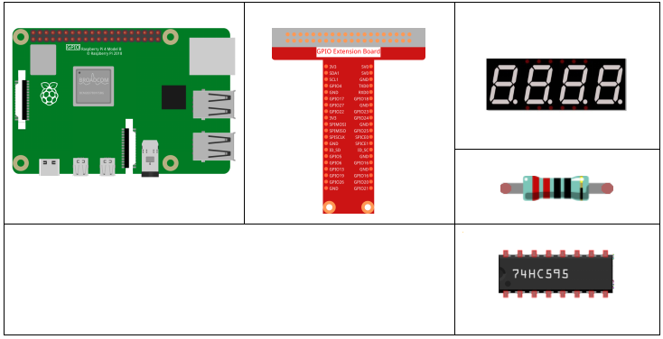
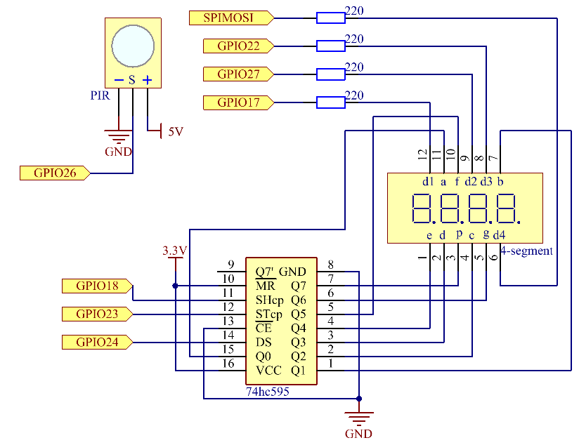
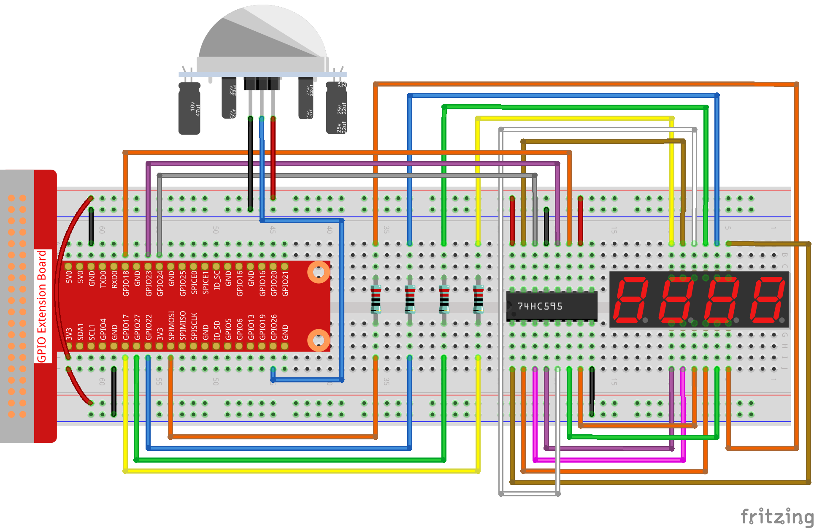
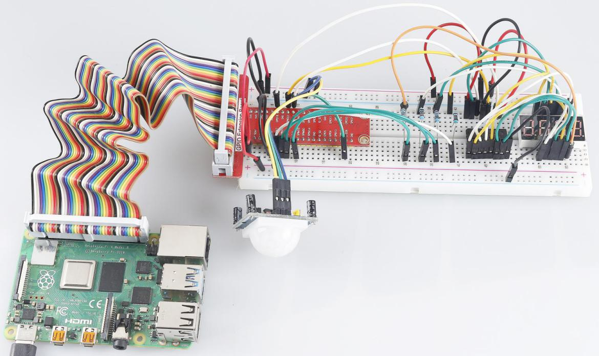

3.1.1 Counting Device
~~~~~~~~~~~~~~~~~~~~~

Introduction
-----------------

Here we will make a number-displaying counter system, consisting of a
PIR sensor and a 4-digit segment display. When the PIR detects that
someone is passing by, the number on the 4-digit segment display will
add 1. You can use this counter to count the number of people walking 
through the passageway.

Components
---------------

.. image:: media/list_Counting_Device2.png
    :align: center

Schematic Diagram
----------------------

============ ======== ======== ===
T-Board Name physical wiringPi BCM
GPIO17       Pin 11   0        17
GPIO27       Pin 13   2        27
GPIO22       Pin 15   3        22
SPIMOSI      Pin 19   12       10
GPIO18       Pin 12   1        18
GPIO23       Pin 16   4        23
GPIO24       Pin 18   5        24
GPIO26       Pin 37   25       26
============ ======== ======== ===

Experimental Procedures
-----------------------------

**Step 1**: Build the circuit.

**For C Language Users**
^^^^^^^^^^^^^^^^^^^^^^^^^

**Step 2**: Go to the folder of the code.

.. raw:: html

   <run></run>

.. code-block:: 

    cd /home/pi/davinci-kit-for-raspberry-pi/c/3.1.1/

**Step 3**: Compile the code.

.. raw:: html

   <run></run>

.. code-block:: 

    gcc 3.1.1_CountingDevice.c -lwiringPi

**Step 4**: Run the executable file.

.. raw:: html

    <run></run>
 
.. code-block:: 
 
    sudo ./a.out
 
After the code runs, when the PIR detects that someone is passing by,
the number on the 4-digit segment display will add 1.

.. note::

    If it does not work after running, please refer to :ref:`C code is not working?`
    
**Code Explanation**

.. code-block:: c

    void display()
    {
        clearDisplay();
        pickDigit(0);
        hc595_shift(number[counter % 10]);

        clearDisplay();
        pickDigit(1);
        hc595_shift(number[counter % 100 / 10]);

        clearDisplay();
        pickDigit(2);
        hc595_shift(number[counter % 1000 / 100]);
     
        clearDisplay();
        pickDigit(3);
        hc595_shift(number[counter % 10000 / 1000]);
    }

First, start the fourth segment display, write the single-digit number.
Then start the third segment display, and type in the tens digit; after
that, start the second and the first segment display respectively, and
write the hundreds and thousands digits respectively. Because the
refreshing speed is very fast, we see a complete four-digit display.

.. code-block:: c

    void loop(){
        int currentState =0;
        int lastState=0;
        while(1){
            display();
            currentState=digitalRead(sensorPin);
            if((currentState==0)&&(lastState==1)){
                counter +=1;
            }
            lastState=currentState;
        }
    }

This is the main function: display the number on the 4-digit segment
display and read the PIR value. When the PIR detects that someone is
passing by, the number on the 4-digit segment display will add 1.

**For Python Language Users**
^^^^^^^^^^^^^^^^^^^^^^^^^^^^^^^

**Step 2**: Go to the folder of the code.

.. raw:: html

   <run></run>

.. code-block::

    cd /home/pi/davinci-kit-for-raspberry-pi/python/

**Step 3**: Run the executable file.

.. raw:: html

   <run></run>

.. code-block::

    sudo python3 3.1.1_CountingDevice.py

After the code runs, when the PIR detects that someone is passing by,
the number on the 4-digit segment display will add 1.

**code**

.. note::

    You can **Modify/Reset/Copy/Run/Stop** the code below. But before that, you need to go to  source code path like ``davinci-kit-for-raspberry-pi\\python``. 
    
.. raw:: html

    <run></run>

.. code-block:: python

    import RPi.GPIO as GPIO
    import time

    sensorPin = 26

    SDI = 24
    RCLK = 23
    SRCLK = 18

    placePin = (10, 22, 27, 17)
    number = (0xc0, 0xf9, 0xa4, 0xb0, 0x99, 0x92, 0x82, 0xf8, 0x80, 0x90)

    counter = 0

    def clearDisplay():
        for i in range(8):
            GPIO.output(SDI, 1)
            GPIO.output(SRCLK, GPIO.HIGH)
            GPIO.output(SRCLK, GPIO.LOW)
        GPIO.output(RCLK, GPIO.HIGH)
        GPIO.output(RCLK, GPIO.LOW)    

    def hc595_shift(data): 
        for i in range(8):
            GPIO.output(SDI, 0x80 & (data << i))
            GPIO.output(SRCLK, GPIO.HIGH)
            GPIO.output(SRCLK, GPIO.LOW)
        GPIO.output(RCLK, GPIO.HIGH)
        GPIO.output(RCLK, GPIO.LOW)

    def pickDigit(digit):
        for i in placePin:
            GPIO.output(i,GPIO.LOW)
        GPIO.output(placePin[digit], GPIO.HIGH)

    def display():
        global counter                    
        clearDisplay() 
        pickDigit(0)  
        hc595_shift(number[counter % 10])

        clearDisplay()
        pickDigit(1)
        hc595_shift(number[counter % 100//10])

        clearDisplay()
        pickDigit(2)
        hc595_shift(number[counter % 1000//100])

        clearDisplay()
        pickDigit(3)
        hc595_shift(number[counter % 10000//1000])

    def loop():
        global counter
        currentState = 0
        lastState = 0
        while True:
            display()
            currentState=GPIO.input(sensorPin)
            if (currentState == 0) and (lastState == 1):
                counter +=1
            lastState=currentState

    def setup():
        GPIO.setmode(GPIO.BCM)
        GPIO.setup(SDI, GPIO.OUT)
        GPIO.setup(RCLK, GPIO.OUT)
        GPIO.setup(SRCLK, GPIO.OUT)
        for i in placePin:
            GPIO.setup(i, GPIO.OUT)
        GPIO.setup(sensorPin, GPIO.IN)

    def destroy():   # When "Ctrl+C" is pressed, the function is executed.
        GPIO.cleanup()

    if __name__ == '__main__':  # Program starting from here
        setup()
        try:
            loop()
        except KeyboardInterrupt:
            destroy()

**Code Explanation**

Based on **1.1.5 4-Digit 7-Segment Display**, this lesson adds **PIR
module** to change the automatic counting of lesson 1.1.5 into count
detecting. When the PIR detects that someone is passing by, the number
on the 4-digit segment display will add 1.

.. code-block:: python

    def display():
        global counter                    
        clearDisplay() 
        pickDigit(0)  
        hc595_shift(number[counter % 10])

        clearDisplay()
        pickDigit(1)
        hc595_shift(number[counter % 100//10])

        clearDisplay()
        pickDigit(2)
        hc595_shift(number[counter % 1000//100])

        clearDisplay()
        pickDigit(3)
        hc595_shift(number[counter % 10000//1000])

First, start the fourth segment display, write the single-digit number.
Then start the third segment display, and type in the tens digit; after
that, start the second and the first segment display respectively, and
write the hundreds and thousands digits respectively. Because the
refreshing speed is very fast, we see a complete four-digit display.

.. code-block:: python

    def loop():
    global counter
        currentState = 0
        lastState = 0
        while True:
            display()
            currentState=GPIO.input(sensorPin)
            if (currentState == 0) and (lastState == 1):
                counter +=1
            lastState=currentState 

This is the main function: display the number on the 4-digit segment
display and read the PIR value. When the PIR detects that someone is
passing by, the number on the 4-digit segment display will add 1.

Phenomenon Picture
-------------------------

