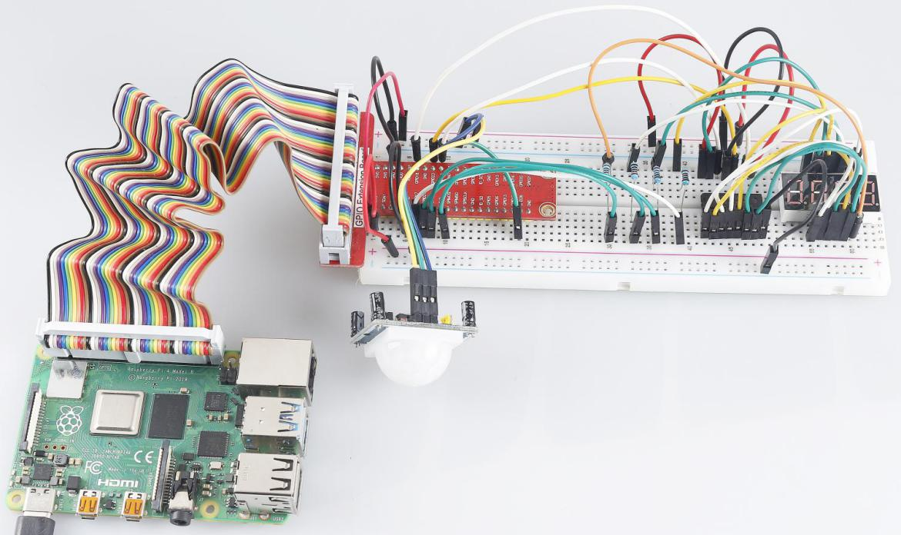

.. note::

    Bonjour et bienvenue dans la communauté des passionnés de SunFounder Raspberry Pi & Arduino & ESP32 sur Facebook ! Plongez dans l'univers du Raspberry Pi, d'Arduino et de l'ESP32 avec d'autres passionnés.

    **Pourquoi nous rejoindre ?**

    - **Support d'experts** : Résolvez les problèmes après-vente et les défis techniques grâce à l'aide de notre communauté et de notre équipe.
    - **Apprendre & Partager** : Échangez des astuces et des tutoriels pour améliorer vos compétences.
    - **Aperçus exclusifs** : Recevez des annonces anticipées sur les nouveaux produits et des avant-premières.
    - **Réductions spéciales** : Bénéficiez de réductions exclusives sur nos produits les plus récents.
    - **Promotions festives et tirages au sort** : Participez à des concours et promotions lors des périodes festives.

    👉 Prêt à explorer et créer avec nous ? Cliquez sur [|link_sf_facebook|] et rejoignez-nous dès aujourd'hui !

3.1.1 Dispositif de comptage
=================================

Introduction
----------------

Ici, nous allons créer un système de comptage avec affichage numérique, 
composé d'un capteur PIR et d'un affichage à 4 segments. Lorsque le capteur 
PIR détecte qu'une personne passe, le nombre sur l'affichage 4 segments 
s'incrémentera de 1. Vous pouvez utiliser ce compteur pour compter le nombre 
de personnes passant dans un couloir.

Composants
-------------

.. image:: img/list_Counting_Device1.png
    :align: center

.. image:: img/list_Counting_Device2.png
    :align: center

Schéma
---------

============ ======== ======== ===
T-Board Name physical wiringPi BCM
GPIO17       Pin 11   0        17
GPIO27       Pin 13   2        27
GPIO22       Pin 15   3        22
SPIMOSI      Pin 19   12       10
GPIO18       Pin 12   1        18
GPIO23       Pin 16   4        23
GPIO24       Pin 18   5        24
GPIO26       Pin 37   25       26
============ ======== ======== ===

.. image:: img/Schematic_three_one1.png
   :align: center

Procédures expérimentales
--------------------------------

**Étape 1** : Construisez le circuit.

.. image:: img/image235.png
   :alt: 计数器_bb
   :width: 800

**Pour les utilisateurs du langage C**
^^^^^^^^^^^^^^^^^^^^^^^^^^^^^^^^^^^^^^^^^

**Étape 2** : Accédez au dossier du code.

.. raw:: html

   <run></run>

.. code-block:: 

    cd ~/davinci-kit-for-raspberry-pi/c/3.1.1/

**Étape 3** : Compilez le code.

.. raw:: html

   <run></run>

.. code-block:: 

    gcc 3.1.1_CountingDevice.c -lwiringPi

**Étape 4** : Exécutez le fichier exécutable.

.. raw:: html

    <run></run>

.. code-block:: 
 
    sudo ./a.out
 
Une fois le code exécuté, lorsque le capteur PIR détecte le passage de quelqu'un, 
le nombre sur l'affichage à 4 segments s'incrémentera de 1.

Il y a deux potentiomètres sur le module PIR : l'un ajuste la sensibilité et l'autre 
ajuste la distance de détection. Pour un meilleur fonctionnement du module PIR, vous 
devez tourner les deux à fond dans le sens antihoraire.

.. note::

    Si cela ne fonctionne pas après l'exécution, ou si un message d'erreur apparaît : \"wiringPi.h: No such file or directory\", veuillez consulter :ref:`C code is not working?`.

**Explication du code**

.. code-block:: c

    void display()
    {
        clearDisplay();
        pickDigit(0);
        hc595_shift(number[counter % 10]);

        clearDisplay();
        pickDigit(1);
        hc595_shift(number[counter % 100 / 10]);

        clearDisplay();
        pickDigit(2);
        hc595_shift(number[counter % 1000 / 100]);
     
        clearDisplay();
        pickDigit(3);
        hc595_shift(number[counter % 10000 / 1000]);
    }

D'abord, le quatrième segment de l'affichage est activé et affiche le chiffre des 
unités. Ensuite, le troisième segment affiche le chiffre des dizaines ; après cela, 
le deuxième et le premier segment affichent respectivement les centaines et les milliers. 
Grâce à une vitesse de rafraîchissement très rapide, nous voyons un affichage complet 
à quatre chiffres.
.. code-block:: c

    void loop(){
        int currentState =0;
        int lastState=0;
        while(1){
            display();
            currentState=digitalRead(sensorPin);
            if((currentState==0)&&(lastState==1)){
                counter +=1;
            }
            lastState=currentState;
        }
    }

Il s'agit de la fonction principale : elle affiche le nombre sur l'afficheur à 4 segments et lit la valeur du capteur PIR. Lorsque le PIR détecte qu'une personne passe, le nombre sur l'afficheur à 4 segments s'incrémente de 1.

**Pour les utilisateurs du langage Python**
^^^^^^^^^^^^^^^^^^^^^^^^^^^^^^^^^^^^^^^^^^^^^^^^^^^

**Étape 2** : Allez dans le dossier du code.

.. raw:: html

   <run></run>

.. code-block::

    cd ~/davinci-kit-for-raspberry-pi/python/

**Étape 3** : Exécutez le fichier exécutable.

.. raw:: html

   <run></run>

.. code-block::

    sudo python3 3.1.1_CountingDevice.py

Après l'exécution du code, lorsque le PIR détecte le passage de quelqu'un, 
le nombre sur l'afficheur à 4 segments s'incrémentera de 1.

**Code**

.. note::

    Vous pouvez **Modifier/Réinitialiser/Copier/Exécuter/Arrêter** le code ci-dessous. Mais avant cela, vous devez aller au chemin du code source tel que ``davinci-kit-for-raspberry-pi/python``. 
    
.. raw:: html

    <run></run>

.. code-block:: python

    import RPi.GPIO as GPIO
    import time

    sensorPin = 26

    SDI = 24
    RCLK = 23
    SRCLK = 18

    placePin = (10, 22, 27, 17)
    number = (0xc0, 0xf9, 0xa4, 0xb0, 0x99, 0x92, 0x82, 0xf8, 0x80, 0x90)

    counter = 0

    def clearDisplay():
        for i in range(8):
            GPIO.output(SDI, 1)
            GPIO.output(SRCLK, GPIO.HIGH)
            GPIO.output(SRCLK, GPIO.LOW)
        GPIO.output(RCLK, GPIO.HIGH)
        GPIO.output(RCLK, GPIO.LOW)    

    def hc595_shift(data): 
        for i in range(8):
            GPIO.output(SDI, 0x80 & (data << i))
            GPIO.output(SRCLK, GPIO.HIGH)
            GPIO.output(SRCLK, GPIO.LOW)
        GPIO.output(RCLK, GPIO.HIGH)
        GPIO.output(RCLK, GPIO.LOW)

    def pickDigit(digit):
        for i in placePin:
            GPIO.output(i,GPIO.LOW)
        GPIO.output(placePin[digit], GPIO.HIGH)

    def display():
        global counter                    
        clearDisplay() 
        pickDigit(0)  
        hc595_shift(number[counter % 10])

        clearDisplay()
        pickDigit(1)
        hc595_shift(number[counter % 100//10])

        clearDisplay()
        pickDigit(2)
        hc595_shift(number[counter % 1000//100])

        clearDisplay()
        pickDigit(3)
        hc595_shift(number[counter % 10000//1000])

    def loop():
        global counter
        currentState = 0
        lastState = 0
        while True:
            display()
            currentState=GPIO.input(sensorPin)
            if (currentState == 0) and (lastState == 1):
                counter +=1
            lastState=currentState

    def setup():
        GPIO.setmode(GPIO.BCM)
        GPIO.setup(SDI, GPIO.OUT)
        GPIO.setup(RCLK, GPIO.OUT)
        GPIO.setup(SRCLK, GPIO.OUT)
        for i in placePin:
            GPIO.setup(i, GPIO.OUT)
        GPIO.setup(sensorPin, GPIO.IN)

    def destroy():   # When "Ctrl+C" is pressed, the function is executed.
        GPIO.cleanup()

    if __name__ == '__main__':  # Program starting from here
        setup()
        try:
            loop()
        except KeyboardInterrupt:
            destroy()

**Explication du code**

Basé sur **1.1.5 Afficheur 7 segments à 4 chiffres**, cette leçon ajoute le **module PIR** 
pour transformer le comptage automatique de la leçon 1.1.5 en détection de comptage. Lorsque 
le PIR détecte qu'une personne passe, le nombre sur l'afficheur à 4 segments s'incrémentera de 1.

.. code-block:: python

    def display():
        global counter                    
        clearDisplay() 
        pickDigit(0)  
        hc595_shift(number[counter % 10])

        clearDisplay()
        pickDigit(1)
        hc595_shift(number[counter % 100//10])

        clearDisplay()
        pickDigit(2)
        hc595_shift(number[counter % 1000//100])

        clearDisplay()
        pickDigit(3)
        hc595_shift(number[counter % 10000//1000])

D'abord, activez le quatrième segment de l'affichage et écrivez le chiffre des unités. 
Ensuite, activez le troisième segment et entrez le chiffre des dizaines ; après cela, 
activez successivement le deuxième et le premier segment pour afficher respectivement 
les centaines et les milliers. Grâce à une vitesse de rafraîchissement très rapide, 
nous voyons un affichage complet à quatre chiffres.

.. code-block:: python

    def loop():
        global counter
        currentState = 0
        lastState = 0
        while True:
            display()
            currentState=GPIO.input(sensorPin)
            if (currentState == 0) and (lastState == 1):
                counter +=1
            lastState=currentState 

Il s'agit de la fonction principale : elle affiche le nombre sur l'afficheur à 4 segments 
et lit la valeur du PIR. Lorsque le PIR détecte qu'une personne passe, le nombre sur 
l'afficheur à 4 segments s'incrémente de 1.

Image du phénomène
-------------------------

