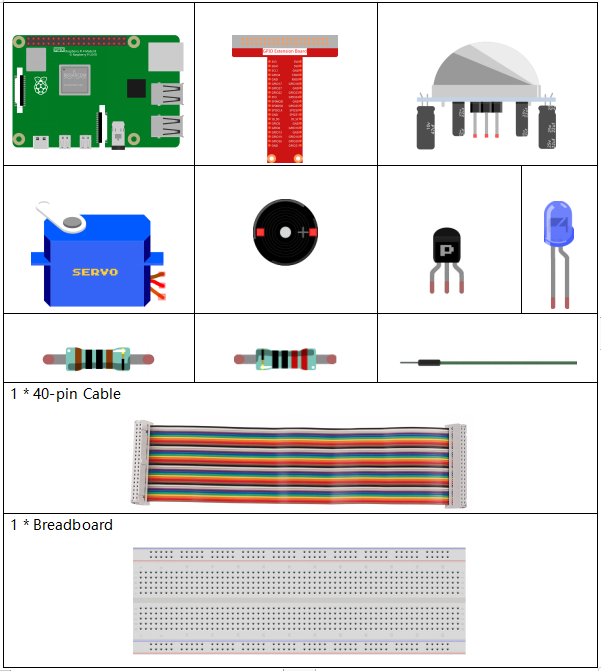
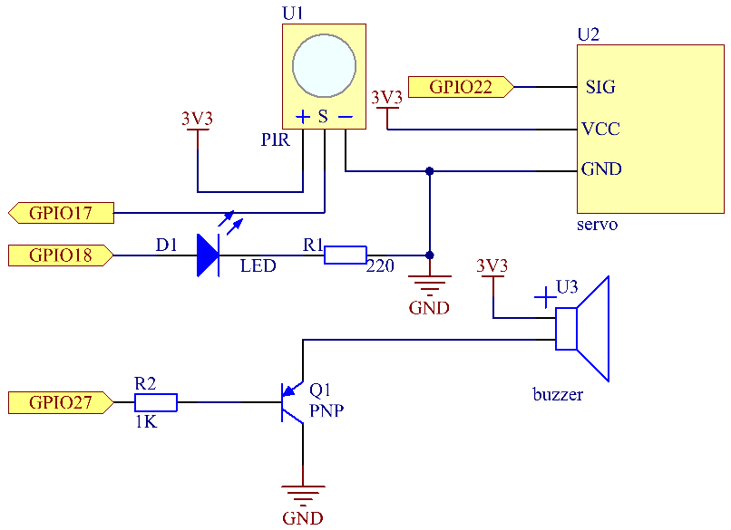
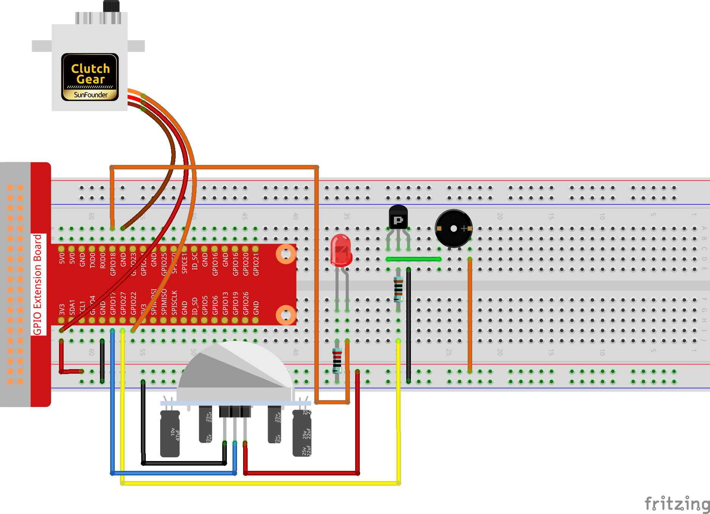

3.1.2 Willkommen
~~~~~~~~~~~~~~~~~~

Einführung
-------------

In diesem Projekt werden wir PIR verwenden, um die Bewegung von Fußgängern zu erfassen, und Servos, LED und Summer verwenden, um die Arbeit der Sensortür des Supermarkts zu simulieren. Wenn der Fußgänger innerhalb des Erfassungsbereichs des PIR erscheint, leuchtet die Anzeigelampe, die Tür wird geöffnet und der Summer ertönt die Öffnungsglocke.

Komponenten
---------------

Schematische Darstellung
-----------------------------------

============ ======== ======== ===
T-Board Name physical wiringPi BCM
GPIO18       Pin 12   1        18
GPIO17       Pin 11   0        17
GPIO27       Pin 13   2        27
GPIO22       Pin 15   3        22
============ ======== ======== ===

Experimentelle Verfahren
-------------------------------------

Schritt 1: Bauen Sie die Schaltung auf.

**Für Benutzer in C-Sprache**
^^^^^^^^^^^^^^^^^^^^^^^^^^^^^^^^^^

Schritt 2: Verzeichnis wechseln.

.. raw:: html

   <run></run>

.. code-block:: 

    cd /home/pi/davinci-kit-for-raspberry-pi/c/3.1.2/

Schritt 3: Kompilieren.

.. raw:: html

   <run></run>

.. code-block:: 

    gcc 3.1.2_Welcome.c -lwiringPi

Schritt 4: Ausführen.

.. raw:: html

   <run></run>

.. code-block:: 

    sudo ./a.out

Wenn der PIR-Sensor nach dem Ausführen der Kode jemanden erkennt, der vorbeikommt, öffnet sich die Tür automatisch (vom Servo simuliert), schaltet die Anzeige ein und spielt die Türklingelmusik ab. Nachdem die Türklingelmusik abgespielt wurde, schließt das System automatisch die Tür und schaltet die Anzeigelampe aus, um auf das nächste Mal zu warten, wenn jemand vorbeikommt.

There are two potentiometers on the PIR module: one is to adjust sensitivity and the other is to adjust the detection distance. To make the PIR module work better, you You need to turn both of them counterclockwise to the end.

**Code Erklärung**

.. code-block:: c

    void setAngle(int pin, int angle){    //Create a funtion to control the angle of the servo.
        if(angle < 0)
            angle = 0;
        if(angle > 180)
            angle = 180;
        softPwmWrite(pin,Map(angle, 0, 180, 5, 25));   
    } 

Erstellen Sie eine Funktion, setAngle, um den Winkel im Servo von 0-180 zu schreiben.

.. code-block:: c

    void doorbell(){
    for(int i=0;i<sizeof(song)/4;i++){
            softToneWrite(BuzPin, song[i]); 
            delay(beat[i] * 250);
        }

Erstellen Sie eine Funktion, Türklingel, damit der Summer Musik abspielen kann.

.. code-block:: c

    void closedoor(){
    digitalWrite(ledPin, LOW);   //led off
    for(int i=180;i>-1;i--){  //make servo rotate from maximum angle to minimum angle
        setAngle(servoPin,i);
        delay(1);
        }
    }

Erstellen Sie eine Closedoor-Funktion, um das Schließen der Tür zu simulieren, schalten Sie die LED aus und lassen Sie das Servo von 180 Grad auf 0 Grad drehen.

.. code-block:: c

    void opendoor(){
        digitalWrite(ledPin, HIGH);   //led on
        for(int i=0;i<181;i++){  //make servo rotate from minimum angle to maximum angle
            setAngle(servoPin,i);
            delay(1);
        }
        doorbell();
        closedoor();
    }

Die Funktion ``opendoor()`` besteht aus mehreren Teilen: Schalten Sie die Anzeigelampe ein, 
schalten Sie das Servo ein (simulieren Sie das Öffnen der Tür), 
spielen Sie die Klingelmusik des Supermarkts und rufen Sie nach dem Abspielen der Musik die Funktion geschlossene ``closedoor()`` auf.

.. code-block:: c

        int main(void)
    {
        if(wiringPiSetup() == -1){ //when initialize wiring failed,print message to screen
            printf("setup wiringPi failed !");
            return 1;
        }
        if(softToneCreate(BuzPin) == -1){
            printf("setup softTone failed !");
            return 1;
    ......

Initialisieren Sie in der Funktion ``main()`` die Bibliothek wiringPi und richten Sie softTone ein. Setzen Sie dann ledPin in den Ausgabestatus und pirPin in den Eingabestatus. Wenn der PIR-Sensor jemanden erkennt, der vorbeikommt, wird die Funktion opendoor aufgerufen, um das Öffnen der Tür zu simulieren.

**Für Python-Sprachbenutzer**
^^^^^^^^^^^^^^^^^^^^^^^^^^^^^^^^^^^^^

Schritt 2: Verzeichnis wechseln.

.. raw:: html

   <run></run>

.. code-block::

    cd /home/pi/davinci-kit-for-raspberry-pi/python/

Schritt 3: Ausführen.

.. raw:: html

   <run></run>

.. code-block::

    sudo python3 3.1.2_Welcome.py

Wenn der PIR-Sensor nach dem Ausführen der Kode jemanden erkennt, der vorbeikommt, öffnet sich die Tür automatisch (vom Servo simuliert), schaltet die Anzeige ein und spielt die Türklingelmusik ab. Nachdem die Türklingelmusik abgespielt wurde, schließt das System automatisch die Tür und schaltet die Anzeigelampe aus, um auf das nächste Mal zu warten, wenn jemand vorbeikommt.

There are two potentiometers on the PIR module: one is to adjust sensitivity and the other is to adjust the detection distance. To make the PIR module work better, you You need to turn both of them counterclockwise to the end.

**code**

.. note::

    Sie können den folgenden Code **Ändern/Zurücksetzen/Kopieren/Ausführen/Stoppen** . Zuvor müssen Sie jedoch zu einem Quellcodepfad wie ``davinci-kit-for-raspberry-pi/python`` gehen.
       
.. raw:: html

    <run></run>

.. code-block:: python

    import RPi.GPIO as GPIO
    import time

    SERVO_MIN_PULSE = 500
    SERVO_MAX_PULSE = 2500

    ledPin = 18    # define the ledPin
    pirPin = 17    # define the sensorPin
    servoPin = 22  # define the servoPin
    buzPin = 27    # define the buzzerpin

    CL = [0, 131, 147, 165, 175, 196, 211, 248]        # Frequency of Low C notes

    CM = [0, 262, 294, 330, 350, 393, 441, 495]        # Frequency of Middle C notes

    CH = [0, 525, 589, 661, 700, 786, 882, 990]        # Frequency of High C notes

    song = [    CH[5],CH[2],CM[6],CH[2],CH[3],CH[6],CH[3],CH[5],CH[3],CM[6],CH[2]    ]

    beat = [    1,1,1,1,1,2,1,1,1,1,1,]

    def setup():
        global p
        global Buzz                        # Assign a global variable to replace GPIO.PWM 
        GPIO.setmode(GPIO.BCM)       # Numbers GPIOs by physical location
        GPIO.setup(ledPin, GPIO.OUT)   # Set ledPin's mode is output
        GPIO.setup(pirPin, GPIO.IN)    # Set sensorPin's mode is input
        GPIO.setup(servoPin, GPIO.OUT)   # Set servoPin's mode is output
        GPIO.output(servoPin, GPIO.LOW)  # Set servoPin to low
        GPIO.setup(buzPin, GPIO.OUT)    # Set pins' mode is output

        Buzz = GPIO.PWM(buzPin, 440)    # 440 is initial frequency.
        Buzz.start(50)                    # Start Buzzer pin with 50% duty ration

        p = GPIO.PWM(servoPin, 50)     # set Frequece to 50Hz
        p.start(0)                     # Duty Cycle = 0

    def map(value, inMin, inMax, outMin, outMax):
        return (outMax - outMin) * (value - inMin) / (inMax - inMin) + outMin

        
    def setAngle(angle):      # make the servo rotate to specific angle (0-180 degrees) 
        angle = max(0, min(180, angle))
        pulse_width = map(angle, 0, 180, SERVO_MIN_PULSE, SERVO_MAX_PULSE)
        pwm = map(pulse_width, 0, 20000, 0, 100)
        p.ChangeDutyCycle(pwm)#map the angle to duty cycle and output it
        
    def doorbell():
        for i in range(1, len(song)):        # Play song 1
            Buzz.ChangeFrequency(song[i])    # Change the frequency along the song note
            time.sleep(beat[i] * 0.25)        # delay a note for beat * 0.25s
        time.sleep(1)                        # Wait a second for next song.

    def closedoor():
        GPIO.output(ledPin, GPIO.LOW)
        for i in range(180, -1, -1): #make servo rotate from 180 to 0 deg
            setAngle(i)
            time.sleep(0.001)
        time.sleep(1)
    def opendoor():
        GPIO.output(ledPin, GPIO.LOW)
        for i in range(0, 181, 1):   #make servo rotate from 0 to 180 deg
            setAngle(i)     # Write to servo
            time.sleep(0.001)
        time.sleep(1)
        doorbell()
        closedoor()

    def loop():
        while True:
            if GPIO.input(pirPin)==GPIO.HIGH:
                opendoor()

    def destroy():
        GPIO.cleanup()                     # Release resource
        p.stop()
        Buzz.stop()

    if __name__ == '__main__':     # Program start from here
        setup()
        try:
            loop()
        except KeyboardInterrupt:  # When 'Ctrl+C' is pressed, the program destroy() will be  executed.
            destroy()

**Code Erklärung**

.. code-block:: python

    def setup():
        global p
        global Buzz                        # Assign a global variable to replace GPIO.PWM
        GPIO.setmode(GPIO.BCM)       # Numbers GPIOs by physical location
        GPIO.setup(ledPin, GPIO.OUT)   # Set ledPin's mode is output
        GPIO.setup(pirPin, GPIO.IN)    # Set sensorPin's mode is input
        GPIO.setup(buzPin, GPIO.OUT)    # Set pins' mode is output
        Buzz = GPIO.PWM(buzPin, 440)    # 440 is initial frequency.
        Buzz.start(50)                    # Start Buzzer pin with 50% duty ration
        GPIO.setup(servoPin, GPIO.OUT)   # Set servoPin's mode is output
        GPIO.output(servoPin, GPIO.LOW)  # Set servoPin to low
        p = GPIO.PWM(servoPin, 50)     # set Frequece to 50Hz
        p.start(0)                     # Duty Cycle = 0

Diese Anweisungen werden verwendet, um die Pins jeder Komponente zu initialisieren.

.. code-block:: python

    def setAngle(angle):      # make the servo rotate to specific angle (0-180 degrees) 
        angle = max(0, min(180, angle))
        pulse_width = map(angle, 0, 180, SERVO_MIN_PULSE, SERVO_MAX_PULSE)
        pwm = map(pulse_width, 0, 20000, 0, 100)
        p.ChangeDutyCycle(pwm)#map the angle to duty cycle and output it

Erstellen Sie eine Funktion von servowrite, um den Winkel in das Servo zu schreiben, der 0-180 ist.

.. code-block:: python

    def doorbell():
        for i in range(1,len(song)): # Play song1
            Buzz.ChangeFrequency(song[i]) # Change the frequency along the song note
            time.sleep(beat[i] * 0.25) # delay a note for beat * 0.25s

Erstellen Sie eine Funktion, Türklingel, damit der Summer Musik abspielen kann.

.. code-block:: python

    def closedoor():
        GPIO.output(ledPin, GPIO.LOW)
        Buzz.ChangeFrequency(1)
        for i in range(180, -1, -1): #make servo rotate from 180 to 0 deg
            setAngle(i)
            time.sleep(0.001)

Schließen Sie die Tür und schalten Sie die Kontrollleuchte aus.

.. code-block:: python

    def opendoor():
        GPIO.output(ledPin, GPIO.LOW)
        for i in range(0, 181, 1):   #make servo rotate from 0 to 180 deg
            setAngle(i)     # Write to servo
            time.sleep(0.001)
        doorbell()
        closedoor()

Die Funktion ``opendoor()`` besteht aus mehreren Teilen: Schalten Sie die Anzeigelampe ein, schalten Sie das Servo ein (um das Öffnen der Tür zu simulieren), spielen Sie die Klingelmusik des Supermarkts und rufen Sie nach dem Spielen die Funktion ``closedoor()`` auf Musik.

.. code-block:: python

    def loop():
    while True:
        if GPIO.input(pirPin)==GPIO.HIGH:
            opendoor()

Wenn RIP erkennt, dass jemand vorbeikommt, ruft es die Funktion ``opendoor()`` auf.

Phänomen Bild
--------------------

.. image:: media/image240.jpeg
   :align: center