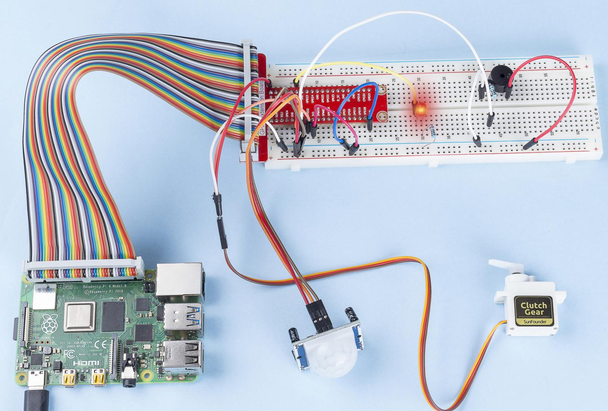

.. note::

    ¡Hola! Bienvenido a la Comunidad de Entusiastas de SunFounder para Raspberry Pi, Arduino y ESP32 en Facebook. Sumérgete en el mundo de Raspberry Pi, Arduino y ESP32 junto a otros entusiastas.

    **¿Por qué unirte?**

    - **Soporte Experto**: Resuelve problemas post-venta y desafíos técnicos con la ayuda de nuestra comunidad y equipo.
    - **Aprende y Comparte**: Intercambia consejos y tutoriales para mejorar tus habilidades.
    - **Previsualizaciones Exclusivas**: Accede anticipadamente a anuncios de nuevos productos y adelantos exclusivos.
    - **Descuentos Especiales**: Disfruta de descuentos exclusivos en nuestros productos más recientes.
    - **Promociones Festivas y Sorteos**: Participa en sorteos y promociones especiales en días festivos.

    👉 ¿Listo para explorar y crear con nosotros? Haz clic en [|link_sf_facebook|] y únete hoy mismo.

3.1.2 Bienvenida
=================

Introducción
--------------

En este proyecto, usaremos un sensor PIR para detectar el movimiento de 
peatones y utilizaremos servos, un LED y un zumbador para simular el 
funcionamiento de una puerta con sensor, como la de una tienda de conveniencia. 
Cuando el peatón esté dentro del rango de detección del PIR, la luz indicadora 
se encenderá, la puerta se abrirá y el zumbador tocará el timbre de bienvenida.

Componentes
--------------

.. image:: img/list_Welcome.png
    :align: center

Diagrama Esquemático
-----------------------

============ ======== ======== ===
T-Board Name physical wiringPi BCM
GPIO18       Pin 12   1        18
GPIO17       Pin 11   0        17
GPIO27       Pin 13   2        27
GPIO22       Pin 15   3        22
============ ======== ======== ===

.. image:: img/Schematic_three_one2.png
   :align: center

Procedimientos Experimentales
------------------------------

**Paso 1:** Construye el circuito.

.. image:: img/image239.png
   :width: 800
   :align: center

**Para Usuarios de Lenguaje C**
^^^^^^^^^^^^^^^^^^^^^^^^^^^^^^^^^^^^

**Paso 2:** Cambia al directorio adecuado.

.. raw:: html

   <run></run>

.. code-block:: 

    cd ~/davinci-kit-for-raspberry-pi/c/3.1.2/

**Paso 3:** Compila el código.

.. raw:: html

   <run></run>

.. code-block:: 

    gcc 3.1.2_Welcome.c -lwiringPi

**Paso 4:** Ejecuta el archivo.

.. raw:: html

   <run></run>

.. code-block:: 

    sudo ./a.out

Después de ejecutar el código, si el sensor PIR detecta a alguien pasando, 
la puerta se abrirá automáticamente (simulada por el servo), se encenderá 
el indicador y se reproducirá el sonido del timbre. Tras la melodía de 
bienvenida, el sistema cerrará la puerta y apagará la luz indicadora, 
esperando la próxima detección de movimiento.

El módulo PIR tiene dos potenciómetros: uno para ajustar la sensibilidad 
y otro para ajustar la distancia de detección. Para un mejor funcionamiento, 
gira ambos en sentido antihorario hasta el final.

.. note::

    Si el programa no funciona después de ejecutar el código, o aparece el mensaje de error: \"wiringPi.h: No such file or directory\", consulta :ref:`C code is not working?`.

**Explicación del Código**

.. code-block:: c

    void setAngle(int pin, int angle){    // Crea una función para controlar el ángulo del servo.
        if(angle < 0)
            angle = 0;
        if(angle > 180)
            angle = 180;
        softPwmWrite(pin,Map(angle, 0, 180, 5, 25));   
    } 

Se crea una función, setAngle, para establecer el ángulo del servo entre 0 y 180 grados.

.. code-block:: c

    void doorbell(){
    for(int i=0;i<sizeof(song)/4;i++){
            softToneWrite(BuzPin, song[i]); 
            delay(beat[i] * 250);
        }

Se crea una función, doorbell, que permite que el zumbador reproduzca música.

.. code-block:: c

    void closedoor(){
    digitalWrite(ledPin, LOW);   // Apaga el LED
    for(int i=180;i>-1;i--){  // Hace que el servo gire del ángulo máximo al mínimo
        setAngle(servoPin,i);
        delay(1);
        }
    }

Se crea la función closedoor para simular el cierre de la puerta, 
apagar el LED y hacer que el servo gire de 180 grados a 0 grados.

.. code-block:: c

    void opendoor(){
        digitalWrite(ledPin, HIGH);   // Enciende el LED
        for(int i=0;i<181;i++){  // Hace que el servo gire del ángulo mínimo al máximo
            setAngle(servoPin,i);
            delay(1);
        }
        doorbell();
        closedoor();
    }

La función opendoor() incluye varias partes: encender la luz indicadora, 
mover el servo (simulando la apertura de la puerta), reproducir la melodía 
de bienvenida y luego llamar a la función closedoor() después de la música.

.. code-block:: c

        int main(void)
    {
        if(wiringPiSetup() == -1){ // Si la inicialización de wiringPi falla, imprime un mensaje en pantalla.
            printf("setup wiringPi failed !");
            return 1;
        }
        if(softToneCreate(BuzPin) == -1){
            printf("setup softTone failed !");
            return 1;
    ......

En la función main(), se inicializa la biblioteca wiringPi y se configura 
softTone. Luego se establece ledPin como salida y pirPin como entrada. 
Si el sensor PIR detecta movimiento, se llama a la función opendoor para 
simular la apertura de la puerta.

**Para Usuarios de Python**
^^^^^^^^^^^^^^^^^^^^^^^^^^^^^

**Paso 2:** Cambia al directorio.

.. raw:: html

   <run></run>

.. code-block::

    cd ~/davinci-kit-for-raspberry-pi/python/

**Paso 3:** Ejecuta el código.

.. raw:: html

   <run></run>

.. code-block::

    sudo python3 3.1.2_Welcome.py

Después de ejecutar el código, si el sensor PIR detecta a alguien pasando, 
la puerta se abrirá automáticamente (simulada por el servo), se encenderá 
el indicador y se reproducirá el sonido del timbre. Luego de la música, el 
sistema cerrará la puerta y apagará la luz indicadora, esperando el 
siguiente paso de alguien.

El módulo PIR tiene dos potenciómetros: uno para ajustar la sensibilidad y 
otro para ajustar la distancia de detección. Para un funcionamiento óptimo, 
gira ambos en sentido antihorario hasta el final.

**código**

.. note::

    Puedes **Modificar/Restablecer/Copiar/Ejecutar/Detener** el código a 
    continuación. Pero antes, debes ir a la ruta de origen del código, 
    como ``davinci-kit-for-raspberry-pi/python``.

.. raw:: html

   <run></run>

.. code-block:: python

    import RPi.GPIO as GPIO
    import time

    SERVO_MIN_PULSE = 500
    SERVO_MAX_PULSE = 2500

    ledPin = 18    # define el ledPin
    pirPin = 17    # define el sensorPin
    servoPin = 22  # define el servoPin
    buzPin = 27    # define el buzzerPin

    CL = [0, 131, 147, 165, 175, 196, 211, 248]        # Frecuencia de notas de C Baja
    CM = [0, 262, 294, 330, 350, 393, 441, 495]        # Frecuencia de notas de C Media
    CH = [0, 525, 589, 661, 700, 786, 882, 990]        # Frecuencia de notas de C Alta

    song = [CH[5],CH[2],CM[6],CH[2],CH[3],CH[6],CH[3],CH[5],CH[3],CM[6],CH[2]]
    beat = [1,1,1,1,1,2,1,1,1,1,1]

    def setup():
        global p
        global Buzz
        GPIO.setmode(GPIO.BCM)           # Define numeración BCM
        GPIO.setup(ledPin, GPIO.OUT)     # Configura ledPin como salida
        GPIO.setup(pirPin, GPIO.IN)      # Configura sensorPin como entrada
        GPIO.setup(servoPin, GPIO.OUT)   # Configura servoPin como salida
        GPIO.output(servoPin, GPIO.LOW)  # Configura servoPin en bajo
        GPIO.setup(buzPin, GPIO.OUT)     # Configura buzzerPin como salida

        Buzz = GPIO.PWM(buzPin, 440)     # 440 es la frecuencia inicial
        Buzz.start(50)                   # Inicia Buzz con ciclo de trabajo del 50%

        p = GPIO.PWM(servoPin, 50)       # Configura frecuencia del servo a 50Hz
        p.start(0)                       # Ciclo de trabajo inicial = 0

    def map(value, inMin, inMax, outMin, outMax):
        return (outMax - outMin) * (value - inMin) / (inMax - inMin) + outMin

        
    def setAngle(angle):      # make the servo rotate to specific angle (0-180 degrees) 
        angle = max(0, min(180, angle))
        pulse_width = map(angle, 0, 180, SERVO_MIN_PULSE, SERVO_MAX_PULSE)
        pwm = map(pulse_width, 0, 20000, 0, 100)
        p.ChangeDutyCycle(pwm)           # Mapea el ángulo al ciclo de trabajo y lo envía

    def doorbell():
        for i in range(1, len(song)):
            Buzz.ChangeFrequency(song[i])  # Cambia la frecuencia de acuerdo a la nota
            time.sleep(beat[i] * 0.25)     # Retraso en cada nota por beat * 0.25s
        time.sleep(1)

    def closedoor():
        GPIO.output(ledPin, GPIO.LOW)
        for i in range(180, -1, -1):       # Gira el servo de 180 a 0 grados
            setAngle(i)
            time.sleep(0.001)
        time.sleep(1)
    def opendoor():
        GPIO.output(ledPin, GPIO.HIGH)
        for i in range(0, 181, 1):         # Gira el servo de 0 a 180 grados
            setAngle(i)
            time.sleep(0.001)
        time.sleep(1)
        doorbell()
        closedoor()

    def loop():
        while True:
            if GPIO.input(pirPin)==GPIO.HIGH:
                opendoor()

    def destroy():
        GPIO.cleanup()                     # Libera los recursos
        p.stop()
        Buzz.stop()

    if __name__ == '__main__':     # Program start from here
        setup()
        try:
            loop()
        except KeyboardInterrupt:  # When 'Ctrl+C' is pressed, the program destroy() will be  executed.
            destroy()

**Explicación del Código**

.. code-block:: python

    def setup():
        global p
        global Buzz                        # Asigna una variable global para reemplazar GPIO.PWM
        GPIO.setmode(GPIO.BCM)             # Numeración de pines en modo BCM
        GPIO.setup(ledPin, GPIO.OUT)       # Configura ledPin como salida
        GPIO.setup(pirPin, GPIO.IN)        # Configura sensorPin como entrada
        GPIO.setup(buzPin, GPIO.OUT)       # Configura buzzerPin como salida
        Buzz = GPIO.PWM(buzPin, 440)       # 440 es la frecuencia inicial.
        Buzz.start(50)                     # Inicia el pin del buzzer con un ciclo de trabajo del 50%
        GPIO.setup(servoPin, GPIO.OUT)     # Configura servoPin como salida
        GPIO.output(servoPin, GPIO.LOW)    # Configura servoPin en bajo
        p = GPIO.PWM(servoPin, 50)         # Establece la frecuencia en 50Hz
        p.start(0)                         # Ciclo de trabajo inicial = 0

Estas declaraciones se utilizan para inicializar los pines de cada componente.

.. code-block:: python

    def setAngle(angle):      # Hace que el servo gire a un ángulo específico (0-180 grados) 
        angle = max(0, min(180, angle))
        pulse_width = map(angle, 0, 180, SERVO_MIN_PULSE, SERVO_MAX_PULSE)
        pwm = map(pulse_width, 0, 20000, 0, 100)
        p.ChangeDutyCycle(pwm) # Mapea el ángulo al ciclo de trabajo y lo emite

Crea una función, servowrite, para escribir el ángulo en el servo que va de 0 a 180.

.. code-block:: python

    def doorbell():
        for i in range(1,len(song)):       # Reproduce la canción
            Buzz.ChangeFrequency(song[i])  # Cambia la frecuencia de acuerdo a la nota de la canción
            time.sleep(beat[i] * 0.25)     # Retardo de una nota por beat * 0.25s

Crea una función, doorbell, para que el buzzer reproduzca música.

.. code-block:: python

    def closedoor():
        GPIO.output(ledPin, GPIO.LOW)
        Buzz.ChangeFrequency(1)
        for i in range(180, -1, -1):       # Hace que el servo gire de 180 a 0 grados
            setAngle(i)
            time.sleep(0.001)

Cierra la puerta y apaga la luz indicadora.

.. code-block:: python

    def opendoor():
        GPIO.output(ledPin, GPIO.LOW)
        for i in range(0, 181, 1):         # Hace que el servo gire de 0 a 180 grados
            setAngle(i)                     # Escribe el ángulo en el servo
            time.sleep(0.001)
        doorbell()
        closedoor()

La función opendoor() consta de varias partes: encender la luz indicadora, 
girar el servo (para simular la acción de abrir la puerta), reproducir la 
música de bienvenida de la tienda y llamar a la función closedoor() después 
de la música.

.. code-block:: python

    def loop():
    while True:
        if GPIO.input(pirPin)==GPIO.HIGH:
            opendoor()

Cuando el sensor PIR detecta que alguien está pasando, llama a la función 
opendoor().

Imagen del Fenómeno
------------------------

