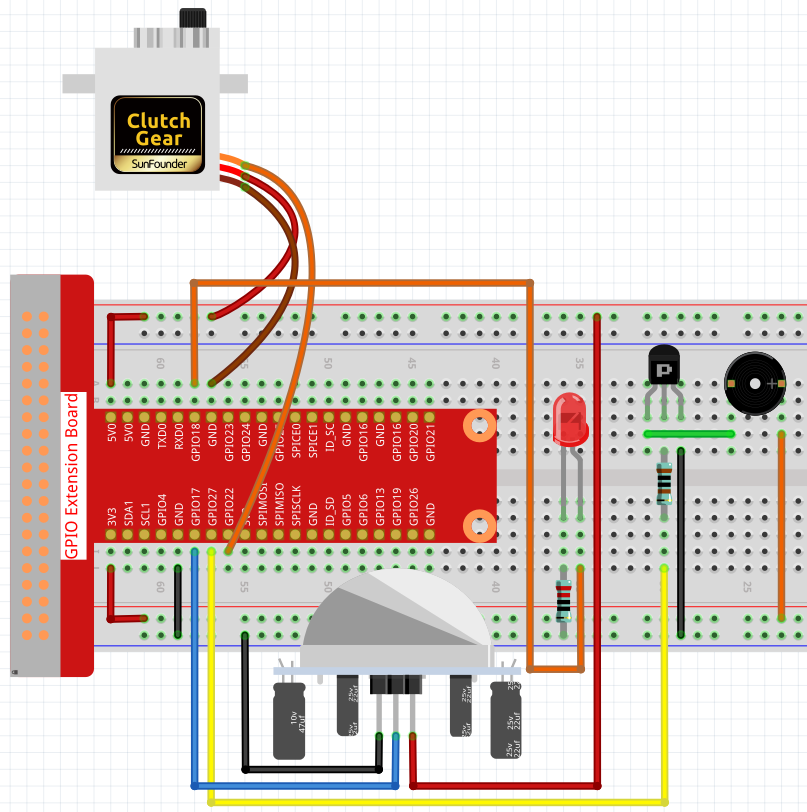

3.1.2 いらっしゃいませ
~~~~~~~~~~~~~~~~~~~~~~~~~~~~~~

前書き
-------------

このプロジェクトでは、PIRを使用して歩行者の動きを検知し、サーボ、LED、ブザーを使用してコンビニのセンサードアの動作をシミュレートする。歩行者がPIRの検知範囲内に現れると、インジケータライトが点灯し、ドアが開き、ブザーがオープニングベルを鳴らす。

部品
---------------

.. image:: media/list_Welcome.png
    :align: center

回路図
-------------------

============ ======== ======== ===
T-Board Name physical wiringPi BCM
GPIO18       Pin 12   1        18
GPIO17       Pin 11   0        17
GPIO27       Pin 13   2        27
GPIO22       Pin 15   3        22
============ ======== ======== ===

.. image:: media/Schematic_three_one2.png
   :align: center

実験手順
-------------------------

ステップ1： 回路を作る。

C言語ユーザー向け
^^^^^^^^^^^^^^^^^^^^^^^^^^

ステップ2： ディレクトリを変更する。

.. raw:: html

   <run></run>

.. code-block:: 

    cd /home/pi/davinci-kit-for-raspberry-pi/c/3.1.2/

ステップ3： コンパイルする。

.. raw:: html

   <run></run>

.. code-block:: 

    gcc 3.1.2_Welcome.c -lwiringPi

ステップ4： 実行する。

.. raw:: html

   <run></run>

.. code-block:: 

    sudo ./a.out

コードの実行後、PIRセンサーが通り過ぎる人を検出すると、
ドアが自動的に開き（サーボによってシミュレートされる）、
インジケーターをオンにして、ドアベルの音楽を再生する。ドアベルの音楽が再生されると、
システムは自動的にドアを閉じてインジケータライトをオフにし、次に誰かが通り過ぎることを待つ。

PIR モジュールには 2 つのポテンショメータがあり、
1 つは感度を調整するためのもので、もう 1 つは検出距離を調整するためのものです。 
PIR モジュールがうまく機能するためには、両方を完全に反時計回りに回す必要があります。

**コードの説明**

.. code-block:: c

    void setAngle(int pin, int angle){    //Create a funtion to control the angle of the servo.
        if(angle < 0)
            angle = 0;
        if(angle > 180)
            angle = 180;
        softPwmWrite(pin,Map(angle, 0, 180, 5, 25));   
    } 

0〜180の角度をサーボに書き込むための関数、 ``setAngle`` を作成する。

.. code-block:: c

    void doorbell(){
    for(int i=0;i<sizeof(song)/4;i++){
            softToneWrite(BuzPin, song[i]); 
            delay(beat[i] * 250);
        }

ブザーで音楽を再生できるようにする関数、 ``doorbell`` を作成する。

.. code-block:: c

    void closedoor(){
    digitalWrite(ledPin, LOW);   //led off
    for(int i=180;i>-1;i--){  //make servo rotate from maximum angle to minimum angle
        setAngle(servoPin,i);
        delay(1);
        }
    }

ドアの閉鎖をシミュレートする関数 ``closedoor`` を作成し、
LEDをオフにし、サーボを180度から0度に回転させる。

.. code-block:: c

    void opendoor(){
        digitalWrite(ledPin, HIGH);   //led on
        for(int i=0;i<181;i++){  //make servo rotate from minimum angle to maximum angle
            setAngle(servoPin,i);
            delay(1);
        }
        doorbell();
        closedoor();
    }

関数 ``opendoor()`` にはいくつかの部分が含まれている：インジケータライトをオンにし、
サーボを回転させ（ドアを開く動作をシミュレートする）、
コンビニのドアベル音楽を再生し、音楽を再生した後に関数 ``closedoor()`` を呼び出す。

.. code-block:: c

        int main(void)
    {
        if(wiringPiSetup() == -1){ //when initialize wiring failed,print message to screen
            printf("setup wiringPi failed !");
            return 1;
        }
        if(softToneCreate(BuzPin) == -1){
            printf("setup softTone failed !");
            return 1;
    ......

関数 ``main()`` で、ライブラリー ``wiringPi`` を初期化し、
``softTone`` をセットアップしてから、 ``ledPin`` を出力状態に、
``pirPin`` を入力状態に設定する。PIRセンサーが通り過ぎる人を検出すると、
ドアを開くことをシミュレートするために関数 ``opendoor`` が呼び出される。

Python言語ユーザー向け
^^^^^^^^^^^^^^^^^^^^^^^^^^^^^^

ステップ2： ディレクトリを変更する。

.. raw:: html

   <run></run>

.. code-block::

    cd /home/pi/davinci-kit-for-raspberry-pi/python/

ステップ3： 実行する。

.. raw:: html

   <run></run>

.. code-block::

    sudo python3 3.1.2_Welcome.py

コードの実行後、PIRセンサーが通り過ぎる人を検出すると、
ドアが自動的に開き（サーボによってシミュレートされる）、
インジケーターをオンにして、ドアベルの音楽を再生する。ドアベルの音楽が再生されると、
システムは自動的にドアを閉じてインジケータライトをオフにし、次に誰かが通り過ぎることを待つ。

PIR モジュールには 2 つのポテンショメータがあり、
1 つは感度を調整するためのもので、もう 1 つは検出距離を調整するためのものです。 
PIR モジュールがうまく機能するためには、両方を完全に反時計回りに回す必要があります。

**コード**

.. note::

   以下のコードを **変更/リセット/コピー/実行/停止** できます。 ただし、その前に、 ``davinci-kit-for-raspberry-pi/python`` のようなソースコードパスに移動する必要があります。 
   
 
.. raw:: html

    <run></run>

.. code-block:: python

    import RPi.GPIO as GPIO
    import time

    SERVO_MIN_PULSE = 500
    SERVO_MAX_PULSE = 2500

    ledPin = 18    # define the ledPin
    pirPin = 17    # define the sensorPin
    servoPin = 22  # define the servoPin
    buzPin = 27    # define the buzzerpin

    CL = [0, 131, 147, 165, 175, 196, 211, 248]        # Frequency of Low C notes

    CM = [0, 262, 294, 330, 350, 393, 441, 495]        # Frequency of Middle C notes

    CH = [0, 525, 589, 661, 700, 786, 882, 990]        # Frequency of High C notes

    song = [    CH[5],CH[2],CM[6],CH[2],CH[3],CH[6],CH[3],CH[5],CH[3],CM[6],CH[2]    ]

    beat = [    1,1,1,1,1,2,1,1,1,1,1,]

    def setup():
        global p
        global Buzz                        # Assign a global variable to replace GPIO.PWM 
        GPIO.setmode(GPIO.BCM)       # Numbers GPIOs by physical location
        GPIO.setup(ledPin, GPIO.OUT)   # Set ledPin's mode is output
        GPIO.setup(pirPin, GPIO.IN)    # Set sensorPin's mode is input
        GPIO.setup(servoPin, GPIO.OUT)   # Set servoPin's mode is output
        GPIO.output(servoPin, GPIO.LOW)  # Set servoPin to low
        GPIO.setup(buzPin, GPIO.OUT)    # Set pins' mode is output

        Buzz = GPIO.PWM(buzPin, 440)    # 440 is initial frequency.
        Buzz.start(50)                    # Start Buzzer pin with 50% duty ration

        p = GPIO.PWM(servoPin, 50)     # set Frequece to 50Hz
        p.start(0)                     # Duty Cycle = 0

    def map(value, inMin, inMax, outMin, outMax):
        return (outMax - outMin) * (value - inMin) / (inMax - inMin) + outMin

        
    def setAngle(angle):      # make the servo rotate to specific angle (0-180 degrees) 
        angle = max(0, min(180, angle))
        pulse_width = map(angle, 0, 180, SERVO_MIN_PULSE, SERVO_MAX_PULSE)
        pwm = map(pulse_width, 0, 20000, 0, 100)
        p.ChangeDutyCycle(pwm)#map the angle to duty cycle and output it
        
    def doorbell():
        for i in range(1, len(song)):        # Play song 1
            Buzz.ChangeFrequency(song[i])    # Change the frequency along the song note
            time.sleep(beat[i] * 0.25)        # delay a note for beat * 0.25s
        time.sleep(1)                        # Wait a second for next song.

    def closedoor():
        GPIO.output(ledPin, GPIO.LOW)
        for i in range(180, -1, -1): #make servo rotate from 180 to 0 deg
            setAngle(i)
            time.sleep(0.001)
        time.sleep(1)
    def opendoor():
        GPIO.output(ledPin, GPIO.LOW)
        for i in range(0, 181, 1):   #make servo rotate from 0 to 180 deg
            setAngle(i)     # Write to servo
            time.sleep(0.001)
        time.sleep(1)
        doorbell()
        closedoor()

    def loop():
        while True:
            if GPIO.input(pirPin)==GPIO.HIGH:
                opendoor()

    def destroy():
        GPIO.cleanup()                     # Release resource
        p.stop()
        Buzz.stop()

    if __name__ == '__main__':     # Program start from here
        setup()
        try:
            loop()
        except KeyboardInterrupt:  # When 'Ctrl+C' is pressed, the program destroy() will be  executed.
            destroy()

**コードの説明**

.. code-block:: python

    def setup():
        global p
        global Buzz                        # Assign a global variable to replace GPIO.PWM
        GPIO.setmode(GPIO.BCM)       # Numbers GPIOs by physical location
        GPIO.setup(ledPin, GPIO.OUT)   # Set ledPin's mode is output
        GPIO.setup(pirPin, GPIO.IN)    # Set sensorPin's mode is input
        GPIO.setup(buzPin, GPIO.OUT)    # Set pins' mode is output
        Buzz = GPIO.PWM(buzPin, 440)    # 440 is initial frequency.
        Buzz.start(50)                    # Start Buzzer pin with 50% duty ration
        GPIO.setup(servoPin, GPIO.OUT)   # Set servoPin's mode is output
        GPIO.output(servoPin, GPIO.LOW)  # Set servoPin to low
        p = GPIO.PWM(servoPin, 50)     # set Frequece to 50Hz
        p.start(0)                     # Duty Cycle = 0

これらのステートメントは、各部品のピンを初期化するために使用される。

.. code-block:: python

    def setAngle(angle):      # make the servo rotate to specific angle (0-180 degrees) 
        angle = max(0, min(180, angle))
        pulse_width = map(angle, 0, 180, SERVO_MIN_PULSE, SERVO_MAX_PULSE)
        pwm = map(pulse_width, 0, 20000, 0, 100)
        p.ChangeDutyCycle(pwm)#map the angle to duty cycle and output it

0〜180の角度をサーボに書き込むための関数、 ``setAngle`` を作成する。

.. code-block:: python

    def doorbell():
        for i in range(1,len(song)): # Play song1
            Buzz.ChangeFrequency(song[i]) # Change the frequency along the song note
            time.sleep(beat[i] * 0.25) # delay a note for beat * 0.25s

ブザーで音楽を再生できるようにする関数、 ``doorbell`` を作成する。

.. code-block:: python

    def closedoor():
        GPIO.output(ledPin, GPIO.LOW)
        Buzz.ChangeFrequency(1)
        for i in range(180, -1, -1): #make servo rotate from 180 to 0 deg
            setAngle(i)
            time.sleep(0.001)

ドアを閉じて、インジケータライトをオフにする。

.. code-block:: python

    def opendoor():
        GPIO.output(ledPin, GPIO.LOW)
        for i in range(0, 181, 1):   #make servo rotate from 0 to 180 deg
            setAngle(i)     # Write to servo
            time.sleep(0.001)
        doorbell()
        closedoor()

関数 ``opendoor()`` にはいくつかの部分が含まれている：インジケータライトをオンにし、
サーボを回転させ（ドアを開く動作をシミュレートする）、コンビニのドアベル音楽を再生し、
音楽を再生した後に関数 ``closedoor()`` を呼び出す。

.. code-block:: python

    def loop():
    while True:
        if GPIO.input(pirPin)==GPIO.HIGH:
            opendoor()

PIRは誰かが通り過ぎることを検知すると、関数 ``opendoor()`` を呼び出す。

現象画像
--------------------

.. image:: media/image240.jpeg
   :align: center