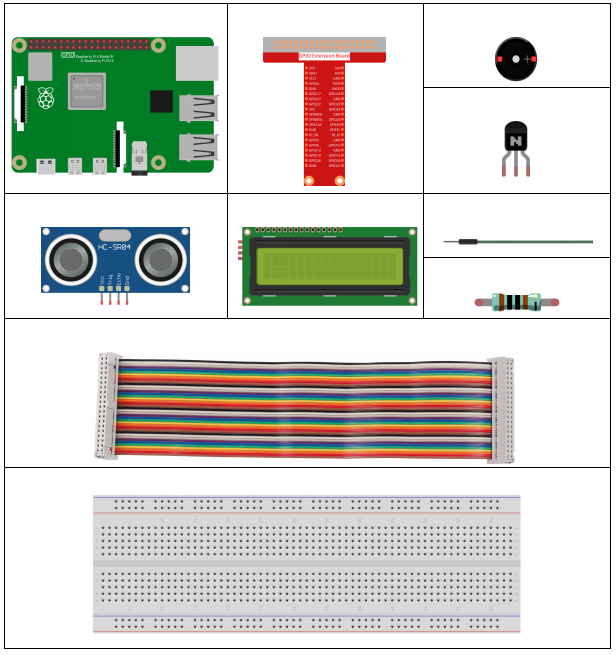
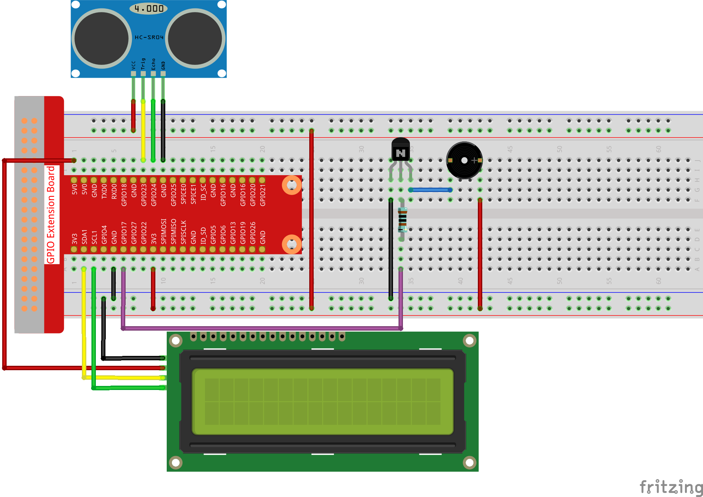
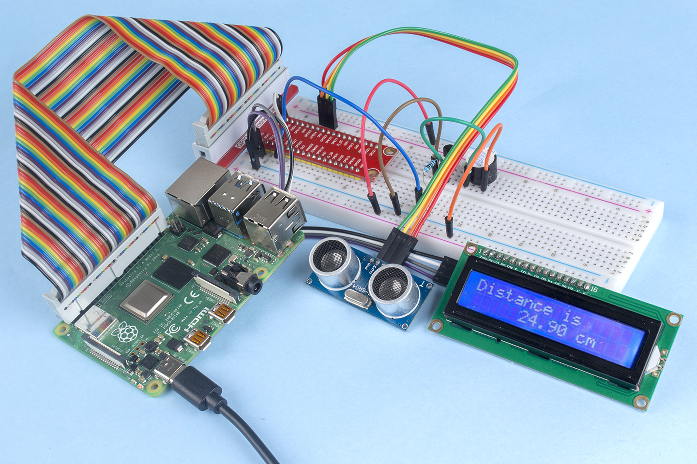

3.1.3 Reversing Alarm
~~~~~~~~~~~~~~~~~~~~~

Introduction
-------------

In this project, we will use LCD, buzzer and ultrasonic sensors to make
a reverse assist system. We can put it on the remote control vehicle to
simulate the actual process of reversing the car into the garage.

Components
----------------

Schematic Diagram
--------------------

Ultrasonic sensor detects the distance between itself and the obstacle
that will be displayed on the LCD in the form of code. At the same time,
the ultrasonic sensor let the buzzer issue prompt sound of different
frequency according to different distance value.

============ ======== ======== ===
T-Board Name physical wiringPi BCM
GPIO23       Pin 16   4        23
GPIO24       Pin 18   5        24
GPIO17       Pin 11   0        17
SDA1         Pin 3             
SCL1         Pin 5             
============ ======== ======== ===

.. image:: media/Schematic_three_one3.png
   :align: center

Experimental Procedures
------------------------

**Step 1:** Build the circuit.

**For C Language Users**
^^^^^^^^^^^^^^^^^^^^^^^^^^

**Step 2:** Change directory.

.. raw:: html

    <run></run>
 
.. code-block:: 
 
    cd /home/pi/davinci-kit-for-raspberry-pi/c/3.1.3/
 
**Step 3:** Compile.

.. raw:: html

   <run></run>

.. code-block:: 

    gcc 3.1.3_ReversingAlarm.c -lwiringPi

**Step 4:** Run.

.. raw:: html

   <run></run>

.. code-block:: 

    sudo ./a.out

As the code runs, ultrasonic sensor module detects the distance to the
obstacle and then displays the information about the distance on
LCD1602; besides, buzzer emits warning tone whose frequency changes with
the distance.

.. note::

    If it does not work after running, please refer to :ref:`C code is not working?`

**Code**

.. note::
    The following codes are incomplete. If you want to check the complete codes, 
    you are suggested to use command nano 3.1.1_ReversingAlarm.c.

.. code-block:: c

    #include <wiringPi.h>
    #include <stdio.h>
    #include <sys/time.h>
    #include <wiringPi.h>
    #include <wiringPiI2C.h>
    #include <string.h>

    #define Trig    4
    #define Echo    5
    #define Buzzer  0

    int LCDAddr = 0x27;
    int BLEN = 1;
    int fd;

    //here is the function of LCD
    void write_word(int data){...}

    void send_command(int comm){...}

    void send_data(int data){...}

    void lcdInit(){...}

    void clear(){...}

    void write(int x, int y, char data[]){...}

    //here is the function of Ultrasonic
    void ultraInit(void){...}

    float disMeasure(void){...}

    //here is the main function
    int main(void)
    {
        float dis;
        char result[10];
        if(wiringPiSetup() == -1){ 
            printf("setup wiringPi failed !");
            return 1;
        }

        pinMode(Buzzer,OUTPUT);
        fd = wiringPiI2CSetup(LCDAddr);
        lcdInit();
        ultraInit();

        clear();
        write(0, 0, "Ultrasonic Starting"); 
        write(1, 1, "By Sunfounder");   

        while(1){
            dis = disMeasure();
            printf("%.2f cm \n",dis);
            delay(100);
            digitalWrite(Buzzer,LOW);
            if (dis > 400){
                clear();
                write(0, 0, "Error");
                write(3, 1, "Out of range");    
                delay(500);
            }
            else
            {
                clear();
                write(0, 0, "Distance is");
                sprintf(result,"%.2f cm",dis);
                write(5, 1, result);

                if(dis>=50)
                {delay(500);}
                else if(dis<50 & dis>20) {
                    for(int i=0;i<2;i++){
                    digitalWrite(Buzzer,HIGH);
                    delay(50);
                    digitalWrite(Buzzer,LOW);
                    delay(200);
                    }
                }
                else if(dis<=20){
                    for(int i=0;i<5;i++){
                    digitalWrite(Buzzer,HIGH);
                    delay(50);
                    digitalWrite(Buzzer,LOW);
                    delay(50);
                    }
                }
            }   
        }

        return 0;
    }

**Code Explanation**

.. code-block:: c

    pinMode(Buzzer,OUTPUT);
    fd = wiringPiI2CSetup(LCDAddr);
    lcdInit();
    ultraInit();

In this program, we apply previous components synthetically. Here we use
buzzers, LCD and ultrasonic. We can initialize them the same way as we
did before.

.. code-block:: c

    dis = disMeasure();
     printf("%.2f cm \n",dis);
    digitalWrite(Buzzer,LOW);
    if (dis > 400){
         write(0, 0, "Error");
         write(3, 1, "Out of range");    
    }
    else
    {
        write(0, 0, "Distance is");
        sprintf(result,"%.2f cm",dis);
        write(5, 1, result);
	}

Here we get the value of the ultrasonic sensor and get the distance
through calculation.

If the value of distance is greater than the range value to be detected,
an error message is printed on the LCD. And if the distance value is
within the range, the corresponding results will be output.

.. code-block:: c

    sprintf(result,"%.2f cm",dis);

Since the output mode of LCD only supports character type, and the
variable dis stores the value of float type, we need to use sprintf().
The function converts the float type value to a character and stores it
on the string variable result[]. %.2f means to keep two decimal places.

.. code-block:: c

    if(dis>=50)
    {delay(500);}
    else if(dis<50 & dis>20) {
        for(int i=0;i<2;i++){
        digitalWrite(Buzzer,HIGH);
        delay(50);
        digitalWrite(Buzzer,LOW);
        delay(200);
        }
    }
    else if(dis<=20){
        for(int i=0;i<5;i++){
        digitalWrite(Buzzer,HIGH);
        delay(50);
        digitalWrite(Buzzer,LOW);
        delay(50);
        }
    }

This judgment condition is used to control the sound of the buzzer.
According to the difference in distance, it can be divided into three
cases, in which there will be different sound frequencies. Since the
total value of delay is 500, all of the cases can provide a 500ms
interval for the ultrasonic sensor.

**For Python Language Users**
^^^^^^^^^^^^^^^^^^^^^^^^^^^^^^^^

**Step 2:** Change directory.

.. raw:: html

    <run></run>
 
.. code-block::
 
    cd /home/pi/davinci-kit-for-raspberry-pi/python/
 
**Step 3:** Run.

.. raw:: html

   <run></run>

.. code-block:: 

    sudo python3 3.1.3_ReversingAlarm.py

As the code runs, ultrasonic sensor module detects the distance to the
obstacle and then displays the information about the distance on
LCD1602; besides, buzzer emits warning tone whose frequency changes with
the distance.

**Code**

.. note::

    You can **Modify/Reset/Copy/Run/Stop** the code below. But before that, you need to go to  source code path like ``davinci-kit-for-raspberry-pi\\python``. 
    
.. raw:: html

    <run></run>

.. code-block:: python

    import LCD1602
    import time
    import RPi.GPIO as GPIO

    TRIG = 16
    ECHO = 18
    BUZZER = 11

    def lcdsetup():
    LCD1602.init(0x27, 1)   # init(slave address, background light)
    LCD1602.clear()   
    LCD1602.write(0, 0, 'Ultrasonic Starting')
    LCD1602.write(1, 1, 'By SunFounder')
    time.sleep(2)

    def setup():
    GPIO.setmode(GPIO.BOARD)
    GPIO.setup(TRIG, GPIO.OUT)
    GPIO.setup(ECHO, GPIO.IN)
    GPIO.setup(BUZZER, GPIO.OUT, initial=GPIO.LOW)
    lcdsetup()

    def distance():
    GPIO.output(TRIG, 0)
    time.sleep(0.000002)

    GPIO.output(TRIG, 1)
    time.sleep(0.00001)
    GPIO.output(TRIG, 0)

    while GPIO.input(ECHO) == 0:
        a = 0
    time1 = time.time()
    while GPIO.input(ECHO) == 1:
        a = 1
    time2 = time.time()

    during = time2 - time1
    return during * 340 / 2 * 100

    def destroy():
    GPIO.output(BUZZER, GPIO.LOW)
    GPIO.cleanup()
    LCD1602.clear()

    def loop():
    while True:
        dis = distance()
        print (dis, 'cm')
        print ('')
        GPIO.output(BUZZER, GPIO.LOW)
        if (dis > 400):
            LCD1602.clear()
            LCD1602.write(0, 0, 'Error')
            LCD1602.write(3, 1, 'Out of range')
            time.sleep(0.5)
        else:
            LCD1602.clear()
            LCD1602.write(0, 0, 'Distance is')
            LCD1602.write(5, 1, str(round(dis,2)) +' cm')
            if(dis>=50):
                time.sleep(0.5)
            elif(dis<50 and dis>20):
                for i in range(0,2,1):
                    GPIO.output(BUZZER, GPIO.HIGH)
                    time.sleep(0.05)
                    GPIO.output(BUZZER, GPIO.LOW)
                    time.sleep(0.2)
            elif(dis<=20):
                for i in range(0,5,1):
                    GPIO.output(BUZZER, GPIO.HIGH)
                    time.sleep(0.05)
                    GPIO.output(BUZZER, GPIO.LOW)
                    time.sleep(0.05)

    if __name__ == "__main__":
    setup()
    try:       
        loop()
    except KeyboardInterrupt:
        destroy()

    **Code Explanation**

    def lcdsetup():

**Code Explanation**

.. code-block:: python

    def lcdsetup():
        LCD1602.init(0x27, 1)   # init(slave address, background light)

    def setup():
        GPIO.setmode(GPIO.BOARD)
        GPIO.setup(TRIG, GPIO.OUT)
        GPIO.setup(ECHO, GPIO.IN)
        GPIO.setup(BUZZER, GPIO.OUT, initial=GPIO.LOW)
        lcdsetup()

In this program, we apply the previously used components synthetically.
Here we use buzzers, LCD and ultrasonic. We can initialize them in the
same way as we did before.

.. code-block:: python

    dis = distance()
    print (dis, 'cm')
    print ('')
    GPIO.output(BUZZER, GPIO.LOW)
    if (dis > 400):
        LCD1602.clear()
        LCD1602.write(0, 0, 'Error')
        LCD1602.write(3, 1, 'Out of range')
        time.sleep(0.5)
    else:
        LCD1602.clear()
        LCD1602.write(0, 0, 'Distance is')
        LCD1602.write(5, 1, str(round(dis,2)) +' cm')

Here we get the values of the ultrasonic sensor and get the distance
through calculation. If the value of distance is greater than the range
of value to be detected, an error message is printed on the LCD. And if
the distance is within the working range, the corresponding results will
be output.

LCD1602.write(5, 1, str(round(dis,2)) +' cm')

Since the LCD output only supports character types, we need to use **str
()** to convert numeric values to characters. We are going to round it
to two decimal places.

.. code-block:: python

    if(dis>=50)
    {delay(500);}
    else if(dis<50 & dis>20) {
        for(int i=0;i<2;i++){
            digitalWrite(Buzzer,HIGH);
            delay(50);
            digitalWrite(Buzzer,LOW);
            delay(200);
            }
        }
        else if(dis<=20){
            for(int i=0;i<5;i++){
            digitalWrite(Buzzer,HIGH);
            delay(50);
            digitalWrite(Buzzer,LOW);
            delay(50);
            }
        }

This judgment condition is used to control the sound of the buzzer.
According to the difference in distance, it can be divided into three
cases, in which there will be different sound frequencies. Since the
total value of delay is 500, all of them can provide a 500ms interval
for the ultrasonic sensor to work.

Phenomenon Picture
--------------------

