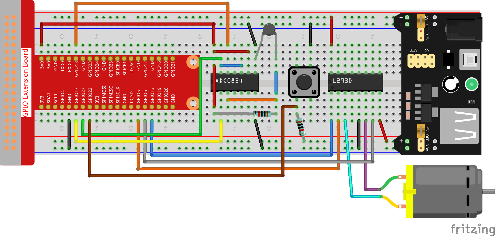
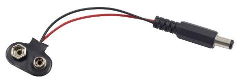
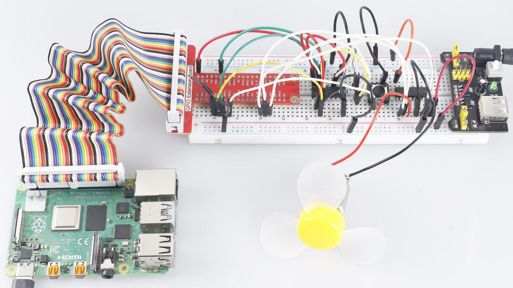

.. note::

    Hallo und willkommen in der SunFounder Raspberry Pi & Arduino & ESP32 Enthusiasten-Gemeinschaft auf Facebook! Tauchen Sie tiefer ein in die Welt von Raspberry Pi, Arduino und ESP32 mit anderen Enthusiasten.

    **Warum beitreten?**

    - **Expertenunterstützung**: Lösen Sie Nachverkaufsprobleme und technische Herausforderungen mit Hilfe unserer Gemeinschaft und unseres Teams.
    - **Lernen & Teilen**: Tauschen Sie Tipps und Anleitungen aus, um Ihre Fähigkeiten zu verbessern.
    - **Exklusive Vorschauen**: Erhalten Sie frühzeitigen Zugang zu neuen Produktankündigungen und exklusiven Einblicken.
    - **Spezialrabatte**: Genießen Sie exklusive Rabatte auf unsere neuesten Produkte.
    - **Festliche Aktionen und Gewinnspiele**: Nehmen Sie an Gewinnspielen und Feiertagsaktionen teil.

    👉 Sind Sie bereit, mit uns zu erkunden und zu erschaffen? Klicken Sie auf [|link_sf_facebook|] und treten Sie heute bei!

3.1.4 Smart Fan
=================

Einführung
-----------------

In diesem Kurs werden wir Motoren, Tasten und Thermistoren verwenden, um einen manuellen + automatischen intelligenten Lüfter herzustellen, dessen Windgeschwindigkeit einstellbar ist.

Komponenten
------------------

.. image:: media/list_Smart_Fan.png
    :align: center

Schematische Darstellung
-------------------------------------

============ ======== ======== ===
T-Karte Name physisch wiringPi BCM
GPIO17       Pin 11   0        17
GPIO18       Pin 12   1        18
GPIO27       Pin 13   2        27
GPIO22       Pin 15   3        22
GPIO5        Pin 29   21       5
GPIO6        Pin 31   22       6
GPIO13       Pin 33   23       13
============ ======== ======== ===

.. image:: media/Schematic_three_one4.png
    :width: 500
    :align: center

Experimentelle Verfahren
-----------------------------

Schritt 1: Bauen Sie die Schaltung auf.

.. note::
    The power module can apply a 9V battery with the 9V Battery Buckle in the kit. Insert the jumper cap of the power module into the 5V bus strips of the breadboard.

Für Benutzer in C-Sprache
^^^^^^^^^^^^^^^^^^^^^^^^^^^^^^^^

Schritt 2: Gehen Sie in den Ordner der Kode.

.. raw:: html

   <run></run>

.. code-block:: 

    cd ~/davinci-kit-for-raspberry-pi/c/3.1.4/

Schritt 3: Kompilieren.

.. raw:: html

   <run></run>

.. code-block:: 

    gcc 3.1.4_SmartFan.c -lwiringPi -lm

Schritt 4: Führen Sie die obige ausführbare Datei aus.

.. raw:: html

   <run></run>

.. code-block:: 

    sudo ./a.out

Starten Sie den Lüfter, während der Kode ausgeführt wird, indem Sie die Taste drücken. Jedes Mal, wenn Sie drücken, wird 1 Geschwindigkeitsstufe nach oben oder unten eingestellt. Es gibt 5 Arten von Geschwindigkeitsstufen: 0~4. Wenn Sie die vierte Geschwindigkeitsstufe einstellen und die Taste drücken, arbeitet der Lüfter nicht mehr mit einer Windgeschwindigkeit von 0.

Sobald die Temperatur länger als 2℃, steigt oder fällt, wird die Geschwindigkeit automatisch um 1 Grad schneller oder langsamer.

**Code Erklärung**

.. code-block:: c

    int temperture(){
        unsigned char analogVal;
        double Vr, Rt, temp, cel, Fah;
        analogVal = get_ADC_Result(0);
        Vr = 5 * (double)(analogVal) / 255;
        Rt = 10000 * (double)(Vr) / (5 - (double)(Vr));
        temp = 1 / (((log(Rt/10000)) / 3950)+(1 / (273.15 + 25)));
        cel = temp - 273.15;
        Fah = cel * 1.8 +32;
        int t=cel;
        return t;
    }

``temperture()`` wandelt die von ADC0834 gelesenen Thermistorwerte in Temperaturwerte um. Siehe :ref:`py_temp`  für weitere Details.

.. code-block:: c

    int motor(int level){
        if(level==0){
            digitalWrite(MotorEnable,LOW);
            return 0;
        }
        if (level>=4){
            level =4;
        }
        digitalWrite(MotorEnable,HIGH);
        softPwmWrite(MotorPin1, level*25);
        return level;    
    }

Diese Funktion steuert die Drehzahl des Motors. Der Bereich der Stufe: 0-4 (Stufe 0 stoppt den Arbeitsmotor). 
Eine Stufeneinstellung steht für eine 25% ige Änderung der Windgeschwindigkeit.

.. code-block:: c

    int main(void)
    {
        setup();
        int currentState,lastState=0;
        int level = 0;
        int currentTemp,markTemp=0;
        while(1){
            currentState=digitalRead(BtnPin);
            currentTemp=temperture();
            if (currentTemp<=0){continue;}
            if (currentState==1&&lastState==0){
                level=(level+1)%5;
                markTemp=currentTemp;
                delay(500);
            }
            lastState=currentState;
            if (level!=0){
                if (currentTemp-markTemp<=-2){
                    level=level-1;
                    markTemp=currentTemp;
                }
                if (currentTemp-markTemp>=2){
                    level=level+1;
                    markTemp=currentTemp;
                }
            }
            level=motor(level);
        }
        return 0;
    }

Die Funktion ``main()`` enthält den gesamten Programmablauf wie folgt:

1. Lesen Sie ständig den Tastenstatus und die aktuelle Temperatur ab.

#. Jede Presse erreicht Stufe+1 und gleichzeitig wird die Temperatur aktualisiert. Die Stufe reicht von 1~4..

#. Während der Lüfter arbeitet (der Niveau ist nicht 0), wird die Temperatur erfasst. Eine Änderung von 2℃+ bewirkt das Auf und Ab des Levels.

#. Der Motor ändert die Drehzahl mit der Stufe.

Für Python-Sprachbenutzer
^^^^^^^^^^^^^^^^^^^^^^^^^^^^^^^

Schritt 2: Gehen Sie in den Ordner der Kode.

.. raw:: html

   <run></run>

.. code-block:: 

    cd ~/davinci-kit-for-raspberry-pi/python

Schritt 3: Ausführen.

.. raw:: html

   <run></run>

.. code-block:: 

    sudo python3 3.1.4_SmartFan.py

Starten Sie den Lüfter, während der Kode ausgeführt wird, indem Sie die Taste drücken. Jedes Mal, wenn Sie drücken, wird 1 Geschwindigkeitsstufe nach oben oder unten eingestellt. Es gibt 5 Arten von Geschwindigkeitsstufen: 0~4. Wenn Sie die vierte Geschwindigkeitsstufe einstellen und die Taste drücken, arbeitet der Lüfter nicht mehr mit einer Windgeschwindigkeit von 0.

Sobald die Temperatur länger als 2℃, steigt oder fällt, wird die Geschwindigkeit automatisch um 1 Grad schneller oder langsamer.

**Code**

.. note::

    Sie können den folgenden Code **Ändern/Zurücksetzen/Kopieren/Ausführen/Stoppen** . Zuvor müssen Sie jedoch zu einem Quellcodepfad wie ``davinci-kit-for-raspberry-pi/python`` gehen.
    
.. raw:: html

    <run></run>

.. code-block:: python

    import RPi.GPIO as GPIO
    import time
    import ADC0834
    import math

    # Set up pins
    MotorPin1   = 5
    MotorPin2   = 6
    MotorEnable = 13
    BtnPin  = 22

    def setup():
        global p_M1,p_M2
        ADC0834.setup()
        GPIO.setmode(GPIO.BCM)
        GPIO.setup(MotorPin1, GPIO.OUT)
        GPIO.setup(MotorPin2, GPIO.OUT)
        p_M1=GPIO.PWM(MotorPin1,2000)
        p_M2=GPIO.PWM(MotorPin2,2000)
        p_M1.start(0)
        p_M2.start(0)
        GPIO.setup(MotorEnable, GPIO.OUT, initial=GPIO.LOW)
        GPIO.setup(BtnPin, GPIO.IN)

    def temperature():
        analogVal = ADC0834.getResult()
        Vr = 5 * float(analogVal) / 255
        Rt = 10000 * Vr / (5 - Vr)
        temp = 1/(((math.log(Rt / 10000)) / 3950) + (1 / (273.15+25)))
        Cel = temp - 273.15
        Fah = Cel * 1.8 + 32
        return Cel

    def motor(level):
        if level == 0:
            GPIO.output(MotorEnable, GPIO.LOW)
            return 0
        if level>=4:
            level = 4
        GPIO.output(MotorEnable, GPIO.HIGH)
        p_M1.ChangeDutyCycle(level*25)
        return level

    def main():
        lastState=0
        level=0
        markTemp = temperature()
        while True:
            currentState =GPIO.input(BtnPin)
            currentTemp=temperature()
            if currentState == 1 and lastState == 0:
                level=(level+1)%5
                markTemp = currentTemp
                time.sleep(0.5)
            lastState=currentState
            if level!=0:
                if currentTemp-markTemp <= -2:
                    level = level -1
                    markTemp=currentTemp            
                if currentTemp-markTemp >= 2:
                    level = level +1
                    markTemp=currentTemp             
            level = motor(level)
            

    def destroy():
        GPIO.output(MotorEnable, GPIO.LOW)
        p_M1.stop()
        p_M2.stop()
        GPIO.cleanup()    

    if __name__ == '__main__':
        setup()
        try:
            main()
        except KeyboardInterrupt:
            destroy()

**Code Erklärung**

.. code-block:: python

    def temperature():
        analogVal = ADC0834.getResult()
        Vr = 5 * float(analogVal) / 255
        Rt = 10000 * Vr / (5 - Vr)
        temp = 1/(((math.log(Rt / 10000)) / 3950) + (1 / (273.15+25)))
        Cel = temp - 273.15
        Fah = Cel * 1.8 + 32
        return Cel

``temperature()`` wandelt von ADC0834 gelesene Thermistorwerte in Temperaturwerte um. Siehe :ref:`py_temp`  für weitere Details.

.. code-block:: python

    def motor(level):
        if level == 0:
            GPIO.output(MotorEnable, GPIO.LOW)
            return 0
        if level>=4:
            level = 4
        GPIO.output(MotorEnable, GPIO.HIGH)
        p_M1.ChangeDutyCycle(level*25)
        return level

Diese Funktion steuert die Drehzahl des Motors. Der Bereich des Hebels: 0-4 (Stufe 0 stoppt den Arbeitsmotor). 
Eine Stufeneinstellung steht für eine 25% ige Änderung der Windgeschwindigkeit.

.. code-block:: python

    def main():
        lastState=0
        level=0
        markTemp = temperature()
        while True:
            currentState =GPIO.input(BtnPin)
            currentTemp=temperature()
            if currentState == 1 and lastState == 0:
                level=(level+1)%5
                markTemp = currentTemp
                time.sleep(0.5)
            lastState=currentState
            if level!=0:
                if currentTemp-markTemp <= -2:
                    level = level -1
                    markTemp=currentTemp            
                if currentTemp-markTemp >= 2:
                    level = level +1
                    markTemp=currentTemp             
            level = motor(level)

Die Funktion ``main()`` enthält den gesamten Programmablauf wie folgt:

1. Lesen Sie ständig den Tastenstatus und die aktuelle Temperatur ab.

#. Jede Presse erreicht Stufe+1 und gleichzeitig wird die Temperatur aktualisiert. Die Stufe reicht von 1~4..

#. Während der Lüfter arbeitet (der Niveau ist nicht 0), wird die Temperatur erfasst. Eine Änderung von 2℃+ bewirkt das Auf und Ab des Levels.

#. Der Motor ändert die Drehzahl mit der Stufe.

Phänomen Bild
------------------------

