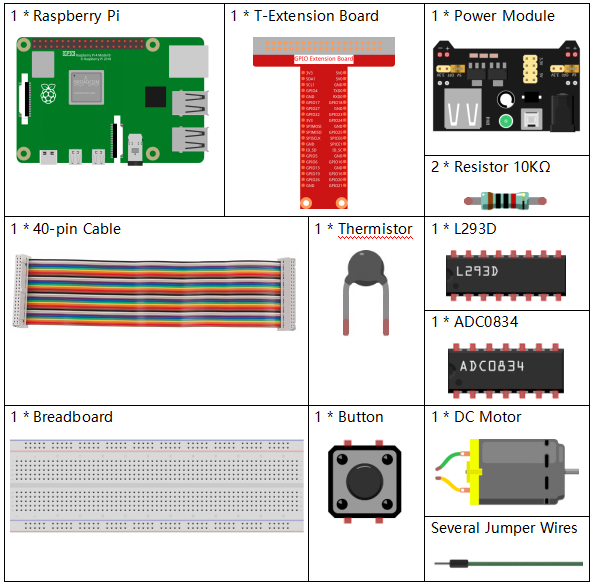
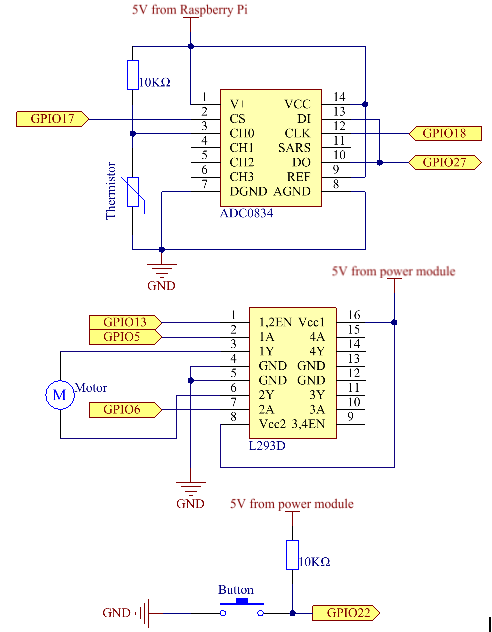
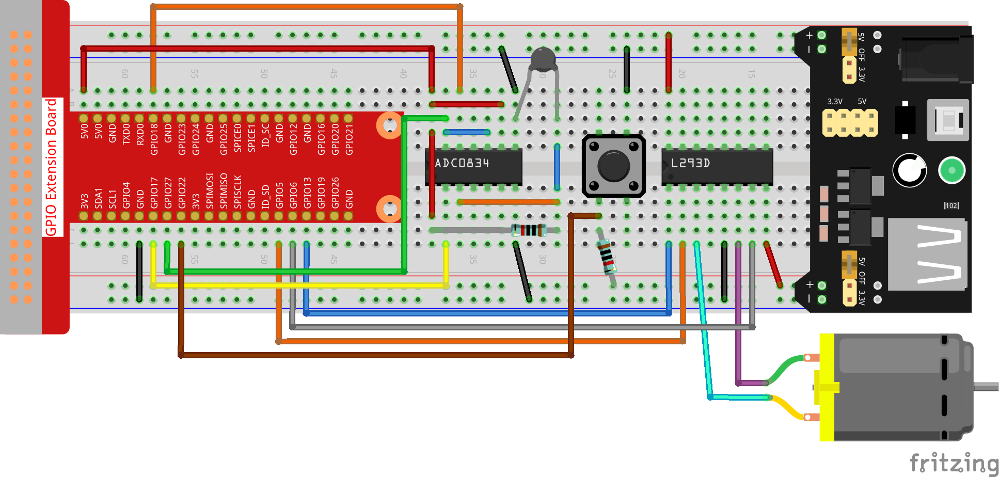
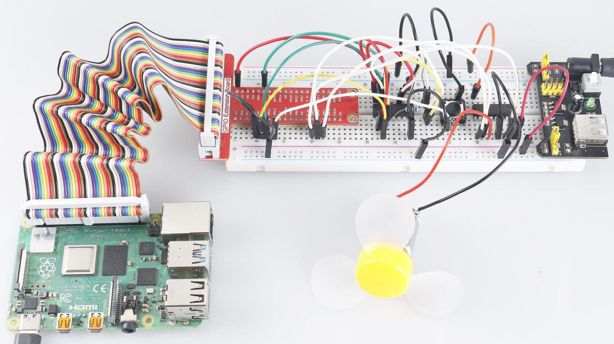

.. note:: 

    Ciao, benvenuto nella Community su Facebook di appassionati di SunFounder Raspberry Pi, Arduino e ESP32! Approfondisci l'esplorazione di Raspberry Pi, Arduino e ESP32 insieme ad altri appassionati.

    **Perché unirsi a noi?**

    - **Supporto esperto**: risolvi i problemi post-vendita e le sfide tecniche grazie all'aiuto della nostra community e del nostro team.
    - **Impara e Condividi**: scambia consigli e tutorial per migliorare le tue competenze.
    - **Anteprime esclusive**: accedi in anteprima agli annunci di nuovi prodotti e curiosità.
    - **Sconti speciali**: approfitta di sconti esclusivi sui nostri prodotti più recenti.
    - **Promozioni festive e omaggi**: partecipa a promozioni e giveaway per le festività.

    👉 Pronto a esplorare e creare insieme a noi? Clicca su [|link_sf_facebook|] e unisciti oggi stesso!

3.1.4 Ventilatore Intelligente
=================================

Introduzione
---------------

In questo corso, utilizzeremo motori, pulsanti e termistori per creare un 
ventilatore intelligente manuale + automatico, con velocità del vento regolabile.

Componenti
------------

Schema Elettrico
------------------

============ ======== ======== ===
T-Board Name physical wiringPi BCM
GPIO17       Pin 11   0        17
GPIO18       Pin 12   1        18
GPIO27       Pin 13   2        27
GPIO22       Pin 15   3        22
GPIO5        Pin 29   21       5
GPIO6        Pin 31   22       6
GPIO13       Pin 33   23       13
============ ======== ======== ===

Procedura Sperimentale
-------------------------

**Step 1:** Costruisci il circuito.

.. note::
    Il modulo di alimentazione può utilizzare una batteria da 9V con 
    l'apposito connettore incluso nel kit. Inserisci il ponticello del 
    modulo di alimentazione nella striscia di bus da 5V della breadboard.

.. image:: img/image118.jpeg
   :alt: \_MG_2084
   :width: 2.80694in
   :height: 0.94375in
   :align: center

**Per utenti del linguaggio C**
^^^^^^^^^^^^^^^^^^^^^^^^^^^^^^^^^

**Step 2:** Accedi alla cartella del codice.

.. raw:: html

   <run></run>

.. code-block:: 

    cd ~/davinci-kit-for-raspberry-pi/c/3.1.4/

**Step 3:** Compila.

.. raw:: html

   <run></run>

.. code-block:: 

    gcc 3.1.4_SmartFan.c -lwiringPi -lm

**Step 4:** Esegui il file compilato.

.. raw:: html

   <run></run>

.. code-block:: 

    sudo ./a.out

All’avvio del codice, premi il pulsante per accendere il ventilatore. Ogni 
volta che premi, la velocità aumenta o diminuisce di una tacca. Sono disponibili 
**5** livelli di velocità: **0~4**. Quando è impostato sulla 4a velocità e premi 
il pulsante, il ventilatore si ferma con velocità del vento **0**.

.. note::

    Se il programma non funziona dopo l'esecuzione o appare il messaggio di 
    errore: "wiringPi.h: No such file or directory", fai riferimento a :ref:`Il codice C non funziona?`.

Quando la temperatura aumenta o diminuisce di oltre 2°C, la velocità aumenta o 
diminuisce automaticamente di 1 livello.

**Spiegazione del Codice**

.. code-block:: c

    int temperture(){
        unsigned char analogVal;
        double Vr, Rt, temp, cel, Fah;
        analogVal = get_ADC_Result(0);
        Vr = 5 * (double)(analogVal) / 255;
        Rt = 10000 * (double)(Vr) / (5 - (double)(Vr));
        temp = 1 / (((log(Rt/10000)) / 3950)+(1 / (273.15 + 25)));
        cel = temp - 273.15;
        Fah = cel * 1.8 +32;
        int t=cel;
        return t;
    }

La funzione **temperature()** converte i valori del termistore letti da 
ADC0834 in valori di temperatura. Per ulteriori dettagli consulta :ref:`2.2.2 Termistore`.

.. code-block:: c

    int motor(int level){
        if(level==0){
            digitalWrite(MotorEnable,LOW);
            return 0;
        }
        if (level>=4){
            level =4;
        }
        digitalWrite(MotorEnable,HIGH);
        softPwmWrite(MotorPin1, level*25);
        return level;    
    }

Questa funzione controlla la velocità di rotazione del motore. 
**Livello**: **0-4** (il livello **0** ferma il motore). Ogni 
livello rappresenta un cambiamento del **25%** nella velocità del vento.

.. code-block:: c

    int main(void)
    {
        setup();
        int currentState,lastState=0;
        int level = 0;
        int currentTemp,markTemp=0;
        while(1){
            currentState=digitalRead(BtnPin);
            currentTemp=temperture();
            if (currentTemp<=0){continue;}
            if (currentState==1&&lastState==0){
                level=(level+1)%5;
                markTemp=currentTemp;
                delay(500);
            }
            lastState=currentState;
            if (level!=0){
                if (currentTemp-markTemp<=-2){
                    level=level-1;
                    markTemp=currentTemp;
                }
                if (currentTemp-markTemp>=2){
                    level=level+1;
                    markTemp=currentTemp;
                }
            }
            level=motor(level);
        }
        return 0;
    }

La funzione **main()** racchiude l'intero processo del programma come segue:

1) Legge costantemente lo stato del pulsante e la temperatura attuale.

2) Ogni pressione incrementa di **+1** il livello e aggiorna la temperatura. 
I livelli vanno da **1** a **4**.

3) Mentre il ventilatore è in funzione (livello diverso da **0**), la 
temperatura viene monitorata. Una variazione di **2°C** comporta l'aumento o la diminuzione del livello.

4) Il motore modifica la velocità di rotazione in base al **livello**.

**Per Utenti Python**
^^^^^^^^^^^^^^^^^^^^^^^^

**Step 2**: Entra nella cartella del codice.

.. raw:: html

   <run></run>

.. code-block:: 

    cd ~/davinci-kit-for-raspberry-pi/python

**Step 3**: Esegui.

.. raw:: html

   <run></run>

.. code-block:: 

    sudo python3 3.1.4_SmartFan.py

Quando il codice è in esecuzione, accendi il ventilatore premendo il pulsante. 
Ogni volta che premi, la velocità viene aumentata o diminuita di un livello. 
Sono disponibili **5** livelli di velocità: **0~4**. Quando è impostato al 4° 
livello e premi il pulsante, il ventilatore si ferma con una velocità **0**.

Quando la temperatura sale o scende di più di 2°C, la velocità aumenta o 
diminuisce automaticamente di un livello.

**Codice**

.. note::

    Puoi **Modificare/Ripristinare/Copiare/Eseguire/Interrompere** il codice 
    qui sotto. Prima di farlo, devi accedere alla directory del codice come 
    ``davinci-kit-for-raspberry-pi/python``.
    
.. raw:: html

    <run></run>

.. code-block:: python

    import RPi.GPIO as GPIO
    import time
    import ADC0834
    import math

    # Configurazione dei pin
    MotorPin1   = 5
    MotorPin2   = 6
    MotorEnable = 13
    BtnPin  = 22

    def setup():
        global p_M1,p_M2
        ADC0834.setup()
        GPIO.setmode(GPIO.BCM)
        GPIO.setup(MotorPin1, GPIO.OUT)
        GPIO.setup(MotorPin2, GPIO.OUT)
        p_M1=GPIO.PWM(MotorPin1,2000)
        p_M2=GPIO.PWM(MotorPin2,2000)
        p_M1.start(0)
        p_M2.start(0)
        GPIO.setup(MotorEnable, GPIO.OUT, initial=GPIO.LOW)
        GPIO.setup(BtnPin, GPIO.IN)

    def temperature():
        analogVal = ADC0834.getResult()
        Vr = 5 * float(analogVal) / 255
        Rt = 10000 * Vr / (5 - Vr)
        temp = 1/(((math.log(Rt / 10000)) / 3950) + (1 / (273.15+25)))
        Cel = temp - 273.15
        Fah = Cel * 1.8 + 32
        return Cel

    def motor(level):
        if level == 0:
            GPIO.output(MotorEnable, GPIO.LOW)
            return 0
        if level>=4:
            level = 4
        GPIO.output(MotorEnable, GPIO.HIGH)
        p_M1.ChangeDutyCycle(level*25)
        return level

    def main():
        lastState=0
        level=0
        markTemp = temperature()
        while True:
            currentState =GPIO.input(BtnPin)
            currentTemp=temperature()
            if currentState == 1 and lastState == 0:
                level=(level+1)%5
                markTemp = currentTemp
                time.sleep(0.5)
            lastState=currentState
            if level!=0:
                if currentTemp-markTemp <= -2:
                    level = level -1
                    markTemp=currentTemp            
                if currentTemp-markTemp >= 2:
                    level = level +1
                    markTemp=currentTemp             
            level = motor(level)

    def destroy():
        GPIO.output(MotorEnable, GPIO.LOW)
        p_M1.stop()
        p_M2.stop()
        GPIO.cleanup()    

    if __name__ == '__main__':
        setup()
        try:
            main()
        except KeyboardInterrupt:
            destroy()

**Spiegazione del Codice**

.. code-block:: python

    def temperature():
        analogVal = ADC0834.getResult()
        Vr = 5 * float(analogVal) / 255
        Rt = 10000 * Vr / (5 - Vr)
        temp = 1/(((math.log(Rt / 10000)) / 3950) + (1 / (273.15+25)))
        Cel = temp - 273.15
        Fah = Cel * 1.8 + 32
        return Cel

La funzione **temperature()** converte i valori del termistore letti da **ADC0834** 
in valori di temperatura. Per maggiori dettagli consulta :ref:`2.2.2 Termistore`.

.. code-block:: python

    def motor(level):
        if level == 0:
            GPIO.output(MotorEnable, GPIO.LOW)
            return 0
        if level>=4:
            level = 4
        GPIO.output(MotorEnable, GPIO.HIGH)
        p_M1.ChangeDutyCycle(level*25)
        return level

Questa funzione controlla la velocità di rotazione del motore. Il range di 
**Livello** va da **0 a 4** (livello **0** ferma il motore). Ogni livello 
rappresenta un cambiamento del **25%** nella velocità del vento.

.. code-block:: python

    def main():
        lastState=0
        level=0
        markTemp = temperature()
        while True:
            currentState =GPIO.input(BtnPin)
            currentTemp=temperature()
            if currentState == 1 and lastState == 0:
                level=(level+1)%5
                markTemp = currentTemp
                time.sleep(0.5)
            lastState=currentState
            if level!=0:
                if currentTemp-markTemp <= -2:
                    level = level -1
                    markTemp=currentTemp            
                if currentTemp-markTemp >= 2:
                    level = level +1
                    markTemp=currentTemp             
            level = motor(level)

La funzione **main()** racchiude l'intero processo del programma:

1) Legge costantemente lo stato del pulsante e la temperatura corrente.

2) Ogni pressione incrementa il livello di **+1** e allo stesso tempo aggiorna 
   la temperatura. Il **Livello** varia da **1 a 4**.

3) Mentre il ventilatore è attivo (livello diverso da **0**), la temperatura 
   viene monitorata. Una variazione di **±2°C** comporta un aumento o una diminuzione del livello.

4) Il motore modifica la velocità di rotazione in base al **livello**.

Immagine del Fenomeno
-------------------------

