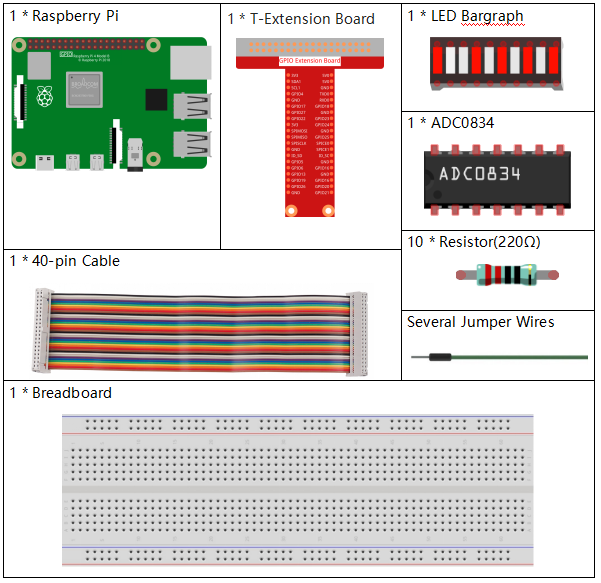
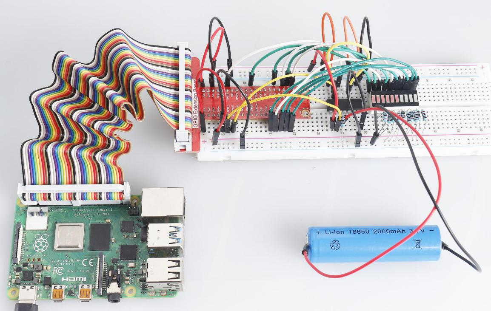

.. note:: 

    Ciao, benvenuto nella Community Facebook di appassionati di SunFounder Raspberry Pi, Arduino e ESP32! Esplora il mondo di Raspberry Pi, Arduino e ESP32 con altri appassionati.

    **Perché unirsi?**

    - **Supporto Esperto**: Risolvi problematiche post-vendita e sfide tecniche con l’aiuto della nostra community e del nostro team.
    - **Impara e Condividi**: Scambia suggerimenti e tutorial per migliorare le tue abilità.
    - **Anteprime Esclusive**: Ottieni un accesso anticipato agli annunci sui nuovi prodotti e ai contenuti in anteprima.
    - **Sconti Speciali**: Godi di sconti esclusivi sui nostri prodotti più recenti.
    - **Promozioni e Omaggi Festivi**: Partecipa a omaggi e promozioni durante le festività.

    👉 Pronto a esplorare e creare con noi? Clicca su [|link_sf_facebook|] e unisciti oggi stesso!

3.1.5 Indicatore di Batteria
===============================

Introduzione
---------------

In questo corso realizzeremo un dispositivo indicatore di batteria che può 
visualizzare visivamente il livello di carica sul LED Bargraph.

Componenti
-------------

Schema Elettrico
------------------

============ ======== ======== ===
T-Board Name physical wiringPi BCM
GPIO17       Pin 11   0        17
GPIO18       Pin 12   1        18
GPIO27       Pin 13   2        27
GPIO25       Pin 22   6        25
GPIO12       Pin 32   26       12
GPIO16       Pin 36   27       16
GPIO20       Pin 38   28       20
GPIO21       Pin 40   29       21
GPIO5        Pin 29   21       5
GPIO6        Pin 31   22       6
GPIO13       Pin 33   23       13
GPIO19       Pin 35   24       19
GPIO26       Pin 37   25       26
============ ======== ======== ===

.. image:: img/Schematic_three_one5.png
   :align: center

Procedura Sperimentale
--------------------------

**Step 1:** Costruisci il circuito.

.. image:: img/image248.png
   :alt: 电量计_bb
   :width: 800
   :align: center

**Per Utenti Linguaggio C**
^^^^^^^^^^^^^^^^^^^^^^^^^^^^

**Step 2:** Accedi alla cartella del codice.

.. raw:: html

   <run></run>

.. code-block:: 

    cd ~/davinci-kit-for-raspberry-pi/c/3.1.5/

**Step 3:** Compila il codice.

.. raw:: html

   <run></run>

.. code-block:: 

    gcc 3.1.5_BatteryIndicator.c -lwiringPi

**Step 4:** Esegui il file eseguibile.

.. raw:: html

   <run></run>

.. code-block:: 

    sudo ./a.out

Dopo aver eseguito il programma, collega separatamente il terzo pin di 
ADC0834 e il GND a due fili e poi collegali ai due poli di una batteria. 
Sul LED Bargraph vedrai illuminarsi i LED corrispondenti per visualizzare 
il livello di carica (intervallo di misura: 0-5V).

.. note::

    Se il programma non funziona dopo l’esecuzione o appare un messaggio di errore: \"wiringPi.h: Nessun file o directory\", consulta :ref:`Il codice C non funziona?`.

**Spiegazione del Codice**

.. code-block:: c

    void LedBarGraph(int value){
        for(int i=0;i<10;i++){
            digitalWrite(pins[i],HIGH);
        }
        for(int i=0;i<value;i++){
            digitalWrite(pins[i],LOW);
        }
    }
    
Questa funzione serve per controllare l'accensione o lo spegnimento dei 
10 LED sul LED Bargraph. Diamo a questi 10 LED un livello alto in modo 
che siano spenti inizialmente e, successivamente, decidiamo quanti LED 
accendere in base al valore analogico ricevuto.

.. code-block:: c

    int main(void)
    {
        uchar analogVal;
        if(wiringPiSetup() == -1){ //when initialize wiring failed,print messageto screen
            printf("setup wiringPi failed !");
            return 1;
        }
        pinMode(ADC_CS,  OUTPUT);
        pinMode(ADC_CLK, OUTPUT);
        for(int i=0;i<10;i++){       //make led pins' mode is output
            pinMode(pins[i], OUTPUT);
            digitalWrite(pins[i],HIGH);
        }
        while(1){
            analogVal = get_ADC_Result(0);
            LedBarGraph(analogVal/25);
            delay(100);
        }
        return 0;
    }

analogVal produce valori (**0-255**) con valori di tensione variabili 
(**0-5V**), ad esempio, se viene rilevato un valore di 3V su una batteria, 
il valore corrispondente **152** viene visualizzato sul voltmetro.

I **10** LED del LED Bargraph sono usati per visualizzare le letture di 
**analogVal**. 255/10=25, quindi ogni incremento di **25** del valore 
analogico accende un LED in più; ad esempio, se “analogVal=150” (circa 3V), 
ci sono 6 LED accesi.

**Per Utenti Python**
^^^^^^^^^^^^^^^^^^^^^^^^^^

**Step 2:** Accedi alla cartella del codice.

.. raw:: html

   <run></run>

.. code-block::

    cd ~/davinci-kit-for-raspberry-pi/python/

**Step 3:** Esegui il file eseguibile.

.. raw:: html

   <run></run>

.. code-block::

    sudo python3 3.1.5_BatteryIndicator.py

Dopo l'esecuzione del programma, collega separatamente il terzo pin di 
ADC0834 e il GND ai due poli di una batteria. Vedrai accendersi il LED 
corrispondente sul LED Bargraph per visualizzare il livello di carica 
della batteria (intervallo di misurazione: 0-5V).

**Codice**

.. note::

    Puoi **Modificare/Reimpostare/Copiare/Eseguire/Arrestare** il codice qui sotto. Tuttavia, prima devi essere nella directory sorgente come ``davinci-kit-for-raspberry-pi/python``. 
    
.. raw:: html

    <run></run>

.. code-block:: python

    import RPi.GPIO as GPIO
    import ADC0834
    import time

    ledPins = [25, 12, 16, 20, 21, 5, 6, 13, 19, 26]

    def setup():
        GPIO.setmode(GPIO.BCM)
        ADC0834.setup()
        for i in ledPins:
            GPIO.setup(i, GPIO.OUT)
            GPIO.output(i, GPIO.HIGH)

    def LedBarGraph(value):
        for i in ledPins:
            GPIO.output(i,GPIO.HIGH)
        for i in range(value):
            GPIO.output(ledPins[i],GPIO.LOW)

    def destroy():
        GPIO.cleanup()

    def loop():
        while True:
            analogVal = ADC0834.getResult()
            LedBarGraph(int(analogVal/25))

    if __name__ == '__main__':
        setup()
        try:
            loop()
        except KeyboardInterrupt: # Quando viene premuto 'Ctrl+C', il programma esegue destroy()
            destroy()

**Spiegazione del Codice**

.. code-block:: python

    def LedBarGraph(value):
        for i in ledPins:
            GPIO.output(i,GPIO.HIGH)
        for i in range(value):
            GPIO.output(ledPins[i],GPIO.LOW)

Questa funzione serve per controllare l'accensione o lo spegnimento dei 
**10** LED sul LED Bargraph. Diamo a questi **10** LED un livello alto 
per spegnerli inizialmente, poi decidiamo quanti LED accendere in base 
al valore analogico ricevuto.

.. code-block:: python

    def loop():
        while True:
            analogVal = ADC0834.getResult()
            LedBarGraph(int(analogVal/25))

analogVal produce valori (**0-255**) in base ai valori di tensione 
variabili (**0-5V**), ad esempio, se viene rilevato un valore di 3V 
su una batteria, il valore corrispondente **152** viene visualizzato 
sul voltmetro.

I **10** LED del LED Bargraph sono usati per visualizzare le letture di 
**analogVal**. 255/10=25, quindi ogni incremento di **25** del valore 
analogico accende un LED in più; ad esempio, se “analogVal=150” (circa 3V), 
ci sono 6 LED accesi.

Immagine del Fenomeno
--------------------------

