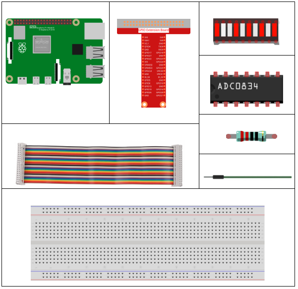
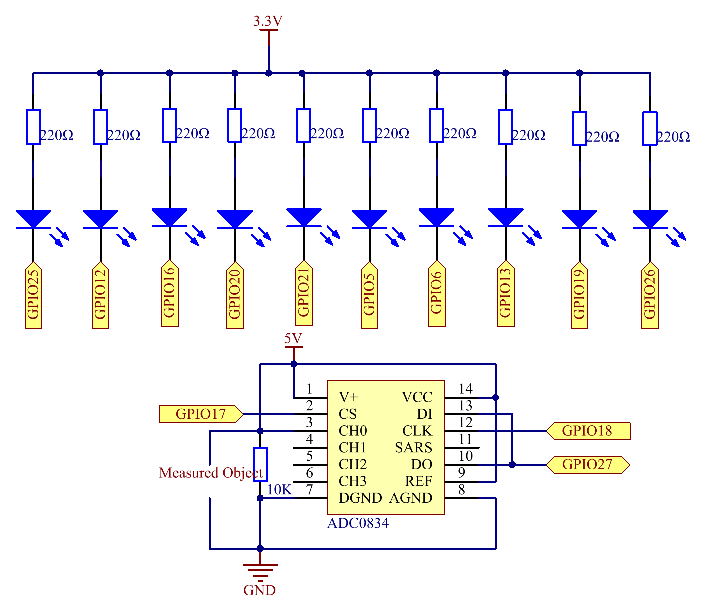

.. note::

    Hallo und willkommen in der SunFounder Raspberry Pi & Arduino & ESP32 Enthusiasten-Gemeinschaft auf Facebook! Tauchen Sie tiefer ein in die Welt von Raspberry Pi, Arduino und ESP32 mit anderen Enthusiasten.

    **Warum beitreten?**

    - **Expertenunterstützung**: Lösen Sie Nachverkaufsprobleme und technische Herausforderungen mit Hilfe unserer Gemeinschaft und unseres Teams.
    - **Lernen & Teilen**: Tauschen Sie Tipps und Anleitungen aus, um Ihre Fähigkeiten zu verbessern.
    - **Exklusive Vorschauen**: Erhalten Sie frühzeitigen Zugang zu neuen Produktankündigungen und exklusiven Einblicken.
    - **Spezialrabatte**: Genießen Sie exklusive Rabatte auf unsere neuesten Produkte.
    - **Festliche Aktionen und Gewinnspiele**: Nehmen Sie an Gewinnspielen und Feiertagsaktionen teil.

    👉 Sind Sie bereit, mit uns zu erkunden und zu erschaffen? Klicken Sie auf [|link_sf_facebook|] und treten Sie heute bei!

3.1.5 Batterieanzeige
=======================

Einführung
--------------

In diesem Kurs erstellen wir ein Batterieanzeigegerät, mit dem der Batteriestand auf dem LED-Balkendiagramm visuell angezeigt werden kann.

Komponenten
-----------------

Schematische Darstellung
-------------------------------

============ ======== ======== ===
T-Karte Name physisch wiringPi BCM
GPIO17       Pin 11   0        17
GPIO18       Pin 12   1        18
GPIO27       Pin 13   2        27
GPIO25       Pin 22   6        25
GPIO12       Pin 32   26       12
GPIO16       Pin 36   27       16
GPIO20       Pin 38   28       20
GPIO21       Pin 40   29       21
GPIO5        Pin 29   21       5
GPIO6        Pin 31   22       6
GPIO13       Pin 33   23       13
GPIO19       Pin 35   24       19
GPIO26       Pin 37   25       26
============ ======== ======== ===

Experimentelle Verfahren
----------------------------------

Schritt 1: Bauen Sie die Schaltung auf.

.. image:: media/image248.png
   :alt: 电量计_bb
   :width: 800
   :align: center

Für Benutzer in C-Sprache
^^^^^^^^^^^^^^^^^^^^^^^^^^^^^^^^

Schritt 2: Gehen Sie zum Ordner der Kode.

.. raw:: html

   <run></run>

.. code-block:: 

    cd ~/davinci-kit-for-raspberry-pi/c/3.1.5/

Schritt 3: Kompilieren Sie der Kode.

.. raw:: html

   <run></run>

.. code-block:: 

    gcc 3.1.5_BatteryIndicator.c -lwiringPi

Schritt 4: Führen Sie die ausführbare Datei aus.

.. raw:: html

   <run></run>

.. code-block:: 

    sudo ./a.out

Nachdem das Programm ausgeführt wurde, geben Sie dem 3. Pin von ADC0834 und dem GND separat einen Anschlussdraht und führen Sie sie dann separat zu den beiden Polen einer Batterie. 
Sie können sehen, dass die entsprechende LED auf dem LED-Balkendiagramm leuchtet, um den LeistungsNiveau anzuzeigen (Messbereich: 0-5V).

**Code Erklärung**

.. code-block:: c

    void LedBarGraph(int value){
        for(int i=0;i<10;i++){
            digitalWrite(pins[i],HIGH);
        }
        for(int i=0;i<value;i++){
            digitalWrite(pins[i],LOW);
        }
    }

Diese Funktion dienst für die Steuerung von Ein- und Ausschalten der 10 LEDs am LED-Bargraphen. 
Wir geben diesen 10 LEDs hohe Niveau, damit sie zuerst ausgeschaltet sind, und entscheiden dann, 
wie viele LEDs aufleuchten, indem wir den empfangenen Analogwert ändern.

.. code-block:: c

    int main(void)
    {
        uchar analogVal;
        if(wiringPiSetup() == -1){ //when initialize wiring failed,print messageto screen
            printf("setup wiringPi failed !");
            return 1;
        }
        pinMode(ADC_CS,  OUTPUT);
        pinMode(ADC_CLK, OUTPUT);
        for(int i=0;i<10;i++){       //make led pins' mode is output
            pinMode(pins[i], OUTPUT);
            digitalWrite(pins[i],HIGH);
        }
        while(1){
            analogVal = get_ADC_Result(0);
            LedBarGraph(analogVal/25);
            delay(100);
        }
        return 0;
    }

``analogVal`` erzeugt Werte (0-255) mit variierenden Spannungswerten (0-5V). 
Wenn beispielsweise 3V an einer Batterie erkannt werden, 
wird der entsprechende Wert 152 auf dem Voltmeter angezeigt.

Die 10 LEDs auf dem LED-Balkendiagramm dienen zur Anzeige der ``analogVal`` Messwerte. 
255/10 = 25, also alle 25 erhöht sich der Analogwert, 
eine weitere LED leuchtet auf, z. B. wenn “analogVal = 150 (ca. 3 V), leuchten 6 LEDs”.

Für Python-Sprachbenutzer
^^^^^^^^^^^^^^^^^^^^^^^^^^^^^^

Schritt 2: Gehen Sie zum Ordner der Kode.

.. raw:: html

   <run></run>

.. code-block::

    cd ~/davinci-kit-for-raspberry-pi/python/

Schritt 3: Führen Sie die ausführbare Datei aus.

.. raw:: html

   <run></run>

.. code-block::

    sudo python3 3.1.5_BatteryIndicator.py

Nachdem das Programm ausgeführt wurde, geben Sie dem 3. 
Pin von ADC0834 und dem GND separat einen Anschlussdraht und führen Sie sie dann separat zu den beiden Polen einer Batterie. 
Sie können sehen, dass die entsprechende LED auf dem LED-Balkendiagramm leuchtet, 
um den LeistungsNiveau anzuzeigen (Messbereich: 0-5V).

**Code**

.. note::

    Sie können den folgenden Code **Ändern/Zurücksetzen/Kopieren/Ausführen/Stoppen** . Zuvor müssen Sie jedoch zu einem Quellcodepfad wie ``davinci-kit-for-raspberry-pi/python`` gehen.
    
.. raw:: html

    <run></run>

.. code-block:: python

    import RPi.GPIO as GPIO
    import ADC0834
    import time

    ledPins = [25, 12, 16, 20, 21, 5, 6, 13, 19, 26]

    def setup():
        GPIO.setmode(GPIO.BCM)
        ADC0834.setup()
        for i in ledPins:
            GPIO.setup(i, GPIO.OUT)
            GPIO.output(i, GPIO.HIGH)

    def LedBarGraph(value):
        for i in ledPins:
            GPIO.output(i,GPIO.HIGH)
        for i in range(value):
            GPIO.output(ledPins[i],GPIO.LOW)

    def destroy():
        GPIO.cleanup()

    def loop():
        while True:
            analogVal = ADC0834.getResult()
            LedBarGraph(int(analogVal/25))

    if __name__ == '__main__':
        setup()
        try:
            loop()
        except KeyboardInterrupt: # When 'Ctrl+C' is pressed, the program destroy() will be executed.
            destroy()

**Code Erklärung**

.. code-block:: python

    def LedBarGraph(value):
        for i in ledPins:
            GPIO.output(i,GPIO.HIGH)
        for i in range(value):
            GPIO.output(ledPins[i],GPIO.LOW)

Diese Funktion dient für die Steuerung von Ein- und Ausschalten der 10 LEDs am LED-Bargraphen. 
Wir geben diesen 10 LEDs hohe Niveau, damit sie zuerst ausgeschaltet sind, und entscheiden dann, 
wie viele LEDs aufleuchten, indem wir den empfangenen Analogwert ändern.

.. code-block:: python

    def loop():
        while True:
            analogVal = ADC0834.getResult()
            LedBarGraph(int(analogVal/25))

``analogVal`` erzeugt Werte (0-255) mit variierenden Spannungswerten (0-5V). Wenn beispielsweise 3V an einer Batterie erkannt werden, wird der entsprechende Wert 152 auf dem Voltmeter angezeigt.

Die 10 LEDs auf dem LED-Balkendiagramm dienen zur Anzeige der ``analogVal`` Messwerte. 255/10 = 25, also alle 25 erhöht sich der Analogwert, eine weitere LED leuchtet auf, z. B. wenn “analogVal = 150 (ca. 3 V), leuchten 6 LEDs”.

Phänomen Bild
----------------------

.. image:: media/image249.jpeg
   :align: center
