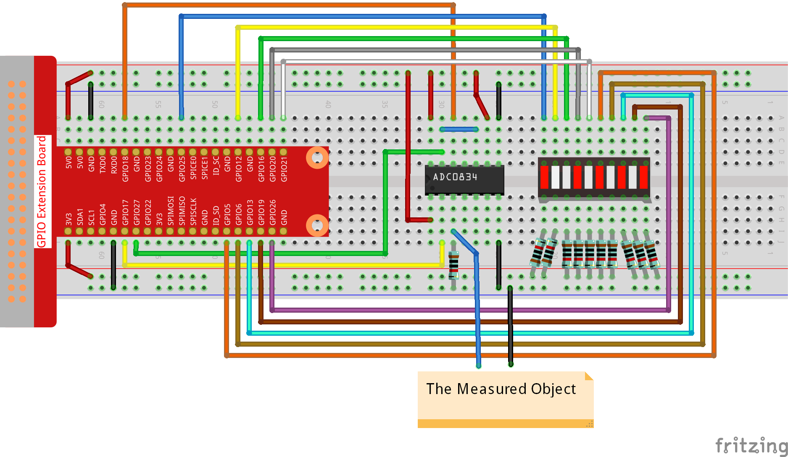

.. note::

    Hello, welcome to the SunFounder Raspberry Pi & Arduino & ESP32 Enthusiasts Community on Facebook! Dive deeper into Raspberry Pi, Arduino, and ESP32 with fellow enthusiasts.

    **Why Join?**

    - **Expert Support**: Solve post-sale issues and technical challenges with help from our community and team.
    - **Learn & Share**: Exchange tips and tutorials to enhance your skills.
    - **Exclusive Previews**: Get early access to new product announcements and sneak peeks.
    - **Special Discounts**: Enjoy exclusive discounts on our newest products.
    - **Festive Promotions and Giveaways**: Take part in giveaways and holiday promotions.

    👉 Ready to explore and create with us? Click [|link_sf_facebook|] and join today!

3.1.5 Battery Indicator
============================

Introduction
--------------

In this course, we will make a battery indicator device that can
visually display the battery level on the LED Bargraph.

Components
------------

.. image:: img/list_Battery_Indicator.png
    :align: center

Schematic Diagram
-------------------

============ ======== ======== ===
T-Board Name physical wiringPi BCM
GPIO17       Pin 11   0        17
GPIO18       Pin 12   1        18
GPIO27       Pin 13   2        27
GPIO25       Pin 22   6        25
GPIO12       Pin 32   26       12
GPIO16       Pin 36   27       16
GPIO20       Pin 38   28       20
GPIO21       Pin 40   29       21
GPIO5        Pin 29   21       5
GPIO6        Pin 31   22       6
GPIO13       Pin 33   23       13
GPIO19       Pin 35   24       19
GPIO26       Pin 37   25       26
============ ======== ======== ===

.. image:: img/Schematic_three_one5.png
   :align: center

Experimental Procedures
-------------------------

**Step 1:** Build the circuit.

**For C Language Users**
^^^^^^^^^^^^^^^^^^^^^^^^^^

**Step 2:** Go to the folder of the code.

.. raw:: html

   <run></run>

.. code-block:: 

    cd ~/davinci-kit-for-raspberry-pi/c/3.1.5/

**Step 3:** Compile the code.

.. raw:: html

   <run></run>

.. code-block:: 

    gcc 3.1.5_BatteryIndicator.c -lwiringPi

**Step 4:** Run the executable file.

.. raw:: html

   <run></run>

.. code-block:: 

    sudo ./a.out

After the program runs, give the 3rd pin of ADC0834 and the GND a
lead-out wire separately and then lead them to the two poles of a
battery separately. You can see the corresponding LED on the LED
Bargraph is lit up to display the power level (measuring range: 0-5V).

.. note::

    If it does not work after running, or there is an error prompt: \"wiringPi.h: No such file or directory\", please refer to :ref:`C code is not working?`.

**Code Explanation**

.. code-block:: c

    void LedBarGraph(int value){
        for(int i=0;i<10;i++){
            digitalWrite(pins[i],HIGH);
        }
        for(int i=0;i<value;i++){
            digitalWrite(pins[i],LOW);
        }
    }

This function works for controlling the turning on or off of the 10 LEDs
on the LED Bargraph. We give these 10 LEDs high levels to let they are
off at first, then decide how many LEDs are lit up by changing the
received analog value.

.. code-block:: c

    int main(void)
    {
        uchar analogVal;
        if(wiringPiSetup() == -1){ //when initialize wiring failed,print messageto screen
            printf("setup wiringPi failed !");
            return 1;
        }
        pinMode(ADC_CS,  OUTPUT);
        pinMode(ADC_CLK, OUTPUT);
        for(int i=0;i<10;i++){       //make led pins' mode is output
            pinMode(pins[i], OUTPUT);
            digitalWrite(pins[i],HIGH);
        }
        while(1){
            analogVal = get_ADC_Result(0);
            LedBarGraph(analogVal/25);
            delay(100);
        }
        return 0;
    }

analogVal produces values (**0-255**) with varying voltage values
(**0-5V**), ex., if a 3V is detected on a battery, the corresponding
value **152** is displayed on the voltmeter.

The **10** LEDs on the LED Bargraph are used to display the
**analogVal** readings. 255/10=25, so every **25** the analog value
increases, one more LED turns on, ex., if “analogVal=150 (about 3V),
there are 6 LEDs turning on.”

**For Python Language Users**
^^^^^^^^^^^^^^^^^^^^^^^^^^^^^^

**Step 2:** Go to the folder of the code.

.. raw:: html

   <run></run>

.. code-block::

    cd ~/davinci-kit-for-raspberry-pi/python/

**Step 3:** Run the executable file.

.. raw:: html

   <run></run>

.. code-block::

    sudo python3 3.1.5_BatteryIndicator.py

After the program runs, give the 3rd pin of ADC0834 and the GND a
lead-out wire separately and then lead them to the two poles of a
battery separately. You can see the corresponding LED on the LED
Bargraph is lit up to display the power level (measuring range: 0-5V).

**Code**

.. note::

    You can **Modify/Reset/Copy/Run/Stop** the code below. But before that, you need to go to  source code path like ``davinci-kit-for-raspberry-pi/python``. 
    
.. raw:: html

    <run></run>

.. code-block:: python

    import RPi.GPIO as GPIO
    import ADC0834
    import time

    ledPins = [25, 12, 16, 20, 21, 5, 6, 13, 19, 26]

    def setup():
        GPIO.setmode(GPIO.BCM)
        ADC0834.setup()
        for i in ledPins:
            GPIO.setup(i, GPIO.OUT)
            GPIO.output(i, GPIO.HIGH)

    def LedBarGraph(value):
        for i in ledPins:
            GPIO.output(i,GPIO.HIGH)
        for i in range(value):
            GPIO.output(ledPins[i],GPIO.LOW)

    def destroy():
        GPIO.cleanup()

    def loop():
        while True:
            analogVal = ADC0834.getResult()
            LedBarGraph(int(analogVal/25))

    if __name__ == '__main__':
        setup()
        try:
            loop()
        except KeyboardInterrupt: # When 'Ctrl+C' is pressed, the program destroy() will be executed.
            destroy()

**Code Explanation**

.. code-block:: python

    def LedBarGraph(value):
        for i in ledPins:
            GPIO.output(i,GPIO.HIGH)
        for i in range(value):
            GPIO.output(ledPins[i],GPIO.LOW)

This function works for controlling the turning on or off of the **10**
LEDs on the LED Bargraph. We give these **10** LEDs high levels to let
they are **off** at first, then decide how many LEDs are lit up by
changing the received analog value.

.. code-block:: python

    def loop():
        while True:
            analogVal = ADC0834.getResult()
            LedBarGraph(int(analogVal/25))

analogVal produces values (**0-255**) with varying voltage values
(**0-5V**), ex., if a 3V is detected on a battery, the corresponding
value **152** is displayed on the voltmeter.

The **10** LEDs on the LED Bargraph are used to display the
**analogVal** readings. 255/10=25, so every **25** the analog value
increases, one more LED turns on, ex., if “analogVal=150 (about 3V),
there are 6 LEDs turning on.”

Phenomenon Picture
----------------------

.. image:: img/image249.jpeg
   :align: center
