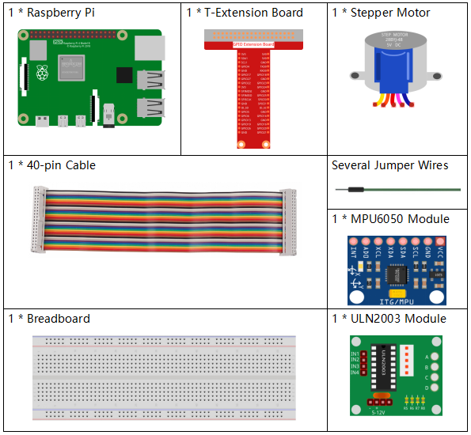
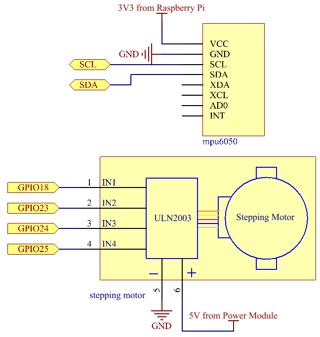
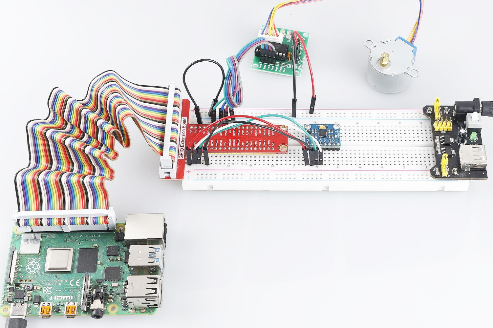

.. note:: 

    Ciao e benvenuto nella Community SunFounder su Facebook per gli appassionati di Raspberry Pi, Arduino e ESP32! Approfondisci il mondo di Raspberry Pi, Arduino e ESP32 insieme ad altri appassionati.

    **Perché unirsi?**

    - **Supporto da esperti**: Risolvi problemi post-vendita e sfide tecniche con l'aiuto della nostra community e del nostro team.
    - **Impara e Condividi**: Scambia suggerimenti e tutorial per migliorare le tue abilità.
    - **Anteprime Esclusive**: Ottieni accesso anticipato agli annunci sui nuovi prodotti e alle anteprime.
    - **Sconti Speciali**: Approfitta di sconti esclusivi sui nostri prodotti più recenti.
    - **Promozioni e Concorsi**: Partecipa a giveaway e promozioni festive.

    👉 Pronto a esplorare e creare con noi? Clicca [|link_sf_facebook|] e unisciti oggi stesso!

3.1.6 Controllo del Movimento
================================

Introduzione
--------------------

In questa lezione, realizzeremo un semplice dispositivo per rilevamento e 
controllo del movimento. L’MPU6050 è utilizzato come sensore e il motore 
passo-passo come dispositivo di controllo. Con l’MPU6050 montato su un guanto, 
puoi controllare il motore passo-passo ruotando il polso.

Componenti
--------------

Schema Elettrico
-----------------------

============ ======== ======== ===
T-Board Name physical wiringPi BCM
GPIO18       Pin 12   1        18
GPIO23       Pin 16   4        23
GPIO24       Pin 18   5        24
GPIO25       Pin 22   6        25
SDA1         Pin 3             
SCL1         Pin 5             
============ ======== ======== ===

Procedure Sperimentali
---------------------------

**Step 1:** Costruisci il circuito.

.. image:: img/image251.png
   :alt: 3.1.6 Motion Control_bb
   :width: 800
   :align: center

**Per gli Utenti di Linguaggio C**
^^^^^^^^^^^^^^^^^^^^^^^^^^^^^^^^^^^^^

**Step 2**: Vai alla cartella del codice.

.. raw:: html

   <run></run>

.. code-block:: 

    cd ~/davinci-kit-for-raspberry-pi/c/3.1.6/

**Step 3**: Compila il codice.

.. raw:: html

   <run></run>

.. code-block:: 

    gcc 3.1.6_MotionControl.c -lwiringPi -lm

**Step 4**: Esegui il file eseguibile.

.. raw:: html

   <run></run>

.. code-block:: 

    sudo ./a.out

Dopo l'esecuzione del codice, se l'angolo di inclinazione dell’ 
**MPU6050** sull'`Y <https://cn.bing.com/dict/search?q=Y&FORM=BDVSP6&mkt=zh-cn>`__-`axis <https://cn.bing.com/dict/search?q=axis&FORM=BDVSP6&mkt=zh-cn>`__
è superiore a **45** ℃, il motore passo-passo ruota in senso antiorario; 
se è inferiore a **-45** ℃, il motore ruota in senso orario.

.. note::

    Se non funziona dopo l'esecuzione o appare un messaggio di errore come: \"wiringPi.h: No such file or directory\", consulta :ref:`Il codice C non funziona?`.

**Spiegazione del Codice**

.. code-block:: c

    double mpu6050(){
        acclX = read_word_2c(0x3B);
        acclY = read_word_2c(0x3D);
        acclZ = read_word_2c(0x3F);
        acclX_scaled = acclX / 16384.0;
        acclY_scaled = acclY / 16384.0;
        acclZ_scaled = acclZ / 16384.0;
        double angle=get_y_rotation(acclX_scaled, acclY_scaled, acclZ_scaled);
        return angle;
    }
mpu6050 ottiene l'angolo di inclinazione nella direzione dell'asse Y.

.. code-block:: c

    void rotary(char direction){
        if(direction == 'c'){
            for(int j=0;j<4;j++){
                for(int i=0;i<4;i++)
                    {digitalWrite(motorPin[i],0x99>>j & (0x08>>i));}
                delayMicroseconds(stepSpeed);
            }        
        }
        else if(direction =='a'){
            for(int j=0;j<4;j++){
                for(int i=0;i<4;i++)
                    {digitalWrite(motorPin[i],0x99<<j & (0x80>>i));}
                delayMicroseconds(stepSpeed);
            }   
        }
    }

Se la direzione ricevuta è \'**c**\', il motore passo-passo ruota in senso 
orario; se la direzione è \'**a**\', il motore ruota in senso antiorario. 
Per maggiori dettagli sul calcolo della direzione di rotazione del motore 
passo-passo, consulta :ref:`1.3.3 Motore Passo-passo`.

.. code-block:: c

    int main()
    {
        setup();
        double angle;
        while(1) {
            angle = mpu6050();
            if (angle >=45){rotary('a');}
            else if (angle<=-45){rotary('c');}
        }
        return 0;
    }

L'angolo di inclinazione nella direzione dell'asse Y viene letto dall'
**mpu6050** e, se è superiore a **45** ℃, il motore passo-passo ruota 
in senso antiorario; se inferiore a **-45** ℃, il motore ruota in senso orario.

**Per Utenti Python**
^^^^^^^^^^^^^^^^^^^^^^^^^^^^^^^

**Step 2**: Vai alla cartella del codice.

.. raw:: html

   <run></run>

.. code-block::

    cd ~/davinci-kit-for-raspberry-pi/python/

**Step 3**: Esegui il file eseguibile.

.. raw:: html

   <run></run>

.. code-block::

    sudo python3 3.1.6_MotionControl.py

Dopo l'esecuzione del codice, se l'angolo di inclinazione dell'**mpu6050** 
sull'asse `Y <https://cn.bing.com/dict/search?q=Y&FORM=BDVSP6&mkt=zh-cn>`__\ **-**\ `axis <https://cn.bing.com/dict/search?q=axis&FORM=BDVSP6&mkt=zh-cn>`__
is larger than **45** ℃, the stepper motor rotates anticlockwise; if è maggiore di **45** ℃, il motore passo-passo ruota in senso 
antiorario; se inferiore a **-45** ℃, ruota in senso orario.

**Codice**

.. note::

    Puoi **Modificare/Reimpostare/Copiare/Eseguire/Arrestare** il codice qui sotto. Prima di fare ciò, vai al percorso del codice sorgente come ``davinci-kit-for-raspberry-pi/python``.
    
.. raw:: html

    <run></run>

.. code-block:: python

    import RPi.GPIO as GPIO
    import smbus
    import math
    import time

    # Registri di gestione dell'alimentazione
    power_mgmt_1 = 0x6b
    power_mgmt_2 = 0x6c

    bus = smbus.SMBus(1) 
    address = 0x68     
    bus.write_byte_data(address, power_mgmt_1, 0)

    # Pin del motore passo-passo
    motorPin = (18,23,24,25) 
    rolePerMinute =15
    stepsPerRevolution = 2048
    stepSpeed = (60/rolePerMinute)/stepsPerRevolution

    # mpu6050
    def read_byte(adr):
        return bus.read_byte_data(address, adr)

    def read_word(adr):
        high = bus.read_byte_data(address, adr)
        low = bus.read_byte_data(address, adr+1)
        val = (high << 8) + low
        return val

    def read_word_2c(adr):
        val = read_word(adr)
        if (val >= 0x8000):
            return -((65535 - val) + 1)
        else:
            return val

    def dist(a,b):
        return math.sqrt((a*a)+(b*b))

    def get_y_rotation(x,y,z):
        radians = math.atan2(x, dist(y,z))
        return -math.degrees(radians)

    def get_x_rotation(x,y,z):
        radians = math.atan2(y, dist(x,z))
        return math.degrees(radians)

    def mpu6050():
        accel_xout = read_word_2c(0x3b)
        accel_yout = read_word_2c(0x3d)
        accel_zout = read_word_2c(0x3f)
        accel_xout_scaled = accel_xout / 16384.0
        accel_yout_scaled = accel_yout / 16384.0
        accel_zout_scaled = accel_zout / 16384.0
        angle=get_y_rotation(accel_xout_scaled, accel_yout_scaled, accel_zout_scaled)
        return angle

    # Motore passo-passo
    def rotary(direction):
        if(direction == 'c'):   
            for j in range(4):
                for i in range(4):
                    GPIO.output(motorPin[i],0x99>>j & (0x08>>i))
                time.sleep(stepSpeed)

        elif(direction == 'a'):
            for j in range(4):
                for i in range(4):
                    GPIO.output(motorPin[i],0x99<<j & (0x80>>i))
                time.sleep(stepSpeed)

    def setup():
        GPIO.setwarnings(False)
        GPIO.setmode(GPIO.BCM)
        for i in motorPin:
            GPIO.setup(i, GPIO.OUT)

    def loop():
        while True:
            angle=mpu6050()
            if angle >=45 :
                rotary('a')
            elif angle <=-45:
                rotary('c')

    def destroy():
        GPIO.cleanup()   

    if __name__ == '__main__':    
        setup()
        try:
            loop()        
        except KeyboardInterrupt:
            destroy()

**Spiegazione del Codice** 

.. code-block:: python

    def mpu6050():
        accel_xout = read_word_2c(0x3b)
        accel_yout = read_word_2c(0x3d)
        accel_zout = read_word_2c(0x3f)
        accel_xout_scaled = accel_xout / 16384.0
        accel_yout_scaled = accel_yout / 16384.0
        accel_zout_scaled = accel_zout / 16384.0
        angle=get_y_rotation(accel_xout_scaled, accel_yout_scaled, accel_zout_scaled)
        return angle

mpu6050 ottiene l'angolo di inclinazione nella direzione dell’asse Y.

.. code-block:: python

    def rotary(direction):
        if(direction == 'c'):   
            for j in range(4):
                for i in range(4):
                    GPIO.output(motorPin[i],0x99>>j & (0x08>>i))
                time.sleep(stepSpeed)

        elif(direction == 'a'):
            for j in range(4):
                for i in range(4):
                    GPIO.output(motorPin[i],0x99<<j & (0x80>>i))
                time.sleep(stepSpeed)

Se la direzione ricevuta è **c**, il motore passo-passo ruota in senso 
orario; se è **a**, il motore ruota in senso antiorario. Per maggiori 
dettagli sul calcolo della direzione di rotazione del motore passo-passo, 
consulta :ref:`1.3.3 Motore Passo-passo`.

.. code-block:: python

    def loop():
        while True:
            angle=mpu6050()
            if angle >=45 :
                rotary('a')
            elif angle <=-45:
                rotary('c')

L'angolo di inclinazione nella direzione dell'asse **Y** viene letto da 
**mpu6050**. Se è superiore a **45** ℃, viene chiamata la funzione rotary() 
per far ruotare il motore passo-passo in senso antiorario; se è inferiore a 
**-45** ℃, il motore ruota in senso orario.

Immagine del Fenomeno
--------------------------

