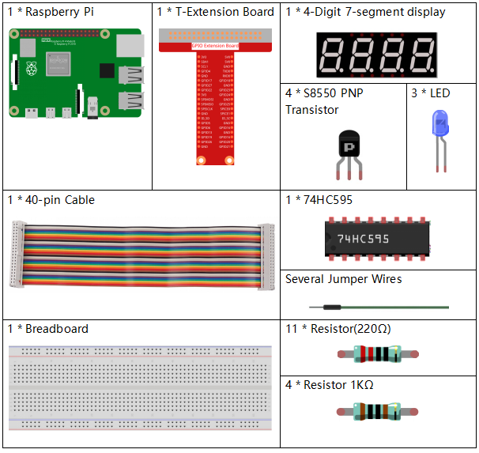
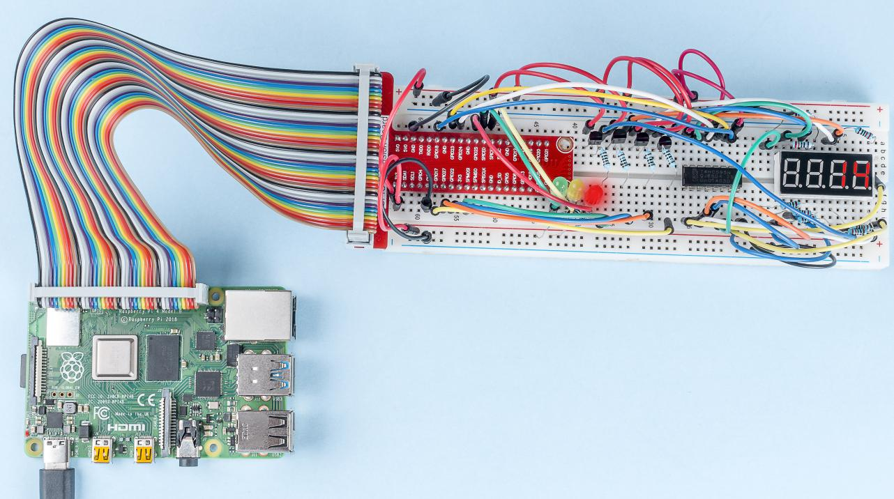

3.1.7 Traffic Light
~~~~~~~~~~~~~~~~~~~

Introduction
---------------

In this project, we will use LED lights of three colors to realize the
change of traffic lights and a four-digit 7-segment display will be used
to display the timing of each traffic state.

Components
------------

Schematic Diagram
--------------------

============ ======== ======== ===
T-Board Name physical wiringPi BCM
GPIO17       Pin 11   0        17
GPIO27       Pin 13   2        27
GPIO22       Pin 15   3        22
SPIMOSI      Pin 19   12       10
GPIO18       Pin 12   1        18
GPIO23       Pin 16   4        23
GPIO24       Pin 18   5        24
GPIO25       Pin 22   6        25
SPICE0       Pin 24   10       8
SPICE1       Pin 26   11       7
============ ======== ======== ===

.. image:: media/Schematic_three_one7.png
   :align: center

Experimental Procedures
------------------------

**Step 1:** Build the circuit.

.. image:: media/image254.png
   :alt: 3.1.7_TrafficLight_bb
   :width: 800

**For C Language Users**
^^^^^^^^^^^^^^^^^^^^^^^^^^

**Step 2:** Change directory.

.. raw:: html

   <run></run>

.. code-block:: 

    cd /home/pi/davinci-kit-for-raspberry-pi/c/3.1.7/

**Step 3:** Compile.

.. raw:: html

   <run></run>

.. code-block:: 

    gcc 3.1.7_TrafficLight.c -lwiringPi

**Step 4:** Run.

.. raw:: html

   <run></run>

.. code-block:: 

    sudo ./a.out

As the code runs, LEDs will simulate the color changing of traffic
lights. Firstly, the red LED lights up for 60s, then the green LED
lights up for 30s; next, the yellow LED lights up for 5s. After that,
the red LED lights up for 60s once again. In this way, this series of
actions will be executed repeatedly.

.. note::

    If it does not work after running, please refer to :ref:`C code is not working?`

**Code Explanation**

.. code-block:: c

    #define     SDI     5 
    #define     RCLK    4  
    #define     SRCLK    1   

    const int placePin[] = {12, 3, 2, 0};
    unsigned char number[] = {0xc0, 0xf9, 0xa4, 0xb0, 0x99, 0x92, 0x82, 0xf8, 0x80, 0x90};

    void pickDigit(int digit);
    void hc595_shift(int8_t data);
    void clearDisplay();
    void display();

These codes are used to realize the function of number display of 4-Digit 7-Segment 
Displays. Refer to :ref:`1.1.5 4-Digit 7-Segment Display` of the document for more details. Here, we use the 
codes to display countdown of traffic light time.

.. code-block:: c

    const int ledPin[]={6,10,11};  

    int colorState = 0;

    void lightup()
    {
        for(int i=0;i<3;i++){
            digitalWrite(ledPin[i],HIGH);
        }
        digitalWrite(ledPin[colorState],LOW);    
    }

The codes are used to switch the LED on and off.

.. code-block:: c

    int greenLight = 30;
    int yellowLight = 5;
    int redLight = 60;
    int colorState = 0;
    char *lightColor[]={"Red","Green","Yellow"};
    int counter = 60;

    void timer(int  timer1){       //Timer function
        if(timer1 == SIGALRM){   
            counter --;         
            alarm(1); 
            if(counter == 0){
                if(colorState == 0) counter = greenLight;
                if(colorState == 1) counter = yellowLight;
                if(colorState == 2) counter = redLight;
                colorState = (colorState+1)%3; 
            }
            printf("counter : %d \t light color: %s \n",counter,lightColor[colorState]);
        }
    }

The codes are used to switch the timer on and off. Refer to :ref:`1.1.5 4-Digit 7-Segment Display` for more details. Here, when the timer returns to zero, colorState
will be switched so as to switch LED, and the timer will be assigned to
a new value.

.. code-block:: c

    void loop()
    {
        while(1){
        display();
        lightup(); 
        }
    }

    int main(void)
    {
        //…
        signal(SIGALRM,timer);  
        alarm(1); 
        loop();
        return 0;
    }

The timer is started in the main() function. In loop() function, use
**while(1)** loop and call the functions of 4-Digit 7-Segment and LED.

**For Python Language Users**
^^^^^^^^^^^^^^^^^^^^^^^^^^^^^^^

**Step 2:** Change directory.

.. raw:: html

   <run></run>

.. code-block::

    cd /home/pi/davinci-kit-for-raspberry-pi/python/

**Step 3:** Run.

.. raw:: html

   <run></run>

.. code-block::

    sudo python3 3.1.7_TrafficLight.py

As the code runs, LEDs will simulate the color changing of traffic
lights. Firstly, the red LED lights up for 60s, then the green LED
lights up for 30s; next, the yellow LED lights up for 5s. After that,
the red LED lights up for 60s once again. In this way, this series of
actions will be executed repeatedly. Meanwhile, the 4-digit 7-segment
display displays the countdown time continuously.

**Code**

.. note::

    You can **Modify/Reset/Copy/Run/Stop** the code below. But before that, you need to go to  source code path like ``davinci-kit-for-raspberry-pi/python``. 
    
.. raw:: html

    <run></run>

.. code-block:: python

    import RPi.GPIO as GPIO
    import time
    import threading

    #define the pins connect to 74HC595
    SDI   = 24      #serial data input(DS)
    RCLK  = 23     #memory clock input(STCP)
    SRCLK = 18      #shift register clock input(SHCP)
    number = (0xc0,0xf9,0xa4,0xb0,0x99,0x92,0x82,0xf8,0x80,0x90)

    placePin = (10,22,27,17)
    ledPin =(25,8,7)

    greenLight = 30
    yellowLight = 5
    redLight = 60
    lightColor=("Red","Green","Yellow")

    colorState=0
    counter = 60
    timer1 = 0

    def setup():
        GPIO.setmode(GPIO.BCM)
        GPIO.setup(SDI, GPIO.OUT)
        GPIO.setup(RCLK, GPIO.OUT)
        GPIO.setup(SRCLK, GPIO.OUT)
        for pin in placePin:
            GPIO.setup(pin,GPIO.OUT)
        for pin in ledPin:
            GPIO.setup(pin,GPIO.OUT)
        global timer1
        timer1 = threading.Timer(1.0,timer)
        timer1.start()

    def clearDisplay():
        for i in range(8):
            GPIO.output(SDI, 1)
            GPIO.output(SRCLK, GPIO.HIGH)
            GPIO.output(SRCLK, GPIO.LOW)
        GPIO.output(RCLK, GPIO.HIGH)
        GPIO.output(RCLK, GPIO.LOW)

    def hc595_shift(data):
        for i in range(8):
            GPIO.output(SDI, 0x80 & (data << i))
            GPIO.output(SRCLK, GPIO.HIGH)
            GPIO.output(SRCLK, GPIO.LOW)
        GPIO.output(RCLK, GPIO.HIGH)
        GPIO.output(RCLK, GPIO.LOW)

    def pickDigit(digit):
        for i in placePin:
            GPIO.output(i,GPIO.LOW)
        GPIO.output(placePin[digit], GPIO.HIGH)

    def timer():        #timer function
        global counter
        global colorState
        global timer1
        timer1 = threading.Timer(1.0,timer)
        timer1.start()
        counter-=1
        if (counter is 0):
            if(colorState is 0):
                counter= greenLight
            if(colorState is 1):
                counter=yellowLight
            if (colorState is 2):
                counter=redLight
            colorState=(colorState+1)%3
        print ("counter : %d    color: %s "%(counter,lightColor[colorState]))

    def lightup():
        global colorState
        for i in range(0,3):
            GPIO.output(ledPin[i], GPIO.HIGH)
        GPIO.output(ledPin[colorState], GPIO.LOW)

    def display():
        global counter

        a = counter % 10000//1000 + counter % 1000//100
        b = counter % 10000//1000 + counter % 1000//100 + counter % 100//10
        c = counter % 10000//1000 + counter % 1000//100 + counter % 100//10 + counter % 10

        if (counter % 10000//1000 == 0):
            clearDisplay()
        else:
            clearDisplay()
            pickDigit(3)
            hc595_shift(number[counter % 10000//1000])

        if (a == 0):
            clearDisplay()
        else:
            clearDisplay()
            pickDigit(2)
            hc595_shift(number[counter % 1000//100])

        if (b == 0):
            clearDisplay()
        else:
            clearDisplay()
            pickDigit(1)
            hc595_shift(number[counter % 100//10])

        if(c == 0):
            clearDisplay()
        else:
            clearDisplay()
            pickDigit(0)
            hc595_shift(number[counter % 10])

    def loop():
        while True:
            display()
            lightup()

    def destroy():   # When "Ctrl+C" is pressed, the function is executed.
        global timer1
        GPIO.cleanup()
        timer1.cancel()      #cancel the timer

    if __name__ == '__main__': # Program starting from here
        setup()
        try:
            loop()
        except KeyboardInterrupt:
            destroy()

**Code Explanation**

.. code-block:: python

    SDI   = 24      #serial data input(DS)
    RCLK  = 23     #memory clock input(STCP)
    SRCLK = 18      #shift register clock input(SHCP)
    number = (0xc0,0xf9,0xa4,0xb0,0x99,0x92,0x82,0xf8,0x80,0x90)
    placePin = (10,22,27,17)   

    def clearDisplay():
    def hc595_shift(data): 
    def pickDigit(digit):
    def display():

These codes are used to realize the function of number display of
4-Digit 7-Segment. Refer to :ref:`1.1.5 4-Digit 7-Segment Display` of the document for more
details. Here, we use the codes to display countdown of traffic light
time.

.. code-block:: python

    ledPin =(25,8,7) 
    colorState=0
        
    def lightup():
        global colorState
        for i in range(0,3):
            GPIO.output(ledPin[i], GPIO.HIGH)
        GPIO.output(ledPin[colorState], GPIO.LOW)

The codes are used to switch the LED on and off.

.. code-block:: python

    greenLight = 30
    yellowLight = 5
    redLight = 60
    lightColor=("Red","Green","Yellow")

    colorState=0
    counter = 60      
    timer1 = 0         

    def timer():        #timer function
        global counter
        global colorState
        global timer1
        timer1 = threading.Timer(1.0,timer)  
        timer1.start()     
        counter-=1                          
        if (counter is 0):
            if(colorState is 0):
                counter= greenLight
            if(colorState is 1):
                counter=yellowLight
            if (colorState is 2):
                counter=redLight
            colorState=(colorState+1)%3
        print ("counter : %d    color: %s "%(counter,lightColor[colorState]))

The codes are used to switch the timer on and off. Refer to :ref:`1.1.5 4-Digit 7-Segment Display` for more details. Here, when the timer returns to zero, colorState
will be switched so as to switch LED, and the timer will be assigned to
a new value.

.. code-block:: python

    def setup():
        # ... 
        global timer1
        timer1 = threading.Timer(1.0,timer)   
        timer1.start()  

    def loop():
        while True:
            display()
            lightup()
            
    def destroy():   # When "Ctrl+C" is pressed, the function is executed. 
        global timer1
        GPIO.cleanup()      
        timer1.cancel()      #cancel the timer

    if __name__ == '__main__': # Program starting from here 
        setup() 
        try:
            loop()  
        except KeyboardInterrupt:  
            destroy()  

In setup() function, start the timer. In loop() function, a ``while
True`` is used: call the relative functions of 4-Digit 7-Segment and LED
circularly.

Phenomenon Picture
-------------------

