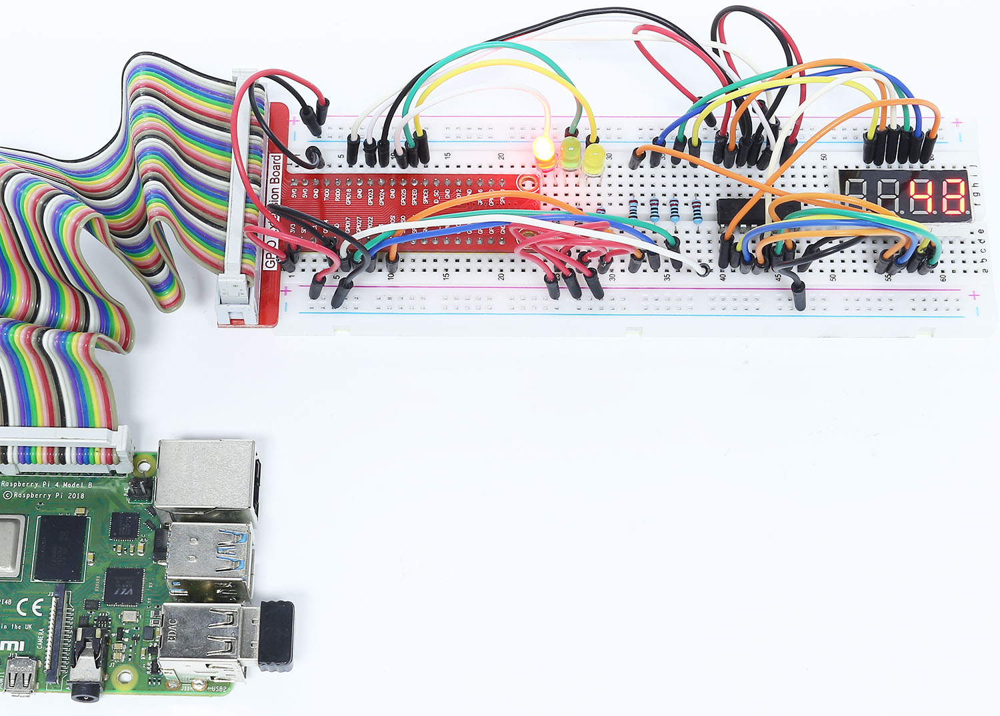

.. note:: 

    Ciao! Benvenuto nella Community di SunFounder per appassionati di Raspberry Pi, Arduino e ESP32 su Facebook! Approfondisci il mondo di Raspberry Pi, Arduino ed ESP32 insieme a tanti altri appassionati.

    **Perché unirsi?**

    - **Supporto da esperti**: Risolvi problemi post-vendita e sfide tecniche con l’aiuto della nostra community e del nostro team.
    - **Impara e condividi**: Scambia suggerimenti e tutorial per migliorare le tue competenze.
    - **Anteprime esclusive**: Ottieni accesso anticipato alle nuove comunicazioni sui prodotti e anteprime.
    - **Sconti speciali**: Approfitta di sconti esclusivi sui nostri prodotti più recenti.
    - **Promozioni e concorsi**: Partecipa a giveaway e promozioni festive.

    👉 Sei pronto a esplorare e creare con noi? Clicca su [|link_sf_facebook|] e unisciti oggi stesso!

3.1.7 Semaforo
=====================

Introduzione
---------------

In questo progetto utilizzeremo LED di tre colori per simulare il 
cambiamento dei segnali semaforici, e un display a sette segmenti 
a quattro cifre per visualizzare il conto alla rovescia per ciascuna 
fase del semaforo.

Componenti
------------

.. image:: img/list_Traffic_Light.png
    :align: center

Schema Elettrico
--------------------

============ ======== ======== ===
T-Board Name physical wiringPi BCM
GPIO17       Pin 11   0        17
GPIO27       Pin 13   2        27
GPIO22       Pin 15   3        22
SPIMOSI      Pin 19   12       10
GPIO18       Pin 12   1        18
GPIO23       Pin 16   4        23
GPIO24       Pin 18   5        24
GPIO25       Pin 22   6        25
SPICE0       Pin 24   10       8
SPICE1       Pin 26   11       7
============ ======== ======== ===

.. image:: img/Schematic_three_one7.png
   :align: center

Procedure Sperimentali
---------------------------

**Passo 1:** Costruisci il circuito.

.. image:: img/image254.png
   :width: 800

**Per gli Utenti C**
^^^^^^^^^^^^^^^^^^^^^^^^^^

**Passo 2:** Vai alla cartella del codice.

.. raw:: html

   <run></run>

.. code-block:: 

    cd ~/davinci-kit-for-raspberry-pi/c/3.1.7/

**Passo 3:** Compila.

.. raw:: html

   <run></run>

.. code-block:: 

    gcc 3.1.7_TrafficLight.c -lwiringPi

**Passo 4:** Esegui.

.. raw:: html

   <run></run>

.. code-block:: 

    sudo ./a.out

Quando il codice viene eseguito, i LED simuleranno il cambio di colore 
del semaforo. Prima si accende il LED rosso per 60 secondi, poi il verde 
per 30 secondi e infine il giallo per 5 secondi. Dopo questo, il LED rosso 
si riaccenderà per altri 60 secondi, ripetendo questa sequenza.

.. note::

    Se il programma non funziona dopo l’esecuzione o appare un messaggio di 
    errore: \"wiringPi.h: No such file or directory\", fai riferimento a :ref:`Il codice C non funziona?`.

**Spiegazione del Codice**

.. code-block:: c

    #define     SDI     5 
    #define     RCLK    4  
    #define     SRCLK    1   

    const int placePin[] = {12, 3, 2, 0};
    unsigned char number[] = {0xc0, 0xf9, 0xa4, 0xb0, 0x99, 0x92, 0x82, 0xf8, 0x80, 0x90};

    void pickDigit(int digit);
    void hc595_shift(int8_t data);
    void clearDisplay();
    void display();

Questi codici servono per realizzare la funzione di visualizzazione numerica 
sul display a sette segmenti a quattro cifre. Consulta :ref:`1.1.5 Display a 7 segmenti a 4 cifre` 
per maggiori dettagli. Qui utilizziamo il codice per visualizzare il conto alla rovescia del semaforo.

.. code-block:: c

    const int ledPin[]={6,10,11};  

    int colorState = 0;

    void lightup()
    {
        for(int i=0;i<3;i++){
            digitalWrite(ledPin[i],HIGH);
        }
        digitalWrite(ledPin[colorState],LOW);    
    }

Questi codici servono per accendere e spegnere i LED.

.. code-block:: c

    int greenLight = 30;
    int yellowLight = 5;
    int redLight = 60;
    int colorState = 0;
    char *lightColor[]={"Red","Green","Yellow"};
    int counter = 60;

    void timer(int  timer1){       //Funzione Timer
        if(timer1 == SIGALRM){   
            counter --;         
            alarm(1); 
            if(counter == 0){
                if(colorState == 0) counter = greenLight;
                if(colorState == 1) counter = yellowLight;
                if(colorState == 2) counter = redLight;
                colorState = (colorState+1)%3; 
            }
            printf("counter : %d \t light color: %s \n",counter,lightColor[colorState]);
        }
    }

Questi codici servono per attivare e disattivare il timer. Consulta 
:ref:`1.1.5 Display a 7 segmenti a 4 cifre` per maggiori dettagli. 
Qui, quando il timer raggiunge lo zero, colorState cambierà per far 
cambiare il colore del LED, e il timer verrà assegnato a un nuovo valore.

.. code-block:: c

    void loop()
    {
        while(1){
        display();
        lightup(); 
        }
    }

    int main(void)
    {
        //…
        signal(SIGALRM,timer);  
        alarm(1); 
        loop();
        return 0;
    }

Il timer viene avviato nella funzione main(). Nella funzione loop(), viene 
utilizzato un ciclo **while(1)** per chiamare le funzioni del display a 4 cifre e dei LED.
**Per gli utenti Python** 
^^^^^^^^^^^^^^^^^^^^^^^^^^^^^^^

**Passo 2:** Cambia la directory.

.. raw:: html

   <run></run>

.. code-block::

    cd ~/davinci-kit-for-raspberry-pi/python/

**Passo 3:** Esegui.

.. raw:: html

   <run></run>

.. code-block::

    sudo python3 3.1.7_TrafficLight.py

Quando il codice viene eseguito, i LED simuleranno la sequenza dei semafori: 
inizialmente si accende il LED rosso per 60 secondi, seguito dal verde per 30 
secondi, poi dal giallo per 5 secondi. Successivamente, il LED rosso si 
riaccenderà per altri 60 secondi, ripetendo questa sequenza. Nel frattempo, 
il display a 7 segmenti e 4 cifre visualizza continuamente il conto alla rovescia.

**Codice**

.. note::

    Puoi **Modificare/Reset/Copiare/Eseguire/Interrompere** il codice qui sotto. Prima di ciò, devi spostarti nella directory del codice come ``davinci-kit-for-raspberry-pi/python``. 
    
.. raw:: html

    <run></run>

.. code-block:: python

    import RPi.GPIO as GPIO
    import time
    import threading

    # Definizione dei pin collegati al 74HC595
    SDI   = 24      # input dati seriali (DS)
    RCLK  = 23     # input di clock di memoria (STCP)
    SRCLK = 18      # input di clock del registro a scorrimento (SHCP)
    number = (0xc0,0xf9,0xa4,0xb0,0x99,0x92,0x82,0xf8,0x80,0x90)

    placePin = (10,22,27,17)
    ledPin =(25,8,7)

    greenLight = 30
    yellowLight = 5
    redLight = 60
    lightColor=("Red","Green","Yellow")

    colorState=0
    counter = 60
    timer1 = 0

    def setup():
        GPIO.setmode(GPIO.BCM)
        GPIO.setup(SDI, GPIO.OUT)
        GPIO.setup(RCLK, GPIO.OUT)
        GPIO.setup(SRCLK, GPIO.OUT)
        for pin in placePin:
            GPIO.setup(pin,GPIO.OUT)
        for pin in ledPin:
            GPIO.setup(pin,GPIO.OUT)
        global timer1
        timer1 = threading.Timer(1.0,timer)
        timer1.start()

    def clearDisplay():
        for i in range(8):
            GPIO.output(SDI, 1)
            GPIO.output(SRCLK, GPIO.HIGH)
            GPIO.output(SRCLK, GPIO.LOW)
        GPIO.output(RCLK, GPIO.HIGH)
        GPIO.output(RCLK, GPIO.LOW)

    def hc595_shift(data):
        for i in range(8):
            GPIO.output(SDI, 0x80 & (data << i))
            GPIO.output(SRCLK, GPIO.HIGH)
            GPIO.output(SRCLK, GPIO.LOW)
        GPIO.output(RCLK, GPIO.HIGH)
        GPIO.output(RCLK, GPIO.LOW)

    def pickDigit(digit):
        for i in placePin:
            GPIO.output(i,GPIO.LOW)
        GPIO.output(placePin[digit], GPIO.HIGH)

    def timer():        # funzione timer
        global counter
        global colorState
        global timer1
        timer1 = threading.Timer(1.0,timer)
        timer1.start()
        counter-=1
        if (counter is 0):
            if(colorState is 0):
                counter= greenLight
            if(colorState is 1):
                counter=yellowLight
            if (colorState is 2):
                counter=redLight
            colorState=(colorState+1)%3
        print ("counter : %d    color: %s "%(counter,lightColor[colorState]))

    def lightup():
        global colorState
        for i in range(0,3):
            GPIO.output(ledPin[i], GPIO.HIGH)
        GPIO.output(ledPin[colorState], GPIO.LOW)

    def display():
        global counter

        a = counter % 10000//1000 + counter % 1000//100
        b = counter % 10000//1000 + counter % 1000//100 + counter % 100//10
        c = counter % 10000//1000 + counter % 1000//100 + counter % 100//10 + counter % 10

        if (counter % 10000//1000 == 0):
            clearDisplay()
        else:
            clearDisplay()
            pickDigit(3)
            hc595_shift(number[counter % 10000//1000])

        if (a == 0):
            clearDisplay()
        else:
            clearDisplay()
            pickDigit(2)
            hc595_shift(number[counter % 1000//100])

        if (b == 0):
            clearDisplay()
        else:
            clearDisplay()
            pickDigit(1)
            hc595_shift(number[counter % 100//10])

        if(c == 0):
            clearDisplay()
        else:
            clearDisplay()
            pickDigit(0)
            hc595_shift(number[counter % 10])

    def loop():
        while True:
            display()
            lightup()

    def destroy():   # Quando si preme "Ctrl+C", la funzione viene eseguita.
        global timer1
        GPIO.cleanup()
        timer1.cancel()      # annulla il timer

    if __name__ == '__main__': # Il programma parte da qui
        setup()
        try:
            loop()
        except KeyboardInterrupt:
            destroy()
**Spiegazione del Codice** 

.. code-block:: python

    SDI   = 24      # ingresso dati seriali (DS)
    RCLK  = 23      # ingresso clock di memoria (STCP)
    SRCLK = 18      # ingresso clock del registro a scorrimento (SHCP)
    number = (0xc0,0xf9,0xa4,0xb0,0x99,0x92,0x82,0xf8,0x80,0x90)
    placePin = (10,22,27,17)   

    def clearDisplay():
    def hc595_shift(data): 
    def pickDigit(digit):
    def display():

Questi codici sono usati per realizzare la visualizzazione dei numeri sul 
display a 7 segmenti a 4 cifre. Consulta :ref:`1.1.5 Display a 7 segmenti a 4 cifre` nel documento per maggiori dettagli. Qui, utilizziamo il codice per mostrare il conto alla rovescia del tempo del semaforo.

.. code-block:: python

    ledPin =(25,8,7) 
    colorState=0
        
    def lightup():
        global colorState
        for i in range(0,3):
            GPIO.output(ledPin[i], GPIO.HIGH)
        GPIO.output(ledPin[colorState], GPIO.LOW)

Questo codice è usato per accendere e spegnere i LED.

.. code-block:: python

    greenLight = 30
    yellowLight = 5
    redLight = 60
    lightColor=("Red","Green","Yellow")

    colorState=0
    counter = 60      
    timer1 = 0         

    def timer():        # funzione timer
        global counter
        global colorState
        global timer1
        timer1 = threading.Timer(1.0,timer)  
        timer1.start()     
        counter-=1                          
        if (counter is 0):
            if(colorState is 0):
                counter= greenLight
            if(colorState is 1):
                counter=yellowLight
            if (colorState is 2):
                counter=redLight
            colorState=(colorState+1)%3
        print ("counter : %d    color: %s "%(counter,lightColor[colorState]))

Questo codice attiva e disattiva il timer. Consulta :ref:`1.1.5 Display a 7 segmenti a 4 cifre` 
per maggiori dettagli. Qui, quando il timer raggiunge lo zero, il valore di colorState viene 
aggiornato per cambiare il LED, e il timer viene impostato con un nuovo valore.

.. code-block:: python

    def setup():
        # ... 
        global timer1
        timer1 = threading.Timer(1.0,timer)   
        timer1.start()  

    def loop():
        while True:
            display()
            lightup()
            
    def destroy():   # Quando si preme "Ctrl+C", viene eseguita la funzione.
        global timer1
        GPIO.cleanup()      
        timer1.cancel()      # annulla il timer

    if __name__ == '__main__': # Il programma parte da qui 
        setup() 
        try:
            loop()  
        except KeyboardInterrupt:  
            destroy()  

Nella funzione setup(), il timer viene avviato. Nella funzione loop(), 
viene usato un ciclo ``while True`` per chiamare ciclicamente le funzioni 
relative al display a 7 segmenti a 4 cifre e ai LED.

Immagine del Fenomeno
----------------------------

