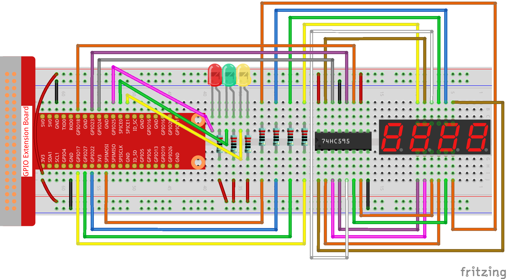

3.1.7 Ampel
~~~~~~~~~~~~~~~~~~~

Einführung
---------------

In diesem Projekt werden wir dreifarbige LED-Lichter verwenden, um den Wechsel der Ampeln zu realisieren, und eine vierstellige 7-Segment-Anzeige wird verwendet, um das Timing jedes Verkehrszustands anzuzeigen.

Komponenten
----------------

.. image:: media/list_Traffic_Light.png
    :align: center

Schematische Darstellung
-------------------------------

============ ======== ======== ===
T-Karte Name physisch wiringPi BCM
GPIO17       Pin 11   0        17
GPIO27       Pin 13   2        27
GPIO22       Pin 15   3        22
SPIMOSI      Pin 19   12       10
GPIO18       Pin 12   1        18
GPIO23       Pin 16   4        23
GPIO24       Pin 18   5        24
GPIO25       Pin 22   6        25
SPICE0       Pin 24   10       8
SPICE1       Pin 26   11       7
============ ======== ======== ===

.. image:: media/Schematic_three_one7.png
   :align: center

Experimentelle Verfahren
------------------------------------

Schritt 1: Bauen Sie die Schaltung auf.

Für Benutzer in C-Sprache
^^^^^^^^^^^^^^^^^^^^^^^^^^^^^^^^^^^

Schritt 2: Verzeichnis wechseln.

.. raw:: html

   <run></run>

.. code-block:: 

    cd /home/pi/davinci-kit-for-raspberry-pi/c/3.1.7/

Schritt 3: Kompilieren.

.. raw:: html

   <run></run>

.. code-block:: 

    gcc 3.1.7_TrafficLight.c -lwiringPi

Schritt 4: Ausführen.

.. raw:: html

   <run></run>

.. code-block:: 

    sudo ./a.out

Während die Kode ausgeführt wird, simulieren LEDs den Farbwechsel von Ampeln. 
Zuerst leuchtet die rote LED 60 Sekunden lang, dann leuchtet die grüne LED 30 Sekunden lang. 
Als nächstes leuchtet die gelbe LED 5 Sekunden lang auf. Danach leuchtet die rote LED erneut für 60s. 
Auf diese Weise wird diese Reihe von Aktionen wiederholt ausgeführt.

**Code Erklärung**

.. code-block:: c

    #define     SDI     5 
    #define     RCLK    4  
    #define     SRCLK    1   

    const int placePin[] = {12, 3, 2, 0};
    unsigned char number[] = {0xc0, 0xf9, 0xa4, 0xb0, 0x99, 0x92, 0x82, 0xf8, 0x80, 0x90};

    void pickDigit(int digit);
    void hc595_shift(int8_t data);
    void clearDisplay();
    void display();

Diese Codes werden verwendet, um die Funktion der Zahlenanzeige von 4-stelligen 7-Segment-Anzeigen zu realisieren. Siehe :ref:`py_4_sig` des Dokuments für weitere Details. Hier verwenden wir die Codes, um den Countdown der Ampelzeit anzuzeigen.

.. code-block:: c

    const int ledPin[]={6,10,11};  

    int colorState = 0;

    void lightup()
    {
        for(int i=0;i<3;i++){
            digitalWrite(ledPin[i],HIGH);
        }
        digitalWrite(ledPin[colorState],LOW);    
    }

Die Kode dienen zum Ein- und Ausschalten der LED.

.. code-block:: c

    int greenLight = 30;
    int yellowLight = 5;
    int redLight = 60;
    int colorState = 0;
    char *lightColor[]={"Red","Green","Yellow"};
    int counter = 60;

    void timer(int  timer1){       //Timer function
        if(timer1 == SIGALRM){   
            counter --;         
            alarm(1); 
            if(counter == 0){
                if(colorState == 0) counter = greenLight;
                if(colorState == 1) counter = yellowLight;
                if(colorState == 2) counter = redLight;
                colorState = (colorState+1)%3; 
            }
            printf("counter : %d \t light color: %s \n",counter,lightColor[colorState]);
        }
    }

Die Codes dienen zum Ein- und Ausschalten des Timers. Weitere Informationen finden Sie unter :ref:`py_4_sig` . Wenn der Timer hier auf Null zurückkehrt, wird colorState auf LED umgeschaltet und dem Timer wird ein neuer Wert zugewiesen.

.. code-block:: c

    void loop()
    {
        while(1){
        display();
        lightup(); 
        }
    }

    int main(void)
    {
        //…
        signal(SIGALRM,timer);  
        alarm(1); 
        loop();
        return 0;
    }

Der Timer wird in der Funktion ``main()`` gestartet. 
Verwenden Sie in der Funktion ``loop()`` die Schleife ``while(1)`` und rufen Sie die Funktionen von 4-stelligem 7-Segment und LED auf.

Für Python-Sprachbenutzer
^^^^^^^^^^^^^^^^^^^^^^^^^^^^^^^

Schritt 2: Verzeichnis wechseln.

.. raw:: html

   <run></run>

.. code-block::

    cd /home/pi/davinci-kit-for-raspberry-pi/python/

Schritt 3: Ausführen.

.. raw:: html

   <run></run>

.. code-block::

    sudo python3 3.1.7_TrafficLight.py

Während die Kode ausgeführt wird, simulieren LEDs den Farbwechsel von Ampeln. 
Zuerst leuchtet die rote LED 60 Sekunden lang, dann leuchtet die grüne LED 30 Sekunden lang. 
Als nächstes leuchtet die gelbe LED 5 Sekunden lang auf. Danach leuchtet die rote LED erneut für 60s. 
Auf diese Weise wird diese Reihe von Aktionen wiederholt ausgeführt. 
Währenddessen zeigt die 4-stellige 7-Segment-Anzeige kontinuierlich die Countdown-Zeit an.

**Code**

.. note::

    Sie können den folgenden Code **Ändern/Zurücksetzen/Kopieren/Ausführen/Stoppen** . Zuvor müssen Sie jedoch zu einem Quellcodepfad wie ``davinci-kit-for-raspberry-pi/python`` gehen.
    

.. raw:: html

    <run></run>

.. code-block:: python

    import RPi.GPIO as GPIO
    import time
    import threading

    #define the pins connect to 74HC595
    SDI   = 24      #serial data input(DS)
    RCLK  = 23     #memory clock input(STCP)
    SRCLK = 18      #shift register clock input(SHCP)
    number = (0xc0,0xf9,0xa4,0xb0,0x99,0x92,0x82,0xf8,0x80,0x90)

    placePin = (10,22,27,17)
    ledPin =(25,8,7)

    greenLight = 30
    yellowLight = 5
    redLight = 60
    lightColor=("Red","Green","Yellow")

    colorState=0
    counter = 60
    timer1 = 0

    def setup():
        GPIO.setmode(GPIO.BCM)
        GPIO.setup(SDI, GPIO.OUT)
        GPIO.setup(RCLK, GPIO.OUT)
        GPIO.setup(SRCLK, GPIO.OUT)
        for pin in placePin:
            GPIO.setup(pin,GPIO.OUT)
        for pin in ledPin:
            GPIO.setup(pin,GPIO.OUT)
        global timer1
        timer1 = threading.Timer(1.0,timer)
        timer1.start()

    def clearDisplay():
        for i in range(8):
            GPIO.output(SDI, 1)
            GPIO.output(SRCLK, GPIO.HIGH)
            GPIO.output(SRCLK, GPIO.LOW)
        GPIO.output(RCLK, GPIO.HIGH)
        GPIO.output(RCLK, GPIO.LOW)

    def hc595_shift(data):
        for i in range(8):
            GPIO.output(SDI, 0x80 & (data << i))
            GPIO.output(SRCLK, GPIO.HIGH)
            GPIO.output(SRCLK, GPIO.LOW)
        GPIO.output(RCLK, GPIO.HIGH)
        GPIO.output(RCLK, GPIO.LOW)

    def pickDigit(digit):
        for i in placePin:
            GPIO.output(i,GPIO.LOW)
        GPIO.output(placePin[digit], GPIO.HIGH)

    def timer():        #timer function
        global counter
        global colorState
        global timer1
        timer1 = threading.Timer(1.0,timer)
        timer1.start()
        counter-=1
        if (counter is 0):
            if(colorState is 0):
                counter= greenLight
            if(colorState is 1):
                counter=yellowLight
            if (colorState is 2):
                counter=redLight
            colorState=(colorState+1)%3
        print ("counter : %d    color: %s "%(counter,lightColor[colorState]))

    def lightup():
        global colorState
        for i in range(0,3):
            GPIO.output(ledPin[i], GPIO.HIGH)
        GPIO.output(ledPin[colorState], GPIO.LOW)

    def display():
        global counter

        a = counter % 10000//1000 + counter % 1000//100
        b = counter % 10000//1000 + counter % 1000//100 + counter % 100//10
        c = counter % 10000//1000 + counter % 1000//100 + counter % 100//10 + counter % 10

        if (counter % 10000//1000 == 0):
            clearDisplay()
        else:
            clearDisplay()
            pickDigit(3)
            hc595_shift(number[counter % 10000//1000])

        if (a == 0):
            clearDisplay()
        else:
            clearDisplay()
            pickDigit(2)
            hc595_shift(number[counter % 1000//100])

        if (b == 0):
            clearDisplay()
        else:
            clearDisplay()
            pickDigit(1)
            hc595_shift(number[counter % 100//10])

        if(c == 0):
            clearDisplay()
        else:
            clearDisplay()
            pickDigit(0)
            hc595_shift(number[counter % 10])

    def loop():
        while True:
            display()
            lightup()

    def destroy():   # When "Ctrl+C" is pressed, the function is executed.
        global timer1
        GPIO.cleanup()
        timer1.cancel()      #cancel the timer

    if __name__ == '__main__': # Program starting from here
        setup()
        try:
            loop()
        except KeyboardInterrupt:
            destroy()

**Code Erklärung**

.. code-block:: python

    SDI   = 24      #serial data input(DS)
    RCLK  = 23     #memory clock input(STCP)
    SRCLK = 18      #shift register clock input(SHCP)
    number = (0xc0,0xf9,0xa4,0xb0,0x99,0x92,0x82,0xf8,0x80,0x90)
    placePin = (10,22,27,17)   

    def clearDisplay():
    def hc595_shift(data): 
    def pickDigit(digit):
    def display():

Diese Codes werden verwendet, um die Funktion der Zahlenanzeige des 4-stelligen 7-Segments zu realisieren. Siehe :ref:`py_4_sig` des Dokuments für weitere Details. Hier verwenden wir die Codes, um den Countdown der Ampelzeit anzuzeigen.

.. code-block:: python

    ledPin =(25,8,7) 
    colorState=0
        
    def lightup():
        global colorState
        for i in range(0,3):
            GPIO.output(ledPin[i], GPIO.HIGH)
        GPIO.output(ledPin[colorState], GPIO.LOW)

Die Kode dienen zum Ein- und Ausschalten der LED.

.. code-block:: python

    greenLight = 30
    yellowLight = 5
    redLight = 60
    lightColor=("Red","Green","Yellow")

    colorState=0
    counter = 60      
    timer1 = 0         

    def timer():        #timer function
        global counter
        global colorState
        global timer1
        timer1 = threading.Timer(1.0,timer)  
        timer1.start()     
        counter-=1                          
        if (counter is 0):
            if(colorState is 0):
                counter= greenLight
            if(colorState is 1):
                counter=yellowLight
            if (colorState is 2):
                counter=redLight
            colorState=(colorState+1)%3
        print ("counter : %d    color: %s "%(counter,lightColor[colorState]))

Die Codes dienen zum Ein- und Ausschalten des Timers. Weitere Informationen finden Sie unter :ref:`py_4_sig` . Wenn der Timer hier auf Null zurückkehrt, wird colorState auf LED umgeschaltet und dem Timer wird ein neuer Wert zugewiesen.

.. code-block:: python

    def setup():
        # ... 
        global timer1
        timer1 = threading.Timer(1.0,timer)   
        timer1.start()  

    def loop():
        while True:
            display()
            lightup()
            
    def destroy():   # When "Ctrl+C" is pressed, the function is executed. 
        global timer1
        GPIO.cleanup()      
        timer1.cancel()      #cancel the timer

    if __name__ == '__main__': # Program starting from here 
        setup() 
        try:
            loop()  
        except KeyboardInterrupt:  
            destroy()  

Starten Sie in der Funktion ``setup()`` den Timer. In der Funktion ``loop()`` wird eine ``While True`` verwendet: Rufen Sie die relativen Funktionen von 4-stelligem 7-Segment und LED kreisförmig auf.

Phänomen Bild
-------------------

.. image:: media/IMG_8319.jpg
    :width: 800
    :align: center