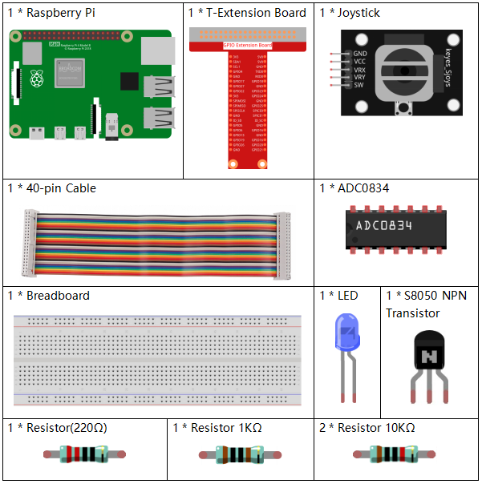
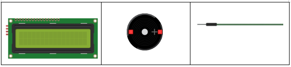
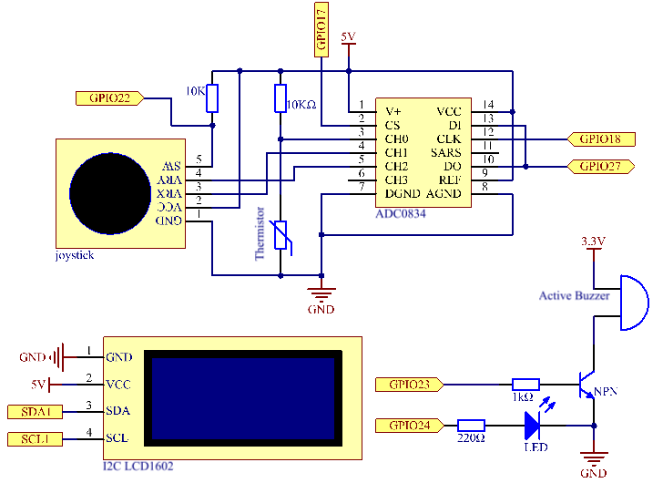
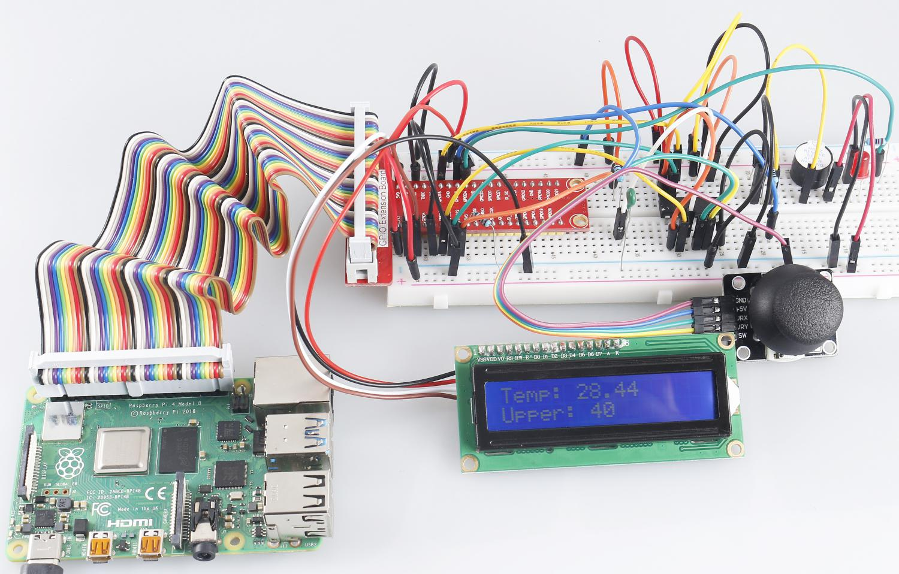

.. note::

    Hallo und willkommen in der SunFounder Raspberry Pi & Arduino & ESP32 Enthusiasten-Gemeinschaft auf Facebook! Tauchen Sie tiefer ein in die Welt von Raspberry Pi, Arduino und ESP32 mit anderen Enthusiasten.

    **Warum beitreten?**

    - **Expertenunterstützung**: Lösen Sie Nachverkaufsprobleme und technische Herausforderungen mit Hilfe unserer Gemeinschaft und unseres Teams.
    - **Lernen & Teilen**: Tauschen Sie Tipps und Anleitungen aus, um Ihre Fähigkeiten zu verbessern.
    - **Exklusive Vorschauen**: Erhalten Sie frühzeitigen Zugang zu neuen Produktankündigungen und exklusiven Einblicken.
    - **Spezialrabatte**: Genießen Sie exklusive Rabatte auf unsere neuesten Produkte.
    - **Festliche Aktionen und Gewinnspiele**: Nehmen Sie an Gewinnspielen und Feiertagsaktionen teil.

    👉 Sind Sie bereit, mit uns zu erkunden und zu erschaffen? Klicken Sie auf [|link_sf_facebook|] und treten Sie heute bei!

3.1.8 Überhitzungsmonitor
===========================

Einführung
-------------------

Möglicherweise möchten Sie ein Überhitzungsüberwachungsgerät herstellen, das für verschiedene Situationen gilt, z. B. im Werk, wenn wir einen Alarm und das rechtzeitige automatische Ausschalten der Maschine bei Überhitzung des Stromkreises wünschen. In dieser Lektion verwenden wir Thermistor, Joystick, Summer, LED und LCD, um ein intelligentes Temperaturüberwachungsgerät zu erstellen, dessen Schwelle einstellbar ist.

Komponenten
-----------------

Schematische Darstellung
--------------------------

============ ======== ======== ===
T-Karte Name physisch wiringPi BCM
GPIO17       Pin 11   0        17
GPIO18       Pin 12   1        18
GPIO27       Pin 13   2        27
GPIO22       Pin15    3        22
GPIO23       Pin16    4        23
GPIO24       Pin18    5        24
SDA1         Pin 3             
SCL1         Pin 5             
============ ======== ======== ===

Experimentelle Verfahren
-----------------------------

Schritt 1: Bauen Sie die Schaltung auf.

.. image:: media/image258.png
   :alt: Overheat Monitor_bb
   :width: 800

Für Benutzer in C-Sprache
^^^^^^^^^^^^^^^^^^^^^^^^^^

Schritt 2: Gehen Sie zum Ordner der Kode.

.. raw:: html

   <run></run>

.. code-block:: 

    cd /home/pi/davinci-kit-for-raspberry-pi/c/3.1.8/

Schritt 3: Kompilieren Sie der Kode.

.. raw:: html

   <run></run>

.. code-block:: 

    gcc 3.1.8_OverheatMonitor.c -lwiringPi -lm

Schritt 4: Führen Sie die ausführbare Datei aus.

.. raw:: html

   <run></run>

.. code-block:: 

    sudo ./a.out

Während die Kode ausgeführt wird, 
werden die aktuelle Temperatur und der Hochtemperaturschwellenwert 40 auf dem I2C LCD1602 angezeigt. 
Wenn die aktuelle Temperatur größer als der Schwellenwert ist, 
werden der Summer und die LED gestartet, um Sie zu alarmieren.

Der Joystick dient zum Drücken, um die Hochtemperaturschwelle anzupassen. Durch Umschalten des Joystick in Richtung X-Achse und Y-Achse kann der aktuelle Hochtemperaturschwellenwert angepasst (nach oben oder unten gedreht) werden. Drücken Sie den Joystick erneut, um den Schwellenwert auf den Anfangswert zurückzusetzen.

**Code Erklärung**

.. code-block:: c

    int get_joystick_value(){
        uchar x_val;
        uchar y_val;
        x_val = get_ADC_Result(1);
        y_val = get_ADC_Result(2);
        if (x_val > 200){
            return 1;
        }
        else if(x_val < 50){
            return -1;
        }
        else if(y_val > 200){
            return -10;
        }
        else if(y_val < 50){
            return 10;
        }
        else{
            return 0;
        }
    }

Diese Funktion liest die Werte von X und Y. 
Wenn X> 200 ist, wird „1“ zurückgegeben. X<50, return „-1“; y> 200, 
geben Sie „-10“ zurück, und y<50, geben Sie „10“ zurück.

.. code-block:: c

    void upper_tem_setting(){
        write(0, 0, "Upper Adjust:");
        int change = get_joystick_value();
        upperTem = upperTem + change;
        char str[6];
        snprintf(str,3,"%d",upperTem);
    write(0,1,str);
    int len;
      len = strlen(str);
      write(len,1,"             ");
        delay(100);
    }

This function is for adjusting the threshold and displaying it on the I2C LCD1602.

.. code-block:: c

    double temperature(){
        unsigned char temp_value;
        double Vr, Rt, temp, cel, Fah;
        temp_value = get_ADC_Result(0);
        Vr = 5 * (double)(temp_value) / 255;
        Rt = 10000 * (double)(Vr) / (5 - (double)(Vr));
        temp = 1 / (((log(Rt/10000)) / 3950)+(1 / (273.15 + 25)));
        cel = temp - 273.15;
        Fah = cel * 1.8 +32;
        return cel;
    }

Lesen Sie den Analogwert des CH0 (Thermistor) von ADC0834 ab und wandeln Sie ihn dann in einen Temperaturwert um.

.. code-block:: c

    void monitoring_temp(){
        char str[6];
        double cel = temperature();
        snprintf(str,6,"%.2f",cel);
        write(0, 0, "Temp: ");
        write(6, 0, str);
        snprintf(str,3,"%d",upperTem);
        write(0, 1, "Upper: ");
        write(7, 1, str);
        delay(100);
        if(cel >= upperTem){
            digitalWrite(buzzPin, HIGH);
            digitalWrite(LedPin, HIGH);
        }
        else if(cel < upperTem){
            digitalWrite(buzzPin, LOW);
            digitalWrite(LedPin, LOW);
        }
    }

Während die Kode ausgeführt wird, werden die aktuelle Temperatur und der Hochtemperaturschwellenwert 40 auf dem I2C LCD1602 angezeigt. Wenn die aktuelle Temperatur größer als der Schwellenwert ist, 
werden der Summer und die LED gestartet, um Sie zu alarmieren.

.. code-block:: c

    int main(void)
    {
        setup();
        int lastState =1;
        int stage=0;
        while (1)
        {
            int currentState = digitalRead(Joy_BtnPin);
            if(currentState==1 && lastState == 0){
                stage=(stage+1)%2;
                delay(100);
                lcd_clear();
            }
            lastState=currentState;
            if (stage==1){
                upper_tem_setting();
            }
            else{
                monitoring_temp();
            }
        }
        return 0;
    }

Die Funktion ``main()`` enthält den gesamten Programmablauf wie folgt:

1. Wenn das Programm startet, ist der Anfangswert der Stufe 0, und die aktuelle Temperatur und der Hochtemperaturschwellenwert 40 werden auf dem I2C LCD1602 angezeigt. Wenn die aktuelle Temperatur größer als der Schwellenwert ist, werden der Summer und die LED gestartet, um Sie zu alarmieren.

#. Drücken Sie den Joystick, und die Stufe ist 1, und Sie können die Hochtemperaturschwelle einstellen. Durch Umschalten des Joysticks in Richtung X-Achse und Y-Achse kann der aktuelle Schwellenwert angepasst (nach oben oder unten gedreht) werden. Drücken Sie den Joystick erneut, um den Schwellenwert auf den Anfangswert zurückzusetzen.

Für Python-Sprachbenutzer
^^^^^^^^^^^^^^^^^^^^^^^^^^^^^^

Schritt 2: Gehen Sie zum Ordner der Kode.

.. raw:: html

   <run></run>

.. code-block:: 

    cd /home/pi/davinci-kit-for-raspberry-pi/python/

Schritt 3: Führen Sie die ausführbare Datei aus.

.. raw:: html

   <run></run>

.. code-block:: 

    sudo python3 3.1.8_OverheatMonitor.py

Während die Kode ausgeführt wird, werden die aktuelle Temperatur und der Hochtemperaturschwellenwert 40 auf dem I2C LCD1602 angezeigt. Wenn die aktuelle Temperatur größer als der Schwellenwert ist, werden der Summer und die LED gestartet, um Sie zu alarmieren.

Der Joystick dient zum Drücken, um die Hochtemperaturschwelle anzupassen. Durch Umschalten des Joystick in Richtung X-Achse und Y-Achse kann der aktuelle Hochtemperaturschwellenwert angepasst (nach oben oder unten gedreht) werden. Drücken Sie den Joystick erneut, um den Schwellenwert auf den Anfangswert zurückzusetzen.

**Code**

.. note::

    Sie können den folgenden Code **Ändern/Zurücksetzen/Kopieren/Ausführen/Stoppen** . Zuvor müssen Sie jedoch zu einem Quellcodepfad wie ``davinci-kit-for-raspberry-pi/python`` gehen.
   
.. raw:: html

    <run></run>

.. code-block:: python

    import LCD1602
    import RPi.GPIO as GPIO
    import ADC0834
    import time
    import math

    Joy_BtnPin = 22
    buzzPin = 23
    ledPin = 24

    upperTem = 40

    def setup():
        ADC0834.setup()
        GPIO.setmode(GPIO.BCM)
        GPIO.setup(ledPin, GPIO.OUT, initial=GPIO.LOW)
        GPIO.setup(buzzPin, GPIO.OUT, initial=GPIO.LOW)
        GPIO.setup(Joy_BtnPin, GPIO.IN, pull_up_down=GPIO.PUD_UP)
        LCD1602.init(0x27, 1)

    def get_joystick_value():
        x_val = ADC0834.getResult(1)
        y_val = ADC0834.getResult(2)
        if(x_val > 200):
            return 1
        elif(x_val < 50):
            return -1
        elif(y_val > 200):
            return -10
        elif(y_val < 50):
            return 10
        else:
            return 0

    def upper_tem_setting():
        global upperTem
        LCD1602.write(0, 0, 'Upper Adjust: ')
        change = int(get_joystick_value())
        upperTem = upperTem + change
        strUpperTem = str(upperTem)
        LCD1602.write(0, 1, strUpperTem)
        LCD1602.write(len(strUpperTem),1, '              ')
        time.sleep(0.1)

    def temperature():
        analogVal = ADC0834.getResult()
        Vr = 5 * float(analogVal) / 255
        Rt = 10000 * Vr / (5 - Vr)
        temp = 1/(((math.log(Rt / 10000)) / 3950) + (1 / (273.15+25)))
        Cel = temp - 273.15
        Fah = Cel * 1.8 + 32
        return round(Cel,2)

    def monitoring_temp():
        global upperTem
        Cel=temperature()
        LCD1602.write(0, 0, 'Temp: ')
        LCD1602.write(0, 1, 'Upper: ')
        LCD1602.write(6, 0, str(Cel))
        LCD1602.write(7, 1, str(upperTem))
        time.sleep(0.1)
        if Cel >= upperTem:
            GPIO.output(buzzPin, GPIO.HIGH)
            GPIO.output(ledPin, GPIO.HIGH)
        else:
            GPIO.output(buzzPin, GPIO.LOW)
            GPIO.output(ledPin, GPIO.LOW)       

    def loop():
        lastState=1
        stage=0
        while True:
            currentState=GPIO.input(Joy_BtnPin)
            if currentState==1 and lastState ==0:
                stage=(stage+1)%2
                time.sleep(0.1)    
                LCD1602.clear()
            lastState=currentState
            if stage == 1:
                upper_tem_setting()
            else:
                monitoring_temp()
        
    def destroy():
        LCD1602.clear() 
        ADC0834.destroy()
        GPIO.cleanup()

    if __name__ == '__main__':     # Program start from here
        try:
            setup()
            while True:
                loop()
        except KeyboardInterrupt:   # When 'Ctrl+C' is pressed, the program destroy() will be executed.
            destroy()

**Code Erklärung**

.. code-block:: python

    def get_joystick_value():
        x_val = ADC0834.getResult(1)
        y_val = ADC0834.getResult(2)
        if(x_val > 200):
            return 1
        elif(x_val < 50):
            return -1
        elif(y_val > 200):
            return -10
        elif(y_val < 50):
            return 10
        else:
            return 0

Diese Funktion liest die Werte von X und Y. Wenn X> 200 ist, wird „1“ zurückgegeben. 
X<50, return „-1“; y> 200, geben Sie „-10“ zurück, und y<50, geben Sie „10“ zurück.

.. code-block:: python

    def upper_tem_setting():
        global upperTem
        LCD1602.write(0, 0, 'Upper Adjust: ')
        change = int(get_joystick_value())
        upperTem = upperTem + change
    LCD1602.write(0, 1, str(upperTem))
    LCD1602.write(len(strUpperTem),1, '              ')
        time.sleep(0.1)

Diese Funktion dient zum Anpassen des Schwellenwerts und zum Anzeigen auf dem I2C LCD1602.

.. code-block:: python

    def temperature():
        analogVal = ADC0834.getResult()
        Vr = 5 * float(analogVal) / 255
        Rt = 10000 * Vr / (5 - Vr)
        temp = 1/(((math.log(Rt / 10000)) / 3950) + (1 / (273.15+25)))
        Cel = temp - 273.15
        Fah = Cel * 1.8 + 32
        return round(Cel,2)

Lesen Sie den Analogwert des CH0 (Thermistor) von ADC0834 ab und wandeln Sie ihn dann in einen Temperaturwert um.

.. code-block:: python

    def monitoring_temp():
        global upperTem
        Cel=temperature()
        LCD1602.write(0, 0, 'Temp: ')
        LCD1602.write(0, 1, 'Upper: ')
        LCD1602.write(6, 0, str(Cel))
        LCD1602.write(7, 1, str(upperTem))
        time.sleep(0.1)
        if Cel >= upperTem:
            GPIO.output(buzzPin, GPIO.HIGH)
            GPIO.output(ledPin, GPIO.HIGH)
        else:
            GPIO.output(buzzPin, GPIO.LOW)
            GPIO.output(ledPin, GPIO.LOW)

Während die Kode ausgeführt wird, 
werden die aktuelle Temperatur und der Hochtemperaturschwellenwert 40 auf dem I2C LCD1602 angezeigt. 
Wenn die aktuelle Temperatur größer als der Schwellenwert ist, 
werden der Summer und die LED gestartet, um Sie zu alarmieren.

.. code-block:: python

    def loop():
        lastState=1
        stage=0
        while True:
            currentState=GPIO.input(Joy_BtnPin)
            if currentState==1 and lastState ==0:
                stage=(stage+1)%2
                time.sleep(0.1)    
                LCD1602.clear()
            lastState=currentState
            if stage == 1:
                upper_tem_setting()
            else:
                monitoring_temp()

Die Funktion ``main()`` enthält den gesamten Programmablauf wie folgt:

1. Wenn das Programm startet, ist der Anfangswert der Stufe 0, und die aktuelle Temperatur und der Hochtemperaturschwellenwert 40 werden auf dem I2C LCD1602 angezeigt. Wenn die aktuelle Temperatur größer als der Schwellenwert ist, werden der Summer und die LED gestartet, um Sie zu alarmieren.

#. Drücken Sie den Joystick, und die Stufe ist 1, und Sie können die Hochtemperaturschwelle einstellen. Durch Umschalten des Joysticks in Richtung X-Achse und Y-Achse kann der aktuelle Hochtemperaturschwellenwert angepasst (nach oben oder unten gedreht) werden. Drücken Sie den Joystick erneut, um den Schwellenwert auf den Anfangswert zurückzusetzen.

Phänomen Bild
-------------------------

