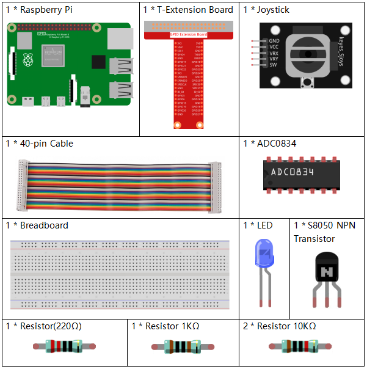
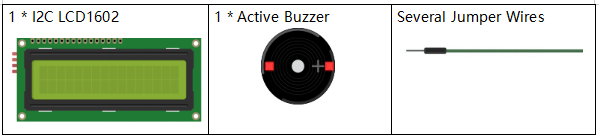
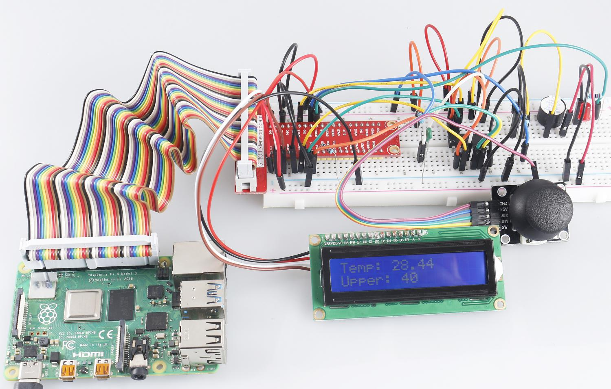

.. note::

    Bonjour et bienvenue dans la communauté SunFounder pour les passionnés de Raspberry Pi, Arduino et ESP32 sur Facebook ! Plongez dans l'univers de Raspberry Pi, Arduino et ESP32 avec d'autres passionnés.

    **Pourquoi rejoindre ?**

    - **Support d'experts** : Résolvez vos problèmes après-vente et vos défis techniques grâce à l'aide de notre communauté et de notre équipe.
    - **Apprendre & Partager** : Échangez des astuces et des tutoriels pour perfectionner vos compétences.
    - **Aperçus exclusifs** : Accédez en avant-première aux annonces de nouveaux produits et aux aperçus exclusifs.
    - **Réductions spéciales** : Profitez de réductions exclusives sur nos nouveaux produits.
    - **Promotions festives et concours** : Participez à des concours et à des promotions spéciales pendant les fêtes.

    👉 Prêt à explorer et créer avec nous ? Cliquez sur [|link_sf_facebook|] et rejoignez-nous dès aujourd'hui !

3.1.8 Moniteur de surchauffe
===============================

Introduction
-------------

Vous pourriez vouloir créer un dispositif de surveillance de surchauffe pour diverses 
situations, par exemple, dans une usine, si vous souhaitez qu'une alarme se déclenche 
et que la machine s'arrête automatiquement en cas de surchauffe du circuit. Dans cette 
leçon, nous utiliserons une thermistance, un joystick, un buzzer, une LED et un écran 
LCD pour créer un dispositif intelligent de surveillance de la température dont le seuil 
est ajustable.

Composants
----------

Schéma de câblage
--------------------

============ ======== ======== ===
T-Board Name physical wiringPi BCM
GPIO17       Pin 11   0        17
GPIO18       Pin 12   1        18
GPIO27       Pin 13   2        27
GPIO22       Pin15    3        22
GPIO23       Pin16    4        23
GPIO24       Pin18    5        24
SDA1         Pin 3             
SCL1         Pin 5             
============ ======== ======== ===

.. image:: img/Schematic_three_one8.png
   :width: 700
   :align: center

Procédures expérimentales
-----------------------------

**Étape 1 :** Montez le circuit.

.. image:: img/image258.png
   :alt: Overheat Monitor_bb
   :width: 800

**Pour les utilisateurs du langage C**
^^^^^^^^^^^^^^^^^^^^^^^^^^^^^^^^^^^^^^^^^^^^^

**Étape 2 :** Accédez au dossier du code.

.. raw:: html

   <run></run>

.. code-block:: 

    cd ~/davinci-kit-for-raspberry-pi/c/3.1.8/

**Étape 3 :** Compilez le code.

.. raw:: html

   <run></run>

.. code-block:: 

    gcc 3.1.8_OverheatMonitor.c -lwiringPi -lm

**Étape 4 :** Exécutez le fichier exécutable.

.. raw:: html

   <run></run>

.. code-block:: 

    sudo ./a.out

Lorsque le code s'exécute, la température actuelle et le seuil de haute température
 **40** s'affichent sur l'écran **I2C LCD1602**. Si la température actuelle dépasse 
 ce seuil, le buzzer et la LED se déclenchent pour vous alerter.

.. note::

    Si cela ne fonctionne pas après l'exécution ou si un message d'erreur apparaît : \"wiringPi.h: Aucun fichier ou dossier de ce type », veuillez vous référer à :ref:`C code is not working?`.

**Le joystick** vous permet d'ajuster le seuil de haute température. En déplaçant le 
**joystick** sur l'axe X et Y, vous pouvez ajuster (augmenter ou diminuer) le seuil 
de température. Appuyez à nouveau sur le **joystick** pour réinitialiser le seuil à 
sa valeur initiale.

**Explication du code**

.. code-block:: c

    int get_joystick_value(){
        uchar x_val;
        uchar y_val;
        x_val = get_ADC_Result(1);
        y_val = get_ADC_Result(2);
        if (x_val > 200){
            return 1;
        }
        else if(x_val < 50){
            return -1;
        }
        else if(y_val > 200){
            return -10;
        }
        else if(y_val < 50){
            return 10;
        }
        else{
            return 0;
        }
    }

Cette fonction lit les valeurs de X et Y. Si **X>200**, elle renvoie "**1**"; **X<50**, 
renvoie "**-1**"; **y>200**, renvoie "**-10**"; et **y<50**, renvoie "**10**".

.. code-block:: c

    void upper_tem_setting(){
        write(0, 0, "Upper Adjust:");
        int change = get_joystick_value();
        upperTem = upperTem + change;
        char str[6];
        snprintf(str,3,"%d",upperTem);
        write(0,1,str);
        int len;
        len = strlen(str);
        write(len,1,"             ");
        delay(100);
    }

Cette fonction permet de régler le seuil et de l'afficher sur l'écran **I2C LCD1602**.

.. code-block:: c

    double temperature(){
        unsigned char temp_value;
        double Vr, Rt, temp, cel, Fah;
        temp_value = get_ADC_Result(0);
        Vr = 5 * (double)(temp_value) / 255;
        Rt = 10000 * (double)(Vr) / (5 - (double)(Vr));
        temp = 1 / (((log(Rt/10000)) / 3950)+(1 / (273.15 + 25)));
        cel = temp - 273.15;
        Fah = cel * 1.8 +32;
        return cel;
    }

Lit la valeur analogique du **CH0** (thermistance) de **ADC0834** et la convertit en 
valeur de température.

.. code-block:: c

    void monitoring_temp(){
        char str[6];
        double cel = temperature();
        snprintf(str,6,"%.2f",cel);
        write(0, 0, "Temp: ");
        write(6, 0, str);
        snprintf(str,3,"%d",upperTem);
        write(0, 1, "Upper: ");
        write(7, 1, str);
        delay(100);
        if(cel >= upperTem){
            digitalWrite(buzzPin, HIGH);
            digitalWrite(LedPin, HIGH);
        }
        else if(cel < upperTem){
            digitalWrite(buzzPin, LOW);
            digitalWrite(LedPin, LOW);
        }
    }

Lorsque le code s'exécute, la température actuelle et le seuil de haute température 
**40** s'affichent sur **I2C LCD1602**. Si la température actuelle dépasse ce seuil, 
le buzzer et la LED se déclenchent pour vous alerter.

.. code-block:: c

    int main(void)
    {
        setup();
        int lastState =1;
        int stage=0;
        while (1)
        {
            int currentState = digitalRead(Joy_BtnPin);
            if(currentState==1 && lastState == 0){
                stage=(stage+1)%2;
                delay(100);
                lcd_clear();
            }
            lastState=currentState;
            if (stage==1){
                upper_tem_setting();
            }
            else{
                monitoring_temp();
            }
        }
        return 0;
    }

La fonction `main()` contient le processus global du programme comme suit :

1) Lorsque le programme démarre, la valeur initiale de **stage** est **0**, et la 
température actuelle ainsi que le seuil de haute température **40** s'affichent sur
 **I2C LCD1602**. Si la température actuelle dépasse ce seuil, le buzzer et la LED 
 se déclenchent pour vous alerter.

2) Appuyez sur le joystick, et **stage** passera à **1**, vous permettant d'ajuster 
le seuil de haute température. En déplaçant le joystick sur l'axe X et Y, vous pouvez 
ajuster (augmenter ou diminuer) le seuil actuel. Appuyez à nouveau sur le joystick pour 
réinitialiser le seuil à sa valeur initiale.

**Pour les utilisateurs du langage Python**
^^^^^^^^^^^^^^^^^^^^^^^^^^^^^^^^^^^^^^^^^^^^^^^^^^^^^

**Étape 2 :** Accédez au dossier du code.

.. raw:: html

   <run></run>

.. code-block:: 

    cd ~/davinci-kit-for-raspberry-pi/python/

**Étape 3 :** Exécutez le fichier exécutable.

.. raw:: html

   <run></run>

.. code-block:: 

    sudo python3 3.1.8_OverheatMonitor.py

Lorsque le code s'exécute, la température actuelle et le seuil de haute température 
**40** s'affichent sur l'écran **I2C LCD1602**. Si la température actuelle dépasse ce 
seuil, le buzzer et la LED se déclenchent pour vous alerter.

Le **joystick** vous permet d'ajuster le seuil de haute température. En déplaçant le 
**joystick** sur l'axe X et Y, vous pouvez ajuster (augmenter ou diminuer) le seuil 
de température. Appuyez à nouveau sur le **joystick** pour réinitialiser le seuil à 
sa valeur initiale.

**Code**

.. note::

    Vous pouvez **Modifier/Réinitialiser/Copier/Exécuter/Arrêter** le code ci-dessous. Mais avant cela, vous devez vous rendre sur le chemin du code source comme ``davinci-kit-for-raspberry-pi/python``.
    
.. raw:: html

    <run></run>

.. code-block:: python

    import LCD1602
    import RPi.GPIO as GPIO
    import ADC0834
    import time
    import math

    Joy_BtnPin = 22
    buzzPin = 23
    ledPin = 24

    upperTem = 40

    def setup():
        ADC0834.setup()
        GPIO.setmode(GPIO.BCM)
        GPIO.setup(ledPin, GPIO.OUT, initial=GPIO.LOW)
        GPIO.setup(buzzPin, GPIO.OUT, initial=GPIO.LOW)
        GPIO.setup(Joy_BtnPin, GPIO.IN, pull_up_down=GPIO.PUD_UP)
        LCD1602.init(0x27, 1)

    def get_joystick_value():
        x_val = ADC0834.getResult(1)
        y_val = ADC0834.getResult(2)
        if(x_val > 200):
            return 1
        elif(x_val < 50):
            return -1
        elif(y_val > 200):
            return -10
        elif(y_val < 50):
            return 10
        else:
            return 0

    def upper_tem_setting():
        global upperTem
        LCD1602.write(0, 0, 'Upper Adjust: ')
        change = int(get_joystick_value())
        upperTem = upperTem + change
        strUpperTem = str(upperTem)
        LCD1602.write(0, 1, strUpperTem)
        LCD1602.write(len(strUpperTem),1, '              ')
        time.sleep(0.1)

    def temperature():
        analogVal = ADC0834.getResult()
        Vr = 5 * float(analogVal) / 255
        Rt = 10000 * Vr / (5 - Vr)
        temp = 1/(((math.log(Rt / 10000)) / 3950) + (1 / (273.15+25)))
        Cel = temp - 273.15
        Fah = Cel * 1.8 + 32
        return round(Cel,2)

    def monitoring_temp():
        global upperTem
        Cel=temperature()
        LCD1602.write(0, 0, 'Temp: ')
        LCD1602.write(0, 1, 'Upper: ')
        LCD1602.write(6, 0, str(Cel))
        LCD1602.write(7, 1, str(upperTem))
        time.sleep(0.1)
        if Cel >= upperTem:
            GPIO.output(buzzPin, GPIO.HIGH)
            GPIO.output(ledPin, GPIO.HIGH)
        else:
            GPIO.output(buzzPin, GPIO.LOW)
            GPIO.output(ledPin, GPIO.LOW)       

    def loop():
        lastState=1
        stage=0
        while True:
            currentState=GPIO.input(Joy_BtnPin)
            if currentState==1 and lastState ==0:
                stage=(stage+1)%2
                time.sleep(0.1)    
                LCD1602.clear()
            lastState=currentState
            if stage == 1:
                upper_tem_setting()
            else:
                monitoring_temp()
        
    def destroy():
        LCD1602.clear() 
        ADC0834.destroy()
        GPIO.cleanup()

    if __name__ == '__main__':     # Programme démarrant ici
        try:
            setup()
            while True:
                loop()
        except KeyboardInterrupt:   # Quand 'Ctrl+C' est pressé, la fonction destroy() sera exécutée.
            destroy()

**Explication du code**

.. code-block:: python

    def get_joystick_value():
        x_val = ADC0834.getResult(1)
        y_val = ADC0834.getResult(2)
        if(x_val > 200):
            return 1
        elif(x_val < 50):
            return -1
        elif(y_val > 200):
            return -10
        elif(y_val < 50):
            return 10
        else:
            return 0

Cette fonction lit les valeurs de X et Y. Si **X>200**, elle renvoie "**1**"; **X<50**, 
elle renvoie "**-1**"; **y>200**, elle renvoie "**-10**"; et **y<50**, elle renvoie "**10**".

.. code-block:: python

    def upper_tem_setting():
        global upperTem
        LCD1602.write(0, 0, 'Upper Adjust: ')
        change = int(get_joystick_value())
        upperTem = upperTem + change
        LCD1602.write(0, 1, str(upperTem))
    LCD1602.write(len(strUpperTem),1, '              ')
        time.sleep(0.1)

Cette fonction permet d'ajuster le seuil et de l'afficher sur l'écran **I2C LCD1602**.

.. code-block:: python

    def temperature():
        analogVal = ADC0834.getResult()
        Vr = 5 * float(analogVal) / 255
        Rt = 10000 * Vr / (5 - Vr)
        temp = 1/(((math.log(Rt / 10000)) / 3950) + (1 / (273.15+25)))
        Cel = temp - 273.15
        Fah = Cel * 1.8 + 32
        return round(Cel,2)

Lit la valeur analogique du **CH0** (thermistance) de **ADC0834** et la convertit en 
valeur de température.

.. code-block:: python

    def monitoring_temp():
        global upperTem
        Cel=temperature()
        LCD1602.write(0, 0, 'Temp: ')
        LCD1602.write(0, 1, 'Upper: ')
        LCD1602.write(6, 0, str(Cel))
        LCD1602.write(7, 1, str(upperTem))
        time.sleep(0.1)
        if Cel >= upperTem:
            GPIO.output(buzzPin, GPIO.HIGH)
            GPIO.output(ledPin, GPIO.HIGH)
        else:
            GPIO.output(buzzPin, GPIO.LOW)
            GPIO.output(ledPin, GPIO.LOW)

Lorsque le code s'exécute, la température actuelle et le seuil de haute température 
**40** s'affichent sur **I2C LCD1602**. Si la température actuelle dépasse ce seuil, 
le buzzer et la LED se déclenchent pour vous alerter.

.. code-block:: python

    def loop():
        lastState=1
        stage=0
        while True:
            currentState=GPIO.input(Joy_BtnPin)
            if currentState==1 and lastState ==0:
                stage=(stage+1)%2
                time.sleep(0.1)    
                LCD1602.clear()
            lastState=currentState
            if stage == 1:
                upper_tem_setting()
            else:
                monitoring_temp()

La fonction `main()` contient l'ensemble du processus du programme, comme suit :

1) Lorsque le programme démarre, la valeur initiale de **stage** est **0**, et la 
température actuelle ainsi que le seuil de haute température **40** s'affichent sur 
**I2C LCD1602**. Si la température actuelle dépasse ce seuil, le buzzer et la LED se 
déclenchent pour vous alerter.

2) Appuyez sur le Joystick, et **stage** passera à **1**, vous permettant d'ajuster le 
seuil de haute température. En déplaçant le Joystick sur l'axe X et Y, vous pouvez ajuster 
(augmenter ou diminuer) le seuil de température actuel. Appuyez à nouveau sur le Joystick 
pour réinitialiser le seuil à sa valeur initiale.

Image du phénomène
-----------------------

