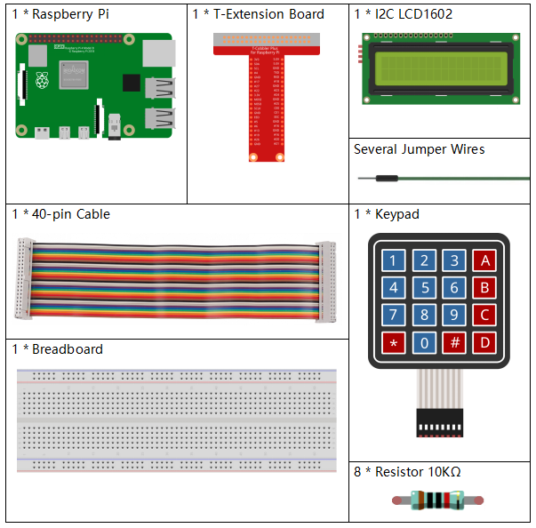
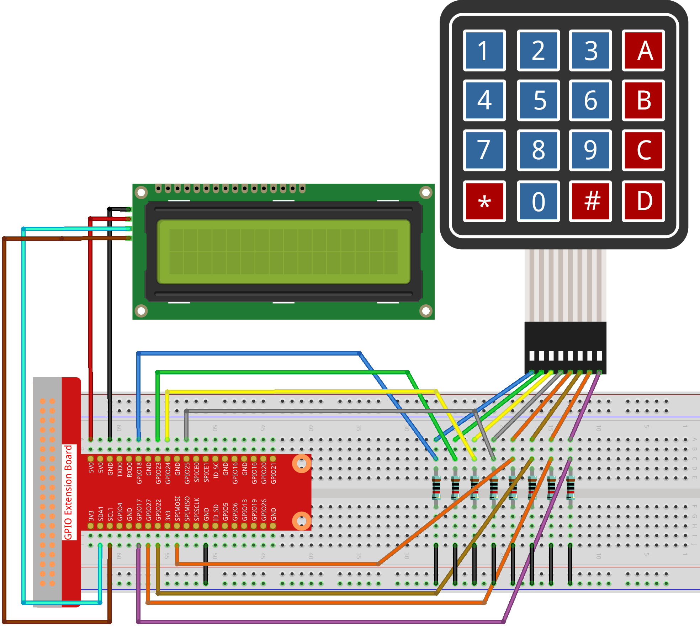

3.1.9 Password Lock
~~~~~~~~~~~~~~~~~~~

Introduction
-------------

In this project, we will use a keypad and a LCD to make a combination
lock. The LCD will display a corresponding prompt for you to type your
password on the Keypad. If the password is input correctly, “Correct”
will be displayed.

On the basis of this project, we can add additional electronic
components, such as buzzer, LED and so on, to add different experimental
phenomena for password input.

Components
--------------

Schematic Diagram
------------------

============ ======== ======== ===
T-Board Name physical wiringPi BCM
GPIO18       Pin 12   1        18
GPIO23       Pin 16   4        23
GPIO24       Pin 18   5        24
GPIO25       Pin 22   6        25
GPIO17       Pin 11   0        17
GPIO27       Pin 13   2        27
GPIO22       Pin 15   3        22
SPIMOSI      Pin 19   12       10
SDA1         Pin 3             
SCL1         Pin 5             
============ ======== ======== ===

.. image:: media/Schematic_three_one9.png
   :align: center

Experimental Procedures
-------------------------

**Step 1:** Build the circuit.

**For C Language Users**
^^^^^^^^^^^^^^^^^^^^^^^^^^

**Step 2**: Change directory.

.. raw:: html

   <run></run>

.. code-block:: 

    cd /home/pi/davinci-kit-for-raspberry-pi/c/3.1.9/

**Step 3**: Compile.

.. raw:: html

   <run></run>

.. code-block::

    gcc 3.1.9_PasswordLock.cpp -lwiringPi

**Step 4:** Run.

.. raw:: html

   <run></run>

.. code-block::

    sudo ./a.out

After the code runs, keypad is used to input password. If the “CORRECT”
appears on LCD1602, there is no wrong with the password; otherwise,
“WRONG KEY” will appear.

.. note::

    If it does not work after running, please refer to :ref:`C code is not working?`

**Code Explanation**

.. code-block:: c

    #define ROWS  4 
    #define COLS  4
    #define BUTTON_NUM (ROWS * COLS)
    #define LENS  4

    unsigned char KEYS[BUTTON_NUM] {  
    '1','2','3','A',
    '4','5','6','B',
    '7','8','9','C',
    '*','0','#','D'};

    char password[LENS]={'1','9','8','4'};

Here, we define the length of the password LENS, storage matrix keyboard
key value array KEYS and the array that stores the correct password.

.. code-block:: c

    void keyRead(unsigned char* result);
    bool keyCompare(unsigned char* a, unsigned char* b);
    void keyCopy(unsigned char* a, unsigned char* b);
    void keyPrint(unsigned char* a);
    void keyClear(unsigned char* a);
    int keyIndexOf(const char value);

There is a declaration of the subfunctions of the matrix keyboard code,
refer to :ref:`2.1.5 Keypad` of this document for more details.

.. code-block:: c

    void write_word(int data);
    void send_command(int comm);
    void send_data(int data);
    void lcdInit();
    void clear();
    void write(int x, int y, char const data[]);

There is a declaration of the subfunctions of LCD1062 code, refer to
 :ref:`1.1.7 I2C LCD1602` of this document for more details.

.. code-block:: c

    while(1){
            keyRead(pressed_keys);
            bool comp = keyCompare(pressed_keys, last_key_pressed);
            ...
                    testword[keyIndex]=pressed_keys[0];
                    keyIndex++;
                    if(keyIndex==LENS){
                        if(check()==0){
                            clear();
                            write(3, 0, "WRONG KEY!");
                            write(0, 1, "please try again");
                            }
                    ...

Read the key value and store it in the test array testword. If the
number of stored key values is more than 4, the correctness of the
password is automatically verified, and the verification results are
displayed on the LCD interface.

.. code-block:: c

    int check(){
        for(int i=0;i<LENS;i++){
            if(password[i]!=testword[i])
            {return 0;}
        }
        return 1;
    }

Verify the correctness of the password. Return 1 if the password is
entered correctly, and 0 if not.

**For Python Language Users**
^^^^^^^^^^^^^^^^^^^^^^^^^^^^^^^

**Step 2:** Change directory.

.. raw:: html

   <run></run>

.. code-block:: 

    cd /home/pi/davinci-kit-for-raspberry-pi/python/

**Step 3:** Run.

.. raw:: html

   <run></run>

.. code-block:: 

    sudo python3 3.1.9_PasswordLock.py

After the code runs, keypad is used to input password:1984. If the
“CORRECT” appears on LCD1602, there is no wrong with the password;
otherwise, “WRONG KEY” will appear.

**Code**

.. note::

    You can **Modify/Reset/Copy/Run/Stop** the code below. But before that, you need to go to  source code path like ``davinci-kit-for-raspberry-pi\\python``. 
    
.. raw:: html

    <run></run>

.. code-block:: python

    import RPi.GPIO as GPIO 
    import time
    import LCD1602

    ##################### HERE IS THE KEYPAD LIBRARY TRANSPLANTED FROM Arduino ############
    #class Key:Define some of the properties of Key
    class Keypad():

        def __init__(self, rowsPins, colsPins, keys):
            self.rowsPins = rowsPins
            self.colsPins = colsPins
            self.keys = keys
            GPIO.setwarnings(False)
            GPIO.setmode(GPIO.BCM)
            GPIO.setup(self.rowsPins, GPIO.OUT, initial=GPIO.LOW)
            GPIO.setup(self.colsPins, GPIO.IN, pull_up_down=GPIO.PUD_DOWN)

        def read(self):
            pressed_keys = []
            for i, row in enumerate(self.rowsPins):
                GPIO.output(row, GPIO.HIGH)
                for j, col in enumerate(self.colsPins):
                    index = i * len(self.colsPins) + j
                    if (GPIO.input(col) == 1):
                        pressed_keys.append(self.keys[index])
                GPIO.output(row, GPIO.LOW)
            return pressed_keys

    ################ EXAMPLE CODE START HERE ################        
    LENS = 4
    password=['1','9','8','4']
    testword=['0','0','0','0']
    keyIndex=0
    
    def check():
        for i in range(0,LENS):
            if(password[i]!=testword[i]):
                return 0
        return 1

    def setup():
        global keypad, last_key_pressed
        rowsPins = [18,23,24,25]
        colsPins = [10,22,27,17]
        keys = ["1","2","3","A",
                "4","5","6","B",
                "7","8","9","C",
                "*","0","#","D"]
        keypad = Keypad(rowsPins, colsPins, keys)
        last_key_pressed = []
        LCD1602.init(0x27, 1)    # init(slave address, background light)
        LCD1602.clear()
        LCD1602.write(0, 0, 'WELCOME!')
        LCD1602.write(2, 1, 'Enter password')
        time.sleep(2)

    def destroy():
        LCD1602.clear()
        GPIO.cleanup()

    def loop():
        global keyIndex
        global LENS
        global keypad, last_key_pressed
        while(True):
            pressed_keys = keypad.read()
            if len(pressed_keys) != 0 and last_key_pressed != pressed_keys:
                LCD1602.clear()
                LCD1602.write(0, 0, "Enter password:")
                LCD1602.write(15-keyIndex,1, pressed_keys)
                testword[keyIndex]=pressed_keys
                keyIndex+=1
                if (keyIndex is LENS):
                    if (check() is 0):
                        LCD1602.clear()
                        LCD1602.write(3, 0, "WRONG KEY!")
                        LCD1602.write(0, 1, "please try again")
                    else:
                        LCD1602.clear()
                        LCD1602.write(4, 0, "CORRECT!")
                        LCD1602.write(2, 1, "welcome back")
                keyIndex=keyIndex%LENS

            last_key_pressed = pressed_keys
            time.sleep(0.1)
            
    if __name__ == '__main__':     # Program start from here
        try:
            setup()
            loop()
        except KeyboardInterrupt:  # When 'Ctrl+C' is pressed, the program destroy() will be  executed.
            destroy()

**Code Explanation**

.. code-block:: python

    LENS = 4
    password=['1','9','8','4']
    ...
    rowsPins = [18,23,24,25]
    colsPins = [10,22,27,17]
    keys = ["1","2","3","A",
            "4","5","6","B",
            "7","8","9","C",
            "*","0","#","D"]

Here, we define the length of the password LENS, the array keys that
store the matrix keyboard keys, and the array password that stores the
correct password.

.. code-block:: python

    class Keypad():
        def __init__(self, rowsPins, colsPins, keys):
            self.rowsPins = rowsPins
            self.colsPins = colsPins
            self.keys = keys
            GPIO.setwarnings(False)
            GPIO.setmode(GPIO.BCM)
            GPIO.setup(self.rowsPins, GPIO.OUT, initial=GPIO.LOW)
            GPIO.setup(self.colsPins, GPIO.IN, pull_up_down=GPIO.PUD_DOWN)
    ...

This class is the code that reads the values of the pressed keys. Refer
to :ref:`2.1.5 Keypad` of this document for more details.

.. code-block:: python

    while(True):
            pressed_keys = keypad.read()
            if len(pressed_keys) != 0 and last_key_pressed != pressed_keys:
                LCD1602.clear()
                LCD1602.write(0, 0, "Enter password:")
                LCD1602.write(15-keyIndex,1, pressed_keys)
                testword[keyIndex]=pressed_keys
                keyIndex+=1
    ...

Read the key value and store it in the test array testword. If the
number of stored key values is more than 4, the correctness of the
password is automatically verified, and the verification results are
displayed on the LCD interface.

.. code-block:: python

    def check():
        for i in range(0,LENS):
            if(password[i]!=testword[i]):
                return 0
        return 1

Verify the correctness of the password. Return 1 if the password is
entered correctly, and 0 if not.

Phenomenon Picture
---------------------

.. image:: media/image263.jpeg
   :align: center