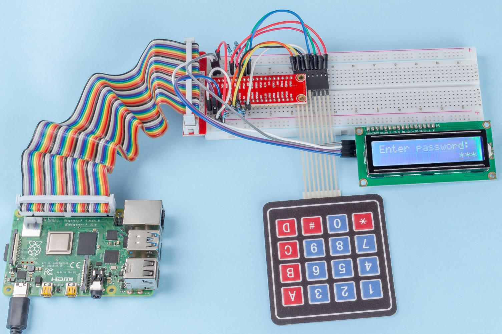

.. note::

    Bonjour et bienvenue dans la communauté SunFounder pour les passionnés de Raspberry Pi, Arduino et ESP32 sur Facebook ! Plongez dans l'univers de Raspberry Pi, Arduino et ESP32 avec d'autres passionnés.

    **Pourquoi nous rejoindre ?**

    - **Support d'experts** : Résolvez vos problèmes après-vente et vos défis techniques avec l'aide de notre communauté et de notre équipe.
    - **Apprendre & Partager** : Échangez des astuces et des tutoriels pour améliorer vos compétences.
    - **Aperçus exclusifs** : Recevez en avant-première les annonces de nouveaux produits et des aperçus exclusifs.
    - **Réductions spéciales** : Profitez de réductions exclusives sur nos nouveaux produits.
    - **Promotions festives et concours** : Participez à des concours et à des promotions spéciales durant les fêtes.

    👉 Prêt à explorer et créer avec nous ? Cliquez sur [|link_sf_facebook|] et rejoignez-nous dès aujourd'hui !

3.1.9 Serrure à code
========================

Introduction
----------------

Dans ce projet, nous utiliserons un clavier numérique et un écran LCD pour 
créer une serrure à combinaison. Le LCD affichera une invite vous demandant 
de saisir votre mot de passe sur le clavier. Si le mot de passe est correctement 
saisi, "Correct" sera affiché.

Sur la base de ce projet, nous pouvons ajouter des composants électroniques 
supplémentaires, tels qu'un buzzer, une LED, etc., pour varier les expérimentations 
autour de la saisie du mot de passe.

Composants
--------------

.. image:: img/list_Password_Lock.png
    :align: center

Schéma de câblage
---------------------

============ ======== ======== ===
T-Board Name physical wiringPi BCM
GPIO18       Pin 12   1        18
GPIO23       Pin 16   4        23
GPIO24       Pin 18   5        24
GPIO25       Pin 22   6        25
GPIO17       Pin 11   0        17
GPIO27       Pin 13   2        27
GPIO22       Pin 15   3        22
SPIMOSI      Pin 19   12       10
SDA1         Pin 3             
SCL1         Pin 5             
============ ======== ======== ===

.. image:: img/Schematic_three_one9.png
   :align: center

Procédures expérimentales
-----------------------------

**Étape 1 :** Montez le circuit.

.. image:: img/image262.png
   :alt: 3.1.3_PasswordLock_bb_看图王
   :width: 800

**Pour les utilisateurs du langage C**
^^^^^^^^^^^^^^^^^^^^^^^^^^^^^^^^^^^^^^^^^^^

**Étape 2 :** Changez de répertoire.

.. raw:: html

   <run></run>

.. code-block:: 

    cd ~/davinci-kit-for-raspberry-pi/c/3.1.9/

**Étape 3 :** Compilez le code.

.. raw:: html

   <run></run>

.. code-block:: 

    gcc 3.1.9_PasswordLock.cpp -lwiringPi

**Étape 4 :** Exécutez le programme.

.. raw:: html

   <run></run>

.. code-block:: 

    sudo ./a.out

Lorsque le code s'exécute, le clavier est utilisé pour entrer le mot de passe. 
Si "CORRECT" apparaît sur le LCD1602, le mot de passe est juste ; sinon, "WRONG KEY" 
s'affichera.

.. note::

    Si cela ne fonctionne pas après l'exécution ou si un message d'erreur apparaît : \"wiringPi.h: Aucun fichier ou dossier de ce type », veuillez vous référer à :ref:`C code is not working?`.

**Explication du code**

.. code-block:: c

    #define ROWS  4 
    #define COLS  4
    #define BUTTON_NUM (ROWS * COLS)
    #define LENS  4

    unsigned char KEYS[BUTTON_NUM] {  
    '1','2','3','A',
    '4','5','6','B',
    '7','8','9','C',
    '*','0','#','D'};

    char password[LENS]={'1','9','8','4'};

Ici, nous définissons la longueur du mot de passe avec LENS, la matrice de valeurs 
de touches du clavier avec KEYS, et le tableau qui stocke le mot de passe correct.

.. code-block:: c

    void keyRead(unsigned char* result);
    bool keyCompare(unsigned char* a, unsigned char* b);
    void keyCopy(unsigned char* a, unsigned char* b);
    void keyPrint(unsigned char* a);
    void keyClear(unsigned char* a);
    int keyIndexOf(const char value);

Il s'agit de la déclaration des sous-fonctions pour la gestion du clavier matriciel. 
Voir :ref:`2.1.5 Keypad` de ce document pour plus de détails.

.. code-block:: c

    void write_word(int data);
    void send_command(int comm);
    void send_data(int data);
    void lcdInit();
    void clear();
    void write(int x, int y, char const data[]);

Il s'agit de la déclaration des sous-fonctions pour le code du LCD1602. Voir 
:ref:`1.1.7 I2C LCD1602` de ce document pour plus de détails.

.. code-block:: c

    while(1){
            keyRead(pressed_keys);
            bool comp = keyCompare(pressed_keys, last_key_pressed);
            ...
                    testword[keyIndex]=pressed_keys[0];
                    keyIndex++;
                    if(keyIndex==LENS){
                        if(check()==0){
                            clear();
                            write(3, 0, "WRONG KEY!");
                            write(0, 1, "please try again");
                            }
                    ...

Lit la valeur de la touche et la stocke dans le tableau testword. Si le nombre 
de valeurs stockées dépasse 4, la validité du mot de passe est automatiquement 
vérifiée et les résultats de la vérification s'affichent sur l'écran LCD.

.. code-block:: c

    int check(){
        for(int i=0;i<LENS;i++){
            if(password[i]!=testword[i])
            {return 0;}
        }
        return 1;
    }

Vérifie la validité du mot de passe. Retourne 1 si le mot de passe est correct, 
sinon retourne 0.

**Pour les utilisateurs de Python**
^^^^^^^^^^^^^^^^^^^^^^^^^^^^^^^^^^

**Étape 2 :** Changez de répertoire.

.. raw:: html

   <run></run>

.. code-block:: 

    cd ~/davinci-kit-for-raspberry-pi/python/

**Étape 3 :** Exécutez.

.. raw:: html

   <run></run>

.. code-block:: 

    sudo python3 3.1.9_PasswordLock.py

Lorsque le code s'exécute, utilisez le clavier pour entrer le mot de passe : 1984. 
Si "CORRECT" apparaît sur le LCD1602, le mot de passe est correct ; sinon, "WRONG KEY" 
sera affiché.

**Code**

.. note::

    Vous pouvez **Modifier/Réinitialiser/Copier/Exécuter/Arrêter** le code ci-dessous. 
    Mais avant cela, assurez-vous d'être dans le chemin du code source comme ``davinci-kit-for-raspberry-pi/python``. 
    
.. raw:: html

    <run></run>

.. code-block:: python

    import RPi.GPIO as GPIO 
    import time
    import LCD1602

    ##################### VOICI LA BIBLIOTHÈQUE KEYPAD TRANSFÉRÉE DE Arduino ############
    #classe Key: Définir certaines des propriétés de Key
    class Keypad():

        def __init__(self, rowsPins, colsPins, keys):
            self.rowsPins = rowsPins
            self.colsPins = colsPins
            self.keys = keys
            GPIO.setwarnings(False)
            GPIO.setmode(GPIO.BCM)
            GPIO.setup(self.rowsPins, GPIO.OUT, initial=GPIO.LOW)
            GPIO.setup(self.colsPins, GPIO.IN, pull_up_down=GPIO.PUD_DOWN)

        def read(self):
            pressed_keys = []
            for i, row in enumerate(self.rowsPins):
                GPIO.output(row, GPIO.HIGH)
                for j, col in enumerate(self.colsPins):
                    index = i * len(self.colsPins) + j
                    if (GPIO.input(col) == 1):
                        pressed_keys.append(self.keys[index])
                GPIO.output(row, GPIO.LOW)
            return pressed_keys

    ################ EXEMPLE DE CODE DÉMARRE ICI ################        
    LENS = 4
    password=['1','9','8','4']
    testword=['0','0','0','0']
    keyIndex=0
    
    def check():
        for i in range(0,LENS):
            if(password[i]!=testword[i]):
                return 0
        return 1

    def setup():
        global keypad, last_key_pressed
        rowsPins = [18,23,24,25]
        colsPins = [10,22,27,17]
        keys = ["1","2","3","A",
                "4","5","6","B",
                "7","8","9","C",
                "*","0","#","D"]
        keypad = Keypad(rowsPins, colsPins, keys)
        last_key_pressed = []
        LCD1602.init(0x27, 1)    # init(adresse esclave, rétroéclairage)
        LCD1602.clear()
        LCD1602.write(0, 0, 'WELCOME!')
        LCD1602.write(2, 1, 'Enter password')
        time.sleep(2)

    def destroy():
        LCD1602.clear()
        GPIO.cleanup()

    def loop():
        global keyIndex
        global LENS
        global keypad, last_key_pressed
        while(True):
            pressed_keys = keypad.read()
            if len(pressed_keys) != 0 and last_key_pressed != pressed_keys:
                LCD1602.clear()
                LCD1602.write(0, 0, "Enter password:")
                LCD1602.write(15-keyIndex,1, pressed_keys)
                testword[keyIndex]=pressed_keys
                keyIndex+=1
                if (keyIndex is LENS):
                    if (check() is 0):
                        LCD1602.clear()
                        LCD1602.write(3, 0, "WRONG KEY!")
                        LCD1602.write(0, 1, "please try again")
                    else:
                        LCD1602.clear()
                        LCD1602.write(4, 0, "CORRECT!")
                        LCD1602.write(2, 1, "welcome back")
                keyIndex=keyIndex%LENS

            last_key_pressed = pressed_keys
            time.sleep(0.1)
            
    if __name__ == '__main__':     # Le programme démarre ici
        try:
            setup()
            loop()
        except KeyboardInterrupt:  # Lorsque 'Ctrl+C' est pressé, la fonction destroy() sera exécutée.
            destroy()

**Explication du code**

.. code-block:: python

    LENS = 4
    password=['1','9','8','4']
    ...
    rowsPins = [18,23,24,25]
    colsPins = [10,22,27,17]
    keys = ["1","2","3","A",
            "4","5","6","B",
            "7","8","9","C",
            "*","0","#","D"]

Ici, nous définissons la longueur du mot de passe `LENS`, le tableau `keys` qui 
stocke les touches du clavier matriciel, ainsi que le tableau `password` qui 
contient le mot de passe correct.

.. code-block:: python

    class Keypad():
        def __init__(self, rowsPins, colsPins, keys):
            self.rowsPins = rowsPins
            self.colsPins = colsPins
            self.keys = keys
            GPIO.setwarnings(False)
            GPIO.setmode(GPIO.BCM)
            GPIO.setup(self.rowsPins, GPIO.OUT, initial=GPIO.LOW)
            GPIO.setup(self.colsPins, GPIO.IN, pull_up_down=GPIO.PUD_DOWN)
    ...

Cette classe contient le code permettant de lire les valeurs des touches pressées. 
Pour plus de détails, référez-vous à :ref:`2.1.5 Keypad` de ce document.

.. code-block:: python

    while(True):
            pressed_keys = keypad.read()
            if len(pressed_keys) != 0 and last_key_pressed != pressed_keys:
                LCD1602.clear()
                LCD1602.write(0, 0, "Enter password:")
                LCD1602.write(15-keyIndex,1, pressed_keys)
                testword[keyIndex]=pressed_keys
                keyIndex+=1
    ...

Lisez la valeur de la touche et stockez-la dans le tableau `testword`. Si le nombre 
de valeurs stockées dépasse 4, la validité du mot de passe est automatiquement 
vérifiée et les résultats de la vérification sont affichés sur l'écran LCD.

.. code-block:: python

    def check():
        for i in range(0,LENS):
            if(password[i]!=testword[i]):
                return 0
        return 1

Vérifie la validité du mot de passe. Retourne 1 si le mot de passe est correct, et 
0 sinon.

Illustration du phénomène
------------------------------

