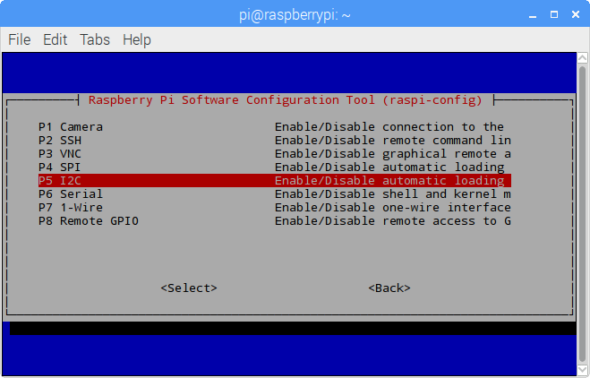

.. _i2c_config:

I2C-Konfiguration
-----------------------

Schritt 1: Aktivieren Sie den I2C-Port Ihres Raspberry Pi (Wenn Sie ihn aktiviert haben, überspringen Sie diesen; wenn Sie nicht wissen, ob Sie das getan haben oder nicht, fahren Sie bitte fort).

.. raw:: html

    <run></run>
 
.. code-block:: 

    sudo raspi-config

**3 Interfacing options**

.. image:: media/image282.png
    :align: center

**P5 I2C**

**<Yes>, dann  <Ok> -> <Finish>**

.. image:: media/image284.png
    :align: center

Schritt 2: Prüfen Sie, ob die i2c-Module geladen und aktiv sind.

.. raw:: html

    <run></run>
 
.. code-block:: 

    lsmod | grep i2c

Dann erscheinen die folgenden Codes (die Nummer kann unterschiedlich sein).

.. code-block:: 

    i2c_dev                     6276    0
    i2c_bcm2708                 4121    0

Schritt 3: Installieren Sie i2c-tools.

.. raw:: html

    <run></run>
 
.. code-block:: 

    sudo apt-get install i2c-tools

Schritt 4: Überprüfen Sie die Adresse des I2C-Geräts.

.. raw:: html

    <run></run>

.. code-block:: 

    i2cdetect -y 1      # For Raspberry Pi 2 and higher version

.. raw:: html

   <run></run>

.. code-block:: 

    i2cdetect -y 0      # For Raspberry Pi 1

.. code-block:: 

    pi@raspberrypi ~ $ i2cdetect -y 1
        0  1  2  3   4  5  6  7  8  9   a  b  c  d  e  f
    00:           -- -- -- -- -- -- -- -- -- -- -- -- --
    10: -- -- -- -- -- -- -- -- -- -- -- -- -- -- -- --
    20: -- -- -- -- -- -- -- -- -- -- -- -- -- -- -- --
    30: -- -- -- -- -- -- -- -- -- -- -- -- -- -- -- --
    40: -- -- -- -- -- -- -- -- 48 -- -- -- -- -- -- --
    50: -- -- -- -- -- -- -- -- -- -- -- -- -- -- -- --
    60: -- -- -- -- -- -- -- -- -- -- -- -- -- -- -- --
    70: -- -- -- -- -- -- -- --

Wenn ein I2C-Gerät angeschlossen ist, wird die Adresse des Geräts angezeigt.

Schritt 5:

**Für Benutzer der Sprache C:** Installieren Sie libi2c-dev.

.. raw:: html

    <run></run>
 
.. code-block:: 

    sudo apt-get install libi2c-dev 

**Für Python-Benutzer:**

1. Aktivierung der virtuellen Umgebung.

.. note::
    
    * Bevor Sie die Aktivierung durchführen, müssen Sie sicherstellen, dass Sie eine virtuelle Umgebung erstellt haben. Bitte beachten Sie: :ref:`create_virtual`.

    * Jedes Mal, wenn Sie den Raspberry Pi neu starten oder ein neues Terminal öffnen, müssen Sie erneut den folgenden Befehl ausführen, um die virtuelle Umgebung zu aktivieren.

.. raw:: html

    <run></run>

.. code-block:: shell

    source myenv/bin/activate

Sobald die virtuelle Umgebung aktiviert ist, sehen Sie den Umgebungsnamen vor dem Befehlszeilen-Prompt, was darauf hinweist, dass Sie innerhalb der virtuellen Umgebung arbeiten.

2. Installation von smbus für I2C.

.. raw:: html

    <run></run>
 
.. code-block:: 

    sudo pip3 install smbus2

3. Beenden der virtuellen Umgebung.

Wenn Sie Ihre Arbeit abgeschlossen haben und die virtuelle Umgebung verlassen möchten, führen Sie einfach folgenden Befehl aus:

.. raw:: html

    <run></run>

.. code-block:: shell

    deactivate

Dadurch kehren Sie zur globalen Python-Umgebung des Systems zurück.
