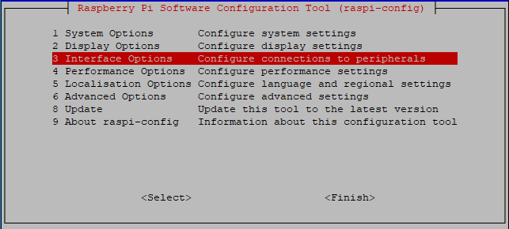

.. _i2c_config:

I2C構成
-----------------------

ステップ1: Raspberry PiのI2Cポートを有効にしてください（有効にしている場合はスキップしてください。

.. raw:: html

    <run></run>
 
.. code-block:: 

    sudo raspi-config

**3 Interfacing options**

**P5 I2C**

.. image:: media/image283.png
    :align: center

**<Yes>、次に<Ok> -> <Finish>**

.. image:: media/image284.png
    :align: center

ステップ2: i2cモジュールがロードされ、アクティブになっているかどうかを確認します。

.. raw:: html

    <run></run>
 
.. code-block:: 

    lsmod | grep i2c

すると、次のようなコードが表示されます（番号は異なる場合があります）。

.. code-block:: 

    i2c_dev                     6276    0
    i2c_bcm2708                 4121    0

ステップ3： i2c-toolsをインストールします。

.. raw:: html

    <run></run>
 
.. code-block:: 

    sudo apt-get install i2c-tools

ステップ4： I2Cデバイスのアドレスを確認します。

.. raw:: html

    <run></run>

.. code-block:: 

    i2cdetect -y 1      # For Raspberry Pi 2 and higher version

.. raw:: html

   <run></run>

.. code-block:: 

    i2cdetect -y 0      # For Raspberry Pi 1

.. code-block:: 

    pi@raspberrypi ~ $ i2cdetect -y 1
        0  1  2  3   4  5  6  7  8  9   a  b  c  d  e  f
    00:           -- -- -- -- -- -- -- -- -- -- -- -- --
    10: -- -- -- -- -- -- -- -- -- -- -- -- -- -- -- --
    20: -- -- -- -- -- -- -- -- -- -- -- -- -- -- -- --
    30: -- -- -- -- -- -- -- -- -- -- -- -- -- -- -- --
    40: -- -- -- -- -- -- -- -- 48 -- -- -- -- -- -- --
    50: -- -- -- -- -- -- -- -- -- -- -- -- -- -- -- --
    60: -- -- -- -- -- -- -- -- -- -- -- -- -- -- -- --
    70: -- -- -- -- -- -- -- --

I2Cデバイスが接続されている場合は、デバイスのアドレスが表示されます。

ステップ5:

C言語をお使いの方へ： libi2c-devをインストールしてください。

.. raw:: html

    <run></run>
 
.. code-block:: 

    sudo apt-get install libi2c-dev 

Pythonユーザーの場合： I2C用のsmbusをインストールします。

.. raw:: html

    <run></run>
 
.. code-block:: 

    sudo pip3 install smbus2