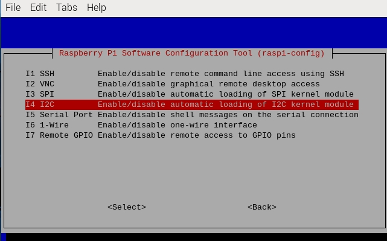

.. note::

    Ciao, benvenuto nella comunità SunFounder Raspberry Pi & Arduino & ESP32 su Facebook! Approfondisci Raspberry Pi, Arduino ed ESP32 con altri appassionati.

    **Perché unirsi?**

    - **Supporto esperto**: Risolvi i problemi post-vendita e le sfide tecniche con l'aiuto della nostra comunità e del nostro team.
    - **Impara e condividi**: Scambia consigli e tutorial per migliorare le tue competenze.
    - **Anteprime esclusive**: Accedi in anticipo agli annunci di nuovi prodotti e anteprime.
    - **Sconti speciali**: Goditi sconti esclusivi sui nostri prodotti più recenti.
    - **Promozioni festive e omaggi**: Partecipa a promozioni festive e omaggi.

    👉 Sei pronto a esplorare e creare con noi? Clicca su [|link_sf_facebook|] e unisciti oggi stesso!

.. _i2c_config:

Configurazione I2C
-----------------------

**Passaggio 1**: Abilita la porta I2C del tuo Raspberry Pi (se l'hai già
abilitata, salta questo passaggio; se non sai se l'hai fatto o meno,
continua a seguire le istruzioni).

.. raw:: html

   <run></run>
 
.. code-block:: 

    sudo raspi-config

**3 Opzioni di Interfaccia**

.. image:: img/image282.png
    :align: center

**I4 I2C**

**<Sì>, poi <Ok> -> <Finish>**

.. image:: img/image284.png
    :align: center

**Passaggio 2:** Controlla se i moduli I2C sono caricati e attivi.

.. raw:: html

   <run></run>
 
.. code-block:: 

    lsmod | grep i2c

Dovrebbero apparire i seguenti codici (il numero può variare); se non compaiono, riavvia il Raspberry Pi con ``sudo reboot``.

.. code-block:: 

    i2c_dev                     6276    0
    i2c_bcm2708                 4121    0

**Passaggio 3:** Installa i2c-tools.

.. raw:: html

   <run></run>
 
.. code-block:: 

    sudo apt-get install i2c-tools

**Passaggio 4:** Controlla l'indirizzo del dispositivo I2C.

.. raw:: html

    <run></run>
  
.. code-block:: 

    i2cdetect -y 1      # Per Raspberry Pi 2 e versioni successive

.. raw:: html

   <run></run>
 
.. code-block:: 

    i2cdetect -y 0      # Per Raspberry Pi 1

.. code-block:: 

    pi@raspberrypi ~ $ i2cdetect -y 1
        0  1  2  3   4  5  6  7  8  9   a  b  c  d  e  f
    00:           -- -- -- -- -- -- -- -- -- -- -- -- --
    10: -- -- -- -- -- -- -- -- -- -- -- -- -- -- -- --
    20: -- -- -- -- -- -- -- -- -- -- -- -- -- -- -- --
    30: -- -- -- -- -- -- -- -- -- -- -- -- -- -- -- --
    40: -- -- -- -- -- -- -- -- 48 -- -- -- -- -- -- --
    50: -- -- -- -- -- -- -- -- -- -- -- -- -- -- -- --
    60: -- -- -- -- -- -- -- -- -- -- -- -- -- -- -- --
    70: -- -- -- -- -- -- -- --

Se è connesso un dispositivo I2C, verrà visualizzato l'indirizzo del dispositivo.

**Passaggio 5:**

**Per gli utenti di linguaggio C:** Installa libi2c-dev.

.. raw:: html

   <run></run>
 
.. code-block:: 

    sudo apt-get install libi2c-dev 

**Per gli utenti Python:**

1. Attivare l'ambiente virtuale.

.. note::
    
    * Prima di attivarlo, devi assicurarti di aver creato un ambiente virtuale, fai riferimento a: :ref:`create_virtual`.

    * Ogni volta che riavvii il Raspberry Pi o apri un nuovo terminale, dovrai eseguire nuovamente il seguente comando per attivare l'ambiente virtuale.

.. raw:: html

    <run></run>

.. code-block:: shell

    source myenv/bin/activate

Una volta attivato l'ambiente virtuale, vedrai il nome dell'ambiente prima del prompt della riga di comando, indicando che stai lavorando all'interno dell'ambiente virtuale.

2. Installa smbus per I2C.

.. raw:: html

    <run></run>
 
.. code-block:: 

    sudo pip3 install smbus2

3. Uscire dall'ambiente virtuale.

Quando hai finito il lavoro e desideri uscire dall'ambiente virtuale, esegui semplicemente:

.. raw:: html

    <run></run>

.. code-block:: shell

    deactivate

Questo ti riporterà all'ambiente Python globale del sistema.
