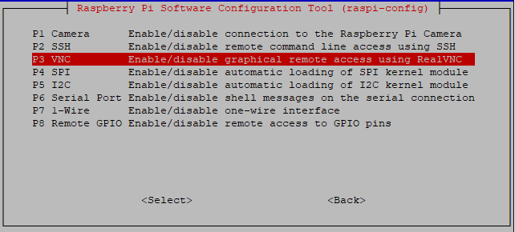
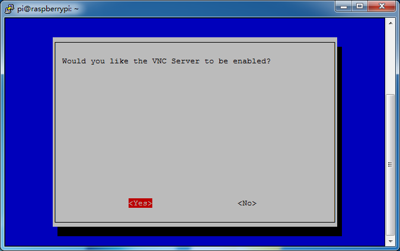

.. _appendix_remote_desktop:

Remotedesktop
=====================

Es gibt zwei Möglichkeiten, den Desktop des Raspberry Pi aus der Ferne zu steuern:

**VNC** und **XRDP** , Sie können jeden von ihnen verwenden.

VNC 
--------------

Sie können die Funktion des Remote-Desktops über VNC verwenden.

**VNC-Dienst aktivieren**

Der VNC-Dienst wurde im System installiert. 
VNC ist standardmäßig deaktiviert. Sie müssen es in der Konfiguration aktivieren.

**Schritt 1**

Geben Sie den folgenden Befehl ein:

.. raw:: html

   <run></run>

.. code-block:: 

   sudo raspi-config

.. image:: media/image287.png
   :align: center

Schritt 2

Wählen Sie **3** **Interfacing Options** , 
indem Sie die Abwärtspfeiltaste auf Ihrer Tastatur drücken und dann die **Enter** drücken.

.. image:: media/image282.png
   :align: center

Schritt 3

**P3 VNC**

Schritt 4

Wählen Sie **Yes -> OK -> Finish** , um die Konfiguration zu beenden.

**Bei VNC anmelden**

Schritt 1

Sie müssen den `VNC Viewer <https://www.realvnc.com/en/connect/download/viewer/>`_ herunterladen und auf Ihrem PC installieren. 
Nachdem die Installation abgeschlossen ist, öffnen Sie es.

Schritt 2

Wählen Sie dann \"**New connection**\".

.. image:: media/image290.png
   :align: center

Schritt 3

Geben Sie die IP-Adresse des Raspberry Pi und einen beliebigen **Name** ein.

.. image:: media/image291.png
   :align: center

Schritt 4

Doppelklicken Sie auf die soeben erstellte **connection** :

.. image:: media/image292.png
   :align: center

Schritt 5

Geben Sie den Benutzernamen ( ``pi`` ) und das Passwort (standardmäßig ``raspberry`` ) ein.

.. image:: media/image293.png
   :align: center

Schritt 6

Nun sehen Sie den Desktop des Raspberry Pi:

.. image:: media/image294.png
   :align: center

Das ist das Ende des VNC-Teils.

XRDP
-----------------------

Eine andere Methode des Remote-Desktops ist XRDP. Sie bietet eine grafische Anmeldung an Remote-Computern mithilfe von RDP (Microsoft Remote Desktop Protocol).

**XRDP installieren**

Schritt 1

Melden Sie sich mit SSH beim Raspberry Pi an.

Schritt 2

Geben Sie die folgenden Anweisungen ein, um XRDP zu installieren.

.. raw:: html

   <run></run>

.. code-block:: 

   sudo apt-get update
   sudo apt-get install xrdp

Schritt 3

Später startet die Installation.

Geben Sie „Y“ ein, drücken Sie zur Bestätigung die Taste „Enter“.

.. image:: media/image295.png
   :align: center

Schritt 4

Nachdem Sie die Installation abgeschlossen haben, sollten Sie sich mit Windows-Remote-Desktop-Anwendungen bei Ihrem Raspberry Pi anmelden.

**Bei XRDP anmelden**

Schritt 1

Wenn Sie ein Windows-Benutzer sind, können Sie die mit Windows gelieferte Remotedesktopfunktion verwenden. Wenn Sie ein Mac-Benutzer sind, können Sie Microsoft Remote Desktop aus dem APP Store herunterladen und verwenden, und es gibt keinen großen Unterschied zwischen den beiden. Das nächste Beispiel ist der Windows-Remotedesktop.

Schritt 2

Geben Sie „mstsc“ in Run (WIN+R) ein, um die Remotedesktopverbindung zu öffnen, geben Sie die IP-Adresse des Raspberry Pi ein und klicken Sie dann auf „Connect“.

.. image:: media/image296.png
   :align: center

Schritt 3

Dann erscheint die xrdp-Anmeldeseite. Bitte geben Sie Ihren Benutzernamen und Ihr Passwort ein. Danach klicken Sie bitte auf „OK“. Bei der ersten Anmeldung lautet Ihr Benutzername „pi“ und das Passwort „raspberry“.

.. image:: media/image297.png
   :align: center

Schritt 4

Hier melden Sie sich erfolgreich über den Remote-Desktop bei RPi an.

.. image:: media/image20.png
   :align: center

