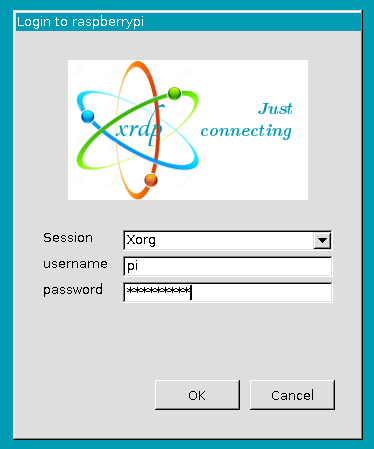

.. note::

    Ciao! Benvenuto nella Community di SunFounder per gli appassionati di Raspberry Pi, Arduino ed ESP32 su Facebook! Approfondisci le tue conoscenze su Raspberry Pi, Arduino ed ESP32 insieme ad altri appassionati.

    **Perché unirsi?**

    - **Supporto Esperto**: Risolvi problemi post-vendita e sfide tecniche con il supporto della nostra comunità e del nostro team.
    - **Impara e Condividi**: Scambia suggerimenti e tutorial per migliorare le tue competenze.
    - **Anteprime Esclusive**: Ottieni accesso anticipato agli annunci di nuovi prodotti e anteprime speciali.
    - **Sconti Speciali**: Approfitta di sconti esclusivi sui nostri prodotti più recenti.
    - **Promozioni Festive e Giveaway**: Partecipa a concorsi e promozioni durante le festività.

    👉 Sei pronto a esplorare e creare con noi? Clicca su [|link_sf_facebook|] e unisciti oggi!

Desktop Remoto
=====================

Ci sono due modi per controllare il desktop del Raspberry Pi da remoto:

**VNC** e **XRDP**, puoi scegliere uno dei due.

VNC
--------------

Puoi utilizzare la funzione di desktop remoto tramite VNC.

**Abilitare il servizio VNC**

Il servizio VNC è già installato nel sistema, ma di default è disabilitato. 
È necessario abilitarlo nelle impostazioni.

**Passaggio 1**

Inserisci il seguente comando:

.. raw:: html

   <run></run>

.. code-block:: 

   sudo raspi-config

.. image:: img/image287.png
   :align: center

**Passaggio 2**

Seleziona **3 Opzioni di Interfacciamento** usando il tasto freccia giù 
sulla tastiera, quindi premi **Invio**.

.. image:: img/image282.png
   :align: center

**Passaggio 3**

**P3 VNC**

.. image:: img/image288.png
   :align: center

**Passaggio 4**

Seleziona **Sì -> OK -> Fine** per uscire dalla configurazione.

.. image:: img/image289.png
   :align: center

**Accesso a VNC**

**Passaggio 1**

Scarica e installa il `VNC Viewer <https://www.realvnc.com/en/connect/download/viewer/>`_ sul tuo computer personale. Dopo l'installazione, aprilo.

**Passaggio 2**

Seleziona "**Nuova connessione**".

.. image:: img/image290.png
   :align: center

**Passaggio 3**

Inserisci l'indirizzo IP del Raspberry Pi e un **Nome** a piacere.

.. image:: img/image291.png
   :align: center

**Passaggio 4**

Fai doppio clic sulla **connessione** appena creata:

.. image:: img/image292.png
   :align: center

**Passaggio 5**

Inserisci il nome utente (**pi**) e la password (di default **raspberry**).

.. image:: img/image293.png
   :align: center

**Passaggio 6**

Ora dovresti visualizzare il desktop del Raspberry Pi:

.. image:: img/image294.png
   :align: center

Questa è la fine della parte relativa a VNC.

XRDP
-----------------------

Un altro metodo di accesso remoto è XRDP, che fornisce un'interfaccia grafica per il login remoto utilizzando il protocollo RDP (Remote Desktop Protocol di Microsoft).

**Installare XRDP**

**Passaggio 1**

Accedi al Raspberry Pi utilizzando SSH.

**Passaggio 2**

Inserisci i seguenti comandi per installare XRDP.

.. raw:: html

   <run></run>

.. code-block:: 

   sudo apt-get update
   sudo apt-get install xrdp

**Passaggio 3**

L'installazione inizierà.

Inserisci "Y" e premi "Invio" per confermare.

.. image:: img/image295.png
   :align: center

**Passaggio 4**

Dopo l'installazione, puoi accedere al Raspberry Pi utilizzando le 
applicazioni desktop remote di Windows.

**Accesso a XRDP**

**Passaggio 1**

Se sei un utente Windows, puoi utilizzare la funzione Desktop Remoto inclusa 
in Windows. Se sei un utente Mac, puoi scaricare e utilizzare Microsoft Remote 
Desktop dall'App Store. Nei passaggi seguenti viene mostrato l'esempio di 
Desktop Remoto di Windows.

**Passaggio 2**

Digita "**mstsc**" nella barra di ricerca di Esegui (WIN+R) per aprire la 
connessione Desktop Remoto, inserisci l'indirizzo IP del Raspberry Pi e 
clicca su "Connetti".

.. image:: img/image296.png
   :align: center

**Passaggio 3**

Si aprirà la pagina di login di xrdp. Inserisci il tuo nome utente e password, 
quindi clicca su "OK". Al primo accesso, il nome utente è "pi" e la password è 
"raspberry".

**Passaggio 4**

Ora hai effettuato correttamente l'accesso al Raspberry Pi tramite desktop remoto.

.. image:: img/image20.png
   :align: center

**Nota sui Diritti d'Autore**

Tutti i contenuti inclusi, ma non limitati a testi, immagini e codice in 
questo manuale sono di proprietà della SunFounder Company. Il loro utilizzo 
è consentito solo per scopi di studio personale, investigazione, intrattenimento 
o altri fini non commerciali o non a scopo di lucro, rispettando le normative e 
le leggi sul copyright, senza violare i diritti legali dell'autore e dei detentori 
di tali diritti. La SunFounder si riserva il diritto di intraprendere azioni legali 
per qualsiasi utilizzo a fini di lucro senza autorizzazione.
