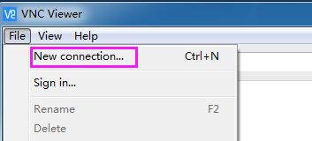

.. note::

    こんにちは、SunFounderのRaspberry Pi & Arduino & ESP32愛好家コミュニティへようこそ！Facebook上でRaspberry Pi、Arduino、ESP32についてもっと深く掘り下げ、他の愛好家と交流しましょう。

    **参加する理由は？**

    - **エキスパートサポート**：コミュニティやチームの助けを借りて、販売後の問題や技術的な課題を解決します。
    - **学び＆共有**：ヒントやチュートリアルを交換してスキルを向上させましょう。
    - **独占的なプレビュー**：新製品の発表や先行プレビューに早期アクセスしましょう。
    - **特別割引**：最新製品の独占割引をお楽しみください。
    - **祭りのプロモーションとギフト**：ギフトや祝日のプロモーションに参加しましょう。

    👉 私たちと一緒に探索し、創造する準備はできていますか？[|link_sf_facebook|]をクリックして今すぐ参加しましょう！

.. _remote_desktop:

リモートデスクトップ
=====================

Raspberry Piのデスクトップをリモートで操作する方法は2つあります。

**VNC** と **XRDP** 、いずれも使用可能です。

VNC
--------------

VNCを使ってリモートデスクトップ機能を利用できます。

**VNCサービスの有効化**

VNCサービスはシステムにインストール済みですが、デフォルトでは無効です。設定で有効にする必要があります。

**ステップ1**

以下のコマンドを入力します：

.. raw:: html

    <run></run>

.. code-block:: 

    sudo raspi-config

.. image:: img/image287.png
   :align: center

**ステップ2**

キーボードの下矢印キーを押して **3** **Interfacing Options** を選び、 **Enter** キーを押します。

.. image:: img/image282.png
   :align: center

**ステップ3**

**P3 VNC**

.. image:: img/image288.png
   :align: center

**ステップ4**

**Yes -> OK -> Finish** を選択して設定を終了します。

.. image:: img/image289.png
   :align: center

**VNCへのログイン**

**ステップ1**

パーソナルコンピュータに `VNC Viewer <https://www.realvnc.com/en/connect/download/viewer/>`_ をダウンロードしてインストールします。インストールが完了したら、開きます。

**ステップ2**

\"**New connection**\"を選択します。

**ステップ3**

Raspberry PiのIPアドレスと任意の **Name** を入力します。

.. image:: img/image291.png
   :align: center

**ステップ4**

作成した **connection** をダブルクリックします：

.. image:: img/image292.png
   :align: center

**ステップ5**

ユーザー名（デフォルトは **pi** ）とパスワード（デフォルトは **raspberry** ）を入力します。

.. image:: img/image293.png
   :align: center

**ステップ6**

これでRaspberry Piのデスクトップが表示されます：

.. image:: img/image294.png
   :align: center

VNC部分は以上です。

XRDP
-----------------------

リモートデスクトップの別の方法として、XRDPがあります。これは、RDP（Microsoft Remote Desktop Protocol）を使用してリモートマシンへのグラフィカルなログインを提供します。

**XRDPのインストール**

**ステップ1**

SSHを使用してRaspberry Piにログインします。

**ステップ2**

以下の指示に従ってXRDPをインストールします。

.. raw:: html

    <run></run>

.. code-block:: 

   sudo apt-get update
   sudo apt-get install xrdp

**ステップ3**

次に、インストールが始まります。

\"Y\"を入力し、\"Enter\"キーを押して確認します。

.. image:: img/image295.png
   :align: center

**ステップ4**

インストールが完了したら、Windowsのリモートデスクトップアプリケーションを使用してRaspberry Piにログインします。

**XRDPへのログイン**

**ステップ1**

Windowsユーザーの場合は、Windowsに付属するリモートデスクトップ機能を使用できます。Macユーザーの場合は、App StoreからMicrosoft Remote Desktopをダウンロードして使用できます。次の例はWindowsリモートデスクトップです。

**ステップ2**

Run（WIN+R）で\"**mstsc**\"と入力し、リモートデスクトップ接続を開きます。次に、Raspberry PiのIPアドレスを入力し、\"接続\"をクリックします。

.. image:: img/image296.png
   :align: center

**ステップ3**

すると、xrdpのログインページが表示されます。ユーザー名とパスワードを入力し、\"OK\"をクリックしてください。初めてログインする際のユーザー名は\"pi\"、パスワードは\"raspberry\"です。

.. image:: img/image297.png
   :align: center

**ステップ4**

これで、リモートデスクトップを使用してRPiに成功裏にログインしました。

.. image:: img/image20.png
   :align: center

**著作権について**

このマニュアルに含まれるテキスト、画像、コード等、すべてのコンテンツはSunFounder Companyが所有しています。個々または組織が許可なく商業的に利益を得る目的でこれらを使用した場合、当社は法的措置を取る権利を留保しています。個人的な学習、調査、楽しみ、またはその他の非営利目的での使用は、関連する規制および著作権法を遵守し、著者と関連する権利保持者の法的権利を侵害しない範囲でのみ許可されます。

