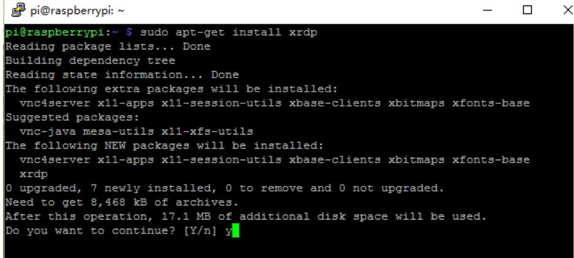

.. note::

    ¡Hola! Bienvenido a la Comunidad de Entusiastas de SunFounder Raspberry Pi, Arduino y ESP32 en Facebook. Profundiza en Raspberry Pi, Arduino y ESP32 junto a otros entusiastas.

    **¿Por qué unirse?**

    - **Soporte experto**: Resuelve problemas post-venta y desafíos técnicos con la ayuda de nuestra comunidad y equipo.
    - **Aprende y comparte**: Intercambia consejos y tutoriales para mejorar tus habilidades.
    - **Acceso exclusivo**: Obtén acceso anticipado a anuncios y adelantos de nuevos productos.
    - **Descuentos especiales**: Disfruta de descuentos exclusivos en nuestros productos más recientes.
    - **Promociones y sorteos**: Participa en sorteos y promociones festivas.

     👉 ¿Listo para explorar y crear con nosotros? Haz clic en [|link_sf_facebook|] y únete hoy mismo!

Remote Desktop 
=====================

Existen dos maneras de controlar el escritorio de la Raspberry Pi de forma remota:

**VNC** y **XRDP**, puedes usar cualquiera de ellas.

VNC
--------------

Puedes utilizar la función de escritorio remoto a través de VNC.

**Habilitar el servicio VNC**

El servicio VNC ya está instalado en el sistema. Por defecto, VNC está deshabilitado. Debes habilitarlo en la configuración.

**Paso 1**

Ingresa el siguiente comando:

.. raw:: html

   <run></run>

.. code-block:: 

   sudo raspi-config

.. image:: img/image287.png
   :align: center

**Paso 2**

Selecciona **3** **Opciones de Interfaz** presionando la tecla de flecha hacia abajo en tu teclado, luego presiona la tecla **Enter**.

.. image:: img/image282.png
   :align: center

**Paso 3**

**P3 VNC**

.. image:: img/image288.png
   :align: center

**Paso 4**

Selecciona **Sí -> Aceptar -> Finalizar** para salir de la configuración.

.. image:: img/image289.png
   :align: center

**Iniciar sesión en VNC**

**Paso 1**

Necesitas descargar e instalar el `VNC Viewer <https://www.realvnc.com/en/connect/download/viewer/>`_ en tu computadora personal. Después de completar la instalación, ábrelo.

**Paso 2**

Luego selecciona \"**Nueva conexión**\".

.. image:: img/image290.png
   :align: center

**Paso 3**

Ingresa la dirección IP de la Raspberry Pi y cualquier **Nombre**.

.. image:: img/image291.png
   :align: center

**Paso 4**

Haz doble clic en la **conexión** que acabas de crear:

.. image:: img/image292.png
   :align: center

**Paso 5**

Ingresa el nombre de usuario (**pi**) y la contraseña (**raspberry** por defecto).

.. image:: img/image293.png
   :align: center

**Paso 6**

Ahora podrás ver el escritorio de la Raspberry Pi:

.. image:: img/image294.png
   :align: center

Eso es todo por la parte de VNC.

XRDP
-----------------------

Otro método de escritorio remoto es XRDP, que proporciona un inicio de sesión 
gráfico en máquinas remotas utilizando RDP (Protocolo de Escritorio Remoto de Microsoft).

**Instalar XRDP**

**Paso 1**

Inicia sesión en la Raspberry Pi usando SSH.

**Paso 2**

Ingresa las siguientes instrucciones para instalar XRDP.

.. raw:: html

   <run></run>

.. code-block:: 

   sudo apt-get update
   sudo apt-get install xrdp

**Paso 3**

Luego, comenzará la instalación.

Ingresa \"Y\" y presiona la tecla \"Enter\" para confirmar.

**Paso 4**

Una vez finalizada la instalación, deberás iniciar sesión en tu Raspberry Pi 
usando aplicaciones de escritorio remoto de Windows.

**Iniciar sesión en XRDP**

**Paso 1**

Si eres usuario de Windows, puedes usar la función de Escritorio Remoto que 
viene con Windows. Si eres usuario de Mac, puedes descargar y usar Microsoft 
Remote Desktop desde la App Store, y no hay mucha diferencia entre ambos. El 
siguiente ejemplo es para Escritorio Remoto de Windows.

**Paso 2**

Escribe \"**mstsc**\" en Ejecutar (WIN+R) para abrir la Conexión de Escritorio 
Remoto, e ingresa la dirección IP de la Raspberry Pi, luego haz clic en \"Conectar\".

.. image:: img/image296.png
   :align: center

**Paso 3**

A continuación, aparecerá la página de inicio de sesión de XRDP. Por favor, 
ingresa tu nombre de usuario y contraseña. Después de eso, haz clic en \"Aceptar\". 
La primera vez que inicies sesión, tu nombre de usuario es \"pi\" y la contraseña es \"raspberry\".

.. image:: img/image297.png
   :align: center

**Paso 4**

Aquí, has iniciado sesión con éxito en RPi usando el escritorio remoto.

.. image:: img/image20.png
   :align: center

**Aviso de Derechos de Autor**

Todos los contenidos, incluidos pero no limitados a textos, imágenes y código 
en este manual, son propiedad de la empresa SunFounder. Solo debes usarlos para 
estudio personal, investigación, disfrute u otros fines no comerciales o sin 
fines de lucro, bajo las regulaciones relacionadas y las leyes de derechos de 
autor, sin infringir los derechos legales del autor y de los titulares de 
derechos correspondientes. Para cualquier individuo u organización que utilice 
esto con fines de lucro comercial sin permiso, la empresa se reserva el derecho 
de tomar acciones legales.

