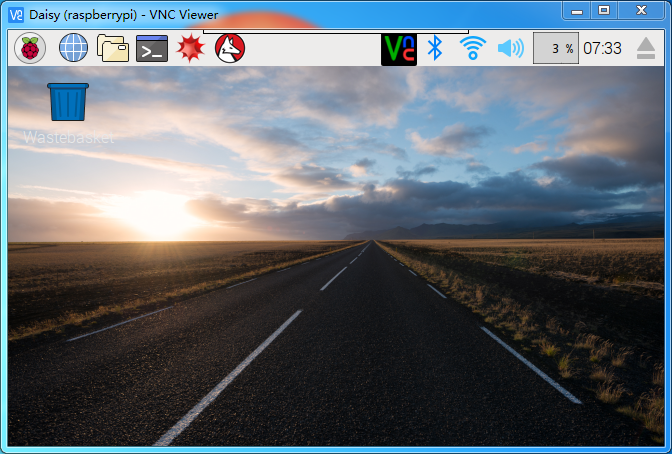

.. note::

    Ciao, benvenuto nella community SunFounder Raspberry Pi & Arduino & ESP32 su Facebook! Approfondisci Raspberry Pi, Arduino ed ESP32 insieme ad altri appassionati.

    **Perché unirti a noi?**

    - **Supporto esperto**: Risolvi i problemi post-vendita e le sfide tecniche con l'aiuto della nostra comunità e del nostro team.
    - **Impara e condividi**: Scambia suggerimenti e tutorial per migliorare le tue competenze.
    - **Anteprime esclusive**: Accedi in anteprima agli annunci dei nuovi prodotti e alle anticipazioni.
    - **Sconti speciali**: Goditi sconti esclusivi sui nostri prodotti più recenti.
    - **Promozioni festive e omaggi**: Partecipa agli omaggi e alle promozioni festive.

    👉 Pronto a esplorare e creare con noi? Clicca [|link_sf_facebook|] e unisciti oggi!

.. _remote_desktop:

Desktop Remoto 
=====================

Ci sono due modi per controllare il desktop del Raspberry Pi da remoto:

**VNC** e **XRDP**, puoi utilizzare entrambi.

VNC 
--------------

Puoi utilizzare la funzione di desktop remoto tramite VNC.

**Abilitare il servizio VNC**

Il servizio VNC è già installato nel sistema. Per impostazione predefinita, VNC è
disabilitato. È necessario abilitarlo nella configurazione.

**Passo 1**

Inserisci il seguente comando:

.. raw:: html

    <run></run>

.. code-block:: 

    sudo raspi-config

.. image:: img/image287.png
   :align: center

**Passo 2**

Scegli **3** **Interfacing Options** premendo la freccia verso il basso sulla tua
tastiera, poi premi il tasto **Enter**.

.. image:: img/image282.png
   :align: center

**Passo 3**

**P3 VNC**

.. image:: img/image288.png
   :align: center

**Passo 4**

Seleziona **Yes -> OK -> Finish** per uscire dalla configurazione.

.. image:: img/image289.png
   :align: center

**Accedere a VNC**

**Passo 1**

Devi scaricare e installare `VNC Viewer <https://www.realvnc.com/en/connect/download/viewer/>`_ sul tuo computer. Dopo aver completato l'installazione, aprilo.

**Passo 2**

Seleziona \"**New connection**\".

.. image:: img/image290.png
   :align: center

**Passo 3**

Inserisci l'indirizzo IP del Raspberry Pi e un **Nome** a tua scelta.

.. image:: img/image291.png
   :align: center

**Passo 4**

Fai doppio clic sulla **connessione** appena creata:

.. image:: img/image292.png
   :align: center

**Passo 5**

Inserisci il Nome utente (**pi**) e la Password (**raspberry** per impostazione predefinita).

.. image:: img/image293.png
   :align: center

**Passo 6**

Ora puoi vedere il desktop del Raspberry Pi:

Questa è la fine della parte VNC.

XRDP
-----------------------

Un altro metodo di desktop remoto è XRDP, che fornisce un accesso grafico alle macchine remote utilizzando RDP (Microsoft Remote Desktop Protocol).

**Installare XRDP**

**Passo 1**

Accedi al Raspberry Pi tramite SSH.

**Passo 2**

Inserisci i seguenti comandi per installare XRDP.

.. raw:: html

    <run></run>

.. code-block:: 

   sudo apt-get update
   sudo apt-get install xrdp

**Passo 3**

L'installazione inizierà.

Digita \"Y\" e premi il tasto \"Enter\" per confermare.

.. image:: img/image295.png
   :align: center

**Passo 4**

Terminata l'installazione, dovrai accedere al tuo Raspberry Pi utilizzando 
le applicazioni di desktop remoto di Windows.

**Accedere a XRDP**

**Passo 1**

Se sei un utente Windows, puoi utilizzare la funzione di Desktop Remoto 
inclusa in Windows. Se sei un utente Mac, puoi scaricare e utilizzare 
Microsoft Remote Desktop dall'APP Store. Non ci sono grandi differenze 
tra le due versioni. L'esempio seguente è per il desktop remoto su Windows.

**Passo 2**

Digita \"**mstsc**\" in Esegui (WIN+R) per aprire la Connessione Desktop 
Remoto e inserisci l'indirizzo IP del Raspberry Pi, quindi clicca su \"Connect\".

.. image:: img/image296.png
   :align: center

**Passo 3**

Apparirà la pagina di login di xrdp. Inserisci il tuo nome utente e
password. Successivamente, clicca su \"OK\". Al primo accesso,
il tuo nome utente sarà \"pi\" e la password sarà \"raspberry\".

.. image:: img/image297.png
   :align: center

**Passo 4**

Ora sei connesso con successo al Raspberry Pi utilizzando il desktop remoto.

.. image:: img/image20.png
   :align: center

**Nota sul Copyright**

Tutti i contenuti, inclusi ma non limitati a testi, immagini e codice in
questo manuale, sono di proprietà della SunFounder Company. Dovresti utilizzarli
solo per scopi personali di studio, indagine, divertimento o altri scopi non commerciali o senza fini di lucro, in conformità con le normative e le leggi sul copyright,
senza violare i diritti legali dell'autore e dei relativi titolari di diritti.
Per qualsiasi individuo o organizzazione che utilizzi questi contenuti per profitto commerciale senza permesso, la società si riserva il diritto di intraprendere azioni legali.
