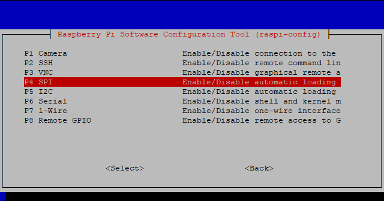

.. _spi_config:

SPI-Konfiguration
-----------------------

Schritt 1: Aktivieren Sie den SPI-Port Ihres Raspberry Pi (Wenn Sie ihn aktiviert haben, überspringen Sie diesen; 
wenn Sie nicht wissen, ob Sie das getan haben oder nicht, fahren Sie bitte fort).

.. raw:: html

    <run></run>

.. code-block:: 

    sudo raspi-config

**3 Interfacing options**

.. image:: media/image282.png
   :align: center

**P4 SPI**

**<YES>**, dann auf **<OK>** und **<Finish>** klicken. Jetzt können Sie den Raspberry Pi mit dem Befehl ``sudo reboot`` neu starten.

.. image:: media/image286.png
   :align: center 

Schritt 2: Überprüfen Sie, ob die Spi-Module geladen und aktiv sind.

.. raw:: html

    <run></run>

.. code-block:: 

    ls /dev/sp*

Dann erscheinen die folgenden Codes (die Nummer kann abweichen).

.. code-block:: 

    /dev/spidev0.0  /dev/spidev0.1

Schritt 3: Installieren Sie das Python-Modul SPI-Py.

.. raw:: html

    <run></run>

.. code-block:: 

    git clone https://github.com/lthiery/SPI-Py.git
    cd SPI-Py
    sudo python3 setup.py install

.. note::

    Dieser Schritt ist für Python-Benutzer, wenn Sie die Sprache C verwenden, überspringen Sie bitte.
