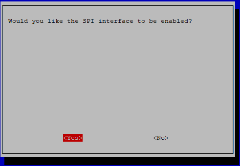

.. note::

    こんにちは、SunFounderのRaspberry Pi & Arduino & ESP32愛好家コミュニティへようこそ！Facebook上でRaspberry Pi、Arduino、ESP32についてもっと深く掘り下げ、他の愛好家と交流しましょう。

    **参加する理由は？**

    - **エキスパートサポート**：コミュニティやチームの助けを借りて、販売後の問題や技術的な課題を解決します。
    - **学び＆共有**：ヒントやチュートリアルを交換してスキルを向上させましょう。
    - **独占的なプレビュー**：新製品の発表や先行プレビューに早期アクセスしましょう。
    - **特別割引**：最新製品の独占割引をお楽しみください。
    - **祭りのプロモーションとギフト**：ギフトや祝日のプロモーションに参加しましょう。

    👉 私たちと一緒に探索し、創造する準備はできていますか？[|link_sf_facebook|]をクリックして今すぐ参加しましょう！

.. _spi_config:

SPI構成
===============

ステップ1：Raspberry PiのSPIポートを有効にします（有効にしている場合はスキップします。有効にしたかどうかわからない場合は続行してください）。

.. raw:: html

    <run></run>

.. code-block:: 

    sudo raspi-config

**3 Interfacing options**

.. image:: media/image282.png
   :align: center

**I3 SPI**

.. image:: img/i3spi.png
   :align: center

<YES> をクリックし、<OK> と <Finish> をクリックします。 これで、 ``sudo reboot`` コマンドを使用してRaspberryPiを再起動できます。

ステップ2： spiモジュールがロードされてアクティブになっていることを確認します。

.. raw:: html

    <run></run>

.. code-block:: 

    ls /dev/sp*

次に、次のコードが表示されます（番号は異なる場合があります）。

.. code-block:: 

    /dev/spidev0.0  /dev/spidev0.1

ステップ3： PythonモジュールSPI-Pyをインストールします。

.. raw:: html

    <run></run>

.. code-block:: 

    git clone https://github.com/lthiery/SPI-Py.git
    cd SPI-Py
    sudo python3 setup.py install

.. note::

    この手順はPythonユーザー向けです。C言語を使用している場合は、スキップしてください。

