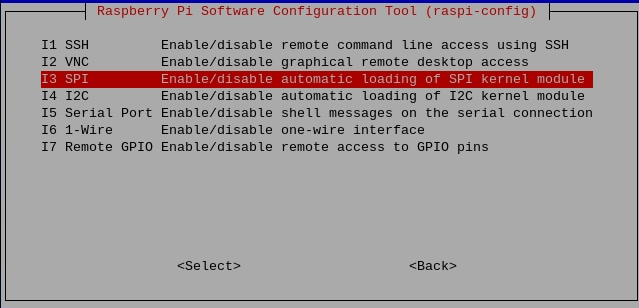

.. note::

    Ciao, benvenuto nella community SunFounder Raspberry Pi & Arduino & ESP32 su Facebook! Approfondisci Raspberry Pi, Arduino ed ESP32 insieme ad altri appassionati.

    **Perché unirti a noi?**

    - **Supporto esperto**: Risolvi i problemi post-vendita e le sfide tecniche con l'aiuto della nostra comunità e del nostro team.
    - **Impara e condividi**: Scambia suggerimenti e tutorial per migliorare le tue competenze.
    - **Anteprime esclusive**: Accedi in anteprima agli annunci dei nuovi prodotti e alle anticipazioni.
    - **Sconti speciali**: Goditi sconti esclusivi sui nostri prodotti più recenti.
    - **Promozioni festive e omaggi**: Partecipa agli omaggi e alle promozioni festive.

    👉 Pronto a esplorare e creare con noi? Clicca [|link_sf_facebook|] e unisciti oggi!

.. _spi_configuration:

Configurazione SPI
-----------------------

**Passo 1**: Abilita la porta SPI del tuo Raspberry Pi (se l'hai già
abilitata, salta questo passaggio; se non sei sicuro di averlo fatto o meno,
continua a seguire le istruzioni).

.. raw:: html

   <run></run>

.. code-block:: 

    sudo raspi-config

**3 Opzioni di Interfaccia**

.. image:: img/image282.png
   :align: center

**I3 SPI**

**<SÌ>, quindi fai clic su <OK> e <Finish>.**

.. image:: img/image286.png
   :align: center 

**Passo 2:** Verifica che i moduli spi siano caricati e attivi.

.. raw:: html

   <run></run>

.. code-block:: 

    ls /dev/sp*

A questo punto compariranno i seguenti codici (il numero può variare).

.. code-block:: 

    /dev/spidev0.0  /dev/spidev0.1

**Passo 3:** Installa il modulo Python SPI-Py.

.. raw:: html

   <run></run>

.. code-block:: 

    git clone https://github.com/lthiery/SPI-Py.git
    cd SPI-Py
    sudo python3 setup.py install

.. note::
    Questo passaggio è per gli utenti Python, se utilizzi il linguaggio C,
    puoi saltarlo.
