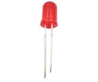
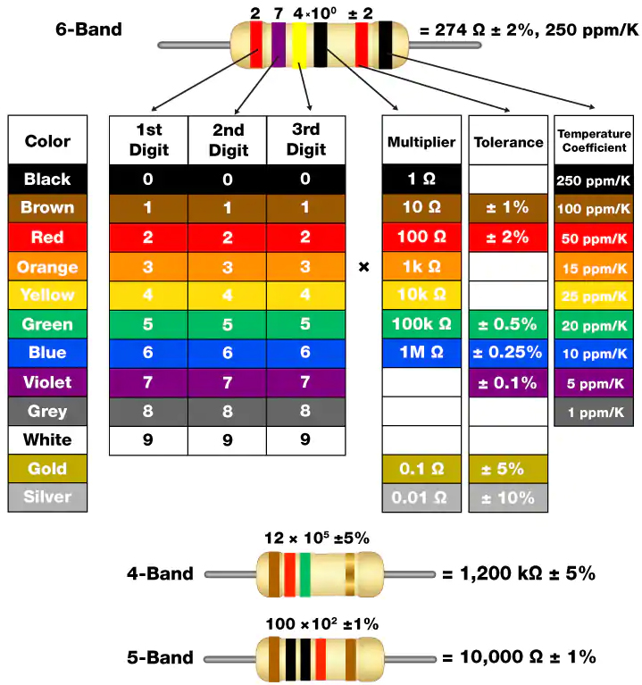
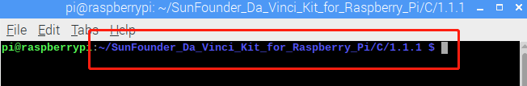
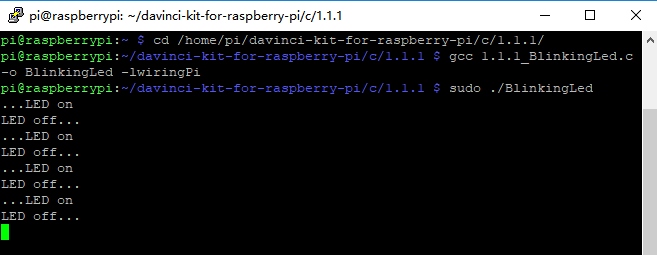

.. note::

    ¡Hola! Bienvenido a la Comunidad de Entusiastas de SunFounder Raspberry Pi, Arduino y ESP32 en Facebook. Profundiza en Raspberry Pi, Arduino y ESP32 junto a otros entusiastas.

    **¿Por qué unirse?**

    - **Soporte experto**: Resuelve problemas post-venta y desafíos técnicos con la ayuda de nuestra comunidad y equipo.
    - **Aprender y compartir**: Intercambia consejos y tutoriales para mejorar tus habilidades.
    - **Acceso exclusivo**: Obtén acceso anticipado a anuncios y adelantos de nuevos productos.
    - **Descuentos especiales**: Disfruta de descuentos exclusivos en nuestros productos más recientes.
    - **Promociones y sorteos**: Participa en sorteos y promociones festivas.

    👉 ¿Listo para explorar y crear con nosotros? Haz clic en [|link_sf_facebook|] y únete hoy mismo!

1.1.1 LED parpadeante
=========================

Introducción
-----------------

En esta lección, aprenderemos a hacer que un LED parpadee mediante programación. 
A través de tus configuraciones, tu LED puede producir una serie de fenómenos 
interesantes. Ahora, ¡manos a la obra!

Componentes
------------------

.. image:: img/blinking_led_list.png
    :width: 800
    :align: center

.. note::
    Para proceder sin inconvenientes, necesitas traer tu propia
    Raspberry Pi, tarjeta TF y alimentación para Raspberry Pi.

Principio
-----------

**Protoboard**

Una protoboard es una base de construcción para la creación de prototipos 
electrónicos. Se utiliza para construir y probar circuitos rápidamente antes 
de finalizar cualquier diseño de circuito. Tiene muchos orificios en los que 
se pueden insertar los componentes mencionados anteriormente, como ICs y 
resistencias, así como cables puente. La protoboard te permite conectar y quitar 
componentes con facilidad.

La imagen muestra la estructura interna de una protoboard completa. Aunque estos 
orificios en la protoboard parecen independientes entre sí, en realidad están 
conectados entre sí a través de tiras de metal internamente.

.. image:: img/image41.png

**LED**

El LED es un tipo de diodo. El LED solo brillará si el pin largo está conectado 
al electrodo positivo y el pin corto está conectado al electrodo negativo.

.. |image43| image:: img/image43.png

|image42|\ |image43|

El LED no puede conectarse directamente a la fuente de alimentación, ya que puede 
dañar el componente. Debe conectarse en serie una resistencia de 160Ω o mayor 
(funcionando a 5V) en el circuito del LED.

**Resistencia**

La resistencia es un elemento electrónico que puede limitar la corriente de 
una rama. Una resistencia fija es un tipo de resistencia cuyo valor no puede 
cambiarse, mientras que el de un potenciómetro o una resistencia variable puede ajustarse.

Se utiliza una resistencia fija en este kit. En el circuito, es esencial para 
proteger los componentes conectados. Las siguientes imágenes muestran un objeto 
real, una resistencia de 220Ω y dos símbolos de circuito comúnmente usados para 
resistencias. Ω es la unidad de resistencia y las unidades más grandes incluyen 
KΩ, MΩ, etc. Su relación se puede expresar de la siguiente manera: 1 MΩ = 1000 KΩ, 
1 KΩ = 1000 Ω. Normalmente, el valor de la resistencia está marcado en ella. 
Así que si ves estos símbolos en un circuito, significa que hay una resistencia.

.. image:: img/image44.png

.. |image45| image:: img/image45.png

.. |image46| image:: img/image46.png

|image45|\ |image46|

Al usar una resistencia, primero necesitamos conocer su valor. Aquí hay dos 
métodos: puedes observar las bandas en la resistencia o usar un multímetro 
para medir la resistencia. Se recomienda usar el primer método, ya que es 
más conveniente y rápido. Para medir el valor, utiliza el multímetro.

Como se muestra en la tarjeta, cada color representa un número.

Diagrama Esquemático
-------------------------

En este experimento, conecta una resistencia de 220Ω al ánodo (el pin largo) 
del LED, luego conecta la resistencia a 3.3 V y conecta el cátodo (el pin corto) 
del LED a GPIO17 de la Raspberry Pi. Por lo tanto, para encender un LED, 
necesitamos establecer el GPIO17 en un nivel bajo (0V). Podemos obtener este 
fenómeno mediante programación.

.. note::

    **Pin11** se refiere al undécimo pin de la Raspberry Pi de izquierda a derecha, y sus correspondientes números de pin **wiringPi** y **BCM** se muestran en la siguiente tabla.

En el contenido relacionado con el lenguaje C, hacemos que GPIO0 sea 
equivalente a 0 en el wiringPi. En el contenido relacionado con el 
lenguaje Python, BCM 17 es 17 en la columna BCM de la siguiente tabla. 
Al mismo tiempo, son equivalentes al undécimo pin de la Raspberry Pi, Pin 11.

============ ======== ======== ====
T-Board Name physical wiringPi BCM
GPIO17       Pin 11   0        17
============ ======== ======== ==== 

.. image:: img/image48.png
    :width: 800
    :align: center

Procedimientos Experimentales
---------------------------------

**Paso 1:** Construir el circuito.

.. image:: img/image49.png
    :width: 800
    :align: center

**Paso 2:** Ve a la carpeta del código.

1) Si usas una pantalla, se recomienda que sigas estos pasos.

Ve a **~/** y encuentra la carpeta 
**davinci-kit-for-raspberry-pi**.

Encuentra **C** en la carpeta, haz clic derecho sobre ella y selecciona **Abrir en Terminal**.

.. image:: img/image50.png
    :width: 800
    :align: center

Luego, aparecerá una ventana como se muestra a continuación. Así que ahora has ingresado a la ruta del código **1.1.1_BlinkingLed.c**.

En las siguientes lecciones, utilizaremos comandos para acceder al archivo de 
código en lugar de hacer clic derecho. Pero puedes elegir el método que prefieras.

2) Si accedes a la Raspberry Pi de forma remota, usa ``cd`` para cambiar de directorio:

.. raw:: html

   <run></run>

.. code-block::

   cd ~/davinci-kit-for-raspberry-pi/c/1.1.1/

.. note::
    Cambia el directorio a la ruta del código en este experimento usando cd.

De cualquiera de las maneras, ahora estás en la carpeta C. Los procedimientos 
posteriores basados en estos dos métodos son los mismos. Continuemos.

**Paso 3:** Compila el código.

.. raw:: html

   <run></run>

.. code-block::

   gcc 1.1.1_BlinkingLed.c -o BlinkingLed -lwiringPi

.. note::
    gcc es GNU Compiler Collection. Aquí, funciona como
    compilador del archivo de lenguaje C *1_BlinkingLed.c* y genera un
    archivo ejecutable.

En el comando, ``-o`` significa salida (el carácter inmediatamente
siguiente a -o es el nombre del archivo que se generará tras la compilación, y se generará un ejecutable llamado ``BlinkingLed``) y ``-lwiringPi`` es para cargar
la biblioteca wiringPi (``l`` es la abreviatura de biblioteca).

**Paso 4:** Ejecuta el archivo ejecutable generado en el paso anterior.

.. raw:: html

   <run></run>

.. code-block::

   sudo ./BlinkingLed

.. note::

   Para controlar el GPIO, necesitas ejecutar el programa con el
   comando, sudo (superusuario). El comando ``./`` indica el directorio actual. 
   El comando completo es para ejecutar ``BlinkingLed`` en el
   directorio actual.

Después de que el código se ejecute, verás el LED parpadeando.

.. note::

   Si no funciona después de ejecutarlo, o si aparece un mensaje de error: "wiringPi.h: No such file or directory", consulta :ref:`c code is not working?`.

Si deseas editar el archivo de código ``1.1.1_BlinkingLed.c``, presiona ``Ctrl + C`` 
para detener la ejecución del código. Luego, escribe el siguiente comando para abrirlo:

.. raw:: html

   <run></run>

.. code-block::

   nano 1.1.1_BlinkingLed.c

.. note::
    nano es una herramienta de editor de texto. El comando se utiliza para abrir el
    archivo de código ``1.1.1_BlinkingLed.c`` mediante esta herramienta.

Presiona ``Ctrl+X`` para salir. Si has modificado el código, aparecerá un
mensaje preguntando si deseas guardar los cambios o no. Escribe ``Y`` (guardar)
o ``N`` (no guardar). Luego presiona ``Enter`` para salir. Repite ``Paso 3``
y ``Paso 4`` para ver el efecto después de modificar.

.. image:: img/image53.png
    :width: 800
    :align: center

**Código**

El código del programa se muestra a continuación:

.. code-block:: c

   #include <wiringPi.h>  
   #include <stdio.h>
   #define LedPin      0
   int main(void)
   {
      // Si la inicialización de wiring falla, imprime un mensaje en la pantalla
      if(wiringPiSetup() == -1){
         printf("setup wiringPi failed !");
         return 1;
      }
      pinMode(LedPin, OUTPUT);// Establece LedPin como salida para escribirle un valor.
      while(1){
         // LED encendido
         digitalWrite(LedPin, LOW);
         printf("...LED on\n");
         delay(500);
         // LED apagado
         digitalWrite(LedPin, HIGH);
         printf("LED off...\n");
         delay(500);
      }
      return 0;
   }

**Explicación del Código**

.. code-block:: c

   include <wiringPi.h>

La biblioteca de control de hardware está diseñada para el lenguaje C de la 
Raspberry Pi. Añadir esta biblioteca facilita la inicialización del hardware,
y la salida de puertos de I/O, PWM, etc.

.. code-block:: c

   #include <stdio.h>

Biblioteca estándar de I/O. La función pintf utilizada para imprimir los datos 
que se muestran en la pantalla se realiza mediante esta biblioteca. Hay muchas 
otras funciones de rendimiento que puedes explorar.

.. code-block:: c

   #define LedPin 0

El pin GPIO17 de la T_Extension Board corresponde al GPIO0 en
wiringPi. Asignamos GPIO0 a LedPin, por lo que LedPin representa GPIO0 en el 
código posterior.

.. code-block:: c

    if(wiringPiSetup() == -1){
        printf("setup wiringPi failed !");
        return 1;

Esto inicializa wiringPi y asume que el programa que lo llama va a usar
el esquema de numeración de pines de wiringPi.

Esta función necesita ser llamada con privilegios de root.
Cuando la inicialización de wiring falla, imprime un mensaje en la pantalla. 
La función "return" se utiliza para salir de la función actual. Usar return 
en la función main() finalizará el programa.

.. code-block:: c

   pinMode(LedPin, OUTPUT);

Establece LedPin como salida para escribirle un valor.

.. code-block:: c

   digitalWrite(LedPin, LOW);

Establece GPIO0 en 0V (nivel bajo). Dado que el cátodo del LED está conectado a
GPIO0, el LED se encenderá si GPIO0 se establece en bajo. Por el contrario,
si GPIO0 se establece en alto, digitalWrite (LedPin, HIGH): el LED se apagará.

.. code-block:: c

   printf("...LED off\n");

La función printf es una función de la biblioteca estándar y su prototipo 
de función se encuentra en el archivo de encabezado "stdio.h". La forma 
general de la llamada es: printf(" cadena de control de formato ", columnas 
de salida). La cadena de control de formato se utiliza para especificar el 
formato de salida, que se divide en cadena de formato y cadena no formateada. 
La cadena de formato comienza con '%' seguido de caracteres de formato, como 
'%d' para la salida de enteros decimales. Las cadenas no formateadas se imprimen 
como prototipos. Lo que se usa aquí es una cadena no formateada, seguida de "\n", 
que es un carácter de nueva línea, representando un salto de línea automático 
después de imprimir una cadena.

.. code-block:: c

   delay(500);

Delay (500) mantiene el estado actual de HIGH o LOW durante 500ms.

Esta es una función que suspende el programa durante un periodo de tiempo. 
Y la velocidad del programa está determinada por nuestro hardware. Aquí 
encendemos
o apagamos el LED. Si no hay una función de delay, el programa ejecutará 
todo el código muy rápidamente y en un bucle continuo. Así que necesitamos 
la función de delay para ayudarnos a escribir y depurar el programa.

.. code-block:: c

   return 0;

Normalmente, se coloca al final de la función principal, indicando que la
función devuelve 0 al ejecutarse con éxito.
