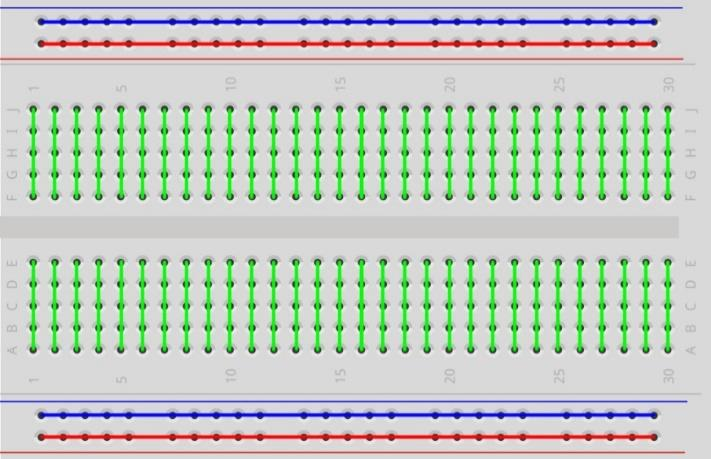

.. note::

    Ciao e benvenuto nella Community di SunFounder per gli appassionati di Raspberry Pi, Arduino e ESP32 su Facebook! Unisciti a noi per esplorare a fondo Raspberry Pi, Arduino e ESP32 con altri appassionati.

    **Perché unirsi a noi?**

    - **Supporto Esperto**: Risolvi problemi post-vendita e affronta sfide tecniche con l'aiuto del nostro team e della community.
    - **Impara e Condividi**: Scambia consigli e tutorial per migliorare le tue competenze.
    - **Anteprime Esclusive**: Ottieni accesso anticipato agli annunci di nuovi prodotti e alle anteprime.
    - **Sconti Speciali**: Goditi sconti esclusivi sui nostri prodotti più recenti.
    - **Promozioni Festive e Omaggi**: Partecipa a promozioni e omaggi durante le festività.

    👉 Sei pronto a esplorare e creare con noi? Clicca su [|link_sf_facebook|] e unisciti oggi stesso!

1.1.1 LED Lampeggiante
=========================

Introduzione
-----------------

In questa lezione impareremo a creare un LED lampeggiante tramite programmazione. 
Con le tue impostazioni, il LED può produrre una serie di effetti interessanti. 
Ora, mettiti all'opera.

Componenti
------------------

.. image:: img/blinking_led_list.png
    :width: 800
    :align: center

.. note::
    Per procedere senza problemi, assicurati di avere un Raspberry Pi, una 
    scheda TF e un alimentatore per Raspberry Pi.

Principio
------------

**Breadboard**

Una breadboard è una base di costruzione per prototipi elettronici, usata per 
costruire e testare circuiti rapidamente prima di completare il design finale. 
Ha numerosi fori in cui si possono inserire componenti come IC, resistenze e 
cavi di collegamento. La breadboard permette di collegare e rimuovere facilmente 
i componenti.

L'immagine mostra la struttura interna di una breadboard completa. Sebbene i fori 
sulla breadboard sembrino indipendenti, sono in realtà collegati tra loro tramite 
strisce metalliche interne.

**LED**

Un LED è un tipo di diodo che si accende solo se il piedino lungo è 
collegato all'elettrodo positivo e il piedino corto all'elettrodo negativo.

.. |image42| image:: img/image42.png

.. |image43| image:: img/image43.png

|image42|\ |image43|

L'LED non può essere collegato direttamente alla fonte di alimentazione, 
poiché potrebbe danneggiarsi. Nel circuito dell'LED, è necessario collegare 
in serie una resistenza da almeno 160Ω (per un funzionamento a 5V).

**Resistenza**

Una resistenza è un componente elettronico che limita la corrente in un 
circuito. La resistenza fissa è un tipo di resistenza che non può essere 
modificata, mentre la resistenza di un potenziometro può essere regolata.

In questo kit viene utilizzata una resistenza fissa. Nel circuito è essenziale 
per proteggere i componenti collegati. Le immagini seguenti mostrano un oggetto 
reale, una resistenza da 220Ω, e due simboli di circuito comunemente usati. 
L'unità di resistenza è l'Ω, con unità maggiori come KΩ e MΩ. La loro relazione 
è: 1 MΩ=1000 KΩ, 1 KΩ = 1000 Ω. Normalmente, il valore di resistenza è indicato 
sulla resistenza stessa. Quindi, se vedi questi simboli in un circuito, significa 
che è presente una resistenza.

.. image:: img/image44.png

.. |image45| image:: img/image45.png

.. |image46| image:: img/image46.png

|image45|\ |image46|

Per utilizzare una resistenza, è necessario conoscere il suo valore. Ci sono 
due metodi: osservare le bande colorate sulla resistenza o usare un multimetro 
per misurare la resistenza. Si consiglia di usare il primo metodo poiché è più 
pratico e veloce. Per una misurazione precisa, utilizza un multimetro.

Come mostrato nella tabella, ogni colore rappresenta un numero.

.. image:: img/image47.jpeg

Schema del Circuito
-------------------------

In questo esperimento, collega una resistenza da 220Ω all'anodo (il piedino 
lungo dell'LED), poi collega la resistenza a 3.3 V e il catodo (il piedino 
corto) dell'LED al GPIO17 del Raspberry Pi. Quindi, per accendere l'LED, 
dobbiamo impostare GPIO17 a livello basso (0V). Questo effetto può essere 
ottenuto tramite programmazione.

.. note::

    **Pin11** si riferisce all'11° pin del Raspberry Pi da sinistra a destra; 
    i numeri corrispondenti **wiringPi** e **BCM** sono mostrati nella tabella 
    seguente.

Nei contenuti relativi al linguaggio C, GPIO0 equivale a 0 in wiringPi. 
Nei contenuti relativi al linguaggio Python, BCM 17 è 17 nella colonna 
BCM della tabella. 

Al contempo, corrisponde all'11° pin sul Raspberry Pi, Pin 11.

============ ======== ======== ====
T-Board Name physical wiringPi BCM
GPIO17       Pin 11   0        17
============ ======== ======== ====

.. image:: img/image48.png
    :width: 800
    :align: center
Procedure Sperimentali
-----------------------------

**Passo 1:** Costruisci il circuito.

.. image:: img/image49.png
    :width: 800
    :align: center

**Passo 2:** Vai alla cartella del codice.

1) Se utilizzi uno schermo, ti consigliamo di seguire i seguenti passaggi.

Vai su **~/** e trova la cartella
**davinci-kit-for-raspberry-pi**.

Trova **C** nella cartella, fai clic destro su di essa e seleziona **Apri in Terminale**.

.. image:: img/image50.png
    :width: 800
    :align: center

Si aprirà una finestra come mostrato di seguito. Ora sei entrato nel percorso del codice **1.1.1_BlinkingLed.c**.

.. image:: img/image51.png
    :width: 800
    :align: center

Nelle lezioni successive utilizzeremo il comando per entrare nel file 
di codice invece di fare clic con il tasto destro. Ma puoi scegliere il 
metodo che preferisci.

2) Se accedi al Raspberry Pi da remoto, usa ``cd`` per cambiare directory:

.. raw:: html

   <run></run>

.. code-block::

   cd ~/davinci-kit-for-raspberry-pi/c/1.1.1/

.. note::
    Cambia directory nel percorso del codice di questo esperimento usando cd.

In entrambi i casi, ora ti trovi nella cartella C. Le procedure successive 
basate su questi due metodi sono identiche. Andiamo avanti.

**Passo 3:** Compila il codice

.. raw:: html

   <run></run>

.. code-block::

   gcc 1.1.1_BlinkingLed.c -o BlinkingLed -lwiringPi

.. note::
    gcc è il GNU Compiler Collection. Qui viene utilizzato per compilare il 
    file di codice in C *1_BlinkingLed.c* e generare un file eseguibile.

Nel comando, ``-o`` indica l'output (il carattere immediatamente successivo 
a -o è il nome del file generato dopo la compilazione e qui si genererà un 
eseguibile chiamato ``BlinkingLed``) e ``-lwiringPi`` serve a caricare la 
libreria wiringPi (``l`` è l'abbreviazione di library).

**Passo 4:** Esegui il file eseguibile creato nel passaggio precedente.

.. raw:: html

   <run></run>

.. code-block::

   sudo ./BlinkingLed

.. note::

   Per controllare il GPIO, è necessario eseguire il programma con il comando 
   sudo (superuser do). Il comando ``./`` indica la directory corrente. 
   L'intero comando serve per eseguire ``BlinkingLed`` nella directory corrente.

.. image:: img/image52.png
    :width: 800
    :align: center

Dopo aver eseguito il codice, vedrai il LED lampeggiare.

.. note::

   Se non funziona dopo l'esecuzione o appare un messaggio di errore: \"wiringPi.h: No such file or directory", fai riferimento a :ref:`Il codice C non funziona?`.

Se vuoi modificare il file di codice ``1.1.1_BlinkingLed.c``, premi ``Ctrl + C`` 
per interrompere l'esecuzione del codice. Poi digita il seguente comando per aprirlo:

.. raw:: html

   <run></run>

.. code-block::

   nano 1.1.1_BlinkingLed.c

.. note::
    nano è uno strumento di editor di testo. Il comando serve ad aprire il 
    file di codice ``1.1.1_BlinkingLed.c`` con questo strumento.

Premi ``Ctrl+X`` per uscire. Se hai modificato il codice, apparirà un messaggio 
che ti chiederà se salvare le modifiche o meno. Digita ``Y`` (salva) o ``N`` 
(non salvare). Poi premi ``Invio`` per uscire. Ripeti ``Passo 3`` e ``Passo 4`` 
per vedere l'effetto dopo le modifiche.

.. image:: img/image53.png
    :width: 800
    :align: center

**Codice**

Il codice del programma è mostrato di seguito:

.. code-block:: c

   #include <wiringPi.h>  
   #include <stdio.h>
   #define LedPin      0
   int main(void)
   {
      // Se l'inizializzazione di wiring fallisce, stampa il messaggio a schermo
      if(wiringPiSetup() == -1){
         printf("setup wiringPi failed !");
         return 1;
      }
      pinMode(LedPin, OUTPUT);// Imposta LedPin come output per scriverci sopra.
      while(1){
         // LED acceso
         digitalWrite(LedPin, LOW);
         printf("...LED on\n");
         delay(500);
         // LED spento
         digitalWrite(LedPin, HIGH);
         printf("LED off...\n");
         delay(500);
      }
      return 0;
   }

**Spiegazione del Codice**

.. code-block:: c

   include <wiringPi.h>

La libreria di driver hardware è progettata per il linguaggio C per 
Raspberry Pi. Aggiungere questa libreria facilita l'inizializzazione 
dell'hardware e la gestione delle porte I/O, PWM, ecc.

.. code-block:: c

   #include <stdio.h>

Libreria di I/O standard. La funzione printf utilizzata per la visualizzazione 
dei dati sullo schermo è fornita da questa libreria. Ci sono molte altre funzioni 
per varie operazioni che puoi esplorare.

.. code-block:: c

   #define LedPin 0

Il pin GPIO17 della T_Extension Board corrisponde al GPIO0 in wiringPi. 
Assegna GPIO0 a LedPin; LedPin rappresenterà GPIO0 nel codice successivo.

.. code-block:: c

    if(wiringPiSetup() == -1){
        printf("setup wiringPi failed !");
        return 1;

Questa funzione inizializza wiringPi e presuppone che il programma in 
esecuzione utilizzi lo schema di numerazione dei pin di wiringPi.

Questa funzione deve essere chiamata con privilegi di root. Se l'inizializzazione 
di wiring fallisce, stampa un messaggio sullo schermo. La funzione “return” viene 
utilizzata per uscire dalla funzione corrente. L'uso di return nella funzione main() 
termina il programma.

.. code-block:: c

   pinMode(LedPin, OUTPUT);

Imposta LedPin come uscita per scrivere un valore.

.. code-block:: c

   digitalWrite(LedPin, LOW);

Imposta GPIO0 a 0V (livello basso). Poiché il catodo del LED è collegato a GPIO0, 
il LED si accenderà se GPIO0 è impostato su basso. Al contrario, impostando GPIO0 
su livello alto, `digitalWrite (LedPin, HIGH)`, il LED si spegnerà.

.. code-block:: c

   printf("...LED off\n");

La funzione printf è una funzione standard della libreria, e il suo prototipo 
si trova nell'intestazione "stdio.h". La forma generale della chiamata è: 
printf(" stringa di controllo del formato ", colonne della tabella di output). 
La stringa di controllo del formato serve a specificare il formato di output, 
divisa in stringhe formattate e non formattate. La stringa formattata inizia 
con '%' seguita da caratteri di formato, come '%d' per l'output intero decimale. 
Le stringhe non formattate vengono stampate così come sono. Qui viene usata una 
stringa non formattata, seguita da "\n", un carattere di newline, che rappresenta 
l'andata a capo automatica dopo la stampa della stringa.

.. code-block:: c

   delay(500);

delay(500) mantiene lo stato attuale HIGH o LOW per 500ms.

Questa è una funzione che sospende il programma per un certo periodo di tempo. 
La velocità del programma è determinata dal nostro hardware. Qui accendiamo o 
spegniamo il LED. Senza la funzione di ritardo, il programma eseguirebbe il 
ciclo rapidamente e in modo continuo. Quindi abbiamo bisogno della funzione 
delay per aiutarci nella scrittura e nel debug del programma.

.. code-block:: c

   return 0;

Di solito viene posizionato alla fine della funzione main, indicando che la 
funzione restituisce 0 se eseguita con successo.
