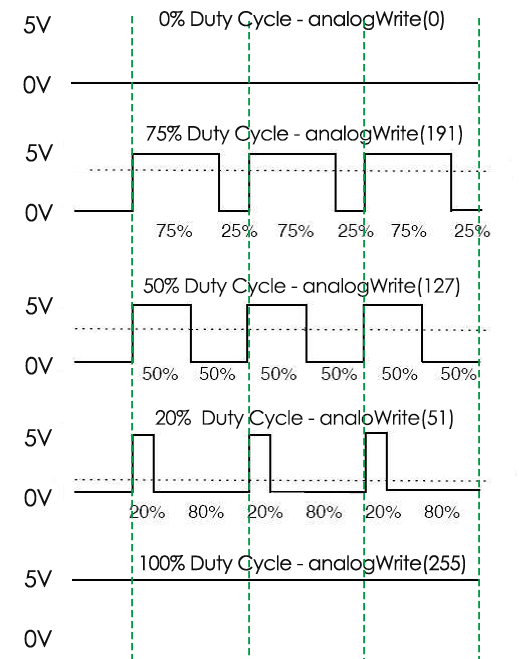

.. note::

    Ciao, benvenuto nella Community di SunFounder per appassionati di Raspberry Pi, Arduino e ESP32 su Facebook! Unisciti a noi per esplorare più a fondo il mondo di Raspberry Pi, Arduino e ESP32 con altri appassionati.

    **Perché unirti?**

    - **Supporto Esperto**: Risolvi i problemi post-vendita e le sfide tecniche con l’aiuto del nostro team e della community.
    - **Impara e Condividi**: Scambia consigli e tutorial per migliorare le tue competenze.
    - **Anteprime Esclusive**: Accedi in anticipo agli annunci di nuovi prodotti e alle anticipazioni.
    - **Sconti Speciali**: Approfitta di sconti esclusivi sui nostri prodotti più recenti.
    - **Promozioni e Giveaway Festivi**: Partecipa a promozioni e concorsi durante le festività.

    👉 Pronto a esplorare e creare con noi? Clicca su [|link_sf_facebook|] e unisciti oggi!

1.1.2 LED RGB
====================

Introduzione
--------------

In questa lezione, impareremo a controllare un LED RGB per farlo lampeggiare in diversi colori.

Componenti
--------------

.. image:: img/list_rgb_led.png
    :align: center

Principio
--------------

**PWM**

La modulazione di larghezza di impulso (PWM) è una tecnica per ottenere 
risultati analogici con mezzi digitali. Si utilizza un controllo digitale 
per creare un’onda quadra, un segnale che passa tra acceso e spento. Questa 
alternanza consente di simulare tensioni intermedie tra il massimo (5V) e il 
minimo (0V), regolando il tempo di permanenza del segnale in stato attivo (on) 
rispetto a quello in stato inattivo (off). La durata del "tempo attivo" è detta 
larghezza dell'impulso. Se questo pattern on-off si ripete abbastanza velocemente, 
il risultato sembra essere una tensione continua che controlla la luminosità di un LED.

**Duty Cycle**

Il duty cycle rappresenta la percentuale di un periodo in cui un segnale è 
attivo. Un periodo è il tempo necessario al segnale per completare un ciclo 
acceso-spento. La formula del duty cycle può essere espressa come:

.. image:: img/image56.png
   :width: 1.16667in
   :height: 0.36458in
   :align: center

Dove **D** è il ciclo di lavoro (duty cycle), **T** è il tempo in cui il segnale è attivo,
e **P** è il periodo totale del segnale. Pertanto, un ciclo di lavoro al 60%
significa che il segnale è attivo per il 60% del tempo e inattivo per il 40%. 
Il "tempo di accensione" di un duty cycle del 60% può essere una frazione di 
secondo, un giorno o persino una settimana, a seconda della lunghezza del periodo.

**LED RGB**

.. image:: img/rgb_led_sch.png
    :width: 500
    :align: center

I tre colori primari del LED RGB possono essere combinati per ottenere varie 
tonalità tramite la regolazione della luminosità. La luminosità può essere 
controllata tramite PWM. Il Raspberry Pi dispone di un solo canale per l’uscita 
PWM hardware, ma ne servono tre per controllare il LED RGB. Per fortuna, la 
libreria softPwm simula il PWM (softPwm) tramite programmazione, permettendo il 
controllo multi-canale del LED RGB.

Diagramma Schematico
-----------------------

Dopo aver collegato i pin R, G e B a una resistenza limitatrice di corrente, 
collegali rispettivamente a GPIO17, GPIO18 e GPIO27. Il pin più lungo (GND) 
del LED va collegato al GND del Raspberry Pi. Assegnando valori PWM differenti 
ai tre pin, il LED RGB mostrerà diversi colori.

============ ======== ======== ===
T-Board Name physical wiringPi BCM
GPIO17       Pin 11   0        17
GPIO18       Pin 12   1        18
GPIO27       Pin 13   2        27
============ ======== ======== ===

.. image:: img/rgb_led_schematic.png

Procedure Sperimentali
----------------------------

**Passo 1:** Costruisci il circuito.

.. image:: img/image61.png
   :width: 6.59097in
   :height: 4.29722in

**Passo 2:** Vai nella cartella del codice.

.. raw:: html

   <run></run>

.. code-block::

    cd ~/davinci-kit-for-raspberry-pi/c/1.1.2/

**Passo 3:** Compila il codice.

.. raw:: html

   <run></run>

.. code-block::

    gcc 1.1.2_rgbLed.c -lwiringPi

.. note::

    Quando si esegue l'istruzione "gcc", se non viene specificato "-o", il file eseguibile viene denominato "a.out".

**Passo 4:** Esegui il file eseguibile.

.. raw:: html

   <run></run>

.. code-block::

    sudo ./a.out

Dopo l'esecuzione del codice, il LED RGB mostrerà 
i colori rosso, verde, blu, giallo, rosa e ciano.
.. note::

    Se, dopo l'esecuzione, il programma non funziona o compare il messaggio di errore: \"wiringPi.h: No such file or directory", fai riferimento a :ref:`Il codice C non funziona?`.

**Codice**

.. code-block:: c

    #include <wiringPi.h>
    #include <softPwm.h>
    #include <stdio.h>
    #define uchar unsigned char
    #define LedPinRed    0
    #define LedPinGreen  1
    #define LedPinBlue   2

    void ledInit(void){
        softPwmCreate(LedPinRed,  0, 100);
        softPwmCreate(LedPinGreen,0, 100);
        softPwmCreate(LedPinBlue, 0, 100);
    }

    void ledColorSet(uchar r_val, uchar g_val, uchar b_val){
        softPwmWrite(LedPinRed,   r_val);
        softPwmWrite(LedPinGreen, g_val);
        softPwmWrite(LedPinBlue,  b_val);
    }

    int main(void){

        if(wiringPiSetup() == -1){ //when initialize wiring failed, printf messageto screen
            printf("setup wiringPi failed !");
            return 1;
        }

        ledInit();
        while(1){
            printf("Red\n");
            ledColorSet(0xff,0x00,0x00);   //red     
            delay(500);
            printf("Green\n");
            ledColorSet(0x00,0xff,0x00);   //green
            delay(500);
            printf("Blue\n");
            ledColorSet(0x00,0x00,0xff);   //blue
            delay(500);
            printf("Yellow\n");
            ledColorSet(0xff,0xff,0x00);   //yellow
            delay(500);
            printf("Purple\n");
            ledColorSet(0xff,0x00,0xff);   //purple
            delay(500);
            printf("Cyan\n");
            ledColorSet(0xc0,0xff,0x3e);   //cyan
            delay(500);
        }
        return 0;
    }

**Spiegazione del Codice**

.. code-block:: c

    #include <softPwm.h>

Libreria usata per realizzare la funzione pwm tramite software.

.. code-block:: c

    void ledInit(void){
        softPwmCreate(LedPinRed,  0, 100);
        softPwmCreate(LedPinGreen,0, 100);
        softPwmCreate(LedPinBlue, 0, 100);
    }

La funzione crea un pin PWM software con un periodo tra 0x100us e 100x100us.

Il prototipo della funzione softPwmCreate(LedPinRed, 0, 100) è:

.. code-block:: c

    int softPwmCreate(int pin,int initialValue,int pwmRange);

* **Parametro pin:** Qualsiasi pin GPIO del Raspberry Pi può essere impostato come pin PWM.
* **Parametro initialValue:** Larghezza d'impulso iniziale pari a initialValue * 100us.
* **Parametro pwmRange:** Il periodo di PWM è pari a pwmRange * 100us.

.. code-block:: c

    void ledColorSet(uchar r_val, uchar g_val, uchar b_val){
        softPwmWrite(LedPinRed,   r_val);
        softPwmWrite(LedPinGreen, g_val);
        softPwmWrite(LedPinBlue,  b_val);
    }

Questa funzione imposta i colori del LED. Usando RGB, **r_val** rappresenta 
la luminosità del rosso, **g_val** quella del verde, e **b_val** quella del blu.

Il prototipo della funzione softPwmWrite(LedPinBlue, b_val) è:

.. code-block:: c

    void softPwmWrite (int pin, int value) ;

* **Parametro pin:** Qualsiasi pin GPIO del Raspberry Pi può essere impostato come pin PWM.
* **Parametro value:** La larghezza dell'impulso PWM è value * 100us. Si noti che value deve essere inferiore a pwmRange definito in precedenza.

.. code-block:: c

    ledColorSet(0xff,0x00,0x00);

Chiamata alla funzione definita in precedenza. Scrive 0xff su LedPinRed e 0x00 
su LedPinGreen e LedPinBlue, accendendo solo il LED rosso. Modificando i parametri, 
è possibile ottenere altre combinazioni di colori.
