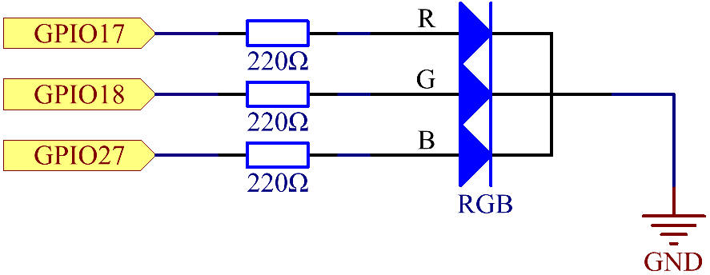

.. note::

    Hallo und willkommen in der SunFounder Raspberry Pi & Arduino & ESP32 Enthusiasten-Gemeinschaft auf Facebook! Tauchen Sie tiefer ein in die Welt von Raspberry Pi, Arduino und ESP32 mit anderen Enthusiasten.

    **Warum beitreten?**

    - **Expertenunterstützung**: Lösen Sie Nachverkaufsprobleme und technische Herausforderungen mit Hilfe unserer Gemeinschaft und unseres Teams.
    - **Lernen & Teilen**: Tauschen Sie Tipps und Anleitungen aus, um Ihre Fähigkeiten zu verbessern.
    - **Exklusive Vorschauen**: Erhalten Sie frühzeitigen Zugang zu neuen Produktankündigungen und exklusiven Einblicken.
    - **Spezialrabatte**: Genießen Sie exklusive Rabatte auf unsere neuesten Produkte.
    - **Festliche Aktionen und Gewinnspiele**: Nehmen Sie an Gewinnspielen und Feiertagsaktionen teil.

    👉 Sind Sie bereit, mit uns zu erkunden und zu erschaffen? Klicken Sie auf [|link_sf_facebook|] und treten Sie heute bei!

.. _py_rgb_led:

1.1.2 RGB-LED
====================
 
Einführung
--------------

In dieser Lektion steuern wir mit eine RGB-LED, die verschiedene Arten von Farben zu blinken.

Komponenten
--------------

.. image:: ../img/list_rgb_led.png
    :align: center

Prinzip
--------------

**PWM**

Die Pulsweitenmodulation oder PWM ist eine Technik, 
mit der analoge Ergebnisse mit digitalen Mitteln erzielt werden können. 
Die digitale Steuerung wird verwendet, um eine Rechteckwelle zu erzeugen, 
um ein Signal zwischen Ein und Aus zu schalten. Dieses Ein-Aus-Muster kann Spannungen zwischen Voll-Ein (5 Volt) und Aus (0 Volt) simulieren, 
mit der Änderung von Zeit, in dem das Signal an ist, gegenüber der Zeit, in der das Signal abläuft. Die Dauer der „Einschaltzeit“ wird als Impulsbreite bezeichnet. 
Um unterschiedliche analoge Werte zu erhalten, ändern oder modulieren Sie diese Breite. Wenn Sie dieses Ein-Aus-Muster mit einem Gerät, 
beispielsweise einer LED, schnell genug wiederholen, 
sieht das Ergebnis folgendermaßen aus: Das Signal ist eine konstante Spannung zwischen 0 und 5 V, die die Helligkeit der LED steuert.

**Arbeitszyklus**

Ein Arbeitszyklus ist der Prozentsatz einer Periode, in der ein Signal aktiv ist. 
Eine Periode ist die Zeit, die ein Signal benötigt, um einen Ein- und Ausschaltzyklus abzuschließen. 
Als Formel kann ein Arbeitszyklus ausgedrückt werden als:

.. image:: ../img/image56.png
   :width: 1.16667in
   :height: 0.36458in
   :align: center

Wobei **D** das Tastverhältnis ist, **T** die Zeit ist, zu der das Signal aktiv ist, 
und **P** die Gesamtperiode des Signals ist. 
Ein Tastverhältnis von 60% bedeutet also, dass das Signal in 60% der Fälle eingeschaltet ist, 
in 40% der Fälle jedoch ausgeschaltet ist. Die „Pünktlichkeit“ für einen Arbeitszyklus von 60% kann je nach Dauer des Zeitraums einen Bruchteil einer Sekunde, 
eines Tages oder sogar einer Woche betragen.

.. image:: ../img/image57.jpeg
   :width: 4.325in
   :height: 5.49167in
   :align: center

**RGB LED**

.. image:: ../img/rgb_led_sch.png
    :width: 500
    :align: center

Die drei Primärfarben der RGB-LED können durch Helligkeit in verschiedene Farben gemischt werden. Die Helligkeit der LED kann mit PWM eingestellt werden. Raspberry Pi hat nur einen Kanal für die Hardware-PWM-Ausgabe, benötigt jedoch drei Kanäle zur Steuerung der RGB-LED, was bedeutet, dass es schwierig ist, die RGB-LED mit der Hardware-PWM von Raspberry Pi zu steuern. Glücklicherweise simuliert die softPwm-Bibliothek PWM (softPwm) durch Programmierung. Alles, was Sie tun müssen, ist die Titeldatei SoftPwm.h (C-Sprachbenutzer) und rufen Sie die API, die es bietet für die einfache Steuerung der RGB-LED durch die Mehrkanal-PWM-Ausgabe, um eine Vielzahl von Farben anzuzeigen.

Schematische Darstellung
------------------------------

Nachdem Sie die Pins von R, G und B mit einem Strombegrenzungswiderstand verbunden haben, verbinden Sie sie mit dem GPIO17, GPIO18 bzw. GPIO27. Der längste Pin (GND) der LED ist mit dem GND des Raspberry Pi verbunden. Wenn die drei Pins unterschiedliche PWM-Werte erhalten, zeigt die RGB-LED unterschiedliche Farben an.

============ ======== ======== ===
T-Karte Name physisch wiringPi BCM
GPIO17       Pin 11   0        17
GPIO18       Pin 12   1        18
GPIO27       Pin 13   2        27
============ ======== ======== ===

Experimentelle Verfahren
----------------------------

Schritt 1: Bauen Sie die Schaltung auf.

.. image:: ../img/image61.png
   :width: 6.59097in
   :height: 4.29722in

Schritt 2: Gehen Sie zum Ordner der Kode.

.. raw:: html

   <run></run>

.. code-block::

    cd ~/davinci-kit-for-raspberry-pi/c/1.1.2/

Schritt 3: Kompilieren Sie die Kode.

.. raw:: html

   <run></run>

.. code-block::

    gcc 1.1.2_rgbLed.c -lwiringPi

.. note::

    Wenn die Anweisung ``gcc`` ausgeführt wird und ``-o`` nicht aufgerufen wird, wird ausführbare Datei ``a.out`` benannt.

Schritt 4: Führen Sie die ausführbare Datei aus.

.. raw:: html

   <run></run>

.. code-block::

    sudo ./a.out

Nachdem die Kode ausgeführt wurde, sehen Sie, dass RGB Rot, Grün, Blau, Gelb, Pink und Cyan anzeigt.

**Code**

.. code-block:: c

    #include <wiringPi.h>
    #include <softPwm.h>
    #include <stdio.h>
    #define uchar unsigned char
    #define LedPinRed    0
    #define LedPinGreen  1
    #define LedPinBlue   2

    void ledInit(void){
        softPwmCreate(LedPinRed,  0, 100);
        softPwmCreate(LedPinGreen,0, 100);
        softPwmCreate(LedPinBlue, 0, 100);
    }

    void ledColorSet(uchar r_val, uchar g_val, uchar b_val){
        softPwmWrite(LedPinRed,   r_val);
        softPwmWrite(LedPinGreen, g_val);
        softPwmWrite(LedPinBlue,  b_val);
    }

    int main(void){

        if(wiringPiSetup() == -1){ //when initialize wiring failed, printf messageto screen
            printf("setup wiringPi failed !");
            return 1;
        }

        ledInit();
        while(1){
            printf("Red\n");
            ledColorSet(0xff,0x00,0x00);   //red     
            delay(500);
            printf("Green\n");
            ledColorSet(0x00,0xff,0x00);   //green
            delay(500);
            printf("Blue\n");
            ledColorSet(0x00,0x00,0xff);   //blue
            delay(500);
            printf("Yellow\n");
            ledColorSet(0xff,0xff,0x00);   //yellow
            delay(500);
            printf("Purple\n");
            ledColorSet(0xff,0x00,0xff);   //purple
            delay(500);
            printf("Cyan\n");
            ledColorSet(0xc0,0xff,0x3e);   //cyan
            delay(500);
        }
        return 0;
    }

**Code Erklärung**

.. code-block:: c

    #include <softPwm.h>

Bibliothek zur Realisierung der PWM-Funktion der Software.

.. code-block:: c

    void ledInit(void){
        softPwmCreate(LedPinRed,  0, 100);
        softPwmCreate(LedPinGreen,0, 100);
        softPwmCreate(LedPinBlue, 0, 100);
    }

Die Funktion besteht darin, mit Software einen PWM-Pin zu erstellen und dessen Periode zwischen 0x100us und 100x100us einzustellen.

Der Prototyp der Funktion ``softPwmCreate(LedPinRed, 0, 100)`` lautet wie folgt:

.. code-block:: c

    int softPwmCreate(int pin,int initialValue,int pwmRange);

* **Parameter pin:** Jeder GPIO-Pin von Raspberry Pi kann als PWM-Pin gesetzt werden.
* **Parameter initialValue:** Die anfängliche Impulsbreite ist der initialValue times100us.
* **Parameter pwmRange:** Die Periode von PWM ist die pwmRange times100us.

.. code-block:: c

    void ledColorSet(uchar r_val, uchar g_val, uchar b_val){
        softPwmWrite(LedPinRed,   r_val);
        softPwmWrite(LedPinGreen, g_val);
        softPwmWrite(LedPinBlue,  b_val);
    }

Diese Funktion dient zum Einstellen der Farben der LED. 
Bei Verwendung von RGB repräsentiert der formale Parameter ``r_val`` die Luminanz des roten, ``g_val`` des grünen, ``b_val`` des blauen.

Der Prototyp der Funktion ``softPwmWrite(LedPinBlue, b_val)`` lautet wie folgt:

.. code-block:: c

    void softPwmWrite (int pin, int value) ;

* **Parameter pin:** Jeder GPIO-Pin von Raspberry Pi kann als PWM-Pin gesetzt werden.
* **Parameter Value:** Die Pulsbreite von PWM ist Wert mal 100us. Beachten Sie, dass der Wert nur kleiner als der zuvor definierte pwmRange sein kann. Wenn er größer als pwmRange ist, erhält der Wert einen festen Wert, pwmRange.

.. code-block:: c

    ledColorSet(0xff,0x00,0x00);

Rufen Sie die zuvor definierte Funktion auf. Schreiben Sie 0xff in LedPinRed und 0x00 in LedPinGreen und LedPinBlue. Nach dem Ausführen der Kode leuchtet nur die rote LED auf. Wenn Sie LEDs in anderen Farben aufleuchten möchten, ändern Sie einfach die Parameter.
