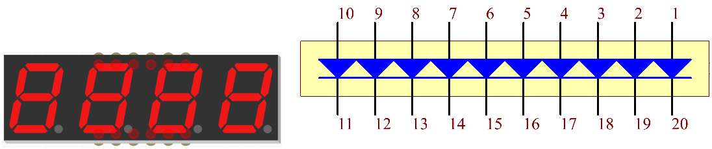
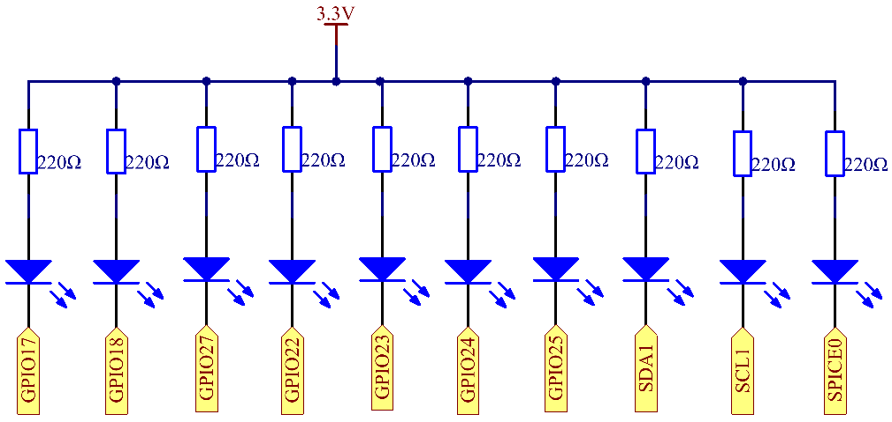
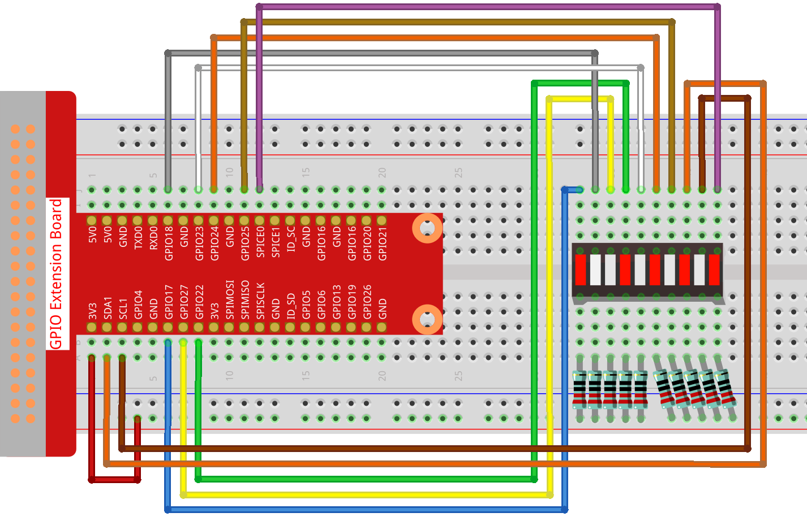

.. note::

    Hallo und willkommen in der SunFounder Raspberry Pi & Arduino & ESP32 Enthusiasten-Gemeinschaft auf Facebook! Tauchen Sie tiefer ein in die Welt von Raspberry Pi, Arduino und ESP32 mit anderen Enthusiasten.

    **Warum beitreten?**

    - **Expertenunterstützung**: Lösen Sie Nachverkaufsprobleme und technische Herausforderungen mit Hilfe unserer Gemeinschaft und unseres Teams.
    - **Lernen & Teilen**: Tauschen Sie Tipps und Anleitungen aus, um Ihre Fähigkeiten zu verbessern.
    - **Exklusive Vorschauen**: Erhalten Sie frühzeitigen Zugang zu neuen Produktankündigungen und exklusiven Einblicken.
    - **Spezialrabatte**: Genießen Sie exklusive Rabatte auf unsere neuesten Produkte.
    - **Festliche Aktionen und Gewinnspiele**: Nehmen Sie an Gewinnspielen und Feiertagsaktionen teil.

    👉 Sind Sie bereit, mit uns zu erkunden und zu erschaffen? Klicken Sie auf [|link_sf_facebook|] und treten Sie heute bei!

1.1.3 LED-Balkendiagramm
=============================

Einführung
-------------

In diesem Projekt beleuchten wir nacheinander die Lichter auf dem LED-Balkendiagramm.

Komponenten
----------------

.. image:: ../img/list_led_bar.png

Prinzip
--------------

**LED-Balkendiagramm**

LED-Balkendiagramm ist ein LED-Array, das zur Verbindung mit einer elektronischen Schaltung oder einem Mikrocontroller verwendet wird. 
Es ist einfach, ein LED-Balkendiagramm mit der Schaltung zu verbinden, es ist wie 10 einzelne LEDs mit 10 Ausgangspins. 
Im Allgemeinen können wir das LED-Balkendiagramm als Batteriestandsanzeige, Audiogeräte und industrielle Bedienfelder verwenden. 
Es gibt viele andere Anwendungen von LED-Balkendiagrammen.

Schematische Darstellung
------------------------------

============ ======== ======== ===
T-Karte Name physisch wiringPi BCM
GPIO17       Pin 11   0        17
GPIO18       Pin 12   1        18
GPIO27       Pin 13   2        27
GPIO22       Pin 15   3        22
GPIO23       Pin 16   4        23
GPIO24       Pin 18   5        24
GPIO25       Pin 22   6        25
SDA1         Pin 3    8        2
SCL1         Pin 5    9        3
SPICE0       Pin 24   10       8
============ ======== ======== ===

Experimentelle Verfahren
------------------------------

Schritt 1: Bauen Sie die Schaltung auf.

Schritt 2: Gehen Sie zum Ordner des Codes.

.. raw:: html

   <run></run>

.. code-block::

    cd ~/davinci-kit-for-raspberry-pi/c/1.1.3/

Schritt 3: Kompilieren Sie den Code.

.. raw:: html

   <run></run>

.. code-block::

    gcc 1.1.3_LedBarGraph.c -lwiringPi

Schritt 4: Führen Sie die ausführbare Datei aus.

.. raw:: html

   <run></run>

.. code-block::

    sudo ./a.out

Nachdem die Kode ausgeführt wurde, werden die LEDs in der LED-Leiste regelmäßig ein- und ausgeschaltet.

**Code**

.. code-block:: c

    #include <wiringPi.h>
    #include <stdio.h>

    int pins[10] = {0,1,2,3,4,5,6,8,9,10};
    void oddLedBarGraph(void){
        for(int i=0;i<5;i++){
            int j=i*2;
            digitalWrite(pins[j],HIGH);
            delay(300);
            digitalWrite(pins[j],LOW);
        }
    }
    void evenLedBarGraph(void){
        for(int i=0;i<5;i++){
            int j=i*2+1;
            digitalWrite(pins[j],HIGH);
            delay(300);
            digitalWrite(pins[j],LOW);
        }
    }
    void allLedBarGraph(void){
        for(int i=0;i<10;i++){
            digitalWrite(pins[i],HIGH);
            delay(300);
            digitalWrite(pins[i],LOW);
        }
    }
    int main(void)
    {
        if(wiringPiSetup() == -1){ //when initialize wiring failed,print message to screen
            printf("setup wiringPi failed !");
            return 1;
        }
        for(int i=0;i<10;i++){       //make led pins' mode is output
            pinMode(pins[i], OUTPUT);
            digitalWrite(pins[i],LOW);
        }
        while(1){
            oddLedBarGraph();
            delay(300);
            evenLedBarGraph();
            delay(300);
            allLedBarGraph();
            delay(300);
        }
        return 0;
    }

**Code Erklärung**

.. code-block:: c

    int pins[10] = {0,1,2,3,4,5,6,8,9,10};

Erstellen Sie ein Array und weisen Sie es der Pin-Nummer zu, die dem LED-Balkendiagramm (0,1,2,3,4,5,6,8,9,10) entspricht. 
Das Array wird zur Steuerung der LED verwendet.

.. code-block:: c

    void oddLedBarGraph(void){
        for(int i=0;i<5;i++){
            int j=i*2;
            digitalWrite(pins[j],HIGH);
            delay(300);
            digitalWrite(pins[j],LOW);
        }
    }

Lassen Sie die LED an der ungeraden Stelle des LED-Balkendiagramms der Reihe nach leuchten.

.. code-block:: c

    void evenLedBarGraph(void){
        for(int i=0;i<5;i++){
            int j=i*2+1;
            digitalWrite(pins[j],HIGH);
            delay(300);
            digitalWrite(pins[j],LOW);
        }
    }

Schalten Sie die LED auf der geraden Ziffer des LED-Balkendiagramms der Reihe nach ein.

.. code-block:: c

    void allLedBarGraph(void){
        for(int i=0;i<10;i++){
            digitalWrite(pins[i],HIGH);
            delay(300);
            digitalWrite(pins[i],LOW);
        }
    }

Lassen Sie die LED auf dem LED-Balkendiagramm nacheinander leuchten.

