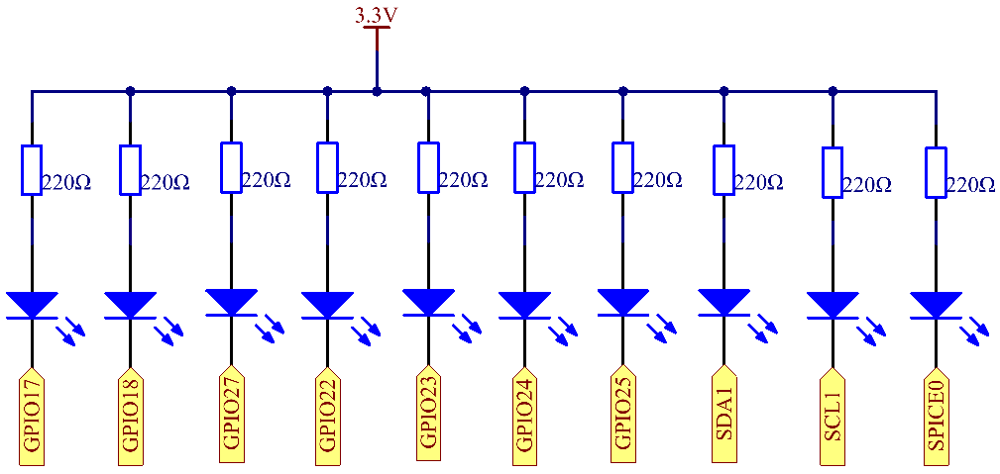

.. note:: 

    ¡Hola! Bienvenido a la Comunidad de Entusiastas de Raspberry Pi, Arduino y ESP32 de SunFounder en Facebook. Profundiza en Raspberry Pi, Arduino y ESP32 con otros entusiastas.

    **¿Por qué unirse?**

    - **Soporte Experto**: Resuelve problemas post-venta y desafíos técnicos con la ayuda de nuestra comunidad y equipo.
    - **Aprender y Compartir**: Intercambia consejos y tutoriales para mejorar tus habilidades.
    - **Vistas Exclusivas**: Accede anticipadamente a anuncios de nuevos productos y adelantos.
    - **Descuentos Especiales**: Disfruta de descuentos exclusivos en nuestros productos más recientes.
    - **Promociones Festivas y Sorteos**: Participa en sorteos y promociones navideñas.

    👉 ¿Listo para explorar y crear con nosotros? Haz clic en [|link_sf_facebook|] y únete hoy.

1.1.3 LED de Barra
========================

Introducción
---------------

En este proyecto, iluminaremos secuencialmente las luces del LED de barra.

Componentes
--------------

.. image:: img/list_led_bar.png

Principio
-----------

**LED de Barra**

Un LED de barra es un arreglo de LEDs que se utiliza para conectar con un 
circuito electrónico o un microcontrolador. Es fácil conectar un LED de 
barra con el circuito, como si se conectaran 10 LEDs individuales con 
10 pines de salida. Generalmente, podemos usar el LED de barra como indicador 
de nivel de batería, en equipos de audio y en paneles de control industriales. 
Existen muchas otras aplicaciones para los LED de barra.

.. image:: img/led_bar_sche.png

Diagrama Esquemático
----------------------

============ ======== ======== ===
T-Board Name physical wiringPi BCM
GPIO17       Pin 11   0        17
GPIO18       Pin 12   1        18
GPIO27       Pin 13   2        27
GPIO22       Pin 15   3        22
GPIO23       Pin 16   4        23
GPIO24       Pin 18   5        24
GPIO25       Pin 22   6        25
SDA1         Pin 3    8        2
SCL1         Pin 5    9        3
SPICE0       Pin 24   10       8
============ ======== ======== ===

Procedimientos Experimentales
-------------------------------

**Paso 1:** Construir el circuito.

.. image:: img/image66.png
    :width: 800

**Paso 2:** Ir a la carpeta del código.

.. raw:: html

   <run></run>

.. code-block::

   cd ~/davinci-kit-for-raspberry-pi/c/1.1.3/

**Paso 3:** Compilar el código.

.. raw:: html

   <run></run>

.. code-block::

   gcc 1.1.3_LedBarGraph.c -lwiringPi

**Paso 4:** Ejecutar el archivo ejecutable.

.. raw:: html

   <run></run>

.. code-block::

   sudo ./a.out

Después de que el código se ejecute, verás que los LEDs de la barra se 
encienden y apagan regularmente.

.. note::

   Si no funciona después de ejecutarlo, o si aparece un mensaje de error: \"wiringPi.h: No such file or directory", consulta :ref:`C code is not working?`.

**Código**

.. code-block:: c

   #include <wiringPi.h>
   #include <stdio.h>

   int pins[10] = {0,1,2,3,4,5,6,8,9,10};
   void oddLedBarGraph(void){
       for(int i=0;i<5;i++){
           int j=i*2;
           digitalWrite(pins[j],HIGH);
           delay(300);
           digitalWrite(pins[j],LOW);
       }
   }
   void evenLedBarGraph(void){
       for(int i=0;i<5;i++){
           int j=i*2+1;
           digitalWrite(pins[j],HIGH);
           delay(300);
           digitalWrite(pins[j],LOW);
       }
   }
   void allLedBarGraph(void){
       for(int i=0;i<10;i++){
           digitalWrite(pins[i],HIGH);
           delay(300);
           digitalWrite(pins[i],LOW);
       }
   }
   int main(void)
   {
       if(wiringPiSetup() == -1){ //si la inicialización de wiring falla, imprime mensaje en pantalla
            printf("setup wiringPi failed !");
           return 1;
       }
       for(int i=0;i<10;i++){       //configura los pines del LED como salida
           pinMode(pins[i], OUTPUT);
           digitalWrite(pins[i],LOW);
       }
       while(1){
           oddLedBarGraph();
           delay(300);
           evenLedBarGraph();
           delay(300);
           allLedBarGraph();
           delay(300);
       }
       return 0;
   }

**Explicación del Código**

.. code-block:: c

   int pins[10] = {0,1,2,3,4,5,6,8,9,10};

Se crea un arreglo y se le asigna el número de pines correspondiente al 
LED de barra (0,1,2,3,4,5,6,8,9,10) y el arreglo se usará para controlar el LED.

.. code-block:: c

   void oddLedBarGraph(void){
       for(int i=0;i<5;i++){
           int j=i*2;
           digitalWrite(pins[j],HIGH);
           delay(300);
           digitalWrite(pins[j],LOW);
       }
   }

Permite que el LED en los dígitos impares del LED de barra se encienda uno tras otro.

.. code-block:: c

   void evenLedBarGraph(void){
       for(int i=0;i<5;i++){
           int j=i*2+1;
           digitalWrite(pins[j],HIGH);
           delay(300);
           digitalWrite(pins[j],LOW);
       }
   }

Hace que el LED en los dígitos pares del LED de barra se encienda uno tras otro.

.. code-block:: c

   void allLedBarGraph(void){
       for(int i=0;i<10;i++){
           digitalWrite(pins[i],HIGH);
           delay(300);
           digitalWrite(pins[i],LOW);
       }
   }

Permite que todos los LEDs en el LED de barra se enciendan uno por uno.
