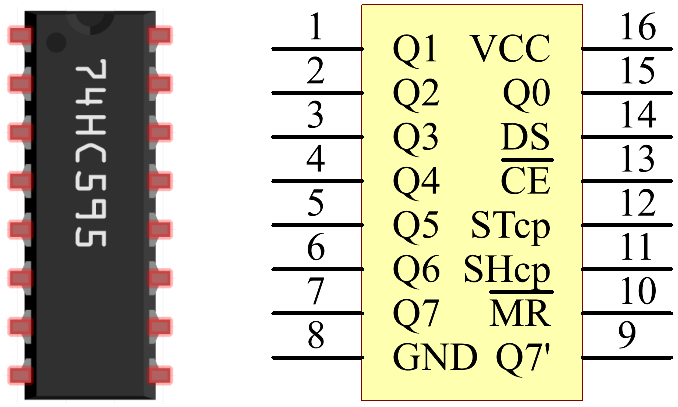

.. note::

    Hallo und willkommen in der SunFounder Raspberry Pi & Arduino & ESP32 Enthusiasten-Gemeinschaft auf Facebook! Tauchen Sie tiefer ein in die Welt von Raspberry Pi, Arduino und ESP32 mit anderen Enthusiasten.

    **Warum beitreten?**

    - **Expertenunterstützung**: Lösen Sie Nachverkaufsprobleme und technische Herausforderungen mit Hilfe unserer Gemeinschaft und unseres Teams.
    - **Lernen & Teilen**: Tauschen Sie Tipps und Anleitungen aus, um Ihre Fähigkeiten zu verbessern.
    - **Exklusive Vorschauen**: Erhalten Sie frühzeitigen Zugang zu neuen Produktankündigungen und exklusiven Einblicken.
    - **Spezialrabatte**: Genießen Sie exklusive Rabatte auf unsere neuesten Produkte.
    - **Festliche Aktionen und Gewinnspiele**: Nehmen Sie an Gewinnspielen und Feiertagsaktionen teil.

    👉 Sind Sie bereit, mit uns zu erkunden und zu erschaffen? Klicken Sie auf [|link_sf_facebook|] und treten Sie heute bei!

1.1.4 7-Segment-Anzeige
=============================

Einführung
-----------------

Versuchen wir, eine 7-Segment-Anzeige anzutreiben, um eine Nummer von 0 bis 9 und von A bis F anzuzeigen.

Komponenten
----------------

.. image:: ../img/list_7_segment.png

Prinzip
-------------

**7-Segment-Anzeige**

Ein 7-Segment-Display ist eine 8-förmige Komponente, die 7 LEDs enthält. Jede LED wird als Segment bezeichnet. 
Bei Erregung ist ein Segment Teil einer anzuzeigenden Ziffer.

Es gibt zwei Typen von Pin-Verbindungen: Common Cathode (CC) und Common Anode (CA). 
Wie der Name schon sagt, sind an einer CC-Anzeige alle Kathoden der 7 LEDs angeschlossen, 
wenn an einer CA-Anzeige alle Anoden der 7 Segmente angeschlossen sind. In diesem Kit verwenden wir der erstere.

.. image:: ../img/image70.jpeg
   :width: 3.89514in
   :height: 3.32222in
   :align: center

Jede der LEDs im Display erhält ein Positionssegment, 
wobei einer der Verbindungsstifte aus dem rechteckigen Kunststoffgehäuse herausgeführt wird. 
Diese LED-Pins sind von *a* bis *g* bezeichnet und repräsentieren jede einzelne LED. 
Die anderen LED-Pins sind miteinander verbunden und bilden einen gemeinsamen Pin. 
Wenn Sie also die entsprechenden Pins der LED-Segmente in einer bestimmten Reihenfolge nach vorne vorspannen, 
werden einige Segmente heller und andere dunkel bleiben, wodurch das entsprechende Zeichen auf dem Display angezeigt wird.

**Koden anzeigen**

Damit Sie wissen können, wie 7-Segment-Anzeigen (Common Cathode) Numbers anzeigen, 
haben wir die folgende Tabelle gezeichnet. Nummer sind die Nummer 0-F, 
die auf der 7-Segment-Anzeige angezeigt werden. (DP) GFEDCBA bezieht sich auf die entsprechende LED, die auf 0 oder 1 gesetzt ist. 
Beispielsweise bedeutet 00111111, dass DP und G auf 0 gesetzt sind, während andere auf 1 gesetzt sind. 
Daher wird die Nummer 0 auf dem 7-Segment-Display angezeigt, während der HEX-Kode der Hexadezimalzahl entspricht.

.. image:: ../img/common_cathode.png

**74HC595**

Der 74HC595 besteht aus einem 8-Bit-Schieberegister und einem Speicherregister mit parallelen Ausgängen mit drei Zuständen. Es wandelt den seriellen Eingang in einen parallelen Ausgang um, sodass Sie E / A-Ports einer MCU speichern können.

Wenn MR (Pin 10) einen hohen Niveaul und OE (Pin 13) einen niedrigen Niveaul aufweist, 
werden Daten in die ansteigende Flanke von SHcp eingegeben und gehen über die ansteigende Flanke von SHcp in das Speicherregister. 
Wenn die beiden Takte miteinander verbunden sind, ist das Schieberegister immer einen Impuls früher als das Speicherregister. 
Es gibt einen seriellen Verschiebungseingangspin (Ds), einen seriellen Ausgangspin (Q) und eine asynchrone Rücksetztaste (niedriger Niveaul) im Speicherregister. 
Das Speicherregister gibt einen Bus mit einem parallelen 8-Bit und in drei Zuständen aus. 
Wenn OE aktiviert ist (niedriger Niveaul), werden die Daten im Speicherregister an den Bus ausgegeben.

**Pins von 74HC595 und ihre Funktionen:**:

* **Q0-Q7** : 8-Bit-Parallel-Datenausgangspins, die 8 LEDs oder 8 Pins der 7-Segment-Anzeige direkt steuern können.

* **Q7’** : Serienausgangspin, verbunden mit DS eines anderen 74HC595, um mehrere 74HC595 in Reihe zu schalten.

* **MR** : Reset-Pin, aktiv bei niedrigem Niveau;

* **SHcp** : Time sequence input of shift register. On the rising edge, the data in shift register moves successively one bit, i.e. data in Q1 moves to Q2, and so forth. While on the falling edge, the data in shift register remain unchanged.

* **STcp** : Zeitfolgeeingabe des Speicherregisters. Bei der steigenden Flanke werden Daten im Schieberegister in das Speicherregister verschoben.

* **CE** : Ausgangsfreigabepin, aktiv auf niedrigem Niveau.

* **DS** : Serieller Dateneingangspin

* **VCC** : Positive Versorgungsspannung

* **GND** : Boden

Schematische Darstellung
---------------------------------

Verbinden Sie Pin ST_CP von 74HC595 mit Raspberry Pi GPIO18, SH_CP mit GPIO27, 
DS mit GPIO17 und parallele Ausgangsanschlüsse mit 8 Segmenten der LED-Segmentanzeige. 
Geben Sie Daten in den DS-Pin in das Schieberegister ein, wenn sich SH_CP (der Takteingang des Schieberegisters) an der ansteigenden Flanke befindet, 
und in das Speicherregister, wenn sich ST_CP (der Takteingang des Speichers) an der ansteigenden Flanke befindet. 
Anschließend können Sie die Zustände von SH_CP und ST_CP über die Raspberry Pi-GPIOs steuern, 
um die serielle Dateneingabe in eine parallele Datenausgabe umzuwandeln, um Raspberry Pi-GPIOs zu speichern und die Anzeige zu steuern.

============ ======== ======== ===
T-Karte Name physisch wiringPi BCM
GPIO17       Pin 11   0        17
GPIO18       Pin 12   1        18
GPIO27       Pin 13   2        27
============ ======== ======== ===

.. image:: ../img/schematic_7_segment.png
    :width: 800

Experimentelle Verfahren
------------------------------

Schritt 1: Bauen Sie die Schaltung auf.

.. image:: ../img/image73.png
    :width: 800

Schritt 2: Gehen Sie in den Ordner der Kode.

.. raw:: html

   <run></run>

.. code-block::

    cd /home/pi/davinci-kit-for-raspberry-pi/c/1.1.4/

Schritt 3: Kompilieren.

.. raw:: html

   <run></run>

.. code-block::

    gcc 1.1.4_7-Segment.c -lwiringPi

Schritt 4: Führen Sie die obige ausführbare Datei aus.

.. raw:: html

   <run></run>

.. code-block::

    sudo ./a.out

Nachdem der Code ausgeführt wurde, wird die 7-Segment-Anzeige 0-9, A-F angezeigt.

**Code**

.. code-block:: c

    #include <wiringPi.h>
    #include <stdio.h>
    #define   SDI   0   //serial data input
    #define   RCLK  1   //memory clock input(STCP)
    #define   SRCLK 2   //shift register clock input(SHCP)
    unsigned char SegCode[16] = {0x3f,0x06,0x5b,0x4f,0x66,0x6d,0x7d,0x07,0x7f,0x6f,0x77,0x7c,0x39,0x5e,0x79,0x71};

    void init(void){
        pinMode(SDI, OUTPUT); 
        pinMode(RCLK, OUTPUT);
        pinMode(SRCLK, OUTPUT); 
        digitalWrite(SDI, 0);
        digitalWrite(RCLK, 0);
        digitalWrite(SRCLK, 0);
    }

    void hc595_shift(unsigned char dat){
        int i;
        for(i=0;i<8;i++){
            digitalWrite(SDI, 0x80 & (dat << i));
            digitalWrite(SRCLK, 1);
            delay(1);
            digitalWrite(SRCLK, 0);
        }
            digitalWrite(RCLK, 1);
            delay(1);
            digitalWrite(RCLK, 0);
    }

    int main(void){
        int i;
        if(wiringPiSetup() == -1){ //when initialize wiring failed, print messageto screen
            printf("setup wiringPi failed !");
            return 1;
        }
        init();
        while(1){
            for(i=0;i<16;i++){
                printf("Print %1X on Segment\n", i); // %X means hex output
                hc595_shift(SegCode[i]);
                delay(500);
            }
        }
        return 0;
    }

**Code Erklärung**

.. code-block:: c

    unsigned char SegCode[16] = {0x3f,0x06,0x5b,0x4f,0x66,0x6d,0x7d,0x07,0x7f,0x6f,0x77,0x7c,0x39,0x5e,0x79,0x71};

Ein Segmentcode-Array von 0 bis F in hexadezimaler Darstellung (gemeinsame Kathode).

.. code-block:: c

    void init(void){
        pinMode(SDI, OUTPUT); 
        pinMode(RCLK, OUTPUT); 
        pinMode(SRCLK, OUTPUT); 
        digitalWrite(SDI, 0);
        digitalWrite(RCLK, 0);
        digitalWrite(SRCLK, 0);
    }

Setzen Sie ``ds`` , ``st_cp`` , ``sh_cp`` drei Pins auf OUTPUT und den Anfangszustand auf 0. 

.. code-block:: c

    void hc595_shift(unsigned char dat){}

Zuweisen eines 8-Bit-Werts zum Schieberegister des 74HC595.

.. code-block:: c

    digitalWrite(SDI, 0x80 & (dat << i));

Ordnen Sie die Datendaten SDI (DS) in Bits zu. 
Hier nehmen wir an, dass ``dat = 0x3f`` (0011 1111, wenn i = 2, 0x3f 2 Bits nach links (<<) verschiebt. 
``1111 1100 (0x3f << 2) & 1000 0000 (0x80) = 1000 0000`` ist wahr.

.. code-block:: c

    digitalWrite(SRCLK, 1);

Der Anfangswert von SRCLK wurde auf 0 gesetzt, und hier wird er auf 1 gesetzt, um einen Anstiegsflankenimpuls zu erzeugen und dann das DS-Datum in das Schieberegister zu verschieben.

.. code-block:: c
        
		digitalWrite(RCLK, 1);

Der Anfangswert von RCLK wurde auf 0 gesetzt, und hier wird er auf 1 gesetzt, um eine ansteigende Flanke zu erzeugen und dann Daten vom Schieberegister zum Speicherregister zu verschieben.

.. code-block:: c

    while(1){
            for(i=0;i<16;i++){
                printf("Print %1X on Segment\n", i); // %X means hex output
                hc595_shift(SegCode[i]);
                delay(500);
            }
        }

In dieser for-Schleife verwenden wir ``%1X`` , um i als Hexadezimalzahl auszugeben. 
Wenden Sie i an, um den entsprechenden Segmentcode im ``SegCode[]`` -Array zu finden, und verwenden Sie ``hc595_shift()``, 
um den SegCode in das Schieberegister des 74HC595 zu übergeben.

