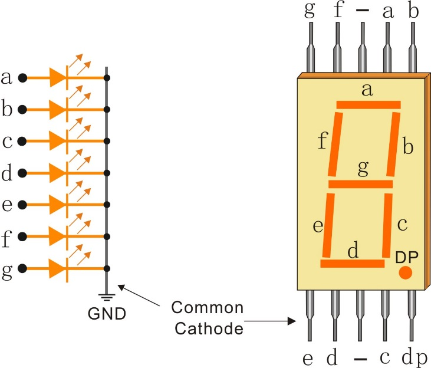
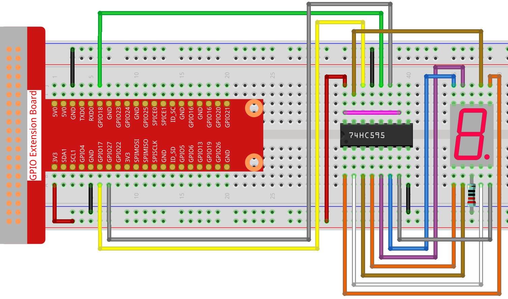

.. note:: 

    ¡Hola! Bienvenido a la Comunidad de Entusiastas de Raspberry Pi, Arduino y ESP32 de SunFounder en Facebook. Profundiza en Raspberry Pi, Arduino y ESP32 con otros entusiastas.

    **¿Por qué unirse?**

    - **Soporte Experto**: Resuelve problemas post-venta y desafíos técnicos con la ayuda de nuestra comunidad y equipo.
    - **Aprender y Compartir**: Intercambia consejos y tutoriales para mejorar tus habilidades.
    - **Vistas Exclusivas**: Accede anticipadamente a anuncios de nuevos productos y adelantos.
    - **Descuentos Especiales**: Disfruta de descuentos exclusivos en nuestros productos más recientes.
    - **Promociones Festivas y Sorteos**: Participa en sorteos y promociones navideñas.

    👉 ¿Listo para explorar y crear con nosotros? Haz clic en [|link_sf_facebook|] y únete hoy.

1.1.4 Pantalla de 7 Segmentos
==================================

Introducción
---------------

En este proyecto, controlaremos una pantalla de 7 segmentos para mostrar cifras del 0 al 9 y de la A a la F.

Componentes
--------------

.. image:: img/list_7_segment.png

Principio
-----------

**Pantalla de 7 Segmentos**

Una pantalla de 7 segmentos es un componente en forma de 8 que contiene 7 LEDs. 
Cada LED se llama un segmento; cuando se energiza, un segmento forma parte de un 
número que se va a mostrar.

Existen dos tipos de conexión de pines: Común Catodo (CC) y Común Ánodo (CA). 
Como su nombre indica, una pantalla CC tiene todos los cátodos de los 7 LEDs 
conectados, mientras que una pantalla CA tiene todos los ánodos de los 7 segmentos 
conectados. En este kit, utilizamos la primera.

Cada uno de los LEDs en la pantalla tiene un segmento posicional, y uno de sus 
pines de conexión sale del paquete plástico rectangular. Estos pines de LED están 
etiquetados de "a" a "g", representando cada LED individual. Los otros pines de 
LED están conectados entre sí formando un pin común. Así, al polarizar hacia 
adelante los pines apropiados de los segmentos LED en un orden particular, 
algunos segmentos se iluminarán y otros permanecerán tenues, mostrando así el 
carácter correspondiente en la pantalla.

**Códigos de Pantalla**

Para ayudarte a entender cómo las pantallas de 7 segmentos (Común Cátodo) 
muestran números, hemos dibujado la siguiente tabla. Los números son del 0 al F 
que se muestran en la pantalla de 7 segmentos; (DP) GFEDCBA se refiere a los LEDs 
correspondientes configurados a 0 o 1. Por ejemplo, 00111111 significa que DP 
y G están configurados a 0, mientras que los demás están configurados a 1. 
Por lo tanto, el número 0 se muestra en la pantalla de 7 segmentos, mientras que 
el Código HEX corresponde al número hexadecimal.

.. image:: img/common_cathode.png

**74HC595**

El 74HC595 consta de un registro de desplazamiento de 8 bits y un registro de 
almacenamiento con salidas paralelas de tres estados. Convierte la entrada 
serial en salida paralela para que puedas ahorrar puertos de IO de un MCU.

Cuando MR (pin10) está en nivel alto y OE (pin13) está en nivel bajo, los datos 
se ingresan en el flanco ascendente de SHcp y pasan al registro de memoria a 
través del flanco ascendente de SHcp. Si los dos relojes están conectados entre 
sí, el registro de desplazamiento siempre estará un pulso antes que el registro 
de memoria. Hay un pin de entrada de desplazamiento serial (Ds), un pin de salida 
serial (Q) y un botón de reinicio asíncrono (nivel bajo) en el registro de memoria. 
El registro de memoria emite un Bus con un paralelo de 8 bits y en tres estados. 
Cuando OE está habilitado (nivel bajo), los datos en el registro de memoria se 
envían al bus.

.. image:: img/74hc595_sche.png
    :width: 400
    :align: center

**Pines del 74HC595 y sus funciones**:

* **Q0-Q7**: Pines de salida de datos paralelos de 8 bits, capaces de controlar 8 LEDs o 8 pines de la pantalla de 7 segmentos directamente.

* **Q7’**: Pin de salida en serie, conectado a DS de otro 74HC595 para conectar múltiples 74HC595 en serie.

* **MR**: Pin de reinicio, activo a nivel bajo.

* **SHcp**: Entrada de secuencia de tiempo del registro de desplazamiento. En el flanco ascendente, los datos en el registro de desplazamiento se mueven sucesivamente un bit, es decir, los datos en Q1 se trasladan a Q2, y así sucesivamente. Mientras que en el flanco descendente, los datos en el registro de desplazamiento permanecen sin cambios.

* **STcp**: Entrada de secuencia de tiempo del registro de almacenamiento. En el flanco ascendente, los datos en el registro de desplazamiento se trasladan al registro de memoria.

* **CE**: Pin de habilitación de salida, activo a nivel bajo.

* **DS**: Pin de entrada de datos en serie.

* **VCC**: Tensión de suministro positiva.

* **GND**: Tierra.

Diagrama Esquemático
------------------------

Conecta el pin ST_CP del 74HC595 al GPIO18 de Raspberry Pi, SH_CP al GPIO27, 
DS al GPIO17 y los puertos de salida paralela a los 8 segmentos de la pantalla 
de LED. Introduce datos en el pin DS al registro de desplazamiento cuando SH_CP 
(la entrada del reloj del registro de desplazamiento) esté en el flanco ascendente, 
y al registro de memoria cuando ST_CP (la entrada del reloj de la memoria) esté en 
el flanco ascendente. Luego, puedes controlar los estados de SH_CP y ST_CP a través 
de los GPIOs de Raspberry Pi para transformar la entrada de datos serial en salida 
de datos paralela y así ahorrar los GPIOs de Raspberry Pi y controlar la pantalla.

============ ======== ======== ===
T-Board Name physical wiringPi BCM
GPIO17       Pin 11   0        17
GPIO18       Pin 12   1        18
GPIO27       Pin 13   2        27
============ ======== ======== ===

.. image:: img/schematic_7_segment.png
    :width: 800

Procedimientos Experimentales
-------------------------------

**Paso 1:** Construir el circuito.

**Paso 2:** Acceder a la carpeta del código.

.. raw:: html

   <run></run>

.. code-block::

   cd ~/davinci-kit-for-raspberry-pi/c/1.1.4/

**Paso 3:** Compilar.

.. raw:: html

   <run></run>

.. code-block::

   gcc 1.1.4_7-Segment.c -lwiringPi

**Paso 4:** Ejecutar el archivo ejecutable anterior.

.. raw:: html

   <run></run>

.. code-block::

   sudo ./a.out

Después de que el código se ejecute, verás que la pantalla de 7 segmentos muestra del 0 al 9 y de la A a la F.

.. note::

   Si no funciona después de ejecutarlo, o si aparece un mensaje de error: \"wiringPi.h: No such file or directory", consulta :ref:`C code is not working?`.

**Código**

.. code-block:: c

   #include <wiringPi.h>
   #include <stdio.h>
   #define   SDI   0   //entrada de datos serial
   #define   RCLK  1   //entrada de reloj de memoria (STCP)
   #define   SRCLK 2   //entrada de reloj del registro de desplazamiento (SHCP)
   unsigned char SegCode[16] = {0x3f,0x06,0x5b,0x4f,0x66,0x6d,0x7d,0x07,0x7f,0x6f,0x77,0x7c,0x39,0x5e,0x79,0x71};

   void init(void){
       pinMode(SDI, OUTPUT); 
       pinMode(RCLK, OUTPUT);
       pinMode(SRCLK, OUTPUT); 
       digitalWrite(SDI, 0);
       digitalWrite(RCLK, 0);
       digitalWrite(SRCLK, 0);
   }

   void hc595_shift(unsigned char dat){
       int i;
       for(i=0;i<8;i++){
           digitalWrite(SDI, 0x80 & (dat << i));
           digitalWrite(SRCLK, 1);
           delay(1);
           digitalWrite(SRCLK, 0);
       }
           digitalWrite(RCLK, 1);
           delay(1);
           digitalWrite(RCLK, 0);
   }

   int main(void){
       int i;
       if(wiringPiSetup() == -1){ //si la inicialización de wiring falla, imprime mensaje en pantalla
            printf("setup wiringPi failed !");
           return 1;
       }
       init();
       while(1){
           for(i=0;i<16;i++){
                printf("Print %1X on Segment\n", i); // %X significa salida en hexadecimal
               hc595_shift(SegCode[i]);
               delay(500);
           }
       }
       return 0;
   }

**Explicación del Código**

   unsigned char SegCode[16] = {0x3f,0x06,0x5b,0x4f,0x66,0x6d,0x7d,0x07,0x7f,0x6f,0x77,0x7c,0x39,0x5e,0x79,0x71};

Un arreglo de códigos de segmento del 0 al F en hexadecimal (Común Cátodo).

.. code-block:: c

   void init(void){
       pinMode(SDI, OUTPUT); 
       pinMode(RCLK, OUTPUT); 
       pinMode(SRCLK, OUTPUT); 
       digitalWrite(SDI, 0);
       digitalWrite(RCLK, 0);
       digitalWrite(SRCLK, 0);
   }

Configura los pines ds, st_cp y sh_cp como SALIDA, y el estado inicial como 0.

   void hc595_shift(unsigned char dat){}

Para asignar un valor de 8 bits al registro de desplazamiento del 74HC595.

.. code-block:: c

   digitalWrite(SDI, 0x80 & (dat << i));

Asigna los datos de dat a SDI(DS) bit a bit. Aquí asumimos que dat=0x3f (0011 1111, cuando i=2, 0x3f se desplazará a la izquierda (<<) 2 bits. 1111 1100 (0x3f << 2) & 1000 0000 (0x80) = 1000 0000, es verdadero.

.. code-block:: c

   digitalWrite(SRCLK, 1);

El valor inicial de SRCLK se estableció en 0, y aquí se establece en 1, que genera un pulso de flanco ascendente, luego desplaza los datos de DS al registro de desplazamiento.

.. code-block:: c

   digitalWrite(RCLK, 1);

El valor inicial de RCLK se estableció en 0, y aquí se establece en 1, que genera un flanco ascendente, luego desplaza los datos del registro de desplazamiento al registro de memoria.

.. code-block:: c

   while(1){
           for(i=0;i<16;i++){
                printf("Print %1X on Segment\n", i); // %X significa salida en hexadecimal
               hc595_shift(SegCode[i]);
               delay(500);
           }
       }

En este bucle for, utilizamos "%1X" para mostrar i como un número hexadecimal. Aplicamos i para encontrar el código de segmento correspondiente en el arreglo SegCode[], y usamos hc595_shift() para pasar el SegCode al registro de desplazamiento del 74HC595.
