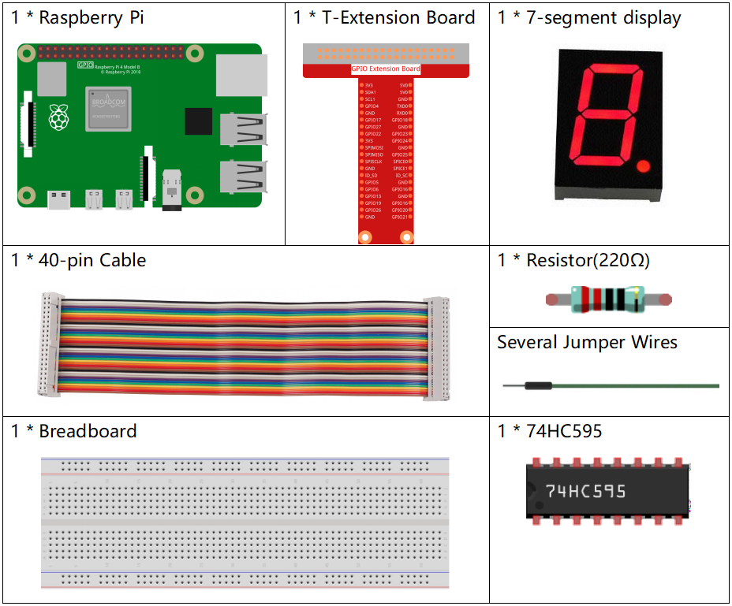

.. note::

    Ciao, benvenuto nella community SunFounder per gli appassionati di Raspberry Pi, Arduino ed ESP32 su Facebook! Approfondisci il mondo di Raspberry Pi, Arduino ed ESP32 insieme ad altri appassionati.

    **Perché unirsi?**

    - **Supporto Esperto**: Risolvi problemi post-vendita e sfide tecniche con l’aiuto della nostra community e del nostro team.
    - **Impara e Condividi**: Scambia suggerimenti e tutorial per migliorare le tue abilità.
    - **Anteprime Esclusive**: Ottieni accesso anticipato a nuovi annunci di prodotto e anteprime esclusive.
    - **Sconti Speciali**: Approfitta di sconti esclusivi sui nostri prodotti più recenti.
    - **Promozioni e Omaggi Festivi**: Partecipa a omaggi e promozioni durante le festività.

    👉 Pronto per esplorare e creare con noi? Clicca su [|link_sf_facebook|] e unisciti oggi!

1.1.4 Display a 7 Segmenti
=============================

Introduzione
-----------------

Proviamo a pilotare un display a 7 segmenti per mostrare numeri da 0 a 9 e lettere da A a F.

Componenti
----------------

Principio
-------------

**Display a 7 Segmenti**

Un display a 7 segmenti è un componente a forma di "8" che contiene 7 LED. 
Ogni LED è chiamato segmento - quando è acceso, un segmento forma parte di 
un numero da visualizzare.

Esistono due tipi di connessione: Catodo Comune (CC) e Anodo Comune (CA). 
Come suggerisce il nome, un display CC ha tutti i catodi dei 7 LED collegati, 
mentre un display CA ha tutti gli anodi collegati. In questo kit usiamo il primo tipo.

Ogni LED del display è associato a un segmento posizionale con un pin di 
connessione che emerge dal pacchetto di plastica rettangolare. I pin dei 
LED sono etichettati da "a" a "g", ciascuno rappresentante un LED individuale. 
Gli altri pin LED sono collegati insieme formando un pin comune. Alimentando 
i pin appropriati dei segmenti in un ordine specifico, alcuni segmenti si 
illumineranno mentre altri rimarranno spenti, mostrando il carattere 
corrispondente sul display.

**Codici Display**

Per comprendere come i display a 7 segmenti (Catodo Comune) mostrano i numeri, 
abbiamo preparato la tabella seguente. I numeri rappresentano i caratteri 0-F 
visualizzati sul display a 7 segmenti; (DP) GFEDCBA indica i LED corrispondenti 
impostati su 0 o 1. Ad esempio, 00111111 significa che DP e G sono impostati su 0, 
mentre gli altri sono impostati su 1. Pertanto, viene visualizzato il numero 0, 
mentre il Codice HEX corrisponde al numero in esadecimale.

.. image:: img/common_cathode.png

**74HC595**

Il 74HC595 è composto da un registro a scorrimento a 8 bit e da un registro di 
memoria con uscite parallele a tre stati. Converte l'input seriale in output 
parallelo, permettendo di risparmiare sui pin IO di un MCU.

Quando MR (pin10) è a livello alto e OE (pin13) è a livello basso, i dati vengono 
immessi al fronte di salita di SHcp e passano al registro di memoria tramite il 
fronte di salita di SHcp. Se i due clock sono collegati insieme, il registro a 
scorrimento è sempre un impulso avanti rispetto al registro di memoria. Nel 
registro di memoria vi è un pin di input seriale (Ds), un pin di output seriale (Q) 
e un pulsante di reset asincrono (livello basso). Il registro di memoria produce 
un Bus con un output parallelo a 8 bit in tre stati. Quando OE è abilitato (livello basso), 
i dati nel registro di memoria vengono inviati al bus.

.. image:: img/74hc595_sche.png
    :width: 400
    :align: center
**Piedini del 74HC595 e loro funzioni**:

* **Q0-Q7**: Uscite di dati paralleli a 8 bit, in grado di controllare direttamente 8 LED o 8 pin di un display a 7 segmenti.

* **Q7’**: Uscita seriale, collegata al DS di un altro 74HC595 per connettere in serie più 74HC595.

* **MR**: Pin di reset, attivo a livello basso;

* **SHcp**: Ingresso di sequenza temporale del registro a scorrimento. Allo spigolo di salita, i dati nel registro a scorrimento avanzano di un bit, ad esempio, i dati in Q1 passano a Q2 e così via. Allo spigolo di discesa, i dati nel registro a scorrimento rimangono invariati.

* **STcp**: Ingresso di sequenza temporale del registro di memoria. Allo spigolo di salita, i dati nel registro a scorrimento vengono trasferiti al registro di memoria.

* **CE**: Pin di abilitazione dell'uscita, attivo a livello basso.

* **DS**: Ingresso dati seriale.

* **VCC**: Tensione di alimentazione positiva.

* **GND**: Massa.

Schema Elettrico
---------------------

Collega il pin ST_CP del 74HC595 al GPIO18 del Raspberry Pi, SH_CP al GPIO27, 
DS al GPIO17 e le uscite parallele agli 8 segmenti del display a 7 segmenti. 
I dati vengono immessi nel pin DS del registro a scorrimento al fronte di salita 
di SH_CP (clock di registrazione) e nel registro di memoria al fronte di salita 
di ST_CP (clock di memoria). Controllando gli stati di SH_CP e ST_CP tramite i 
GPIO del Raspberry Pi, puoi trasformare l’input seriale in output parallelo, 
risparmiando i GPIO del Raspberry Pi e pilotando il display.

============ ======== ======== ===
T-Board Name physical wiringPi BCM
GPIO17       Pin 11   0        17
GPIO18       Pin 12   1        18
GPIO27       Pin 13   2        27
============ ======== ======== ===

.. image:: img/schematic_7_segment.png
    :width: 800

Procedure Sperimentali
------------------------------

**Passo 1**: Costruisci il circuito.

.. image:: img/image73.png
    :width: 800

**Passo 2**: Accedi alla cartella del codice.

.. raw:: html

   <run></run>

.. code-block::

    cd ~/davinci-kit-for-raspberry-pi/c/1.1.4/

**Passo 3**: Compila.

.. raw:: html

   <run></run>

.. code-block::

    gcc 1.1.4_7-Segment.c -lwiringPi

**Passo 4**: Esegui il file eseguibile appena creato.

.. raw:: html

   <run></run>

.. code-block::

    sudo ./a.out

Dopo aver eseguito il codice, vedrai il display a 7 segmenti mostrare i numeri da 0 a 9 e le lettere da A a F.

.. note::

    Se il programma non funziona o compare un messaggio di errore: \"wiringPi.h: No such file or directory", consulta :ref:`Il codice C non funziona?`.

**Codice**

.. code-block:: c

    #include <wiringPi.h>
    #include <stdio.h>
    #define   SDI   0   // input dati seriale
    #define   RCLK  1   // ingresso clock della memoria (STCP)
    #define   SRCLK 2   // ingresso clock registro a scorrimento (SHCP)
    unsigned char SegCode[16] = {0x3f,0x06,0x5b,0x4f,0x66,0x6d,0x7d,0x07,0x7f,0x6f,0x77,0x7c,0x39,0x5e,0x79,0x71};

    void init(void){
        pinMode(SDI, OUTPUT); 
        pinMode(RCLK, OUTPUT);
        pinMode(SRCLK, OUTPUT); 
        digitalWrite(SDI, 0);
        digitalWrite(RCLK, 0);
        digitalWrite(SRCLK, 0);
    }

    void hc595_shift(unsigned char dat){
        int i;
        for(i=0;i<8;i++){
            digitalWrite(SDI, 0x80 & (dat << i));
            digitalWrite(SRCLK, 1);
            delay(1);
            digitalWrite(SRCLK, 0);
        }
            digitalWrite(RCLK, 1);
            delay(1);
            digitalWrite(RCLK, 0);
    }

    int main(void){
        int i;
        if(wiringPiSetup() == -1){ // se l'inizializzazione di wiring fallisce, stampa un messaggio
            printf("setup wiringPi failed !");
            return 1;
        }
        init();
        while(1){
            for(i=0;i<16;i++){
                printf("Print %1X on Segment\n", i); // %X means hex output
                hc595_shift(SegCode[i]);
                delay(500);
            }
        }
        return 0;
    }

**Spiegazione del Codice**

unsigned char SegCode[16] = {0x3f,0x06,0x5b,0x4f,0x66,0x6d,0x7d,0x07,0x7f,0x6f,0x77,0x7c,0x39,0x5e,0x79,0x71};
Un array di codici per segmenti da 0 a F in esadecimale (catodo comune).

.. code-block:: c

    void init(void){
        pinMode(SDI, OUTPUT); 
        pinMode(RCLK, OUTPUT); 
        pinMode(SRCLK, OUTPUT); 
        digitalWrite(SDI, 0);
        digitalWrite(RCLK, 0);
        digitalWrite(SRCLK, 0);
    }

Imposta i pin ds, st_cp e sh_cp su OUTPUT e il loro stato iniziale a 0.
void hc595_shift(unsigned char dat){}
Per assegnare un valore a 8 bit al registro a scorrimento del 74HC595.

.. code-block:: c

    digitalWrite(SDI, 0x80 & (dat << i));

Assegna i dati di "dat" a SDI (DS) per singoli bit. Supponiamo dat=0x3f (0011 1111); quando i=2, 0x3f si sposta a sinistra (<<) di 2 bit. 1111 1100 (0x3f << 2) & 1000 0000 (0x80) = 1000 0000, quindi vero.

.. code-block:: c

    digitalWrite(SRCLK, 1);

Il valore iniziale di SRCLK è impostato a 0, e qui è impostato a 1 per generare un impulso di salita, quindi trasferisce i dati DS nel registro a scorrimento.

.. code-block:: c
        
		digitalWrite(RCLK, 1);

Il valore iniziale di RCLK è impostato a 0, e qui è impostato a 1 per generare un impulso di salita, quindi trasferisce i dati dal registro a scorrimento al registro di memoria.

.. code-block:: c

    while(1){
            for(i=0;i<16;i++){
                printf("Print %1X on Segment\n", i); // %X means hex output
                hc595_shift(SegCode[i]);
                delay(500);
            }
        }

In questo ciclo "for", usiamo "%1X" per visualizzare "i" come numero esadecimale. Usiamo "i" per trovare il codice segmento corrispondente nell'array SegCode[], e utilizziamo hc595_shift() per trasferire il SegCode nel registro a scorrimento del 74HC595.

